## A web működésének megértése
A World Wide Web, amelyet manapság általában csak Webnek hívnak, rengeteg weboldalból áll amelyek az interneten keresztül egy webböngésző segítségével érhetők el. Minden weboldal tartalmaz egy vagy több web oldalt - általában sokkal többet. Minden weboldalt egy egyedi cím, az úgynevezett Uniform Resource Locator, azaz URL azonosít. Egy weboldal lekérdezéséhez a felhasználó beírja az URL-címet a böngésző alkalmazásba, vagy az URL beírásával vagy egy linkre kattintva. A weboldalnak otthont adó webkiszolgáló továbbítja a kért oldalt a böngészőnek, amely megjeleníti annak tartalmát a felhasználó számára.

### Mi a weboldal?
A weboldal olyan digitális dokumentum, amely a weben keresztül, egy webböngésző alkalmazással érhető el. A weboldalak a következőkben tárgyalt weboldalak összetevői, amelyeket a később tárgyalt webkiszolgálókon tárolnak.

A weboldalak tartalmazhatnak szöveget, képeket, hang- vagy videofájlokat és egyéb digitális erőforrásokat, például dokumentumokat, amelyeket a látogatók letölthetnek. A weboldalak elrendezése és formázása a Hypertext Markup Language, HTML és a Cascading Style Sheets, CSS segítségével történik. A weboldalak tartalma lehet statikus vagy dinamikus; ezek interaktív funkciókat is tartalmazhatnak, például űrlapokat, amelyek lehetővé teszik a látogatók számára az adatok bevitelét vagy a tartalommal való interakciót.

### Mi a weboldal?
A weboldal egy webkiszolgálón tárolt és a webböngészők számára az interneten keresztül elérhetővé tett weboldalak gyűjteménye. Egy weboldal jellemzően több oldalt tartalmaz, amelyek hiperhivatkozásokkal kapcsolódnak egymáshoz, és így alkotnak egy összefüggő struktúrát, amely lehetővé teszi a látogatók számára a weboldal különböző területei közötti gyors navigációt.

Egy weboldal jellemzően egy adott célt szolgál. Például egy személyes weboldal bemutathatja a tulajdonos érdeklődési körét és tehetségét; egy szervezet honlapja a szervezet célját és céljait ismertetheti és a látogatókat csatlakozásra ösztönözheti; vagy egy vállalat honlapja a lehető legjobb fényben tünteti fel a vállalatot és lehetőséget biztosít a termékek megvásárlására.

### Mi a webszerver?
A webkiszolgáló egy olyan szoftver, amely válaszol a webes ügyfelek, például a webböngészők kéréseire, és visszaküldi az adatokat, ha az elérhető és engedélyezett. A webkiszolgáló weboldalakat, képeket, videókat és egyéb tartalmakat tárol hogy azokat az ügyfelek számára kiszolgálhassa.

A webszerver szinte bármilyen számítógépes hardveren futhat, az olyan apró számítógépektől kezdve, mint a Raspberry Pi sorozaton keresztül egészen a szerverfarmoknak nevezett teljes körű létesítményekben telepített dedikált szervergépekig. Jelen íráskor, sok webkiszolgálót felhőalapú infrastruktúrán telepítenek, mint például az Amazon Web Services, az AWS vagy az Microsoft Azure.

A webkiszolgáló szinte bármilyen számítógépes operációs rendszeren futhat, beleértve a Windows, a macOS, a Linux és az iOS, iPadOS és Android mobil operációs rendszereket.

A webkiszolgálók az internetes infrastruktúra kritikus részét képezik, és webes tartalmakat juttatnak el a felhasználókhoz az egész világon.

### Mi a web böngésző?
A webböngésző egy olyan alkalmazás, amelyet a weboldalak és egyéb tartalmak elérésére és megjelenítésére használnak a weben. A web böngésző segítségével egy weboldalt a cím beírásával vagy beillesztésével, illetve egy linkre kattintva érhet el. A Webböngészők
a Hypertext Transport Protocol-t (HTTP) vagy annak biztonságos változatát, a Hypertext Transport Protocol Secure-t (HTTPS) használják, hogy weboldalakat kérjenek le a web szerverekről majd megjelenítsék a  tartalmat a böngésző ablakában.

A népszerű webböngészők közé tartozik a Google Chrome, a Mozilla Firefox, a Microsoft Edge és az Apple Safari. Ezek a böngészők számos olyan funkcióval rendelkeznek, amelyek megkönnyítik és felgyorsítják a böngészést, mint például a könyvjelzők és a füles böngészés.

Hogyan találja meg a webböngésző a webhelyet tároló webkiszolgálót?
Amikor egy weboldal URL-címét beírja a böngésző címsorába, a böngésző a Domain Name System-et, azaz a DNS-t használja a weboldalnak otthont adó webkiszolgáló internetprotokoll-címének (IP-cím) megkeresésére. A DNS egy hierarchikus szerverrendszert használ az egyes weboldalakhoz tartozó IP-címek rendszerezésére, tárolására és visszaküldésére.

A domain név egy szövegalapú azonosító, amely egy egyedi helyet jelöl az interneten. Például, www.wiley.com a domain neve a John Wiley & Sons, Inc. weboldalának, ennek és több más könyv kiadójának.  A domain név több részből áll. A jobb szélső rész a legfelső szintű tartomány, vagy TLD - ebben az esetben .com. Balra haladva a következő rész - ebben az esetben a wiley - a másodlagos domain név szintű domain. A következő rész, a www, az aldomain.

## A HTML, CSS és reszponzív web szerkesztés megértése
Mielőtt elkezdené oldalak létrehozását webhelye számára, valószínűleg hasznos lesz megértenie a HTML és a CSS lényegét, a két nyelvet, amelyekkel végig fog dolgozni
ebben a könyvben. Ez a rész bemutatja a HTML-t és a CSS-t. Emellett áttekintést nyújt a reszponzív web szerkesztésről, egy olyan megközelítésről, amelynek célja, hogy a weboldalakat a különböző típusú felhasználók számára egyformán hozzáférhetővé tegye
különböző képernyőméretű és felbontású eszközökön.

A HTML- és CSS-szabványokat a World Wide Web Consortium (W3C) dolgozza ki és tartja karban, számos vállalat és szervezet hozzájárulásával, beleértve a főbb böngészők gyártóit is.

### Mi a HTML?
A HTML a Hypertext Markup Language (hipertext jelölés) rövidítése, ami egy olyan nyelv, amelyet weboldalak létrehozására használnak. A hipertext olyan szöveget jelent, amely hiperhivatkozásokat tartalmaz más helyekre ugyanazon az oldalon vagy más oldalakra,
így amikor rákattint a hivatkozott szövegre, a böngésző megjeleníti a hivatkozott helyet vagy oldalt.

A HTML lehetővé teszi a szöveg és más elemek "jelölését". kódokkal, amelyek meghatározzák, hogy jelennek meg az elemek. Például megjelölhet egy bekezdést mint
egy első szintű címsort közbezárva a megfelelő HTML kódokkal, amelyek `<h1>` az elején és `</h1>` a végén:
``` html
<h1>This Is a Heading 1 Paragraph</h1>
```

Hasonlóképpen megjelölhet egy bekezdést is, hogy szabályos “bekezdés” szöveget kapj a `<p>` és a `</p>` kódok közé zárva:
``` html
<p>This is a paragraph of regular text.</p>
```

A közeli ábrán látható, hogyan néz ki a címsor és a bekezdés a Google Chrome böngésző alapértelmezett stílusával a h1 `(A)` és a p `(B)` elemen. A saját stílusod meghatározásával és alkalmazásával tudod szabályozni a formázást.

A HTML jelenleg az 5-ös verziónál tart, amit általában HTML5-nek nevezünk. De egy fix verzió helyett a HTML 5 egy úgynevezett élő szabvány, folyamatos fejlesztésekkel és funkciókkal. Tehát bár a HTML5 volt az első megjelenés 2008 januárjában és ment végig egy nagyszabású frissítésen 2014 októberében, még mindig ez az aktuális verzió - és ez
valószínűleg az aktuális verzió is marad még legalább néhány évig.

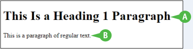

### Mi a CSS?
A CSS a Cascading Style Sheets rövidítése, egy nyelv, amelyet a weboldalak formázására használnak HTML-ben. A CSS lehetővé teszi a vizuális elrendezés vezérlését és a weboldalak megjelenését, beleértve a betűtípusokat, színeket, a szövegeket és pozícionálásokat szövegen és más elemeken. 

A CSS szövegalapú utasításokból áll, amelyek meghatározzák az egyes elemekre alkalmazandó formázást. Például létrehozhat egy h1 stílust az előbb bemutatott h1 elem formázására. 

A CSS-t háromféleképpen lehet implementálni: külső fájlként, a HTML-dokumentumba ágyazott stílusként, vagy egy adott HTML-címkén belül alkalmazott stílusok formájában. Általában egy külső fájl használata a legjobb, mert az lehetővé teszi több HTML dokumentum formázását egyetlen stíluslap segítségével. Amikor változtatásokra van szüksége, azt megteheted a külső CSS-ben ahelyett, hogy egyesével változtatnád a dokumentumokon.

### Hogyan készítsünk HTML és CSS fájlokat?
Mind a HTML, mind a CSS csak szöveges fájlokból áll, így akár a legegyszerűbb szövegszerkesztővel is létrehozhatja őket, például a Windowshoz mellékelt Notepad szövegszerkesztővel. Azonban, hogy gyorsan és egyszerűen hozzon létre HTML és CSS
fájlokat, általában jobban jár, ha egy olyan szövegszerkesztőt vagy integrált fejlesztőkörnyezetet használ, amelyik funkciókat biztosít a kód beviteléhez és ellenőrzéséhez. Az ilyen szövegszerkesztőket gyakran nevezik kódszerkesztőknek.

Ez a könyv a Microsoft Visual Studio Code-ot ajánlja, egy ingyenes kódszerkesztő programot, amely Windows, macOS és Linux alatt fut, és tartalmaz néhány integrált fejlesztőkörnyezet funkciót. Lásd a "Visual Studio Code" című fejezet későbbi részében a Visual Studio Code telepítésére vonatkozó utasításokat.

### Mi a reszponzív web szerkesztés?
A web kezdeti időszakában a legtöbb ember asztali számítógépet vagy laptopot használt a böngészéshez, amelynek képernyője mérsékelt mennyiségű információ megjelenítésére volt alkalmas - mondjuk 1024 × 768 felbontásra vagy annál nagyobbra. A legtöbb weboldalt úgy tervezték és kódolták, hogy az ilyen képernyőkön könnyen olvashatóak legyenek. Ha egy ilyen weboldalt egy sokkal kisebb vagy alacsonyabb felbontású képernyőn érne el, akkor valószínűleg az oldal szélességének csak egy részét látná olvasható méretben, és vízszintesen kellene görgetnie, hogy a többit is lássa. Napjainkban a látogatók sokféle eszközt használnak, a hatalmas képernyőkkel rendelkező asztali számítógépektől kezdve egészen a viszonylag apró képernyővel rendelkező táblagépekig és okostelefonokig. A böngészőeszközök e sokfélesége azt jelenti, hogy az egyméretű webdesign már nem kielégítő a legtöbb weboldal számára.

A különböző eszközökhöz való alkalmazkodás érdekében a weboldal-építők a reszponzív webdesignnak nevezett megközelítést alkalmazzák.A reszponzív webdesign olyan oldalakat hoz létre, amelyek alkalmazkodnak a különböző eszköztípusokhoz, különböző képernyőméretekhez és a vízszintes és függőleges tájoláshoz.

A reszponzív webdesign során a weboldal elrendezése és tartalma automatikusan alkalmazkodik a képernyő méretéhez. A reszponzív webdesign rugalmas rácsrendszereket, képeket és tipográfiát használ, hogy megváltoztassa a weboldal elrendezését. Médialekérdezéseket használ az eszköz képernyőméretének megfelelő stílus alkalmazásához. 

A reszponzív webdesignnak számos egyértelmű előnye van a statikus webdesignnal szemben. Először is, egy reszponzív weboldal konzisztens felhasználói élményt nyújt a különböző típusú eszközökön, ahelyett, hogy előnyben részesítene egyes eszközöket másokkal szemben. Másodszor, egy reszponzív weboldal könnyebben olvasható, navigálható és használható a látogatók számára. Harmadszor, egy reszponzív weboldal javítja a hozzáférhetőséget, lehetővé téve a fogyatékkal élők számára, hogy kielégítően elérjék azt. Negyedszer, egy reszponzív weboldal javíthatja a keresőoptimalizálást, vagy röviden SEO-t.

## Statikus és dinamikus weboldalak megértése
A weboldalához, statikus vagy dinamikus weboldalakat hozhat létre. A statikus weboldal egy
olyan oldal, amelynek tartalma rögzített, és nem változik, kivéve, ha szerkesztik azt. Ezzel szemben egy dinamikus weboldal tartalma szükség szerint változik. 

A statikus weboldalak jól alkalmazhatóak bizonyos célokra, és valószínűleg Ön is szeretne majd létrehozni néhány statikus oldalt a weboldalához. Valószínű azonban, hogy számos weblapja számára előnyös lenne a naprakész információk vagy a látogatók igényeire való reagálás, ezért dinamikus weboldalakat kell létrehoznia. 

### Statikus weboldalak és dinamikus weboldalak összehasonlítása
A reszponzív weboldal egy olyan weboldal, amely megvizsgálja, hogy milyen típusú eszköz fér hozzá a weboldalhoz, és megjeleníti az adott tartalmat az eszköznek megfelelő módon. Például, ha meglátogat egy reszponzív weboldalt az asztali számítógépen, amely nagy kijelzővel rendelkezik, a weboldal az ön számítógép verziójának megfelelően formázott oldalát fogja betölteni.

Ezzel szemben, ha ugyanarra a reszponzív weboldalra tér vissza mobiltelefonjával, akkor a webszerver egy olyan formázott változattal szolgál ami megfelel a kisebb kijelzőknek.

Egy nem reszponzív weboldal egyszerűen minden látogatónak ugyanolyan típusú oldalt ad, függetlenül attól, hogy az megfelel-e a az eszköznek vagy sem. A nem reszponzív weboldal nem vizsgálja meg, hogy milyen típusú eszköz látogatja meg

Általában inkább egy reszponzív weboldalt szeretne létrehozni, nem pedig egy nem reszponzív weboldalt. Egy reszponzív weboldal készítésének számos előnye van:
-	A weboldal tartalma folyamatosan használható különböző eszközökön egy kódbázis használatával. Nem kell különböző weboldalakat készíteni különböző eszközök számára.
-	Az egy kódbázis leegyszerűsíti a fejlesztést és frissítést és csökkenti a karbantartási költséget
-	Ha a weboldal látható és használható különböző eszközökön, az növelheti a márka elismerését és annak valószínűségét, hogy a látogatók megosszák a weboldalt a közösségi médiában, ami extra forgalmat generálhat a weboldal számára. Ilyenféle siker természetesen függ a weboldal tartalmától; reszponzivitás segít, de nem csodaszer.

Több információért, hogy reszponzívvá tegye oldalát nézze meg a 10. fejezetet.

## Eszközök megértése weboldalak készítéséhez
Sok különböző féle eszköz elérhető weboldalak készítésére. Ez a rész összefoglalja a rendelkezésre álló különféle típusú eszközöket, majd rámutat azokra az eszközökre, amelyeket ez a könyv használ, hogy bemutassa a HTML és CSS fájlok készítését.

A HTML és CSS egyaránt csak szöveget tartalmaz, szóval létre tudja hozni ezeket a fájlokat szöveg szerkesztő használatával. Bár nagyobb valószínűséggel fog használni egy kód szerkesztőt, egy alkalmazás ami segíti helyesen és gyorsan megírni a kódot. Valószínűleg szüksége lesz egy graphics‐manipulation alkalmazásra a weboldal számára alkalmas képek készítéséhez.

### Szövegszerkesztő
A *szövegszerkesztő* egy alkalmazás egy szöveg létrehozására és szerkesztésére. A HTML és CSS fájlok egyaránt csak szövegből állnak, tehát a legalapvetőbb szövegszerkesztőt is használhatja ezek létrehozására és szerkesztésére. Például a Windows tartalmazza a tiszteletreméltó, de még mindig használható szövegszerkesztő a Jegyzettömböt, amely egy HTML-fájl szerkesztését mutatja be a mellékelt ábrán.

A Jegyzettömb se más szövegszerkesztő nem ad semmiféle specifikus funkciót HTML és CSS fájlok létrehozásához. Néhány purista
előnyben részesítik ezt a fajta minimalista megközelítést, de a legtöbb ember számára hasznos ha van segítsége a kód elkészítésében és ellenőrzésében.

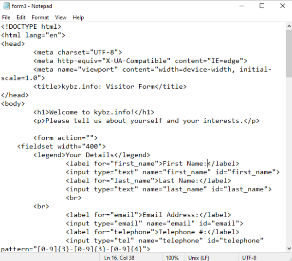

### Word Processor (szövegszerkesztő)
A *word processor* egy olyan applikáció amely szövegből, grafikából és más objektumokból álló dokumentumok elkészítésére alkalmas és szükség szerint formázható. HTML és CSS fájlok készítéshez használható szövegszerkesztő, ez általában nem egy jó megoldás, mivel rengeteg olyan funkciót hoz fel amit el kell kerülni mint például a formázás,
elrendezés, grafikus objektumok és revízió jelölés.

A szövegszerkesztő hasznos lehet weboldal készítéshez a már létező szövegszerkesztő dokumentumokból. Például a Microsoft Word lehetővé teszi, hogy a dokumentumokat három féle webes formátumba mentsen: a Single File Web Page formátum; a Web Page formátum, vagy a Web Page, Filtered formátum. Normális esetben a Web Page, Filtered formátumot választja, mert ez adja a legkompaktabb eredményt, csak azokat az információkat őrzi meg amelyek szükségesek a weboldal megjelenítéséhez és eldobja azon információkat amelyek csak a Word formátumnak szükséges. A Web Page formátum egyaránt elmenti az összes Word formázási információt effektíven megmentve az egész Word dokumentumot HTML formátumban. A Single File Web Page formátum egy nagy fájlt hoz létre, amely tartalmazza az összes szükséges objektumot a Word dokumentum elkészítéséhez.

### Kód szerkesztő
A kódszerkesztő az egy fejlesztett szövegszerkesztő extra funkciókkal bővítve kódok létrehozásához - bármilyen HTML-től kezdve a programozási kódig. Általában egy kódszerkesztő a legjobb választás a HTML- és CSS-fájlok nulláról történő létrehozásához és ezek későbbi szerkesztéséhez.

A mellékelt ábra az automatikus kódkiegészítést mutatja be `(A)` a Microsoft Visual Studio Code ingyenes kódszerkesztő programjában amelyet ez a könyv ajánlja  HTML és  CSS való munkához. Lásd később a „Visual Studio Code telepítése” című részt ebben a fejezetben a Visual Studio telepítésével kapcsolatos utasításokért egyszerű telepítésért.

Más széles körben használt kódszerkesztők közé tartozik a Sublime Text, [www.sublimetext.com](https://www.sublimetext.com/), ami 99 dollárba kerül egy ingyenes időszak után értékelés idő nélkül korlátoz, de emlékeztetőkkel ujításhoz; UltraEdit, [www.ultraedit.com](https://www.ultraedit.com), amely ingyenes 30 napos próbaverziót kínál majd 79,95 dollárba kerül éves előfizetésre vagy 149,95 dollár az állandó verzióért; és Jegyzettömb ++, [www.notepad-plus-plus.org](https://www.notepad-plus-plus.org), amely ingyenes de csak Windowson fut.

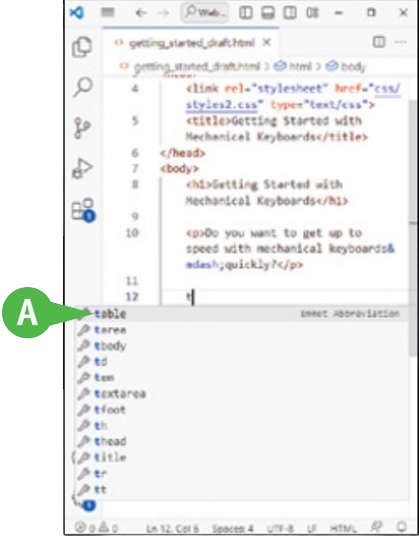

### Weboldal készítő
A webhelykészítők egyszerűsített eszközök, amelyek lehetővé teszik, hogy készítsen egy webhelyet előre megtervezett elmek behúzásával egy testreszabható sablonra. Weboldal készítők jók azoknak az embereknek vagy kisvállalkozásoknak, akik arra vágynak, hogy gyorsan és kódolás nélkül készítsenek egy weboldalt.	A széles körben használt webhely-készítők közé tartozik a Weebly, www.weebly.com; Wix, www.wix.com; és a Squarespace, www.squarespace.com. A legtöbb webhelykészítő kínál webhost-ot, így nem kell külön webhost-ot találnia.

Sok webhost hozzáférést biztosít egy vagy több webhelyhez építő számára. Tehát ha már van webhost-ja, nézze meg, hogy van-e webhelykészítőt kínálata.

### Tartalomkezelő rendszerek
A tartalomkezelő rendszer, rövidítve CMS, a
webalapú alkalmazások létrehozásához, kezeléséhez és weboldalak, blogbejegyzések és képek közzétételéhez. A CMS-ek webhelysablonok széles választékát kínálja, amelyek számos választási lehetőséget kínálnak dizájnról és funkcionalitásról.	Eszközöket is biztosítanak
tartalmak kezelésére és közzétételére, ideértve a postok ütemezést, a közösségi média integrálása és a SEO optimalizálás.

A széles körben használt CMS platformok közé tartozik a WordPress, a 
www. wordpress.com; Joomla, www.joomla.org; és Drupal, www.drupal.org.

### Grafikai eszközök
A weboldalához megfelelő képfájlok létrehozásához egy grafikai-manipuláló eszközre lesz szüksége. Ez a könyv a
GIMP, a GNU Image Manipulation Program-ot ajánlja, amely ingyenes és Windows, macOS és Linux rendszeren fut. Ez elérhető a www.gimp.org webhelyről; lássa a „GIMP telepítése” részt, később ebben a fejezetben.

Ha professzionálisan dolgozik grafikával, akkor már lehet rendelkezik megfelelő grafikus manipulációs eszközzel, például Adobe-val, Photoshop-val vagy Adobe Illustrator-el Az ilyen eszközök megfelelő képfájlokat képes létrehozni webhelye számára.	Adobe, a www.adobe.com kínál Photoshop-ot és Illustrator-t mint egyalkalmazásos előfizetés, vagy akár Creative Cloud csomagjához való előfizetés ami több mint 20 alkalmazást tartalmaz. Különleges árak érhetőek el diákok, tanárok, iskolák és egyetemek számára.

Ha Windows rendszert használ, érdemes lehet kipróbálni a beépített Paint alkalmazás; Ha nem bizonyul megfelelőnek, akkor ki próbálhatja az ingyenes Paint.net ami a www.getpaint.net webhelyről elérhető. Ha macOS-el rendelkezik akkor érdemes lehet kísérletezni a beépített Előnézet és Fotó alkalmazással. Linux esetén menjen egyenesen a GIMP-hez.

## Felkészülés a webhelyed elkészítésére
A webhely létrehozása előtt előfordulhat, hogy ki kell választania egy webhost-ot, amelyen hostolhatja a webhelyét, regisztráljon egy domain nevet, amely alatt fog megjelenik a weben, és szerezzen be és alkalmazzon Secure Sockets Layer-t, SSL-t a webhely és a látogatók közötti forgalom biztonságához.

Az Ön helyzetétől függ, hogy milyen lépéseket kell megtennie. Ha Ön vagy cége már rendelkezik web hostinggal, hagyja ki ezt a lépést; hasonlóképpen hagyja ki a domain név és az SSL lépéseit, ha már rendelkezik velük. Ha készen áll, lépjen tovább a következő szakaszra: „A Visual Studio Code telepítése”.

### Web host választása
Ha Ön vagy cége nem rendelkezik webhost-tal, először válassza ki a megfelelőt, és regisztráljon az Ön igényeinek megfelelő hosting tervre.

Számos webhost áll rendelkezésre, amelyeket másodpercek alatt megtalálhatóak az interneten való kereséssel. A webhostok értékelésekor általában érdemes a következő funkciókat figyelembe venni:

- **Ár.** Az ár segítségével válasszon ki egy olyan webhostot és csomagot, amelyet megengedhet magának, majd alkalmazza a listában lévő többi tényezőt, hogy értékelje a hostot és csomagját. Ne csak az ár alapján ítélje meg a csomagot.

- **Üzemidő és megbízhatóság.** Webhelyének működőképesnek és a hét minden napján elérhetőnek kell lennie ahhoz, hogy kiszolgálja a látogatókat. Válasszon olyan internetes tárhelyet, amely magas százalékos üzemidőt kínál – a 99,9 százalékos üzemidőt tekintjük minimum üzemidőnek dedikált hostoknak – és nagy megbízhatóságnak

- **Vevőszolgálat.** Győződjön meg arról, hogy a webhost-ja erős ügyfélszolgálatot kínál az összes használni kívánt csatornán keresztül – e-mailes támogatás, telefonos támogatás és élő csevegés

- **Teljesítmény és sebesség.** A felhasználók könnyen frusztrálttá válnak a lassan betöltődő webhelyek miatt, szóval győződjön meg, hogy webhost-ja gyors betöltési sebességet biztosít. Olyan webhost-ot keressen, amely tartalomszolgáltató hálózatokat használ, röviden CDN. A CDN egy földrajzilag elosztott szerverrendszer, amely webtartalmat szállít a látogatók földrajzi elhelyezkedésük alapján, ahelyett, hogy az összes tartalmat egy központi pontról szállítanák, amelyek földrajzilag távol lehet egyes látogatóktól.

- **Méretezhetőség.** Győződjön meg arról, hogy a webhost-ja lehetővé teszi a tárhely-terv frissítését, mivel webhelye és annak forgalma nőhet. Ez a méretezhetőség segít elkerülni, hogy kinője a webhost-ját, és ne kelljen másik hostra váltani, ami jelentős és költséges felfordulás.

- **Biztonság, biztonsági mentés és helyreállítás.** A webtárhelynek biztosítania kell az SSL-tanúsítványokat, a rosszindulatú programok észlelését és tűzfalakat a webhelyek biztonságának megőrzése érdekében. A hostnak biztonsági mentési beállítási és elfelejtési funkciókat is kell kínálnia, hogy megőrizze az Ön adatait a webhelyen sérülés vagy hardverhiba esetén, valamint könnyen használható eszközök weboldala visszaállításához a legutóbbi elérhető mentés alapján.

### Domain név regisztrálása
Ha nem rendelkezik domain névvel a webhelyéhez, most itt az ideje beszerezni egyet. Nyisson meg egy ablakot a domain regisztrálásához, keressen egy elérhető domain nevet ami Önnek megfelel, és regisztrálja. Az alábbi ábra a Pair Domains regisztráló felületét mutatja be.

Jelen állás szerint ez az öt vezető domain vezetők:
- GoDaddy, [www.godaddy.com](https://www.godaddy.com)
- Domain.com, [www.domain.com](https://www.domain.com)
- Namecheap, [www.namecheap.com](https://www.namecheap.com)
- Google Domains, [https://domains.google](https://domains.google)
- Porkbun, [www.porkbun.com](https://www.porkbun.com)

Mindezek a domainregisztrátorok a legfelső szintű szolgáltatások széles skáláját kínálják domainek vagy TLD-k. Ezek a TLD-k széleskörben elérhetőek .com, .org és .net – három az eredeti hat TLD-ből, amelyet a 1980-as években készítettek – újabb TLD-k, mint például az .art, .biz és .shop. Az árak eltérően változnak, a legnépszerűbb TLD-k messze a legdrágábbak.	 

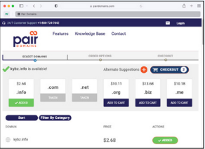

A különböző TLD-k azokra a szervekre korlátozódnak, amelyek megfelelnek
minősítési kritériumoknak. Például a .gov TLD az Egyesült Államok kormányzati szervei és szervezetei számára fenntartott, a .mil TLD az Egyesült Államok hadseregének van fenntartva, és az .edu
TLD az akkreditált középiskola utáni oktatás számára van fenntartva intézmények számára az Egyesült Államokban. Kiábrándítóan, a .cat TLD a katalán nyelvészeti és kulturális közösség számára van, de a .dog TLD, a .pet TLD, és az .animal TLD mindenki számára nyitva áll.

### Válassza ki az SSL-tanúsítvány típusát
Az SSL a Secure Sockets Layer rövidítése, a hálózati biztonsági protokoll, egy titkosított kapcsolat a webböngésző és a webkiszolgáló között, annak biztosítására, hogy a közöttük átadott adatok bizalmasak és biztonságosak maradnak még akkor is, ha azokat útközben elfogják. Hogy megbizonyosodjon arról böngészők biztonságosan hozzáférhetnek webhelyéhez, ahhoz szüksége lesz
egy SSL-tanúsítványra, és annak alkalmazására a webhely domainjére.

Az SSL-tanúsítvány beszerzésének két fő lehetősége van. Először is szerezhet be egy SSL-tanúsítványt a domain
regisztrátornál, amikor regisztrálja a webhely nevét. Második, sok webhost kínál SSL-tanúsítványokat az Ön domainjéhez amit a webhost szerverein hostol. A harmadik lehetőség az SSL beszerzésére
egy másik domain regisztrátortól, de ez a körkörös megközelítés ritkán előnyös.

Általában azt szeretné meg tudni, hogy webhost-ja milyen SSL-tanúsítványokat ajánl, mielőtt fizetne egy SSL-tanúsítványért a domain regisztrátorától.	Különféle típusú SSL-tanúsítványok állnak rendelkezésre, mint például a
következő:

- A próbatanúsítvány, egy idő korlátozott tanúsítvány, amely lehetővé teszi annak tesztelését, hogy a tanúsítvány megfelel-e az Ön igényeinek; ha igen, akkor vásárolhat egy másik tanúsítványt.

- Egy pozitív tanúsítvány lehetővé teszi a titkosítást a webhely adatai számára, és viszonylag kicsi az érintett fél garanciája, $10.000.

- Az alaptanúsítvány szintén lehetővé teszi a titkosítást, de sokkal magasabb garanciával rendelkezik, $250 000.

- A pozitív helyettesítő karakter tanúsítvány lehetővé teszi a titkosítást több aldomainnek a domainen belül, így nem kell külön tanúsítványt venni minden aldomain számára.

## Visual Studio telepítése
Ahogy azt a "Weboldalak létrehozásához szükséges eszközök megértése" fejezetben már korábban ismertettük, a kód szerkesztője a mindennapi eszközöd az HTML dokumentumok és CSS fájlok létrehozásához és szerkesztéséhez. Számos különböző kód szerkesztő elérhető, de ez a könyv a Visual Studio Code-ot javasolja, egy erőteljes, de ingyenes kód szerkesztőt a Microsofttól. A Visual Studio Code Windows-on, macOS-en és Linux-on fut, az egyes platformokon hasonló felülettel.

A Microsoft két különálló verziót kínál a Visual Studio Code-ból. A Stabil verziót általában
azt fogod telepíteni. Az Insiders verzió új funkciókat és javításokat tartalmazhat, és nem biztos, hogy teljesen stabil.

### Telepítés Visual Studio Code lépései:

1. Egy webböngészőben látogass el a code. visualstudio.com oldalra. A Visual Studio Code weboldalának főoldala jelenik meg.

2. Kattints a Stabil Verzió Letöltése gombra. Ez a gomb megjeleníti a számítógéped operációs rendszerét, amelyet az oldal automatikusan érzékel. A Ha más operációs rendszerrel rendelkező számítógépre szeretnéd letölteni a Visual Studio Code-ot, vagy ha az Insiders verziót szeretnéd letölteni a Stabil helyett, kattints a legördülő nyílra ( ), majd kattints a Letöltés ( ) gombra az operációs rendszer és verzió kiválasztásához. A letöltés megkezdődik.

3. Nyisd meg a böngésző Letöltések paneljét vagy ablakát. Például a Microsoft Edge-ben kattints a Letöltések ( ) ikonra, ha a Letöltések panel nem nyílik meg automatikusan.

4. Nyisd meg a letöltött fájlt. Például a Microsoft Edge-ben kattints a Letöltött fájl megnyitása gombra a letöltött fájl neve alatt. Windows-on az installáló automatikusan fut.

5. Az Engedélyezési Szerződés képernyőn kattints az Elfogadom gombra (átvált ), ha folytatni szeretnéd a telepítést.

6. Kattints a Következő gombra.

7. Az Válaszd ki a telepítési helyet képernyőn kattints a Következő gombra (nem látható).

8. Az Startmenü Mappa Kiválasztása képernyőn kattints a Következő gombra (nem látható). Megjelenik a Válassz további feladatokat képernyő.

9. Válaszd ki az Asztali ikon létrehozása opciót ( ), ha asztali ikont szeretnél létrehozni a Visual Studio Code-hoz.

10. Válaszd ki a Két &quot;Megnyitás a Kóddal&quot; művelet hozzáadása jelölőnégyzetet ( ), hogy könnyen megnyithasd a fájlokat és mappákat a Visual Studio Code-ban a Fájlkezelőből. Részletekért lásd a második tippet.

11. Válaszd ki a Kód regisztrálása szerkesztőként támogatott fájltípusokhoz opciót ( ), hogy regisztráld a Visual Studio Code-ot a Windows rendszerrel olyan alkalmazásként, amely meg tudja nyitni például az HTML és CSS fájlokat.

12. Válaszd ki az Elérési útvonalhoz hozzáadása (újraindítás szükséges) opciót ( ), hogy hozzáadd a Visual Studio Code-ot a Windows elérési útvonalához. Ez megmondja a Windowsnak, hol található a Visual Studio Code.

13. Kattints a Következő gombra, majd a Telepítésre kész képernyőn ismét kattints a Következő gombra. A telepítés fut. Megjelenik a Visual Studio Code telepítővarázsló befejezése képernyő.

14. Kattints a Visual Studio Code indítása gombra ( átvált ), ha nem szeretnéd elindítani a Visual Studio Code-ot.

15. Kattints a Befejezés gombra. A Telepítővarázsló bezárul. A Visual Studio Code megnyílik, és beállíthatod, ahogy a következő szakaszban magyarázzák.

::: center
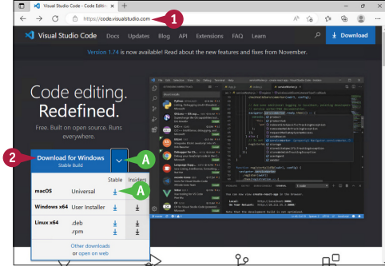
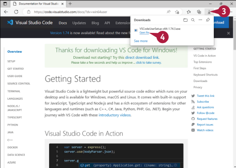
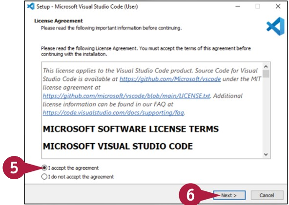
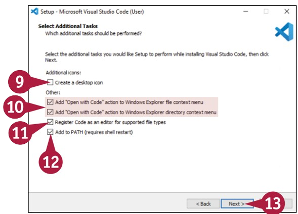
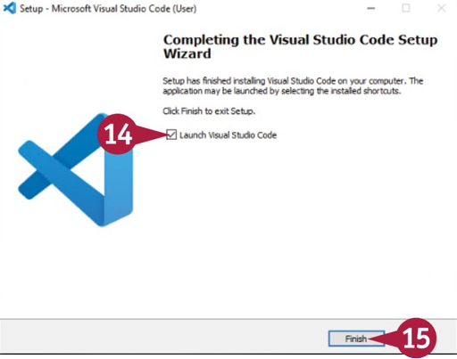
:::

::: tip Tipp
**Hogyan telepíthetem a Visual Studio Code-ot macOS-en?**
Kattints duplán a letöltött Zip fájlra a kicsomagolásához, majd húzd át a Visual Studio Code alkalmazásfájlt az Alkalmazások mappába.

**Mit csinálnak a ” Megnyitás a Kóddal” opciók?**
A ”Megnyitás a Kóddal” művelet hozzáadása a Windows Fájlkezelő fájlokra kattintva jobb-kattintással nyitja meg a Visual Studio Code által támogatott fájltípusokat, majd a Megnyitás a Kóddal lehetőséget választva a kontextusmenüből. Hasonlóan, a **Megnyitás kóddal** művelet hozzáadása a Windows Fájlkezelő mappáira jobb-kattintva lehetővé teszi a mappák megnyitását a Visual Studio Code-ban.
:::

## Találkozás és konfigurálás a Visual Studio Code-dal
Amikor először futtatod a Visual Studio Code-ot, az alkalmazás általában megjeleníti a **Kezdés a Visual Studio Code-dal** képernyőt, amely végigvezet néhány kezdeti beállítási lépésen. Később visszatérhetsz a **Kezdés a Visual Studio Code-dal** képernyőre, ha szeretnéd; vagy alternatívaként használhatod az alkalmazás más beállításaihoz való hozzáférés más módjait is, hogy az alkalmazást úgy konfigurálhasd, ahogy szeretnéd.

Az első változtatás, amit valószínűleg szeretnél, az a téma lesz, amely az Visual Studio Code általános megjelenését irányítja. Az alkalmazás tartalmaz különböző sötét és világos témákat; harmadik féltől származó témák is elérhetőek.

### Indítsd el a Visual Studio Code-ot és találkozz a Üdvözlő Képernyővel
Kezdd a Visual Studio Code indításával a számítógéped operációs rendszerének szokásos módján. Például, Windows-on kattints a Start gombra ( ), hogy megjelenítse a Start menüt, majd kattints a Visual Studio Code-ra ( ).

Amikor először indítod a Visual Studio Code-ot, az alkalmazás automatikusan megjeleníti az Üdvözlő képernyőt, amely ösztönzi, hogy válassz néhány kulcsfontosságú konfigurációs beállítást. Például kattinthatsz a **Kezdés a VS Code-dal** lehetőségre, hogy megjelenítse a Kezdés a VS Code-dal képernyőt, amely itt látható, és amely néhány kulcsfontosságú beállításra mutat linkeket. Ezeket a beállításokat később is konfigurálhatod, ahogy az alábbi alfejezetekben ismertetésre kerül.

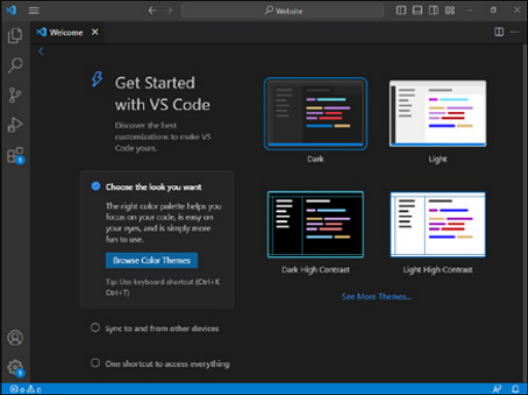

### Válassz témát a Visual Studio Code-hoz
Alapértelmezetten a Visual Studio Code a Dark+ témát használja, amely szemkímélő alacsony fényviszonyok között, de hajlamos túl sok tintát használni a könyvekben. Ahhoz, hogy megváltoztasd a témát, kattints a bal alsó sarkában található **Kezelés** gombra `(A, )`, hogy megjelenítse a ” Kezelés” felugró menüt, kattints a ” Témák” lehetőségre `(B)`, hogy megjelenítse a  **Témák**  folytatási menüt, majd kattints a **Szín Téma** lehetőségre `(C)`, amint itt látható.

A **Szín Téma** kiválasztásánál nyomd le a fel- és lebillentyűket a témák listájának fel- és lemozgatásához. A Visual Studio Code előnézetet jelenít meg a kiválasztott témáról. Amikor megtalálod a kívánt témát, nyomd le az Enter billentyűt a alkalmazásához. Innen kezdve ez a könyv a Light+ V2 (Kísérleti) témát használja az olvashatóság érdekében.

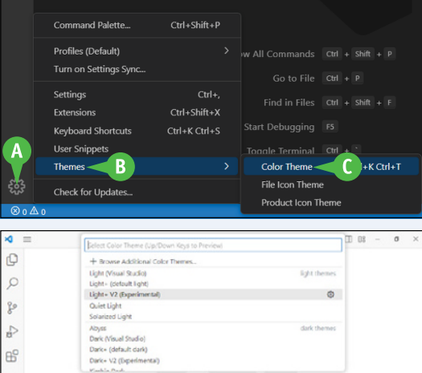

### A kulcselemek azonosítása a Visual Studio kódablakkal:
Az Visual Studio Code ablakban az alábbi kulcsfontosságú elemek találhatók:
- **Tevékenység Sáv (D).** Ez a függőleges sáv az ablak bal oldalán gyors hozzáférést biztosít több különböző panelhez, amelyek közül egyet egyszerre megjeleníthetsz az Elsődleges Oldalsávban.

- **Menü ikon (E).** Amikor a menüsor nincs megjelenítve, kattints a Menü ( ) gombra, hogy megjelenítse a menülistát, majd kattints arra a menüre, amelyet meg szeretnél nyitni.

- **Elsődleges Oldalsáv (F).** Ez a terület, amely alapértelmezés szerint az ablak bal oldalán jelenik meg, megjeleníthet több panelt is, például a Közvetlen hozzáférésű panelt, amely a közelben látható illusztrációban. Egyik panelről a másikra a Tevékenység Sávban található gombokra kattintva válthatsz. Szükség szerint megjelenítheted vagy elrejtheted az Elsődleges Oldalsávot.

- **Másodlagos Oldalsáv (nem látható).** Ez a terület az ablak jobb oldalán további információkat jeleníthet meg a szerkesztett kódhoz. Például megjelenítheted a kódszerkezet vázlatát. Szükség szerint megjelenítheted vagy elrejtheted a Másodlagos Oldalsávot.

- **Szerkesztő (G).** Ez a fő terület, ahol szerkesztheted a fájlokat.

- **Fül sáv (H).** A Fül sáv minden nyitott dokumentumhoz egy lapot jelenít meg. Kattinthatsz a lapra annak a dokumentumnak a megjelenítéséhez, amelyet szeretnél.

- **Panel (I).** Ez az ablak alján található terület lapokkal, amelyek lehetővé teszik különböző elemek megjelenítését: Problémák, Kimenet, Terminál és Hibakereső konzol. Szükség szerint megjelenítheted vagy elrejtheted a Panelt.

- **Állapot sáv (J).** Ez a keskeny vízszintes sáv az ablak alján információkat jelenít meg a Szerkesztő aktuális állapotáról, beleértve a nyelv módot, a sor- és oszlopszámokat, valamint a észlelt problémák számát.

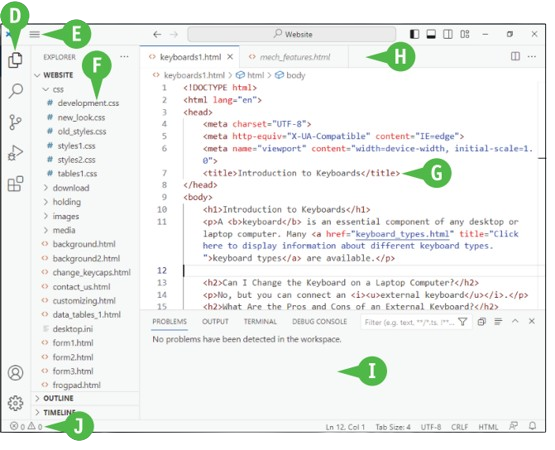

## Ismerkedés a Visual Studio Code-al és konfigurálása (folytatás)
Visual Studio Code rendkívül jól konfigurálható felülettel rendelkezik, amely lehetővé teszi, hogy csak azokat az elemeket jelenítse meg, amelyeket éppen szeretne látni. Az Activity Bar lehetővé teszi számára, hogy a kívánt panelt megjelenítse a Primary Side Bar-ban, de elrejtheti a Primary Side Bar-t, amikor a Kódolásra szeretne koncentrálni.

A Visual Studio Code számos beállítást kínál, amelyekkel vezérelheti az alkalmazás működését. Ez a rész bemutatja, hogyan állíthatja be a két legfontosabb beállítást, az Automatikus Mentést és a Betűméretet.

##Változtassa meg aVisual Studio Code elrendezését
Az ablak jobb felső sarkában található négy gomb lehetővé teszi a Visual Studio Code alkalmazás elrendezésének módosítását:
- Az Elsődleges Oldalsáv váltása (A, ). Kattintson erre a gombra az Elsődleges Oldalsáv megjelenítésének váltásához. Vagy nyomja le az CTRL+B billentyűt Windows vagy Linux rendszeren, vagy a CMD+B billentyűt Mac rendszeren.
- A Panel váltása (B, ). Kattintson erre a gombra a Panel megjelenítésének váltásához. Vagy nyomja le az CTRL+J billentyűt Windows vagy Linux rendszeren, vagy a CMD+J billentyűt Mac rendszeren.
- A Másodlagos Oldalsáv váltása (C, ). Kattintson erre a gombra a Másodlagos Oldalsáv megjelenítésének váltásához. Vagy nyomja le az CTRL+ALT+B billentyűt Windows vagy Linux rendszeren, vagy a CMD+OPTION+B billentyűt Mac rendszeren.
- Az elrendezés testreszabása (D, ). Kattintson erre a gombra az Elrendezés testreszabása ablak megjelenítéséhez, amely a közelben látható.

A Testreszabás elrendezése ablak négy szakaszt tartalmaz: a Láthatóság szakaszt, az Elsődleges Oldalsáv Pozíció szakaszt, a Panel Igazítás szakaszt és a Módok szakaszt.

A Láthatóság szakaszban (E) kiválaszthatja, hogy mely elemeket kívánja megjeleníteni, és melyeket elrejteni. Mozgassa az egeret az elem fölé, amelyet meg szeretne jeleníteni vagy elrejteni. A Megjelenített ikon (F, ) vagy a Rejtett ikon (G, ) megjelenik az elem jobb oldalán. Kattintson erre az ikonra az elem megjelenítése és elrejtése közötti váltáshoz. Az Elsődleges Oldalsáv Pozíció szakaszban (H) válassza ki a **Left** ( ) vagy **Right** ( ) lehetőséget az Elsődleges Oldalsáv megjelenési oldalának irányításához. Az alapértelmezett beállítás a Left.
A Panel Igazítás szakaszban (I) válassza ki a **Left** ( ), **Right** ( ), **Center** ( ) vagy **Justify** ( ) lehetőséget szükség szerint.

A Módok szakaszban (J) válassza ki a **Fullscreen** ( ) lehetőséget a Teljes képernyő módra váltáshoz; kattintson a **Zen** ( ) lehetőségre a Zen módra váltáshoz, amely minimalizálja a Visual Studio Code felületét; vagy kattintson a **Centered Layout** ( ) lehetőségre a Központozott elrendezés módra váltáshoz. Az ezek közül bármelyik vagy az összes három módot alkalmazhatja.

Amikor befejezte a beállítások kiválasztását a Testreszabás elrendezése ablakban, kattintson a **Close** ( ) gombra az ablak bezárásához.

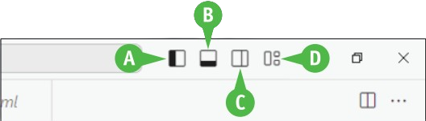
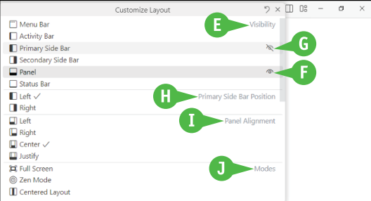

### A weboldalak létrehozására való felkészülés
Auto Save és Betűméret Konfigurálása A Visual Studio Code-ban kattintson a **Menu** (K, ) gombra, hogy megjelenítse a menülistát, majd kattintson a **Fájlra** a Fájl menü megnyitásához. Kattintson a **Preferences** a Beállítások almenü megnyitásához, majd kattintson a **Beállításokra**. 

A Beállítások ablak megjelenik. A Gyakran használt beállítások kategória általában elsőként jelenik meg. Ha egy másik kategória jelenik meg, kattintson a **Gyakran használt** (L) lehetőségre. 

Kattintson a Fájlok: Automatikus mentés (M, ) lehetőségre, majd kattintson az afterDelay-re. Ez a beállítás lehetővé teszi, hogy a Visual Studio Code automatikusan mentse a változtatásait egy rövid késleltetés után. Ebben a könyvben feltételezzük, hogy az afterDelay beállítást használja. A más elérhető beállítások: off, onFocusChange, amely akkor menti el a változtatásokat, amikor a fókuszt egy másik részre mozgatja a Visual Studio Code-ban; és az onWindowChange, amely akkor menti el a változtatásokat, amikor a fókuszt egy másik ablakra mozgatja. 

Kattintson az **Editor: Font Size** (N) lehetőségre, majd írja be az editorban használni kívánt betűméretet. 

Opcionálisan kattintson az **Editor: Font Size** (O) lehetőségre, majd írja be az editorban használni kívánt betűtípust. A Visual Studio Code az első betűt használja — például a Consolas a példában — ha elérhető, és ha szükséges, a következő nevű betűkra lép át; ha egyik nevű betű sem elérhető, a generikus betűtípusra — ebben az esetben a monospace-re — lép át. Ha a betűtípus neve tartalmaz szóközt, akkor a példában látható módon idézőjelek között adja meg, például 'Courier New'. 

Ahogy láthatja, a Visual Studio Code rendelkezik számos funkcióval. Végigböngészheti azokat, ha a bal oldali ablaktáblázatban kattint a kategóriákra, vagy keresse meg a **Search settings** (P) gombra kattintva, majd gépelje be a keresési kifejezését. Amikor befejezte a beállítások konfigurálását, kattintson a **Close** ( ) gombra az ablak bezárásához.

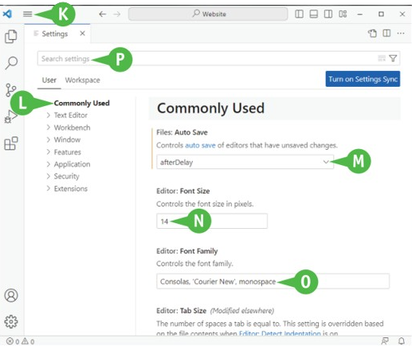

## GIMP telepítése
A webhelyéhez megfelelő képfájlok létrehozásához szüksége lesz egy képszerkesztő alkalmazásra. Sok alkalmazás elérhető, néhány ingyenes, néhány pedig nem, így bőséges választási lehetősége van. A legjobb platformok közötti megoldás a GIMP, a GNU Képmanipulációs Program. A GIMP egy ingyenes és nyílt forráskódú képszerkesztő, amely Windows, macOS, Linux és más operációs rendszereken is fut.

### GIMP telepítése Windows 10 vagy Windows 11
A GIMP telepítéséhez Windows 10 vagy Windows 11 rendszeren kattintson a **Start** ( ) gombra a Start menü megjelenítéséhez, majd kattintson a **Microsoft Store** ( ) gombra a Microsoft Store alkalmazás megnyitásához. Kattintson a **Keresés alkalmazásokra, játékokra, filmekre és még többre** az alkalmazásablak tetején, gépelje be a **gimp** (A) szót, majd nyomja le az Enter billentyűt. A keresési eredmények között kattintson a **GIMP-re**, majd kattintson a **Telepítés** (B) gombra.

Amint a GIMP telepítve van, elindíthatja a **Start** ( ) gombra kattintva, majd a **GIMP** ( ) gombra kattintva.

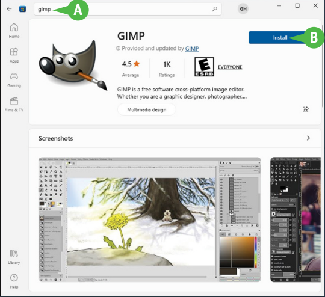

### GIMP telepítése macOS rendszerre Ezen írás
Pillanatilag a GIMP nem elérhető az Apple Mac App Store-ban. 

A GIMP telepítéséhez macOS rendszeren nyisson meg egy böngésző ablakot vagy lapot a GIMP webhelyén, a www.gimp.org (C) címen. Kattintson a Letöltések fülre (D) az ablak tetején, hogy megjelenítse a **Letöltések** oldalt, keressen rá a macOS jelenlegi stabil verziójára, majd kattintson vagy a **GIMP letöltése BitTorrent segítségével** (E) azért, hogy a GIMP-et a BitTorrent fájlmegosztási szolgáltatáson keresztül töltse le, vagy **közvetlenül a GIMP letöltése** (F) opcióra, hogy a GIMP webhelyéről tölthesse le. A gombok lehetőséget kínálnak az Apple Silicon és az Intel processzorokhoz való letöltésre; válasszon megfelelően a használt processzortípustól függően.

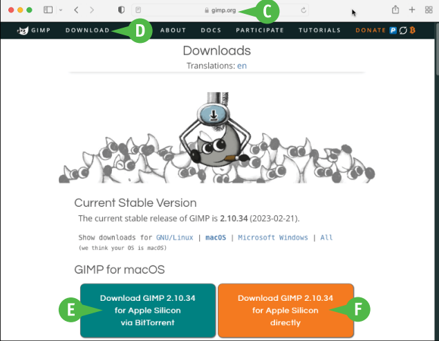

### Felkészülés a weboldalak létrehozására
Ha megjelenik a "Do You Want to Allow Downloads on www.gimp.org?" párbeszédpanel, kattintson az **Engedélyezés** opcióra. 

Amikor a letöltés befejeződik, kattintson a Letöltések mutatása gombra, majd kattintson a GIMP lemezképfájlra a Letöltések listájában. Egy Finder ablak megnyílik, amely a GIMP telepítőcsomag tartalmát mutatja. Húzza az GIMP ikont (G) az Alkalmazások mappához vezető gyorsikonra. A telepítés befejezése után kattintson a Nézet gombra a Nézet menü megnyitásához, majd kattintson a Eszköztár mutatása opcióra az eszköztár és az oldalsáv megjelenítéséhez. Menjen az oldalsáv Helyek szakaszába, és kattintson az **Reject** gombra a GIMP lemezképfájl kihúzásához. Ezt követően törölheti a fájlt a Letöltések mappából, ha nem kívánja megtartani.

Az alkalmazás telepítése után elindíthatja a GIMP-et a **Launchpad** ( ) gombra kattintva, majd a **GIMP** ( ) opcióra kattintva.

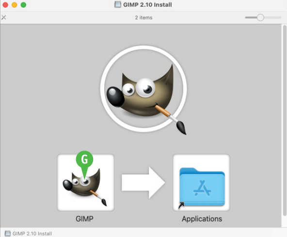

### GIMP telepítése Linux rendszeren Több lehetősége
Van a GIMP telepítésére Linux rendszeren, beleértve a disztribúció szoftverkezelő alkalmazásának használatát. Ha a számítógépén Ubuntu fut, a legegyszerűbb megközelítés az, hogy nyisson meg egy terminál ablakot, és frissítse a csomaglistát a következő parancs kiadásával:
```shell
sudo apt-get update
``` 
Amint a csomaglista naprakész, telepítse a GIMP-et és minden szükséges függőséget a következő parancs kiadásával: 
```shell
sudo apt-get install gimp
```
A telepítés befejezése után elindíthatja a GIMP-et vagy az alkalmazás menüből a GIMP kiválasztásával, vagy a terminál ablakban a gimp parancs kiadásával: 
```shell
gimp
```

## Telepítse a főbb böngészőket
A legtöbb operációs rendszer egyetlen böngészőalkalmazással érkezik – például a Windowshoz a Microsoft Edge böngésző, a macOS-hez az Apple Safari böngészője, a ChromeOS-hez pedig a Google Chrome böngészője. Bár ezek a böngészők mindegyike jól működik a webböngészés során, valószínűleg telepítenie kell a főbb böngészők teljes palettáját, hogy mindegyikkel tesztelhesse weboldalait, és megoldhassa a felmerülő kompatibilitási problémákat.

Jelen pillanatban a négy vezető böngésző a Chrome, a Mozilla Firefox, a Safari és a Microsoft Edge.

### Mely böngészőket használják a legszélesebb körben?
A webböngészők széles választéka áll rendelkezésre, de 2023 tavaszán a Google Chrome uralja a piacot. A webböngészőhasználat lebontása (lásd a közeli kördiagramot) inkább illusztrációs, semmint pontos, de a legtöbb adat egyetért abban, hogy a Chrome a forgalom kétharmada és háromnegyede között mozog. Következik az Apple Safari körülbelül egyötödével a forgalomnak, főleg annak köszönhetően, hogy minden iPhone-on, iPaden és minden Mac-en megtalálható.

A Safari után a Microsoft Edge a Windows 10 és a Windows 11 része, a forgalom valamivel kevesebb mint 5 százalékával. A Mozilla Firefox 3 százalék körüli;  A Samsung Internet 2,5 százalék körüli, akárcsak az Opera. Más böngészők, mint például a Vivaldi és a már megszűnt Internet Explorer adják a forgalom fennmaradó 3 százalékát.

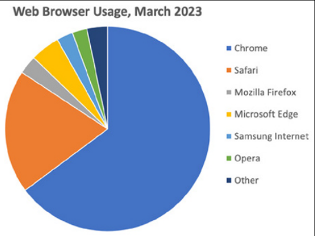

### Hogyan hasonlítható össze a Chrome, a Safari, a Mozilla Firefox és a Microsoft Edge?
Mind a négy böngésző támogatja a funkciók széles skáláját, amelyek segítségével a felhasználók hatékonyan böngészhetnek az interneten és élvezhetik a webes tartalmakat. Mindegyik böngésző támogatja a HTML5-öt, a CSS3-at és a JavaScriptet. Mindegyik a következő hét fő funkciót kínálja:
- **Lapos böngészés.** Egy ablakon belül több weboldalt is megnyithat külön lapokon.

- **Könyvjelzők.** Megjelölheti a weboldalakat, hogy gyorsan újra meglátogassa őket.

- **Történelem.** A böngésző automatikusan listát vezet a meglátogatott oldalakról, így könnyen visszatérhet azokra.

- **Privát vagy "inkognitó" böngészés.** Ez a mód lehetővé teszi az előzmények kikapcsolását, ha nem szeretné, hogy a böngésző nyomon kövesse azokat.

- **Automatikus kitöltés.** A böngésző tárolja az űrlapmezőkbe beírt adatokat – például címadatokat –, így a jövőbeni űrlapokon automatikusan kitöltheti ezeket a mezőket.

- **Jelszótárolás.** A böngésző lehetővé teszi a jelszavak biztonságos tárolását, így gépelés nélkül beírhatja azokat a weboldalakra.

- **Kiterjesztések.** A böngésző funkcionalitását bővítmények, harmadik féltől származó kiegészítők telepítésével bővítheti. 

Ezeken a funkciókon túl, amelyek vitathatatlanul nélkülözhetetlenek manapság az internetes böngészéshez, minden böngésző kínál saját funkciókat. Például:
- A Chrome szorosan integrálva van a Google szolgáltatásaival, például a Gmaillel és a Google Drive-val, és Chrome-alkalmazásokat, webes alkalmazásokat kínál, amelyek a Chrome böngészővel futnak.

- A Microsoft Edge szoros integrációt kínál az Office 365-tel és más Microsoft-szolgáltatásokkal.

- A Mozilla Firefox nagymértékben testreszabható felületet és erős adatvédelmi funkciókat kínál.

- A Safari szorosan integrálódik az Apple eszközfunkcióival, például a Continuity szolgáltatással, amely lehetővé teszi a böngészést az egyik eszközön, és a folytatást egy másikon, valamint az Apple Keychain jelszókezelőjével. A Safari Reader módot is kínál a hirdetések és a megszakítások csökkentése érdekében a weboldalakon.

### Milyen böngészőket érdemes telepíteni?
Hacsak nincs komoly oka az ellenkezőjére, valószínűleg telepítenie kell mind a négy vezető böngészőt, --- Chrome-ot, a Safarit, a Mozilla Firefoxot és a Microsoft Edge-t --- a fejlesztő számítógépére. Ha mind a négy böngésző elérhető, akkor megbizonyosodhat arról, hogy weboldalai a számítógépek túlnyomó többségén megfelelően jelennek meg.
Telepítse a böngészőket, és válassza a konfigurációs lehetőségeket

### A böngészőket a következő oldalakról töltheti le:
- Chrome: [www.google.com/chrome](https://www.google.com/chrome)

- Safari: [https://support.apple.com/downloads/safari](https://support.apple.com/downloads/safari)

- Firefox: [www.mozilla.org/en-US](https://www.mozilla.org/en-US)

- Edge: [www.microsoft.com/edge/download](https://www.microsoft.com/edge/download)

A böngészők telepítése elég egyszerű, de általában a következő hármat kell végrehajtania választási lehetőségek:
- **Meghatározza, hogy az új böngésző legyen az alapértelmezett böngésző a számítógépén.** Például a Legyen a Firefox böngészője párbeszédpanelen kattintson a Lépés kihagyása lehetőségre, hogy elutasítsa a Firefox alapértelmezett böngészővé tételére vonatkozó ajánlatot.

- **Importálja-e a könyvjelzőket az aktuális böngészőből.** A könyvjelzők importálása akkor hasznos, ha tartósan vagy félig állandóan vált egyik böngészőről a másikra, de ha több böngészőt telepít párhuzamos használathoz, érdemes külön könyvjelzőket tartani.

- **Szinkronizálja-e a böngésző adatait az eszközök között.** A könyvjelzők, jelszavak és beállítási adatok szinkronizálása minden olyan eszközön, amelyen egy adott böngészőt használ, nagy áldás lehet a fogyasztók számára. De amikor tesztelés céljából telepíti a böngészőket a számítógépére, érdemes lehet az adatokat szinkronizálatlanul tartani.

## Hozzon létre mappastruktúrát a webhelyéhez
A webhely tervezésének része a webhely mappaszerkezetének kiválasztása és megvalósítása. Általában ezt a mappastruktúrát a fejlesztői számítógépen – vagy a fejlesztői kiszolgálón – és az élő webszerveren is be kell állítani, hogy a fejlesztői környezetből fájlokat másolhasson az élő környezetbe anélkül, hogy módosítania kellene a mappák relatív elérési útját.

A webhelyekhez nincs hivatalos „jóváhagyott” mappastruktúra, így a mappákat úgy rendezheti el, ahogy Önnek és kollégáinak a legjobban megfelel. Ez a rész módszereket javasol a kezdéshez. Önnek és kollégáinak a legjobban megfelel. Ez a rész módszereket javasol a kezdéshez.

### A webhely által használt fájltípusok listája
Kezdje azzal, hogy készítsen listát a webhelye által használt különböző típusú fájlokról. A következő típusokat széles körben használják, de az Ön webhelyén más típusok is lehetnek:
- HTML dokumentumok és CSS fájlok
- Képek
- Betűtípusok
- Audio- és videofájlok
- JavaScript script fájlok
- A weboldallal kapcsolatos dokumentációs fájlok
- Újrafelhasználható kódok és sablonok

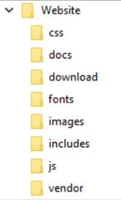

### Határozza meg azokat a könyvtárakat, amelyekre szüksége lesz webhelyének.
Ezután döntse el, hogy hol tárolja ezeket az elemeket. Az 1‐1. táblázat és a közeli illusztráció a könyvtárak meglehetősen tipikus listáját mutatja, de valószínűleg létre kell hoznia a saját egyéni verzióját.

|  | 1-1. táblázat: Tipikus könyvtárak a webhely szerkezetében |
| :------------------------- | :--------------------------- |
| **Mappa** | **Magyarázat** |
| / | A gyökérkönyvtár, a weboldal legfelső szintje. Ebbe a könyvtárba helyezi a fő index.html fájlt, weboldalait és egyéb lényeges fájlokat, például egy robots.txt fájlt. A többi könyvtár a gyökérkönyvtár gyermekei. |
| /css | A weboldalak stílusához használt CSS-fájlok tárolására szolgáló könyvtár. Ha sok CSS-je van fájlokat, fontolja meg alkönyvtárak létrehozását a szorosabb rendszerezés érdekében. |
| /docs | A dokumentációs fájlok tárolására szolgáló könyvtár. |
| /download | A webhely által letölthető fájlok tárolására szolgáló könyvtár. |
| /fonts | A webhely által használt betűtípusfájlok tárolására szolgáló könyvtár. |
| /images | A képfájlok tárolására szolgáló könyvtár. |
| /includes | A sablonok vagy újrafelhasználható kódok tárolására szolgáló könyvtár. |
| /js | A JavaScript szkriptfájlok tárolására szolgáló könyvtár. |
| /vendor | A webhely által használt, harmadik féltől származó keretrendszerek vagy könyvtárak tárolására szolgáló könyvtár. Lásd a 12. fejezetet. |

### Állítsa be a listát az Ön igényei szerint
Ezt a listát tekintve megkérdezheti, hogy a hang- és videofájlok hova kerülnek a könyvtárstruktúrában. Mivel a könyvtárszerkezet nem rendelkezik ezekről a fájltípusokról, el kell döntenie a megfelelő helyet. Egyszerűen létrehozhat egy /audio könyvtárat az audiofájlokhoz és egy /videos könyvtárat a videofájlokhoz. De a címtárszerkezet kompaktságának megőrzése érdekében érdemes lehet létrehozni egy könyvtárat, például /media vagy /assets, amely alkönyvtárakat tartalmaz audio-, videó- és esetleg képek számára. Például:

```
/media
    /audio
    /images
    /videos
```

Vagy:

```
/assets
    /audio
    /images
    /videos
```

A videofájlok helyének kiválasztásakor ne feledje, hogy a videók nagy fájlméretei megnövelik a webszerver terhelését. Ha webhelye sok videót jelenít meg a látogatók számára, fontolja meg a terhek tehermentesítését a videofájlok CDN-en való tárolásával.

### Hozza létre a címtárszerkezetet
Miután meghozta a tervezési döntéseket, létrehozhatja a könyvtárstruktúrát a számítógép operációs rendszerének szabványos parancsaival. Például:

- **Windows.** Nyissa meg a Fájlkezelő ablakot, amely megmutatja azt a mappát, amelybe a gyökérkönyvtárat el fogja helyezni. Kattintson a jobb gombbal a nyitott területre a mappában, kattintson vagy jelölje ki az New elemet a helyi menüben, majd kattintson a gombra Mappa a folytatás menüben. Írja be a könyvtár nevét, és nyomja meg az ENTER gombot a név alkalmazásához. nyomja meg ismét az ENTER-t a könyvtár megnyitásához. Ezután alkönyvtárakat hozhat létre benne.

- **macOS.** Nyissa meg a Finder ablakot a mappába, amelybe a gyökérkönyvtárat helyezi. nyomja meg Control +  Kattintson vagy kattintson a jobb gombbal a helyi menü megjelenítéséhez, majd kattintson az Új mappa parancsra. Írja be a könyvtár nevét, és nyomja meg a Return-t az alkalmazáshoz. Kattintson duplán a könyvtárra a megnyitáshoz, és létrehozhat benne lévő alkönyvtárak.

- **Linux.** Nyisson meg egy terminálablakot, a cd paranccsal keresse meg a megfelelő könyvtárat, majd keresse meg a megfelelő könyvtárat az mkdir paranccsal hozza létre a gyökérkönyvtárat. Használja a chdir parancsot a könyvtár módosításához a gyökérkönyvtárat, majd hozzon létre benne alkönyvtárakat.
