## Reszponzív és tetszetős oldalak létrehozása

Ebben a fejezetben megtudhatja, hogyan hozhat létre reszponzív és vonzó weboldalakat. Az oldalak reszponzívvá tételéhez olyan technikákat használhat, mint a relatív méretezés alkalmazása, a rugalmas pozicionálás megadása és a médialekérdezések hozzáadása. Az oldalak tetszetőssé tételéhez színátmeneteket és átmeneteket alkalmazhat, sprite-okat használhat, és kulcskép-animációkat hozhat létre.

### Az alkotáshoz szükséges eszközök megértése

### Responsive Pages készítése

A CSS egy eszközkészletet biztosít a reszponzív weboldalak létrehozásához, olyan weboldalakhoz, amelyeket úgy terveztek, hogy sikeresen alkalmazkodjanak a különböző képernyőméretekhez és eszközökhöz. Relatív méretezéssel engedélyezheti, hogy az elemek alkalmazkodjanak a rendelkezésre álló területhez. Rugalmas pozicionálással engedélyezheti, hogy a böngésző korlátozásokon belül átrendezze az elemeket. Az eszköz képességeit médialekérdezésekkel észlelheti, növelheti a koppintási cél méretét, és konfigurálhatja a nézetablakot. Az oldalakat különböző eszközökön és képernyőkön is tesztelnie kell
Ez a szakasz áttekintést nyújt ezekről az eszközökről és technikákról, és rámutat a fejezet későbbi szakaszaira, amelyek ezeket tárgyalják.

### Relatív méretezés

A CSS lehetővé teszi fix vagy relatív méretezés megadását. A rögzített méretezés általában képpontokat használ, bár más egységek is rendelkezésre állnak. Például beállíthatja a div elem szélességi tulajdonságát 500 képpontra, így a böngésző 500 képpont szélességben jeleníti meg az elemet. A rögzített érték nem változik a különböző képernyőkön, így ami jól néz ki az asztali vagy laptop képernyőjén, az olvashatatlan lehet a telefon képernyőjén.
A relatív méretezés a rendelkezésre álló terület százalékos arányát vagy a relatív egységeket, például az ems-t és a rems-t használja. Az ems a szülőelemen alapuló betűméret, míg a rems a gyökérelem alapján történő betűméret mértékegysége. Például, ha a gyökérelem 16 pontos betűtípust használ, megadhatja a 2rem értéket, hogy 32 pontos betűtípust alkalmazzon egy elemre.
A relatív méretezéssel kapcsolatos további információkért tekintse meg a következő szakaszt: „Relatív méretezés alkalmazása”.

### Rugalmas pozicionálás

A CSS lehetővé teszi, hogy különféle technikákat alkalmazzon az elemek rugalmas elhelyezésére az oldalakon. Lebegtethet egy elemet egy másik elemtől balra vagy jobbra. Megadhat egy elem relatív vagy abszolút pozicionálását. Létrehozhat Flexbox elrendezéseket is, amelyek lehetővé teszik a böngésző számára az elemek átrendezését az Ön által megadott megszorításokon belül.
Tekintse vissza a 9. fejezetet ezekről a témákról.

### Médiakérdések

A CSS tartalmaz egy médialekérdezések nevű funkciót, amely lehetővé teszi, hogy megtudja, milyen típusú eszközön és milyen típusú kijelzőn jelenik meg egy weboldal. A „médialekérdezések” úgy hangzik, mintha újságírók keresnének egy történetet, de ebben az esetben a főszereplő Ön – vagy inkább a webhelye –, aki lekérdezi a látogató böngészőjét arról, hogy milyen típusú médiát használ az oldal megjelenítésére. Ezzel az információval különböző stílusokat határozhat meg a különböző képernyőtípusokhoz, így minden eszközre optimalizálhatja a weboldalt.
A médialekérdezések használatával kapcsolatos további információkért tekintse meg a fejezet későbbi részében a „Médialekérdezések hozzáadása oldalhoz” című részt.

### Érintési Célpontok

Ha valaha is küzdöttél azzal, hogy egy apró gombot megérints egy weboldalon a telefonod képernyőjén, mint például a Bezárás (x) gombot, ami állítólag bezár egy nem kívánt hirdetést, akkor azonnal megérted az érintési célpontok fontosságát. Az érintési célpont egy elem kattintható területe, mint például egy gomb vagy egy link, egy weboldalon. Beállíthatod az érintési célpontok méretét a weboldalaidon a látogató által használt eszköznek megfelelően. Például általában megnöveled az érintési célpontok méretét, ha tudod, hogy a látogató érintőképernyőt használ, hogy könnyebb legyen megérinteni a célpontokat.
Az érintési célpontokról és beállításuk módjáról további információért tekintse meg a fejezet későbbi részében az „Érintési célpontok beállítása érintőképernyőkhöz” című részt.

### Nézőablak mérete és viselkedése

A nézetablak a weboldal azon területe, amely a látogató eszközének böngészőjében látható – egy „képernyőnyi” weboldal vagy egy „ablaknyi” weboldal, ha úgy tetszik. A nézetablak mérete és tájolása a látogató által használt eszköztől függően változik. Például egy okostelefon nézetablaka lehet kicsi, álló tájolású, magasabb, mint széles; a laptop vagy az asztali számítógép nézetablakja általában nagyobb és fekvő – szélesebb, mint a magas –, de lehet álló vagy négyzet alakú is, attól függően, hogy a felhasználó hogyan méretezte meg az ablakot.
A CSS lehetővé teszi a nézetablak konfigurálását a HTML-dokumentum fejrészében a nézetablak metatagjának beállításával. A nézetablak méretének beállításával kapcsolatos további információkért lásd a „Nézetablak méretének beállítása” című részt ebben a fejezetben.

### Ellenőrizze weboldalait különböző eszközökön és képernyőkön

Valószínűleg néhány látogató okostelefont, míg mások táblagépet, laptopot vagy asztali számítógépet használnak. Ezeknek az eszközöknek a képernyő mérete a kicsitől a hatalmasig, a felbontásuk pedig a szerénytől a rendkívül magasig terjedhet; egyesek álló tájolást, mások fekvő tájolást használnak, alkalmanként négyzet alakú képernyővel, hogy találgasson.
Annak érdekében, hogy weboldalai sikeresen megjelenjenek különböző méretű képernyőkön és eszközökön, tesztelnie kell őket különböző képernyőméreteken, hardvereszközök vagy szoftverszimulátorok segítségével.
A témával kapcsolatos további információkért tekintse meg a fejezet későbbi részében az „Oldalak ellenőrzése különböző eszközökön és képernyőkön” című részt.

### Relatív méretezés alkalmazása

Ahhoz, hogy weboldalaid reszponzívak legyenek, használj inkább relatív méretezést, mint fix méretezést a méret megadásához. Az oldalakon lévő elemek méretének meghatározásához. A relatív méretezés arányos mértékegységeket használ, például százalékokat vagy remeket, ahelyett, hogy fix pixelértékeket használna. A relatív méretezés lehetővé teszi, hogy az oldal simán méretezhető legyen, és alkalmazkodjon a különböző eszközökhöz és képernyőméretekhez.
Egy elem százalékos méretezéséhez adja meg a százalékos arányt - akár a nézetablak, akár az elem szülőelemének - az elemnek ki kell foglalnia. Például beállíthat egy konténer elem szélességét 75%-ra állíthatjuk be, hogy az elem a nézetablak szélességének háromnegyedét foglalja el.

### A relatív méretezés előnyei a fix méretezéssel szemben

A weboldalak relatív méretezésének négy fő előnye van a fix méretezéssel szemben:

-   A relatív méretezés növeli a rugalmasságot. A relatív méretezés használatával olyan weboldalakat hozhat létre, amelyek alkalmazkodnak a következőkhöz különböző képernyőméretekhez és eszközökhöz. Ez a rugalmasság lehetővé teszi a látogatók számára, hogy a weboldalakat az Ön szándéka szerint nézzék meg. megjeleníteni azokat, függetlenül attól, hogy milyen eszközöket használnak.
-   A relatív méretezés reszponzív tervezést valósít meg. A relatív méretezéssel reszponzív weboldalakat hozhat létre. amelyek tartalma és elrendezése dinamikusan igazodik az egyes látogatók képernyőméretéhez és tájolásához eszközhöz.
-   A relatív méretezés javítja a hozzáférhetőséget. A látogatók testre szabhatják a weboldalak megjelenítését, hogy elkerüljék a hozzáférhetőségi problémákat. Például egy látásproblémákkal küzdő látogató növelheti a betűméretet, hogy az oldal könnyebben olvashatóvá tegye.
-   A relatív méretezés növeli a konzisztenciát. A relatív méretezés használatával biztosíthatja, hogy az oldalai egy konzisztens megjelenést és élményt nyújtanak a különböző eszközökön és képernyőméreteken. Ez a következetesség a jobb felhasználói élményt nyújt, és növelheti a látogatók elkötelezettségét.

### A relatív méretezés alkalmazásához szükséges mérések megértése

A CSS öt fő mértékegységet biztosít a relatív méretezés alkalmazásához:

-   **em**: A digitális tipográfiában az `em` egy elem szülőelemének betűmérete. Például, ha a szülőegység 16 pixel méretű betűt használ, 1 `em` értéke 16 px. A kifejezés a hagyományos nyomtatásból származik, ahol egy `em` az adott betűtípusban egy M betű szélessége; egy `em` kötőjel, —, az adott betűtípusban az M betű szélessége, és egy `em` tér az M betű szélessége.
-   **rem**: Az `em` egy gyökér `em`, azaz az `em` az dokumentum gyökérelemére alapul, nem pedig az elem szülőelemére, amelyet formázol. A gyökérelem az `html` elem a dokumentumban, hacsak ez az elem hiányzik vagy - valószínűbben - hibásan van megadva, például nem megfelelően van lezárva. Ha nincs érvényes `html` elem, a böngésző a `body` elemet kezeli gyökérelemként. Ha a `body` elem is hiányzik vagy hibásan van megadva, a `rem` méretezés nem fog megfelelően működni.
-   **%**: A százalékos méretezés lehetővé teszi egy elem méretének az alapját képezni a szülőelem méretéből. Például, ha a szülőelem 600 pixel széles, és megadod a `width: 50%;` tulajdonságot, az elem 300 pixel széles lesz.
-   **vw és vh**: Az `vw` egység a nézetablak szélességén alapul, míg az `vh` egység a nézetablak magasságán alapul. A teljes szélesség 100vw, és a teljes magasság 100vh, tehát ha 50vw-t állítasz be, az a nézetablak szélességének felét jelenti, és ha 50vh-t, az a nézetablak magasságának felét jelenti.

### Példák a relatív méretezés alkalmazására

A dokumentumokban való relatív méretezés alkalmazásához használj em méretezést vagy rem méretezést a betűkhöz.
Ha a gyökérelem alapján szeretnél méretezni, akkor használd a rem méretezést. Első lépésként állítsd be a betűméret tulajdonságot az html elemre a CSS fájlodban. Az alábbi példa 16 pixeles betűt állít be az html elemre:

```css
html {
	font-size: 16px;
}
```

Miután ezt megtetted, más elemek betűméretét ennek alapján állíthatod be. Az alábbi példa `1.5rem`-et állít be a `h2` elemre, ami 24 pixeles betűméretet eredményez:

```css
h2 {
	font-size: 1.5rem;
}
```

Ha az elemek betűméretét szeretnéd a szülőelemek méretéhez viszonyítani, használd az em méretezést. Az alábbi példa egy `.parent` osztályt definiál 20 pixeles betűmérettel és egy `.child` osztályt `0.8em` betűmérettel, ami 16 pixeles betűméretet eredményez:

```css
.parent {
	font-size: 20px;
}
```

```css
.child {
	font-size: 0.8em;
}
```

Az elemek méretének beállításához a nézetablak méreteihez használj `vw` és `vh` egységeket. Az alábbi példa egy `div` elemet állít be a nézetablak szélességének felére és magasságának háromnegyedére:

```css
div {
	width: 50vw;
	height: 75vh;
}
```

Ha egy elem méretét a szülőelem méreteihez szeretnéd igazítani, használj %-os mértékegységeket. Az alábbi példa egy `div` elemet állít be a szülőelem szélességének felére:

```css
div {
	width: 50%;
}
```

## Média lekérdezések hozzáadása egy oldalhoz

A CSS média lekérdezések lehetővé teszik a képernyő méretének, felbontásának és színmélységének megismerését, amelyet a weboldalt kérő eszköz használ. Megtanulhatod az eszköz bemeneti metódusát – például egy mutatóeszköz vagy érintőképernyő. A média lekérdezések által visszaadott információkat felhasználhatja olyan szabályok végrehajtásához, amelyek meghatározzák, hogy a weboldal hogyan jelenjen meg a különböző képernyőkön, méretben, vagy különböző eszközökön. A média lekérdezések segítségével olyan weboldalakat hozhat létre, amelyek alkalmazkodnak és reagálnak a látogató eszközéhez, és jó megjelenítési élményt nyújtanak rajta.

### A média lekérdezések szintaxisának megértése

A média lekérdezések általános szintaxisa a következőképpen néz ki:

```css
@media mediatype and (media feature) {
    CSS style to apply
}
```

Íme a szintaxis összetevői:

-   **@media**: Ez az a kulcskifejezés, amellyel a médiakérdést elindíthatja.
-   **mediatype**: Ez a paraméter adja meg a lekérdezés által érintett médiatípust. Használjon `screen`-t eszköz képernyőkhöz, `speech`-t a képernyőolvasókhoz, vagy a nyomtatott dokumentumokhoz a `print`-et.
-   **Media feature**: Ez a paraméter a tesztelendő állapotot adja meg. A 10-1. Táblázat mutatja a legelterjedtebb médiajellemzőket.
-   **CSS style to apply**: Ez a paraméter adja meg az alkalmazandó CSS stílust, abban az esetben ha a média lekérdezés True értéket ad vissza.

|                   | 10-1. táblázat: Médiafunkciók a média lekérdezésekhez:                                     |
| ----------------- | ------------------------------------------------------------------------------------------ |
| **Média funkció** | **Magyarázat**                                                                             |
| width             | A nézetablak szélessége pixelben                                                           |
| height            | A nézetablak magassága, pixelben                                                           |
| min-width         | A nézetablak minimális szélessége képpontokban                                             |
| max-width         | A nézetablak maximális szélessége képpontokban                                             |
| min-height        | A nézetablak minimális magassága képpontokban                                              |
| max-height        | A nézetablak maximális magassága képpontokban                                              |
| aspect-ratio      | A nézetablak képaránya, a szélességének és a magasságának aránya                           |
| min-aspect-ratio  | A nézetablak minimális képaránya                                                           |
| max-aspect-ratio  | A nézetablak maximális képaránya                                                           |
| orientation       | A nézetablak tájolása, _landscape_ vagy _portrait_                                         |
| color             | A csatornánkénti színmélység, például 8 vagy 16                                            |
| color-index       | A készülék képernyője által megjeleníthető színek száma                                    |
| resolution        | A képernyő pixelsűrűsége                                                                   |
| scan              | A képernyő szkennelési folyamata, akár _interlace_, akár _progressive_                     |
| grid              | Rácsalapú kijelzővel rendelkezik-e a képernyő                                              |
| pointer           | A készülék mutatási módszerének hozzávetőleges pontossága, például fine, coarse, vagy none |
| any-pointer       | Rendelkezik-e a készülék valamilyen beviteli mechanizmussal                                |
| hover             | Támogatja-e az elsődleges beviteli mechanizmus a lebegő interakciókat                      |
| any-hover         | Támogatja-e valamelyik beviteli mechanizmus a lebegő interakciókat                         |

## Média lekérdezések példa: Betűformázás módosítása kisebb képernyőkhöz

A média lekérdezések segítségével megváltoztathatja egy elem betűtípus-formázását, hogy az elem olvashatóbbá váljon a kisebb képernyőkön. Ez a példa a betűméret megváltoztatását mutatja, de más módosításokat is végezhet, például nagyobb betűsúlyt vagy olyan színt használhat, amely jobban kiemelkedik a háttérből.

A CSS fájlod tartalmazhat olyan stílusokat, mint a következő a `h1` elem és a `h2` elem rendes méretű képernyőkön:

```css
/* h1 style for standard screens */
h1 {
	font-size: 30px;
}

/* h2 style for standard screens */
h2 {
	font-size: 24px;
}
```

Egy média lekérdezéssel ellenőrizheti a 600 pixeles maximális szélességű képernyőket, és átválthat egy nagyobb betűméretre:

```css
/* h1 and h2 styles for smaller screens */
@media only screen and (max-width: 600px) {
	h1 {
		font-size: 36px;
	}

	h2 {
		font-size: 28px;
	}
}
```

## Érintési célok beállítása érintőképernyőkhöz

A CSS lehetővé teszi a tap targetek, azaz az elemek, például a gombok és linkek kattintható területeinek méretének meghatározását. Az oldalak reszponzívvá tétele érdekében a tap targetek méretét a képernyőhöz méretéhez igazíthatja és a látogató által használt eszköz típusához. Például, ha a látogató okostelefonon használja az érintőképernyőt, akkor általában megnöveli a tap targetek méretét, hogy könnyebben megérintse őket. Lehetőséged van arra is, hogy az érintési célpontokat könnyebben láthatóvá tedd, és hozzáadhatsz egy hover hatást, hogy megmutasd, mikor érintik őket.

### Lásd az érintő célpontok formázásának előnyeit

Az érintő célpontok formázásával elérheti, hogy kisebb képernyőkön sokkal könnyebben legyen használható az érintőképernyő, mint az egér vagy más mutatóeszközök használata esetén.

Például, van egy űrlapunk, amely tartalmazza a következő ábrán látható vezérlőelemeket: több gomb és egy link. Ez a távolság jó egy asztali számítógéphez egérrel vagy trackpaddal rendelkező laptopon, de a gombok kényelmetlenül kicsik az érintőképernyő használatához.

A 11. fejezet a formák és azok vezérlését részletesen tárgyalja.

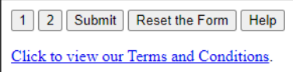

### Párnázás hozzáadása az érintő célpontok tömegének növeléséhez

Ezután az érintő célpontokat bővíthetjük némi kitöltéssel. A következő CSS kód példát mutat:

```css
/* Add padding to bulk up the tap
targets */
a,
button,
input[type="button"],
input[type="submit"] {
	padding: 20px;
}
```

Ez az ábra mutatja a párnázás alkalmazását:

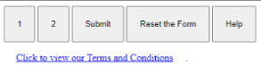

### Minimális méret alkalmazása az érintő célpontokra

Első lépésként alkalmazhatna egy minimális méretet az érintő célpontokra. A World Wide Web Consortium (W3C) 44×44 pixeles minimális méretet javasol az érintőképernyős eszközök érintő célpontjaira.

A következő CSS-kód ezt a minimális méretet alkalmazza:

```css
/* Set a minimum size of 44x44 pixels
for all tap targets */
a,
button,
input[type="button"],
input[type="submit"] {
	min-width: 44px;
	min-height: 44px;
}
```

Ez az ábra mutatja a minimális méret alkalmazását:

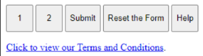

### Margótér hozzáadása érintő célpontok között

Az érintési célpontok most már megfelelő méretűek, de a link talán kényelmetlenül az alján a gombok közelében van. Ha üres helyet szeretne elhelyezni közöttük, akkor a tap targetek alatt egy kis helyet hagyhatnánk, mint a következő CSS-kódban:

```css
/* Add margin to provide vertical
separation */
a,
button,
input[type="button"],
input[type="submit"] {
	margin-bottom: 20px;
}
```

Ez az ábra mutatja a margótér hozzáadásának hatását:

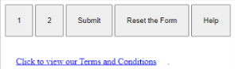

### Az érintő célpontok széleinek formázása

A gombok, mint például a Beküldés gomb és a Visszaállítás gomb, automatikusan kapnak keretet a legtöbb böngészőkben, de a hiperhivatkozások nem. Ahhoz, hogy az összes vezérlőelemek könnyebben láthatóak legyenek a kis képernyőn, akkor erősebb keretet alkalmazhat, mint az alábbiakban látható CSS-kódban:

```css
/* Format the border of the tap
targets */
a,
button,
input[type="button"],
input[type="submit"] {
	border: 2px solid black;
}
```

Ez az illusztráció a széleket mutatja. Az érintő célpont a hiperhivatkozáshoz tisztán látható.

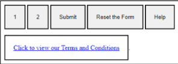

### Az érintő célpont színének megváltoztatása lebegtetéskor

Lehetőséged van arra is, hogy megváltoztasd az érintési célpontok színét, amikor a látogató az egérmutatót ráhelyezi vagy röviden megérinti őket egy érintőképernyőn anélkül, hogy érintést hajtana végre. A következő CSS-kód erre mutat példát:

```css
/* Change the tap target color on
hover */
a:hover,
button:hover,
input[type="button"]:hover,
input[type="submit"]:hover {
	background-color: cyan;
}
```

Ez az ábra azt mutatja, hogyan változik egy érintő célpont színe, amikor a mutató fölé mozog.

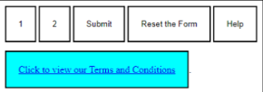

### Az érintő célpontok hátterének formázása

Az érintő célpontot is formázhatja a kontraszt növelése érdekében, mint a következő CSS-kódban:

```css
/* Give the tap targets a white
background */
a,
button,
input[type="button"],
input[type="submit"] {
	background-color: white;
}
```

Ez az ábra az érintő célpontokat mutatja a fehér háttérrel.

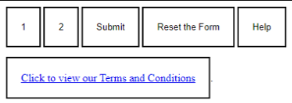

### Az érintési cél színének módosítása érintéskor

Az érintő célpontok színét is megváltoztathatja amikor a látogató megérinti vagy rájuk kattint. Ez a visszajelzés segít a látogatónak abban, hogy észrevegye, hogy az érintés vagy kattintás regisztrálódott-e. A következő CSS-kód egy példát mutat be:

```css
/* Change the target color when tapped
or clicked */
a:active,
button:active,
input[type="button"]:active,
input[type="submit"]:active {
	background-color: black;
	color: white;
}
```

Ez az ábra azt mutatja, hogyan változik egy érintési célpont színe, amikor a látogató megérinti vagy rákattint.

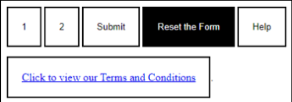

## A nézetablak méretének beállítása

A nézetablak a weboldalnak az a területe, amely a látogató eszközén a böngészőben látható. A CSS lehetővé teszi számodra, hogy konfiguráld a nézetablakot a weboldal `head` részében, azáltal, hogy beállítod a `viewport` meta tag tartalmát a `content` tulajdonságával. A megfelelő beállítások kiválasztásával a weblap megjeleníthetővé teheti az egyes látogatók által használt eszköz képernyőjének megfelelő módját.

A 10-2. táblázat ismerteti a `viewport` meta tag `content` tulajdonságához használható beállításait
| | 10-2. táblázat: A viewport Meta Tag content tulajdonságának beállításai |
|------------------------|-------------------------------------------------------------------------------------------------------------------------------------------------------------------------------------------------------------------------------------------------------------------------------------------------------------------------------------------------------------------------------------------------------------------------------------------------------------------------------------------------------------------|
| Tulajdonság | Magyarázat |
| width | Megadja a nézetablak szélességét. Beállíthat egy adott pixelszámot, vagy használhatja a _device-width_ használatával az eszköz szélességét. |
| height | Megadja a nézetablak magasságát. Beállíthat egy adott pixelszámot, vagy használhatja a _device-height_ használatával az eszköz magasságát. |
| initial-scale | Megadja a kezdeti nagyítási szintet az oldal betöltésekor. Például, a _initial-scale=1_ használatával a nagyítási szint 100 százalékra állítható. |
| minimum-scale | Megadja az oldal minimálisan megengedett nagyítási szintjét. Például, a _minimum-scale=0.5_ használatával 50 százalékos nagyítást engedélyezhet. |
| maximum-scale | Megadja az oldal maximálisan megengedett nagyítási szintjét. Például, a _maximum-scale=2_ használatával 200 százalékos nagyítást engedélyezhet. |
| user-scalable | Szabályozza, hogy a felhasználó nagyíthat-e vagy kicsinyíthet-e az oldalon. Ezt beállíthatja _yes_-re vagy _no_-ra. |
| fullscreen | Ezt a beállítást _yes_ értékre állíthatod a teljes képernyős mód engedélyezéséhez, _no_ értékre a teljes képernyős mód letiltásához, _minimal-ui_ értékre, hogy minimális felhasználói felület jelenjen meg, amikor az oldal belép a teljes képernyős módba, vagy _browser_ értékre, hogy a böngésző felhasználói felülete jelenjen meg, amikor az oldal belép a teljes képernyős módba. Nem minden böngésző támogatja a _fullscreen_ beállítást, és a _minimal-ui_ érték elavult; azaz, már nem ajánlott a használata. |
| shrink-to-fit | Összezsugorítja az oldal tartalmát a képernyő szélességéhez. Megadhatod a _yes_ értéket a tartalom összeméretezéséhez, vagy a _no_ értéket, hogy a tartalom túllépje a képernyő szélességét. |
| viewport-fit | Szabályozza, hogy a nézetablak hogyan illeszkedjen a képernyőre; a beállítások között szerepel a _cover_, _contain_, _auto_ és _100%_. |
| target-densitydpi | Megadja a céleszköz pixelsűrűségét. Ez a beállítás elavult, így ezért ne használja többé. |
| viewport-initial-scale | Megadja a nézetablak kezdeti nagyítási szintjét. Az alapértelmezett érték _1.0_, ami 100 százalékos nagyítást alkalmaz - normál méretben. |
| viewport-minimum-scale | Megadja a nézetablak minimális nagyítási szintjét. Az alapértelmezett érték _0,25_, lehetővé teszi a felhasználó számára, hogy a normál méret 25 százalékára kicsinyítsen. |
| viewport-maximum-scale | Megadja a nézetablak maximális nagyítási szintjét. Az alapértelmezett érték _5.0_, ami a felhasználó a normál méret 500 százalékára nagyíthat. |
| viewport-user-scalable | Szabályozza, hogy a felhasználó nagyíthat-e vagy kicsinyíthet-e a nézetablakon. Beállíthatja, _yes_-re, hogy engedélyezze a zoomolást, _no_-ra, hogy ne engedélyezze a zoomolást, vagy _1_-re, hogy engedélyezze a felhasználónak a zoomolást, de csak addig zoomoljon, amíg az oldal el nem éri az eredeti méretét. |
| overscroll-behavior | Meghatározza, hogyan viselkedjen a nézetablak, amikor a felhasználó _overscrolls_-t használ - amikor megpróbál a tartalom végére görgetni. Használja az _auto_ lehetőséget, hogy a böngésző vezérelje a túlgörgetés viselkedését. Használj _contain_ parancsot az átlós görgetés megakadályozásához a tartományon kívül, lehetővé téve így a szülőelemek részeinek megjelenítését .A _none_ használatával teljesen letiltja a túlgördülést. |

Az `initial-scale` beállítása, `minimum-scale` beállítása és a `maximum-scale` beállítása befolyásolja a weboldalát. A `viewport-initial-scale` beállítás, a `viewport-mninimum-scale` beállítás és a `viewport-maximum-scale` beállítás csak a megjelenő oldalon látszódik.
Alapvetően az `initial-scale` beállításnál be kell állítani az alap zoomolást ahhoz, hogy beállíthasd a magasságot, szélességet, a helyett, hogy a `viewport-initial-scale`, `viewport-minimum-scale`, vagy a `viewport-maximum-scale`-t használná.

Több oldalon keresztül, simán bellíthatja a viewport szélességét a készülék szélességéhez:

```html
<meta name="viewport" content="width=device-width" />
```

Pár oldalhoz beállíthatja a viewport magasságot a készülék magasságához:

```html
<meta name="viewport" content="height=device-height" />
```

Néhány esetben meg kell adnia a magasságot és a szélességet is:

```html
<meta name="viewport" content="width=500, height=700" />
```

## Ellenőrizd az oldalaidat különböző eszközökön és kijelzőkön.

A weboldala látogatói különböző típusú eszközöket használnak, számítógépeket, laptopokat, tableteket, okostelefonokat - valamint vr headset-eket is. Ezeknek az eszközöknek különböző méretű a képernyőjük, felbontásuk valamint orientációjuk is. Ezek befolyásolják az elrendezést, betűméretet és a weboldala funkcióját is. Ellenőrizze a weboldalát különböző méretben, különböző készülékeken. Ha ezt csinálja akkor könnyen rábukkan hibákra, például elolvashatatlan kicsi szövegekre is.

### Értékelje a látogatók eszközeit és képernyőméreteit

Amennyire csak lehetséges, próbálja meg meghatározni, hogy a weboldalának látogatói milyen eszközöket és képernyőméreteket használnak leginkább.
Először talán okos becsléseket kell végezned, de miután az oldalad már fut, részletes adatokat kaphatsz a Google Analytics-ből.

Jelentkezzen be a Google Analytics-fiókjába, majd kattintson a bal oldali navigációs ablakban a **Reports** ( ) gombra, hogy megjelenjen a Jelentések ablaktábla. Kattintson a **Tech** címszóra a tartalom kibontásához, majd kattintson a Tech alatt található **Overview** elemre, majd nézze meg a különböző hisztogramokat és kijelzéseket: Felhasználók platformok szerint, Felhasználók operációs rendszer szerint, Felhasználók platform/készülékkategória szerint, Felhasználók képernyőfelbontás szerint, Felhasználók készülékmodell szerint stb.

### Weboldalak tesztelése hardveres eszközökön

Miután meghatároztad, hogy a látogatók milyen eszközöket, böngészőket és képernyőméreteket részesítenek előnyben, gyűjts össze olyan széles körű teszteszközöket, amennyit csak tudsz. Nézze meg, mit tud kihámozni a vállalata műszaki temetőjéből vagy a családja szemétdombjáról. Ideális esetben egy iPhone és egy Android telefon a kisképernyős teszteléshez, egy iPad és egy Windows táblagép pedig a közepes képernyős teszteléshez, és egy régi laptop és valamilyen Mac a nagyképernyős teszteléshez. Azonban Chrome vagy Firefox fejlesztőeszközökkel szimulálhat olyan eszközöket, amelyekkel nem rendelkezik, ahogyan azt a következő fejezetben tárgyaltuk. Továbbá találhatsz online felhőalapú tesztelési szolgáltatásokat is, amelyek széles választékban kínálnak szimulátorokat és fizikai eszközöket.

Frissítsd az operációs rendszert minden eszközön, hogy naprakésszé vagy a lehető legközelebbi állapotba hozd azt. Frissítsd a beépített böngészőket is, és telepítsd a látogatóid által kedvelt más böngészőket is.

Csatlakoztass egy második monitort a teszt laptopodhoz vagy asztali számítógépedhez, majd forgasd el portré módra, így könnyebben megtekintheted az oldalakat mind vízszintes, mind függőleges tájolásban.

Most már készen állsz az oldalaid tesztelésére. Amikor tesztelsz okostelefonokon és táblagépeken, váltogasd az eszközöket portré és tájkép tájolás között, hogy megbizonyosodj arról, hogy a Bluetooth megfelelően működik.

### Teszteld az oldalakat a Chrome fejlesztői eszközeinek segítségével.

Mind a Google Chrome, mind a Mozilla Firefox fejlesztői eszközöket tartalmaz, amelyek lehetővé teszik különböző képernyőméretek, tájolások és eszközök emulálását. Ezek az eszközök egy másik lehetőséget kínálnak az oldalaid tesztelésére, különösen hasznosak, ha csak korlátozott választékban áll rendelkezésre hardver a teszteléshez. Ez a rész bemutatja a Chrome fejlesztői eszközeit, a Firefox fejlesztői eszközeinek felfedezésére pedig rád bízza a feladatot.

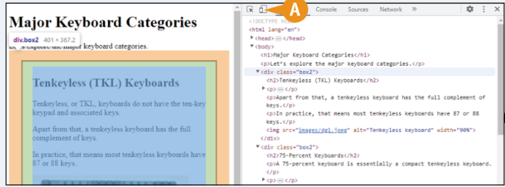

Indítsd el a Chrome-ot a számítógépeden szokás szerint, majd nyisd meg azt a weboldalt, amelyet tesztelni szeretnél. Jobb kattintással a lapra jelenítsd meg a kontextusmenüt, majd kattints az ellenőrzés opcióra, hogy megjelenítsd a fejlesztői eszközöket. Ezután kattints az Eszköztárra (A, változik ) az eszköztár megjelenítéséhez; alternatív módon nyomd meg a Ctrl + Shift + M billentyűkombinációt Windows vagy Linux rendszeren, vagy a ⌘ + Shift + M kombinációt Mac rendszeren az eszköztár megjelenítéséhez.

Az Eszköztár `B)` megjelenik a közvetlen előnézet ablak felett.
Kattints a Méretek lenyíló menü gombra `C)`, hogy megjelenítsd az eszközök menüjét.
Itt kiválaszthatod az eszközt, amelyet szimulálni szeretnél, vagy kattinthatsz a Szerkesztés `D)` gombra, hogy megjelenítsd a Chrome fejlesztői eszközök beállításainak Emulált Eszközök kategóriáját, ahol más meglévő eszközöket választhatsz ki a menühöz, vagy kattinthatsz a Egyedi eszköz hozzáadása gombra, hogy egy olyan egyedi eszközt adj hozzá, amelynek beállításait te határozod meg.

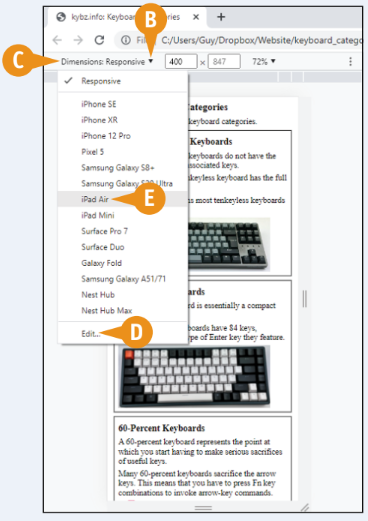

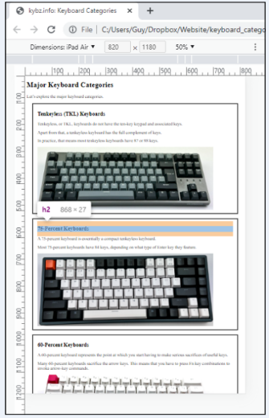

A harmadik ábrán az látható, hogy mi történik, ha az iPad Air (E) opcióra kattintasz a menüben: egy szimuláció jelenik meg, ami megmutatja, hogyan fog kinézni az oldal az iPad Air kijelzőjén. Ahhoz, hogy hozzáadd az időzítőket, amint az a képen látható, kattints a Menü ( ) gombra, majd kattints az Időzítők megjelenítése opcióra a menüben. A menü lehetővé teszi továbbá a készülék keretének és média lekérdezések megjelenítésének váltását, valamint a készülék képpont arányának hozzáadását.

## A CSS gradiensek működésének megértése

A CSS által a weboldalak felépítéséhez és javításához kínált különféle eszközök közül a színátmenetek nagyszerű lehetőséget jelentenek arra, hogy vizuális érdeklődést kölcsönözzenek a terveknek. A CSS segítségével könnyedén hozhat létre színátmeneteket, sima átmeneteket két vagy több szín között. Létrehozhat lineáris vagy radiális színátmeneteket. A színátmeneteket különféle célokra használhatja, például hátteret biztosíthat a tervezési elemek, például a gombok vagy fejlécek megtalálásához.

### Mik a lineáris gradiensek?

A színátmenet olyan színminta, amely egyenletes átmenetet hoz létre több szín között. A lineáris gradiens színei egyenes vonalban helyezkednek el egyik ponttól a másikig. Például az első lineáris gradiens a bal oldali vörösről a jobb oldali lilára való átmenetet mutatja.

Igény szerint további színeket is hozzáadhat. Például a második lineáris gradiens kéket ad a piros és az ibolya közé.

A harmadik lineáris gradiens pedig a teljes szivárványt futja.

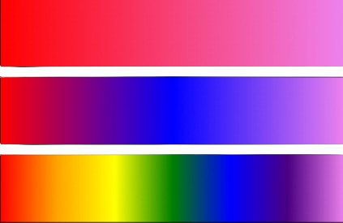

### Ismerje meg a lineáris színátmenetek szintaxisát és beállításait

A lineáris gradiens létrehozásához írd be a `linear‐gradient()` függvényt azon tulajdonság értékének, amelyhez a gradienst hozzárendeled. Ezután használd a 10-3. táblázatban megjelenített paramétereket és értékeket a lineáris gradiens részleteinek meghatározásához.

A következő példa a `background‐image` tulajdonságnak egy olyan lineáris gradienst rendel, amely balról jobbra fut, kezdve a `red`-del és áthaladva a `blue`-on keresztül a `violet`-ig:

```css
background-image: linear-gradient(to right, red, blue, violet);
```

|            | 10-3.táblázat: Lineáris színátmenetek beállításai                                                                                                                                                                                          |
| ---------- | ------------------------------------------------------------------------------------------------------------------------------------------------------------------------------------------------------------------------------------------ |
| Beállítás  | Magyarázat                                                                                                                                                                                                                                 |
| to         | Megadja az irányt. Használj _to left_, _to right_, _to top_ vagy _to bottom_.                                                                                                                                                              |
| angle      | Meghatározza a gradiens szögét fokban - például, _45deg_ vagy _270deg_.                                                                                                                                                                    |
| color      | Határozd meg a használandó színeket. Használhatsz elnevezett színeket, például _purple_; hexadecimális kódokat; vagy RGB értékeket. Add hozzá a _transparent_ kulcsszót, hogy áttetszőséget tartalmazó gradienst hozz létre.               |
| color stop | Határozd meg azt a pontot, ahol a gradiens minden színe elkezdődik és befejeződik. Használhatsz tizedes értékeket _0_ és _1_ között, például _0,25_ az elem méretének egynegyedére; vagy százalékokat, például _25%_ ugyanarra a negyedre. |

### Mik azok a radiális gradiensek?

A _radial gradient_ olyan gradiens, amely egy körből vagy ellipszisből indul ki, és színe vagy intenzitása kifelé változik. A következő ábra egy sugárirányú gradienst mutat, amely egy ellipszisből indul ki a `darkred` színt használva, áthalad a `red`-en és az `orange`-on keresztül, és `yellow`-val végződik.

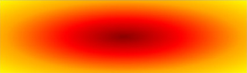

### Ismerje meg a radiális színátmenetek szintaxisát és beállításait

Radiális színátmenet létrehozásához adja meg a `radial-gradient()` függvényt annak a tulajdonságnak az értékeként, amelyhez a gradienst hozzárendeli. Ezután a 10-4. táblázatban ismertetett paramétereket és értékeket használja a színátmenet részleteinek megadásához.

A következő példa a `background-image`-hez egy radiális színátmenetet rendel, amely az előző ábrán látható színátmenetet hozza létre.

```css
background-image: radial-gradient(
	ellipse at 50% 50%,
	darkred 0%,
	red 33%,
	orange 67%,
	yellow 100%
);
```

|            | 10-4.táblázat: A sugárirányú színátmenetek beállításai                                                                                                                                                                                                                                                                                                                                       |
| ---------- | -------------------------------------------------------------------------------------------------------------------------------------------------------------------------------------------------------------------------------------------------------------------------------------------------------------------------------------------------------------------------------------------- |
| Beállítás  | Magyarázat                                                                                                                                                                                                                                                                                                                                                                                   |
| at         | Adja meg a színátmenet középpontjának helyzetét. Az alapértelmezett érték az elem közepe. Használhatja az elem magasságának és szélességének páros százalékát – például használhatja a _25%_ _75%_ értékét, hogy megadja az elem szélességének 25 százalékát, balról mérve, és magasságának 75 százalékát felülről mérve. Alternatív megoldásként írja be a pozíciót, például _bottom left_. |
| shape      | Határozd meg a gradiens alakját: _ellipse_, az alapértelmezett; vagy _circle_.                                                                                                                                                                                                                                                                                                               |
| size       | Határozd meg a gradiens méretét - a leállási helyet. Megadhatod CSS hosszúságértéket, például _50%_; _closest‐side_ vagy _furthest‐side_; vagy _closest‐corner_ vagy _furthest‐corner_.                                                                                                                                                                                                      |
| color      | Határozd meg a használt színeket. Használhatsz elnevezett színeket, például _mediumaquamarine_; hexadecimális kódokat; vagy RGB értékeket. Add hozzá a _transparent_ kulcsszót, hogy áttetszőséget tartalmazó gradienst hozz létre.                                                                                                                                                          |
| color stop | Határozd meg azt a pontot, ahol a gradiens minden színe elkezdődik és befejeződik. Használhatsz tizedes értékeket _0_ és _1_ között, például _0,75_ az elem méretének háromnegyedére; vagy százalékokat, például _75%_.                                                                                                                                                                      |

## Lineáris gradiens alkalmazása egy elemre

A CSS lineáris színátmenetek lehetővé teszik, hogy feltűnő vagy vonzó mintát adjon a HTML-elemekhez. Használhat például egy lineáris színátmenetet egy elem háttérképeként, és szükség szerint vezérlőket ad hozzá a háttér elé.

Ebben a részben először hozzon létre egy lineáris színátmenetet, amely balról jobbra fut, és csak két színt használ. Ezután megváltoztatja a színátmenet irányát, és további színeket ad hozzá.

### Lineáris gradiens alkalmazása egy elemre

1. A Visual Studio Code programban nyissa meg a külső CSS-fájlt, amelyen dolgozni szeretne.
2. Szintén a Visual Studio Code programban nyisson meg egy HTML-fájlt, amelyhez csatolta a külső CSS-fájlt.
3. Nyissa meg a HTML-fájlt egy böngészőablakban.
4. A HTML-fájlba írja be a `div` elem kódját, és rendelje hozzá egy osztályhoz, amelynek neve a lineáris színátmenet stílusát adja. Ez a példa a `lingrad` nevet használja:

```html
<div class="lingrad"></div>
```

5. Kattintson a CSS fájl fülére. A CSS-fájl aktívvá válik.
6. Kattintson egy üres sorra, és írjon be egy pontot, a 4. lépésben használt osztálystílusnevet, egy szóközt és egy nyitó kapcsos zárójelet, { — például:

```css
.lingrad {
```

A Visual Studio Code belép a megfelelő záró kapcsos zárójelbe.

7. Nyomja meg az **Enter** billentyűt egy üres sor létrehozásához, majd írja be a **background‐image: linear‐gradient(right, red, blue);**.
8. Nyomja meg az **Enter** billentyűt egy üres sor létrehozásához, majd írja be a **height: 400px;** értéket.
9. Kattintson a Frissítésre. A weboldal frissül.

    `A)` Megjelenik a lineáris gradiens.

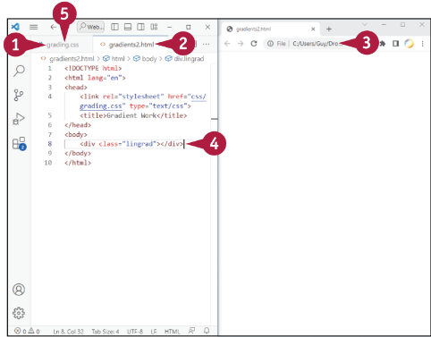

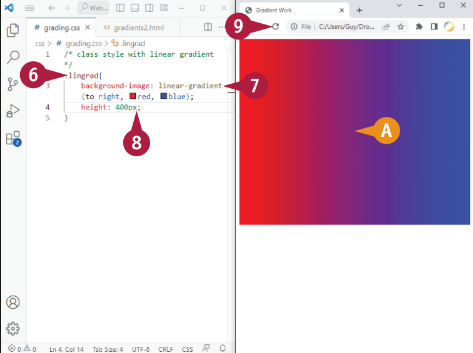

10. Jelölje a `to right`-t, és gépelje a **to bottom**-t az irány megváltoztatásához.
11. Kattintson a `red` után, és írja be a **green**, szót.
12. Kattintson a Frissítésre. A weboldal frissül.

    `B)` Megjelenik a lineáris gradiens új verziója, felülről lefelé haladva piros, zöld és kék színekkel.

13. Válassza ki a to bottom lehetőséget, és írja be a **225deg**-et.
14. Kattintson a `red` után, és írja be, hogy **orange**, **yellow**, .
15. Kattintson a Frissítésre. A weboldal frissül.

    `C)` Megjelenik a lineáris gradiens új verziója, amely átlósan lefelé fut a képernyő jobb felső sarkából piros, narancs, sárga, zöld és kék színekkel.

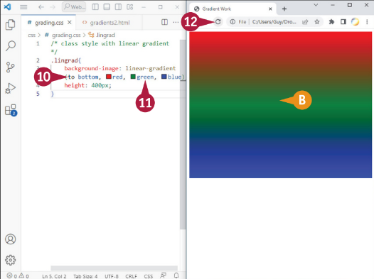

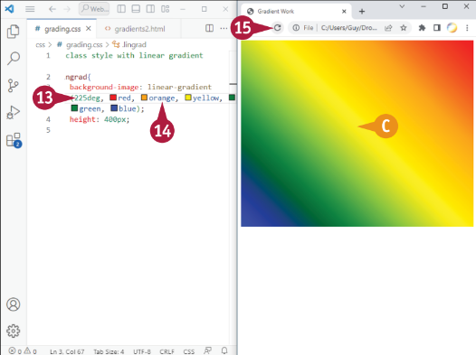

::: tip TIPP:
**Hogyan hozhatok létre ismétlődő lineáris gradienst?**

Használja a repeaating-linear-gradient függvényt a lineáris-gradiens függvény helyett. Ez a funkció hasonló módon működik, de megismétli a színátmenetet, nem pedig egyszer jeleníti meg.
:::

## Alkalmazzon sugárirányú gradienst egy elemre

A lineáris színátmenetekhez hasonlóan a radiális színátmenetek is lehetővé teszik, hogy szemet gyönyörködtető vagy tetszetős mintákat adjon a HTML-elemekhez. A sugárirányú színátmenetek különösen hasznosak vizuális effektusok, például világítás és árnyékok létrehozásához. A sugárirányú színátmenetet akár az alapértelmezett ellipszis alakjával, akár egy körrel indíthatja, és az alakzatot bárhová elhelyezheti azon az elemen belül, amelyhez a színátmenetet hozzáadja. Kiválaszthatja, hogy mely színek jelenjenek meg a színátmenetben, és megadhatja, hogy hol állítsa le a színátmenetet – például a `closest‐side`-nál vagy a `furthest‐side`-nál.

### Alkalmazz egy sugárirányú átmenetet egy elemre.

1. A Visual Studio Code programban nyissa meg azt a külső CSS-fájlt, amelyen dolgozni szeretne.
2. Szintén a Visual Studio Code programban nyisson meg egy HTML-fájlt, amelyhez csatolta a külső CSS-fájlt.
3. Nyissa meg a HTML-fájlt egy böngészőablakban.
4. A HTML-fájlba írja be a `div` elem kódját, és rendelje hozzá egy osztályhoz, amelynek neve a lineáris-gradiens stílusát adja.
   Ez a példa a `radgrad` nevet használja:

```html
<div class="radgrad"></div>
```

5. Kattintson a CSS-fájl fülére. A CSS-fájl aktívvá válik.
6. Kattintson egy üres sorra, és írjon be egy pontot, a 4. lépésben használt osztálystílusnevet, egy szóközt és egy nyitó kapcsos zárójelet, { — például:

```css
.radgrad {
```

A Visual Studio Code belép a megfelelő záró kapcsos zárójelbe.

7. Nyomja meg az **Enter** billentyűt egy üres sor létrehozásához, majd írja be a
   **background-image: radial-gradient(circle, yellow, blue);** -kifejezést.
8. Nyomja meg az **Enter** billentyűt egy üres sor létrehozásához, majd írja be a **height: 650px;** értéket.
9. Kattintson a Frissítésre. A weboldal frissül.

    `A)` Megjelenik a radiális gradiens.

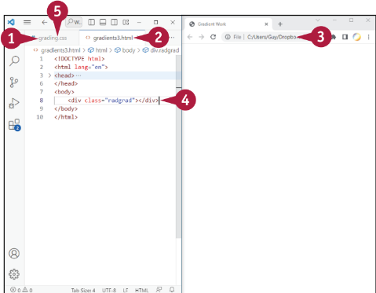

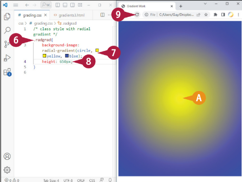

10. Válassza ki a `circle`-t és írja be az **ellipse** fölé.
11. Szerkessze a színsorrendet a következővel további színek hozzáadásával. A példa a a következő kódot használja:

```css
radial-gradient(ellipse,
yellow, cyan, blue, purple,
navy, black)
```

12. Nyomj a Frissítésre. A weboldal frissül.

    `B)` A sugárirányú gradiens mutatja a az elvégzett változtatásokat.

13. Kattintson az `ellipse` után és írja be a méret utasítást. Ez a példa a **closest-side 33% 66%**-os méretét használja:

```css
radial-gradient(ellipse
closest-side at 33% 66%,
yellow, cyan, blue, purple,
navy, black)
```

14. Nyomj a Frissítésre. A weboldal frissül

    `C)` A sugárirányú gradiens mutatja a az elvégzett változtatásokat.
    A példában a gradiens a következőképpen kezdődik a div element egyharmadánál , és kétharmada a lefelé, és akkor áll meg, amikor eléri az elem legközelebbi oldalát.

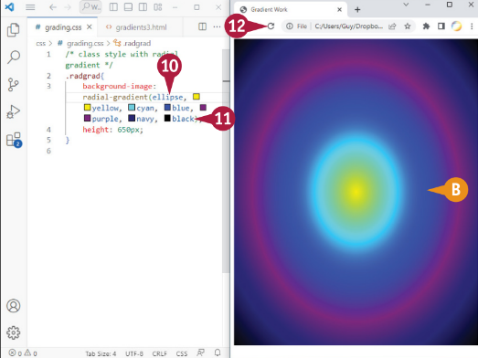

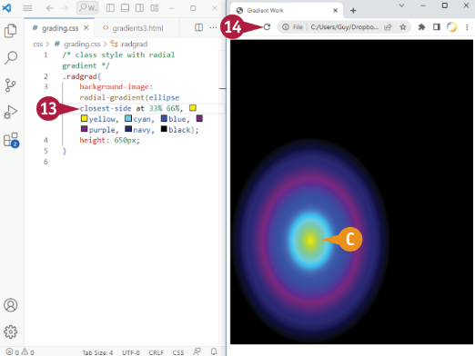

::: tip TIPP:
**Hogyan hozhatok létre egy sugárirányú gradienst, amely ismétlődik?**

Használja az ismétlődő sugárirányú gradiens funkciót a sugárirányú gradiens funkció helyett. Ez a függvény hasonlóan működik, de megismétli a gradienst ahelyett, hogy egyszer jelenítené meg.
:::

## Sprite-ok használata

A sprite egy manó vagy tündér, egy testetlen szellem, vagy egy felfelé irányuló villám. De a HTML-ben és a CSS-ben, valamint egyes játékprogramozásban a `sprite` az egyetlen kép, amely több kisebb képet tartalmaz, amelyet a weboldalon használnak. Például egy sprite tartalmazhatja az összes egyéni gombképet, amelyet a webhelye használ, vagy a kulcsfontosságú pontok illusztrálására használt ikonok készletét. A látogató böngészője a következőket kéri a sprite fájlt csak egyszer, ahelyett, hogy minden egyes képet külön-külön kérne. Megmondja a böngészőnek, hogy csak a sprite-fájl azon részét mutassa meg, amely a megjeleníteni kívánt képet tartalmazza.

### Mire valók a sprite-ok, és mikor érdemes használni őket?

A sprite-oknak két fő célja van:

-   **Csökkentse a webszerver terhelését**. A sprite-ok használata csökkenti a webszerverhez intézett kérések számát, így könnyítve annak terhelését, és segítve azt, hogy továbbra is gyorsan tudjon reagálni a kérésekre.
-   **Segít a weboldalak gyors betöltésében**. Mivel a látogató webböngészője csak egy sprite-fájlt, nem pedig egy egész sor egyedi fájlt, a weboldalak gyorsabban töltődnek be.

A sprite-ok különösen hasznosak az ikonok esetében, különösen, ha a webhely sok ikont használ. Szintén hasznosak a a navigációs menük lebegő effektusainak létrehozásához, ahol a háttérkép egy másik részének megjelenítésével gyorsabb és simább lehet, mint egy különálló képfájl betöltése.

Az, hogy érdemes-e sprite-okat használni, nagyban függ attól, hogy hány ikon vagy hasonló kis kép van a weboldalon. használ. Általában, ha a webhelye sok kis grafikai elemet, például gombokat vagy ikonokat használ, érdemes lehet sprite-okat használni. De ha a webhelye összesen csak egy maroknyi ikont használ, akkor egy sprite létrehozása valószínűleg nem éri meg az időt vagy a fáradságot.

Amikor eldöntöd, hogy létrehozz-e sprite-okat, számolnod kell azzal az idővel is, ami a sprite fájl vagy fájlok frissítése az egyes ikonok változása után. Ha az ikon mérete is változik, akkor a következő beállításokat kell elvégeznie a sprite-ok megjelenítésére szolgáló kódot is.

### Az egyedi képek létrehozása

Feltételezve, hogy úgy döntöttél, hogy sprite fájlt hozol létre, az első lépés az egyes képek létrehozása. Minden egyes képnek azonos méretűnek kell lennie, hogy a sprite fájlban sorba vagy rácsba rendezhesse őket.

### A Sprite fájl összeállítása az egyes képekből

Ezután állítsa össze a sprite fájlt az egyes képek kombinálásával. Ezt a feladatot egy képszerkesztő programmal, például a 4. fejezetben tárgyalt GIMP programmal. Alternatívaként használhat egy sprite-okra összpontosító eszközt is. Számos ilyen eszközt találhat az interneten, némelyik ingyenes, némelyik nem. Ilyen például a TexturePacker, *www.codeandweb.com/texturepacker*, amely ingyenes verziót kínál.

Tárolja a sprite fájlt vagy a képek számára használt mappában, például egy _images_ mappában, vagy a sprite-specifikus almappában, például az _images/sprites_ mappában.

### CSS osztály létrehozása a Sprite-hoz

A következő lépésed az, hogy létrehozol egy CSS osztályt a sprite fájl egészéhez, valamint egy CSS osztályt az egyes a sprite fájlból megjelenítendő egyedi képekhez.

A sprite fájl CSS osztálya maga a sprite fájlt állítja be az elem háttérképeként. A esetében Például, mondjuk, hogy van egy _sprite1.png_ nevű sprite fájl az _images/sprites_ mappában. A
CSS-kódot használhat a következőhöz hasonlóan egy _sprite1_ nevű osztály létrehozásához, és hozzárendelheti a _sprite1.png_ állományt fájlhoz, és állítsa be a megjelenítendő terület szélességét és magasságát egy elemre - egy ikon értékű ikonra a sprite fájlt, nem az egész fájlt. Ebben a példában minden ikon 75×75 pixeles.

```css
.sprite1 {
	background-image: url("images/sprites/sprite1.png");
	width: 75px;
	height: 75px;
}
```

A sprite fájl minden egyes ikonjához külön osztályt kell létrehozni, amely meghatározza a háttér pozícióját. ahol az adott ikon megjelenítéséhez szükséges sprite-képet kell megjeleníteni. Például, az első ikon tipikusan egy _0,0_ pozíciót kapna a fájl bal felső sarkában:

```css
.icon1 {
	background-position: 0 0;
}
```

A fájlban lévő minden más ikonhoz tartozó osztály megadja a megfelelő eltolást a megfelelő rész megjelenítéséhez. a képnek. Például a második 75×75 pixeles ikonhoz a sprite fájlt 75 pixellel kell eltolni balra:

```css
.icon2 {
	background-position: -75px 0;
}
```

Ha elérte a második sort, a sprite-képet is 75 pixellel feljebb kell tolni.

### A Sprite osztályok használata a HTML dokumentumokban

A sprite-osztályok létrehozása után a HTML-dokumentumokban más osztályokhoz hasonlóan használhatja őket. A következő példa azt mutatja, hogyan jeleníthet meg két `div` elemet, az egyik az icon1 osztályt használja az `icon1` osztály megjelenítésére. ikon megjelenítésére, a másik pedig az `icon2` osztályt használja a második ikon megjelenítésére:

```html
<div class="sprite icon1"></div>
<div class="sprite icon2"></div>
```

## CSS animációk megértése

A CSS különböző animációkat biztosít, amelyek lehetővé teszik, hogy dinamikus és interaktív effekteket építsünk be a a HTML-dokumentumokba. Például alkalmazhat átmeneteket, olyan effekteket, amelyek olyan változásokat tesznek, mint a
például egy elem be- vagy kifakulását. Alternatívaként alkalmazhat transzformációkat, olyan hatásokat, amelyek módosítják az elemet. elem helyzetét vagy megjelenését módosítják, például az elem elforgatásával vagy méretezésével. Az animációt lefuttathatja, amikor egy megfelelő esemény bekövetkezik, például amikor a felhasználó a mutatót az elemre helyezi egy elem fölé.

Ez a szakasz a CSS animációkat ismerteti. A "Kulcskocka animáció létrehozása" című szakasz, később ebben az fejezetben egy lépésről-lépésre bemutatott példán keresztül vezet végig.

### A CSS által nyújtott animációk különböző kategóriáinak megértése

A CSS számos animációs kategóriát kínál, amelyekkel animálhatod és feldobhatod a weboldalaidat:

-   **Transitions.**. Az `transition` egy olyan hatás, amely megváltoztatja egy elem stílusát. Például alkalmazhat egy fade-in átmenetet, amely egy elemet fokozatosan jelenít meg az Ön által megadott időtartam alatt, például 10 másodperc.
-   **Transforms**. A `transform` olyan hatás, amely megváltoztatja egy elem pozícióját, megjelenését vagy mindkettőt.
-   **Keyframe animations**. A kulcskocka animáció `keyframes` használ, az animáció idővonalának olyan pontjait, amelyeket meghatározzák, hogyan nézzen ki az animált elem. Például két kulcskockát használhat, amelyek egy elem átlátszóságát 0-ra állítja az első kulcskockában, hogy az elem teljesen átlátszó legyen, majd az átlátszóságot 0-ra állítja. 100-ra a második kulcskockában, hogy az elem teljesen átlátszatlan legyen. E két kulcskocka esetén a böngésző automatikusan létrehozza a köztük lévő képkockákat az animáció létrehozásához.
-   **Scroll animations**. A `scroll animation` automatikusan lejátszódik, amikor a felhasználó felfelé vagy lefelé görget az oldalon. A görgetési animációval szükség szerint csúsztathat elemeket a képernyőre vagy a képernyőről. A görgetés megvalósításához animáció megvalósításához általában a JavaScript `scroll` eseményét kell használni, ami azonban meghaladja a e könyv témakörén túlmutat.
-   **SVG animations**. Az SVG animáció egy illusztrációt animál a Scalable Vector Graphics formátumban, amely rövidítve SVG. Például létrehozhat egy olyan animációt, amely megváltoztatja a színeket.

### Átmenetek létrehozása

Átmenet létrehozásához a CSS-ben az `transition` tulajdonságot az animálni kívánt tulajdonsághoz kell hozzáadni. Ha például színt érintő átmenetet szeretne létrehozni, akkor a `transition` tulajdonságot a következőhöz adja hozzá a `color` tulajdonsághoz. A következő, "Átmenetek alkalmazása HTML-elemekre" című szakaszban talál egy példát.

### Transzformációk létrehozása

A transzformáció létrehozásához a CSS-ben hozzáadjuk a `transform` tulajdonságot az animálni kívánt elemhez, és a majd megadja a kívánt transzformáció típusának függvényét. A következő lista négy széles körben ismerteti transzformációt ismerteti:

-   **Rotate**. Egy elemet az óramutató járásával megegyező vagy ellentétes irányban forgathat el a `rotate()` függvény használatával. Egy elem elforgatásához az óramutató járásával megegyező irányban, pozitív fokszámot kell megadni; az óramutató járásával ellentétes irányban történő elforgatáshoz pedig a negatív számot. A következő példa az elemet 180°-kal az óramutató járásával ellentétesen forgatja el:

```css
.element {
	transform: rotate(-180deg);
}
```

-   **Translate**. Ez a fordítás inkább egy tárgy mozgatását jelenti, mint a nyelvváltást. Lehetőség van egy elemet a `translate()` függvény használatával, és először a vízszintes távolság megadásával, majd a függőleges távolságot. Ha negatív értéket ad meg a vízszintes távolsághoz, akkor az objektumot a balra, vagy pozitív értéket, ha jobbra akarjuk mozgatni. Hasonlóképpen, adjon meg negatív értéket a függőleges távolsághoz az objektum felfelé történő mozgatásához, illetve pozitív értéket a lefelé történő mozgatásához. A következő példa az objektumot 2-vel mozgatja remmel jobbra és 3 remmel lefelé mozgatja a tárgyat:

```css
.element {
	transform: translate(2rem, 3rem);
}
```

-   **Scale**. Az elem méretének növeléséhez vagy csökkentéséhez használja a `scale()` függvényt, és adjon meg egy megfelelő tényezőt, például _0.5_ az elem méretének felére való méretezéshez, mint a következő példában, vagy _2_ az elem méretének megduplázására.

```css
.element {
	transform: scale(0.5);
}
```

-   **Skew**. Az elem mindkét tengelyen történő elferdítéséhez vagy megdöntéséhez használja a `skew()` függvényt. Csak az x tengelyen történő ferdítéshez, a `skewX()` függvényt; ha csak az y-tengelyen szeretnénk elferdíteni, a `skewY()` függvényt használjuk. A következő példa az elemet mindkét irányban 45°-kal ferdíti el:

```css
.element {
	transform: skew(45dg);
}
```

### Keyframe animációk létrehozása

A kulcskocka animáció létrehozására vonatkozó példát lásd a "Kulcskocka animáció létrehozása" című részben, a fejezet későbbi részében animáció létrehozására.

## Átmenetek alkalmazása HTML-elemekre

A webhely tartalmának kell a fő vonzerejének lennie, de a webes szemgolyókért folytatott verseny kemény, és érdemes lehet sztárport szórnia weboldalaira, hogy növelje a webhely vonzerejét.
A weboldalak vizuális vonzerejének fokozásának egyik módja az, ha átmeneteket ad hozzá a HTML-elemekhez.

Átmeneteket alkalmazhat különféle elemekre, például szövegekre, gombokra és képekre. Például megváltoztathatja egy elem megjelenését, amikor a látogató ráviszi a mutatót.

### Az átmenetek beállításának tulajdonságainak megismerése

A CSS lehetővé teszi az átmenetek beállítását egyetlen rövidített tulajdonság vagy több egyedi tulajdonság használatával.

Az egyetlen gyorsírási tulajdonságot `transition`-nek nevezik, és legfeljebb négy paramétert igényel:

```css
transition: property duration timing delay;
```

Az alábbi lista elmagyarázza, mit jelentenek ezek a paraméterek:

-   **property**. Ez a paraméter határozza meg azt a CSS-tulajdonságot, amelyet az átmenetnek érintenie kell, például `background‐color`, `height` vagy `width`.
-   **duration**. Ez a paraméter határozza meg, hogy mennyi ideig tartson az átmenet, ezredmásodperceket, `ms`-okat vagy másodperceket, `s`-t használva.
-   **timing**. Ez a paraméter határozza meg, hogyan fusson az átmenet. Lehetőségei közé tartozik az `ease‐in`, hogy lassan induljon és gyorsuljon; `ease‐out` gyorsan indul, majd lassít; és `ease‐in‐out`, lassan kezdeni, gyorsan haladni és lassan befejezni.
-   **delay**. Ez a paraméter határozza meg az átmenet futtatása előtti várakozási időt, ezredmásodpercben, `ms`-ban vagy másodpercben, `s`-ban kifejezve. Ha például `1s` késleltetést ad meg egy `hover` átmenethez, akkor az átmenet akkor kezdődik, amikor a látogató egy másodpercig az elem felett tartja a mutatót.

Az alábbi példa meghatározza a `transition` tulajdonságot egy `button` elemhez. A gomb fehér szöveget — `color: white;` — tartalmaz egy sötét szürke háttéren — `background‐color: darkgray;`. A `transition` tulajdonság megadja a `background‐color`-t mint a változtatandó tulajdonságot, az átmenet időtartamát `1.0s`-ként, és az időzítést `ease‐in‐out`-ként.

```css
button {
	background-color: darkgray;
	color: white;
	transition: background-color 1s ease-in-out;
}
```

A következő CSS-kód magát az átmenetet mutatja a `:hover` pszeudo-osztály használatával. Amikor a látogató a mutatót a gomb fölé állítja, a `background‐color` tulajdonság `blue` értékre változik, így a gomb sokkal élénkebbnek tűnik.

```css
button:hover {
	background-color: blue;
}
```

Az egyetlen rövidítésű tulajdonság, a `transition` használata helyett a következő négy egyedi tulajdonságot használhatja:

-   _transition‐property_. Ez a tulajdonság azt a CSS-tulajdonságot adja meg, amelyre az átmenet vonatkozik.
-   _transition-duration_. Ez a tulajdonság megadja, hogy mennyi ideig tartson az átmenet, ezredmásodpercek, `ms` vagy másodpercek `s` használatával.
-   _transition-timing-function_. Ez a tulajdonság határozza meg az átmenet futtatásának módját – például `ease‐in` vagy `ease‐out`.
-   _transition‐delay_. Ez a tulajdonság megadja az átmenet futtatása előtti várakozási időt, ezredmásodpercben, `ms`-ban vagy másodpercben, `s`-ban kifejezve

A következő CSS-kód a korábbi példát valósítja meg újra, és az egyedi tulajdonságokat használja a rövidítés tulajdonság helyett.

```css
button {
	background-color: darkgray;
	color: white;
	transition-property: background-color;
	transition-duration: 1s;
	transition-timing-function: ease-in-out;
}
```

## Keyframe animáció létrehozása

A CSS lehetővé teszi egy _keyframe animation_ nevű animáció létrehozását, amely meghatározza, hogy egy HTML-elem hogyan változzon egy bizonyos idő alatt. A változtatást úgy irányíthatja, hogy az animáció meghatározott pontjain különféle kulcskockákat azonosít. Ezeknél a kulcsképeknél megadhatja az elem stílusát és pozícióját az animációban.

Létrehozhat például egy kulcsképkocka-animációt, amely manipulálja egy elem `opacity` tulajdonságát, így fokozatosan, néhány másodperc alatt megjelenik. A változás mértékének szabályozásához több kulcskockát is meghatározhat ezalatt a két másodperc alatt, mindegyik más értékkel.

### Keyframe animáció létrehozása

1. A Visual Studio Code-ban nyissa meg azt a külső CSS-fájlt, amelyen dolgozni szeretne.
2. Szintén a Visual Studio Code-ban nyisson meg egy HTML-fájlt, amelyhez csatolta a külső CSS-fájlt.
3. Nyissa meg a HTML-fájlt egy böngészőablakban.
4. A HTML-fájlba írja be az előzetes szöveget, valamint az animálni kívánt elemet. Ebben a példában a kód egy `h1` elemet jelenít meg, amelyet egy `img` elem követ, amelyet a példa animál.

```html
<h1>Gradually Appearing Image</h1>

```

5. Kattintson a CSS fájl fülére. Megjelenik a CSS-fájl.
6. Írjon be egy pontot és az osztály nevét **fade-in**, majd egy szóközt és egy nyitó kapcsos zárójelet, {.
   Visual Studio Code beírja a megfelelő záró kapcsos zárójelet, }.
7. Nyomja meg az **Enter** billentyűt egy üres sor létrehozásához, majd írja be az animáció tulajdonságait:

```css
opacity: 1;
animation-name: fade-in;
animation-duration: 10s;
animation-timing-function: ease-in-out;
animation-fill-mode: backwards;
```

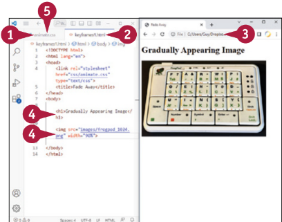

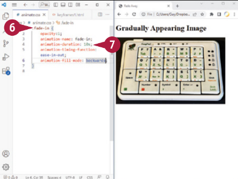

8. A fade‐in osztály alá írja be a **@keyframes** kulcsszót, majd egy szóközt; az effektus nevét, **fade‐in;** és egy másik szóközt; és egy nyitó kapcsos, {.
   A Visual Studio Code automatikusan beírja a megfelelő kapcsos zárójelet.
9. Nyomjon **Enter**-t az új sor létrehozásához, majd írja be a from és to részleteket a keyframe-hez:

```css
from {
	opacity: 0;
}
to {
	opacity: 1;
}
```

10. Kattintson a HTML-fájl fülére. A HTML-fájl aktívvá válik.
11. Kattintson a `` tag záró `>` elé, és írja be a **class="fade‐in"** kódrészt.
12. Kattintson a Frissítés gombra. A weboldal frissül.

    `A)` A kép fokozatosan jelenik meg egy 10 másodperces animáció során.

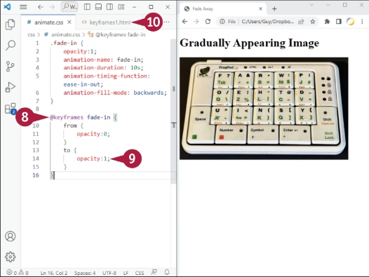

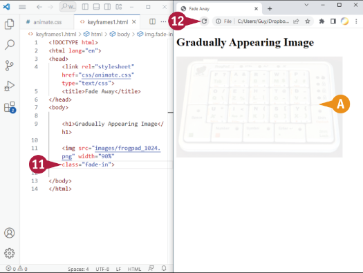

::: tip TIPP:
**Mit csinál a _@keyframes_ utasítás?**

Az _@keyframes_ utasítás két keyframes-t határoz meg az animáció vezérlésére. Az első keyframe a `from` keyframe, ami az `opacity` tulajdonságot `0`-ra állítja, így az kép kezdetben rejtett lesz. A második keyframe a `to` keyframe, ami az `opacity` tulajdonságot `1`-re állítja, így a kép teljesen látható lesz.
:::
