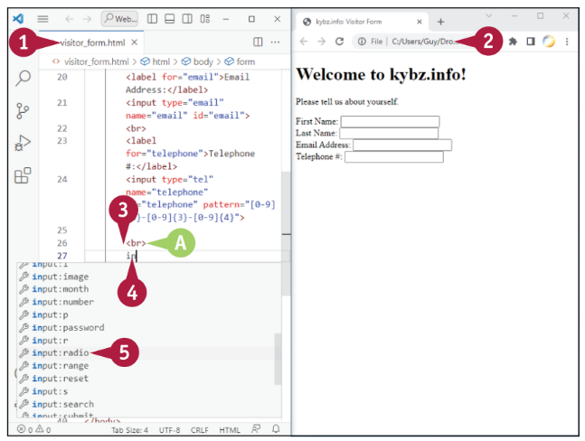

## Webes űrlapok alapjai

A weboldal űrlap egy olyan weboldal, ami felületként szolgál arra, hogy a látogatók információt adhassanak meg és elküldjék azt. Az űrlap egy weboldalként jelenik meg, amely tartalmazza az adatbeviteli vezérlőket, például szövegmezőket, amelyekbe a felhasználó beírhatja nevét és e-mail címét, valamint jelölőnégyzeteket vagy választógombokat, amelyekkel a felhasználó kiválaszthatja a lehetőségeket. Miután kitöltötte az űrlapot, a felhasználó az Elküldés gomb megnyomásával elküldi azt. Ezután az űrlapból származó adatokat visszakeresi és elküldi egy űrlapkézbesítőnek, ami általában egy szerveroldal, amely tartalmaz egy szkriptet az adatok feldolgozásához. Az űrlap validálhatja az adatokat, amikor a felhasználó beírja azokat, vagy amikor az űrlapot elküldi.

### Ismerd meg az elemeket, amelyeket használhatsz webes űrlapokban

Az 11‐1. táblázat részletesen bemutatja azokat az adatbeviteli elemeket, amelyeket az HTML biztosít a webes űrlapokhoz. A közelben található ábra többek között a leggyakrabban használt adatbeviteli elemeket mutatja be.


|                | Táblázat 11-1: Adatbeviteli elemek a webes űrlapokhoz                                                                                                                                                                                                                                                                                      |
| -------------- | ------------------------------------------------------------------------------------------------------------------------------------------------------------------------------------------------------------------------------------------------------------------------------------------------------------------------------------------ |
| text(A)        | Egy soros szövegbeviteli mező. Ez az alapértelmezett érték az input esetén, tehát ha kihagyod a típus attribútumot, egy egy soros szövegbeviteli mezőt kapsz.                                                                                                                                                                              |
| button(B)      | Egy parancs gomb. Szabályozhatod a gombon megjelenő szöveget, valamint azt, hogy mi történjen, amikor a felhasználó rákattint a gombra. Például létrehozhatsz egy "További információk kérése" nevű gombot, amely egy párbeszédpanelt jelenít meg, extra információkat mutatva.                                                            |
| checkbox(C)    | Egy jelölőnégyzet. A felhasználó kiválaszthatja a jelölőnégyzetet az opció engedélyezéséhez vagy egy pozitív válasz jelzéséhez, vagy kijelölheti a jelölőnégyzetet az opció letiltásához vagy egy negatív válasz jelzéséhez.                                                                                                               |
| color(D)       | Színválasztó. A felhasználó kattinthat a színválasztóra annak érdekében, hogy vezérlőket jelenítsen meg a szín kiválasztásához.                                                                                                                                                                                                            |
| date(E)        | Dátummező. A legtöbb böngésző most egy dátumválasztót jelenít meg, egy mini-naptár vezérlőt, amely lehetővé teszi a felhasználó számára, hogy vizuálisan válassza ki a dátumot, ahelyett, hogy be kellene azt gépelnie.                                                                                                                    |
| datetime-local | Dátum és idő mező. Erre is a legtöbb böngésző egy dátumválasztót jelenít meg egy idővezérlővel, amely lehetővé teszi a felhasználó számára, hogy a dátumot és az időt kiválassza kattintással, anélkül hogy be kellene azt gépelnie.                                                                                                       |
| email(F)       | Egy olyan beviteli mező, amely egy e-mail címet fogad be. A legtöbb böngésző automatikusan validálja a címet annak elküldésekor. Az iOS és Android operációs rendszerekben az érintőképernyős billentyűzet megjeleníti a ".com" tartományválasztó gombot, amikor egy e-mail mező van kiválasztva.                                          |
| file(G)        | Fájlkiválasztó gomb, például egy "Fájl kiválasztása" gomb. A felhasználó kattinthat a gombra annak érdekében, hogy megjelenítse az "Megnyitás" vagy hasonló párbeszédpanelt, amely lehetővé teszi egy feltöltendő fájl kiválasztását.                                                                                                      |
| hidden         | Egy rejtett beviteli mező. Egy rejtett mezőt használhatsz adatok beillesztésére az űrlap elküldésekor. Vigyázat, bár a mező rejtett a böngészőben, látható az oldal forrásában, így bárki könnyen megtekintheti.                                                                                                                           |
| image          | Egy kép, amely funkcióként működik egy Elküldés gombként. Egy képbeviteli mezőt használhatsz egy Elküldés gomb helyett vagy mellette, amiről később lesz szó ebben a táblázatban.                                                                                                                                                          |
| month          | Hónap és év mező. A legtöbb böngésző most egy dátumválasztót jelenít meg, amely lehetővé teszi a felhasználó számára, hogy a hónapot és az évet vizuálisan válassza ki.                                                                                                                                                                    |
| number         | Numerikus beviteli mező, beleértve a forgógombokat az érték beállításához. Beállíthatod az értékek minimális és maximális korlátjait, amelyeket a mező elfogad — például minimális érték lehet 1, a maximális pedig 10.                                                                                                                    |
| password       | Jelszó mező. Ez egy egy soros szövegmező, amelyben a begépelt karakterek csillagokkal vagy körökkel jelennek meg, a vállalatkövetés elleni biztonság érdekében.                                                                                                                                                                            |
| radio(H)       | Egy rádiógomb, más néven választógomb. A rádiógombok csoportokban jelennek meg kettő vagy annál több és lehetővé teszik a felhasználó számára, hogy válasszon egyet a csoportban lévő lehetőségek közül. Ha egy rádiógombra kattintunk, az kiválasztja azt a gombot, és a korábban kiválasztott másik rádiógomb kiválasztását megszünteti. |
| range(I)       | Egy csúszka, amely lehetővé teszi a felhasználó számára, hogy egy meghatározott tartományban kiválassza az értéket. Például, hangerőszabályzó.                                                                                                                                                                                             |
| reset(J)       | Egy Visszaállítás gomb. A felhasználó rákattinthat erre a gombra annak érdekében, hogy az összes űrlapbevitelt visszaállítsa az alapértelmezett értékeikre.                                                                                                                                                                                |
| search         | Egy keresőmező. A felhasználó beírhat egy keresési kifejezést, amelyet a vezérlésben meghatározott keresőmotoron keres meg.                                                                                                                                                                                                                |
| submit(K)      | Egy Elküldés gomb. Ez a gomb, amelyre a felhasználó kattintva elküldi az űrlap adatait egy űrlapkézbesítőnek. Az alapértelmezett címke az Elküldés, de ha szeretnéd, más címkét is adhatsz a gombnak.                                                                                                                                      |
| tel(L)         | Egy szövegmező, amelyet telefonn szám fogadására terveztek. A minta attribútumot használhatod az elfogadható számformátum meghatározására.                                                                                                                                                                                                 |
| time(M)        | Időmező. A legtöbb böngésző most egy időválasztót jelenít meg, amely lehetővé teszi a felhasználó számára, hogy vizuálisan válassza ki az időt.                                                                                                                                                                                            |
| URL(N)         | Egy szövegmező egy URL számára. A legtöbb böngésző automatikusan validálja az URL-t, amikor az űrlapot elküldik.                                                                                                                                                                                                                           |
| week           | Hétmező. A legtöbb böngésző most egy hétválasztót jelenít meg, amely lehetővé teszi a felhasználó számára, hogy vizuálisan válassza ki a hetet és az évet.                                                                                                                                                                                 |

## Formanyomtatvány létrehozása

Amikor szeretnéd, hogy weboldalad látogatói információt küldjenek neked, készíts egy webes űrlapot. Például szeretnéd, hogy a látogatók kitöltsenek egy felmérést, feliratkozzanak egy hírlevélre, vagy beküldjenek egy állásra jelentkezést.

Ahhoz, hogy elkezdj egy űrlap létrehozását, elhelyezel egy **form** elemet a megfelelő helyre egy weboldalon, és megadod vagy a GET vagy a POST módszert, ha már tudod, hogy melyiket fogja használni az űrlap. Az elem nyitó `<form>` tag-je és záró `</form>` tag-je között beírod az űrlap bemeneti vezérlőit.

### Formanyomtatvány létrehozása:

1. Nyissa meg a Visual Studio Code-ban a fájlt a
   amelyben az űrlapot elhelyezzük.
2. Nyissa meg a fájlt egy böngészőablakban.
3. A Visual Studio Code-ban kattintson a
   beillesztési pontra, ahol el akarja kezdeni
   az űrlapot.
4. Írja be az **f** billentyűt a bővítmények listájának megjelenítéséhez. \
   `A)` Ha az űrlapod a get műveletet használja, kattintson a **form:get** gombra. Lásd a tippet. \
   `B)` Ha az űrlap a post műveletet használja,
   kattintson a **form:post** gombra.
5. Kattintson a **form**-ra. \
   `C)` A Visual Studio Code beszúrja a nyitó
   `<form>` címkét, az **action** attribútumot
   a beszúrási ponton belül dupla
   idézőjelek közé, és a záró
   `</form>` címkét:

```html
<form action=""></form>
```


6. Nyomja meg a `tab` gombot a beszúrási pont áthelyezéséhez a
   közvetlenül a `</form>` címke elé, majd
   nyomja meg az `enter` gombot többször az üres
   sorok létrehozásához (nem látható).
7. Kattintson a gombra a beszúrási pont elhelyezéséhez a
   az első üres sorba.
8. Írja be a **la** billentyűt szót a bővítmények listájának megjelenítéséhez.
9. Kattintson a **lable**-re. \
   `D.` A Visual Studio Code beszúrja a nyitó `<label>` tag-et, a for attribútumot a beszúrási ponttal együtt dupla idézőjel között, és a záró `</label>` tag-et:

```html
<label for=""></label>
```

10. Írd be azt a nevet, amit hozzá fogsz rendelni az input vezérlőhöz, amit hozzáadsz. Az példában a név first_name.
11. Nyomj azért, hogy a beszúrási pontot éppen a `</label>` címke elé mozgásra kényszerítsd, majd írd be a címke megjelenítési szövegét. A példában ez az: Keresztnév:
12. Kattints a **Refresh** gombra. \
    A weboldal frissül. \
    `E)` A címke megjelenik.
13. A következő sorban írd be azt hogy **in**, majd kattints az **input:text** elemre a kibontási listában.
    A Visual Studio Code beszúrja az `<input>` címkét, amely így néz ki:

```html
<input type="text" name="" id="" />
```

14. Az attribútum név részének rendeld hozzá a 10. lépésben megadott nevet — a példában **first_name**.
15. Az id attribútumhoz adj meg egy leíró ID-t. A példa újra first_name-t használ.
16. Kattints a **Refresh** gombra. \
    A weboldal frissül. \
    `F)` A szöveges beviteli vezérlő megjelenik.


::: tipp TIPP:
**A get vagy a post módszert válasszam az űrlapomhoz?**
Az, hogy a get vagy a post módszert használja, attól függ, hogy a webhelye milyen szkriptet fog használni az űrlapok gyűjtésére.
információt fog gyűjteni az űrlapról. Kérdezze meg rendszergazdáját, hogy melyik módszert használja. Ha nem tudja meghatározni
melyik módszert használja, hagyja meg nem határozva a módszert az űrlap létrehozásakor. Hozzáadhatja a módszert
amikor az űrlap egyébként elkészült. \
A biztonság érdekében az űrlapot tartalmazó oldalt csak HTTPS-en keresztül tegye elérhetővé, HTTP-n keresztül ne. Konzultáljon a rendszerével
rendszergazdával az űrlapon keresztül beküldött adatok titkosításáról.
:::

## Szövegbeviteli vezérlők hozzáadása egy űrlaphoz

A HTML számos beviteli vezérlőelemet tartalmaz, amelyekkel egy űrlap felhasználójától szöveget kaphat. A legtöbb
ezek közül a legegyszerűbb a szövegbevitel, amellyel szinte bármilyen szöveget lekérdezhetünk.
Ha azonban egy bizonyos formátumú szövegre van szükségünk, használhatunk egy olyan beviteli vezérlőt, amelyet arra terveztek, hogy fogadjon
formátum fogadására. Az e-mail beviteli típus az űrlap elküldésekor érvényesíthet egy e-mail címet, és
az url beviteli típus egy URL-címet tud érvényesíteni. A tel bemeneti típus egy szám fogadására szolgál egy
elfogadható telefonszám-formátumot kapjon, amelyet Ön határoz meg.

**Szövegbeviteli vezérlők hozzáadása az űrlaphoz**

1. A Visual Studio Code-ban nyisd meg a fájlt, amely tartalmazza az űrlapot.
2. Nyisd meg a fájlt egy böngészőablakban.
3. A Visual Studio Code-ban kattints arra a helyre, ahol be akarod szúrni a következő bemeneti vezérlőt.
   A. Ha szükséges, írd be `<br>`-t egy sortörés kényszerítéséhez.
4. Írd be azt hogy **la**.
   Megjelenik a kibontási lista.
5. Kattints a **lable** tag-re.
   B. A `<label>` elem megjelenik.
6. Írd be azt a nevet, amelyet hozzárendelsz a hozzáadni kívánt bemeneti vezérlőhöz. Az példában a **last_name**-et használjuk.
7. Nyomd meg az `Tab`-ot az elhelyezési pont áthelyezéséhez, ahol a `</label>` tag előtt szeretnéd elhelyezni, majd írd be a címke szövegét.
   Az példában a **Last Name:** szöveget használjuk.
8. A következő sorban írd be az **in** szót, majd kattints az **input:text** elemre a kibontási listában.
   Megjelenik az `<input>` tag.
9. A name attribútumnak rendeld hozzá a 6. lépésben megadott nevet – a példában **last_name**.
10. A id attribútumnak rendeld hozzá a leíró azonosítót.
    A példában újra a **last_name**-et használjuk.
11. Kattints a **Refresh** gombra. \
    A weboldal frissül. \
    `C)` A Vezetéknév szövegbeviteli mező és annak címkéje megjelenik.
12. Írj be egy másik `<br>` tag-et egy sortörés kikényszerítéséhez.
13. Ismételd meg a 4. és a 10. lépést, hogy beszúrj egy másik címkét és beviteli mezőt. Ezúttal helyezz be egy e-mail mezőt. A példa ezt a kódot használja:

```html
<label for="email">Email Cím:</label>
<input type="email" name="email" id="email" />
```

14. Írj be egy másik `<br>` tag-et egy sortörés kikényszerítéséhez.
15. Ismételd meg a 4. és a 10. lépést, hogy beszúrj egy másik címkét és beviteli mezőt. Ezúttal helyezz be egy telefonszám mezőt. A példa ezt a kódot használja:

```html
<label for="telephone">Telefonszám:</label>
<input
	type="tel"
	name="telephone"
	id="telephone"
	pattern="[0-9]{3}-[0-9]{3}-[0-9]{4}"
/>
```

**Megjegyzés:** Különböző helyzetekben eltérő mintaattribútumot használhatsz a telefonszámhoz.

16. Kattints a **Refresh** gombra. \
    A weboldal frissül. \
    `D)` Az e-mail mező és a telefonszám mező megjelenik.

::: tipp TIPP:
**Így használhatod a minta attribútumot egy telefonszám bevitelhez?**
Ha ellenőrizni szeretnéd a felhasználó által megadott telefonszámot, akkor a minta attribútumot kell felvenned az `<input>` tag-be, és egy reguláris kifejezést kell használnod a minta meghatározásához. Egy reguláris kifejezés egy karakterek sorozata, amely egy keresési mintát határoz meg. Egy amerikai telefonszám esetén általában a következő mintát használnád: **pattern = "[0‐9]{3}‐[0‐9]{3}‐[0‐9]{4}"**, ami három számjegyet jelent a 0–9 tartományban, egy kötőjelet, további három számjegyet a 0–9 tartományban, egy másik kötőjelet, és végül négy számjegyet a 0–9 tartományban — például 415‐555‐1212. Nem minden böngésző ellenőrzi a telefonszám bevitelt, így érdemes a szerveren ellenőrizni a telefonszámot a űrlapadatok összegyűjtése után.
:::

## Rádiógombok hozzáadása egy űrlaphoz

A HTML lehetővé teszi rádiógombok hozzáadását egy űrlaphoz, egyszerű módot adva arra, hogy a felhasználó válasszon egy lehetőséget egy csoportból. A rádiógombok, más néven opciógombok, két vagy több csoportban jelennek meg, és lehetővé teszik a felhasználó számára, hogy kiválasszon egy lehetőséget a csoportból. Az egyik rádiógombra kattintva kiválasztja azt a gombot, és visszavonja a korábban kiválasztott másik rádiógomb kiválasztását, ha volt ilyen. A csoportban alapértelmezés szerint egy opciós gombot lehet kiválasztani a `checked` attribútum beállításával.

### Rádiógombok hozzáadása egy űrlaphoz

1. Nyisd meg a fájlt a Visual Studio Code-ban, amely tartalmazza az űrlapot.
2. Nyisd meg a fájlt egy böngészőablakban.
3. A Visual Studio Code-ban kattints arra a helyre, ahol el szeretnéd helyezni a következő bemeneti vezérlőt. \
   `A)` Ha szükséges, írj `<br>`-t, hogy sortörést hozz létre.
4. Írd be a következőt: **in**.
   A kiegészítő lista megjelenik.
5. Kattints az **input:radio**-ra.
   A Visual Studio Code beilleszti az `<input>` tag-et:
    ```html
    <input type="radio" name="" id="" />
    ```



6. Az idézőjelek között a name attribútum után gépeld be a rádiógombok csoportjának nevét — például:

```html
<input type="radio" name="platform" id="" />
```

7. Az idézőjelek között az `id` attribútum után gépeld be a rádiógomb nevét — például:

```html
<input type="radio" name="platform" id="linux" />
```

8. A következő sorba írj egy **l** betűt, majd kattints a kiegészítő listán belül, a **label**-re.
   A Visual Studio Code beszúr egy `<label>` tag-et, beleértve a `for` attribútumot, és a beszúrási pontot az attribútum utáni idézőjelek közé helyezi.


9. Írd be az `id`, amit a 7. lépésben rendeltél hozzá.
10. Nyomj `TAB`-ot a beszúrási pont előtti `</label>` tag elé, majd írd be a címke megjelenítendő szövegét. Ebben a példában **Linux**ot használunk.
11. Kattints a **Refresh**-re. \
    A weboldal frissül. \
    `B)` A rádiógomb megjelenik.


12. Ismételd meg a 4. és 10. lépést, hogy más rádiógombokat adj hozzá a csoportba. A példa az alábbi kódot használja:

```html
<input type="radio" name="platform" id="macos" />
<label for="macos">macOS </label>
<input type="radio" name="platform" id="windows" checked="checked" />
<label for="windows">Windows </label>
```

`C)` Ha szeretnél választani egy rádiógombot, add hozzá a `checked` tulajdonságot az `<input>` tag-hez, és rendelj hozzá egy értéket. Bármit hozzárendelhetsz, például `checked="penguin"`, de általában a `checked="checked"` a legértelmesebb. 13. Kattints a **Refresh**-re. \
A weboldal frissül. \
`D)` Megjelennek a rádiógombok. \
`E)` A megadott `checked` tulajdonsággal rendelkező rádiógomb van kiválasztva. \


:::tipp TIPP:
**Tehetek több rádiógomb csoportot egy űrlapra?** \
Igen — annyit, amennyire szükséged van. Használd az ’input’ elem ’name’ attribútumát minden opciógomb esetében annak megadására, hogy melyik csoport tagja. Az űrlap felületén tisztázd az egyes csoportok különböző célját és rendezd el úgy, hogy a felhasználó azonnal megkülönböztesse az egyik csoportot a másiktól. \
**Mi történik, ha több rádiógombra is beállítom a checked tulajdonságot?** \
Az HTML a te kódodban utoljára megadott rádiógombot választja ki, amelyre a checked tulajdonságot beállítottad.
:::

## Jelölőnégyzetek hozzáadása egy űrlaphoz

Amikor független igen/nem vagy be/ki vezérlést kell hozzáadnod egy űrlaphoz, beszúrhatsz egy jelölőnégyzetet úgy, hogy hozzáadsz egy ’input’ vezérlőt, és megadod a ’checkbox’ értéket a ’type’ attribútumnak. A felhasználó a jelölőnégyzet kiválasztásához kattint, ha az jelenleg nincs kijelölve, vagy a kijelölés megszüntetéséhez, ha ki van jelölve. A jelölőnégyzetet alapértelmezés szerint jelölheted ki, ha a jelölőnégyzet ’checked’ attribútumát ’checked’ vagy más értékre állítja.

### Jelölőnégyzetek hozzáadása egy űrlaphoz

1. A Visual Studio Code-ban nyisd meg azt a fájlt, amely tartalmazza az űrlapot.
2. Nyisd meg a fájlt egy böngészőablakban.
3. A Visual Studio Code-ban kattints arra a helyre, ahol el szeretnéd helyezni az első jelölőnégyzetet.
   `A)` Ha szükséges, írj `<br>`-t azért, hogy sortörést hozz létre.
4. Írd be a következőt: **in**.
   A kiegészítő lista megjelenik.
5. Kattints az **input:checkbox**-ra.
   A Visual Studio Code beszúrja a `<input>` tag-et:

```html
<input type="checkbox" name="" id="" />
```


6. Az idézőjelek között a ’name’ attribútum után gépeld be a jelölőnégyzet nevét, amit hozzárendelni kíván - például:

```html
<input type="checkbox" name="mech" id="" />
```

7. Az idézőjelek között az `id` attribútum után gépeld be a rádiógomb nevét - például:

```html
<input type="checkbox" name="mech" id="mech" />
```

8. A következő sorba írj egy **l** betűt, majd kattints a kiegészítő listán belül, a **label**-re.
   A Visual Studio Code beszúr egy `<label>` tag-et, beleértve a `for` attribútumot, és a beszúrási pontot az attribútum utáni dupla idézőjelek közé helyezi.


9. Írja be a 7. lépésben hozzárendelt azonosítót.
10. Nyomja meg a `TAB` billentyűt, hogy a beszúrási pontot közvetlenül a `</label>` címke elé helyezze, majd írja be a címke megjelenített szövegét. Ez a példa a **Mechanical Keyboards hírlevelének elküldését használja.**
11. Kattintson a **Refresh** gombra. \
    `A)` weboldal frissül. \
    `B)` Megjelenik a
    jelölőnégyzet és a hozzá tartozó címke. \
    `C)` Ha szükséges, törés


beszúrásához írja be a `<br>` parancsot. 12. Ismételje meg a 4–10. lépéseket, hogy szükség szerint további jelölőnégyzeteket szúrjon be, mindegyik címkével. \
`D)` Ha ki szeretne jelölni egy jelölőnégyzetet, adja meg a bejelölt attribútumot a
`<input>` címkét, és rendeljen hozzá értéket.
**Megjegyzés:** Bármilyen értéket hozzárendelhet, például `checked="yep"`, de a `checked= "checked"` általában a legegyértelműbb. 13. Kattintson a `Refresh` gombra.\
A weboldal frissül.\
`E)` Megjelennek a jelölőnégyzetek.


:::tipp TIPP:
Hogyan rendelhetek visszatérési (return) értéket egy jelölőnégyzethez?
Ha egy jelölőnégyzethez (check box) visszatérési értéket szeretne rendelni, adja meg az érték attribútumot a jelölőnégyzet bemeneti címkéjében, és adja meg az értéket. Ha például azt szeretné, hogy a jelölőnégyzet az Newsletter 1-nél a szöveget adja vissza, használhatja az

```html
<input type="checkbox" name="nl" id="nl" value="Newsletter 1" />.
```

## Legördülő lista lehetőségek hozzáadása egy űrlaphoz

Ha az űrlapon a felhasználónak ki kell választania egy opciót a sok lehetséges opció közül, hozzáadhat egy legördülő listát. Ehhez be kell szúrnia egy kijelölő (select) elemet, és annyi beállítási (option) elemmel kell feltöltenie, amennyi szükséges. Minden beállításelem a következőképpen jelenik meg: egy külön elem a legördülő listában. A felhasználó a legördülő menü gombra kattintva megjelenik a legördülő listát, amelyen egy elemre kattintva kiválaszthatja azt.

### Legördülő lista lehetőségek hozzáadása egy űrlaphoz

1. A Visual Studio Code programban nyissa meg az űrlapot tartalmazó fájlt.
2. Nyissa meg a fájlt egy böngészőablakban.
3. A Visual Studio Code programban kattintson a beszúrási pont helyére a legördülő lista helyére.
   `A)` Ha szükséges, írja be a `<br>` parancsot a sortörés kényszerítéséhez.
4. Típus **l**.
   Megjelenik a bővítmények listája.
5. Kattintson a **lable**-re.
   B A Visual Studio Code beilleszti a nyitó `<label>` címkét.
6. Írja be a `select` elemhez a hozzáadni kívánt nevet. A példában a név **keyboard_type**.
7. Nyomja meg a `TAB` billentyűt, hogy a beszúrási pontot közvetlenül a `</label>` címke elé helyezze, majd írja be a címke megjelenített szövegét. A példában ez van
   **Keyboard Type** (Billentyűzet típusa):.
8. Kattintson a **Refresh** gombra. \
   A weboldal frissül. \
   `C)` Megjelenik a **lable**.
9. A következő sorba írja be az **s**. karaktert.
   Megjelenik a bővítmények listája.
10. Kattintson a kiválasztás **select** gombra.

## A Visual Studio Code beszúrja a select elemet:

```html
<select name="" id=""></select>
```

11. Az insertálási pontra a name dupla idézőjelei közé írd be a select elem nevét. A példa a `keyboard_type`-ot használja.
12. Nyomj `Tab`-ot, hogy az insertálási pontot áthelyezd az id dupla idézőjelei közé, és írd be a 6. lépésben megadott értéket.
13. Nyomj `Tab`-ot, hogy az insertálási pontot közvetlenül a `</select>` elé helyezd, majd nyomj többször `Enter`-t, hogy üres sorokat hozz létre (nem látható).
14. Az első üres sorba írd be az `op`-t, majd kattints az `option`-ra a kiterjesztések listáján. A Visual Studio Code beszúrja az option elemet:

```html
<option value=""></option>
```

15. Az insertálási pontot az érték dupla idézőjelei közé helyezd a `value` után, és írd be az opcióhoz rendelt visszatérési értéket. Ebben a példában a `laptop`-ot használjuk.
16. Nyomj `Tab`-ot, majd írd be az elem megjelenítési szövegét. Ebben a példában a `Laptop Keyboard`-ot használjuk.
17. Ismételd meg a 14. és 16. lépéseket, hogy további `option` elemeket adj hozzá a `select` elemhez.

:::tipp TIPP:
Mi a name attribútum szerepe a select elemen?
A name attribútum lehetővé teszi számodra, hogy adatokat nyerj ki a select elemről, amikor a felhasználó elküldi az űrlapot.
Ha elhagyod a name attribútumot, akkor nem tudsz adatot kinyerni a select elemből.
:::

## Parancsgombok hozzáadása űrlaphoz

Ahhoz, hogy bármi hasznát vehesd, az űrlapodnak szüksége lesz egy Elküld gombra, amely lehetővé teszi a felhasználó számára, hogy elküldje azt. A HTML könnyen lehetővé teszi számodra, hogy könnyen létrehozz egy Elküld gombot és más típusú gombokat, ahogyan szükséges. Például, lehet, hogy szeretnél hozzáadni egy Visszaállít gombot, amely visszaállítja az összes űrlapmezőt az alapértelmezett értékeire, lehetővé téve a felhasználó számára, hogy újra kezdje a kitöltést. Lehet, hogy hozzá szeretnéd adni a saját gombjaidat is, hogy segítséget nyújts a felhasználónak.

### Parancsgombok hozzáadása űrlaphoz

1. A Visual Studio Code-ban nyisd meg a fájlt, amely tartalmazza az űrlapot.
2. Nyisd meg a fájlt egy böngészőablakban.
3. A Visual Studio Code-ban kattints oda, hogy behelyezd a beszúrási pontot, ahova az első parancsgombot szeretnéd elhelyezni.
   `A)` Szükség esetén írd be `<br>`, hogy sortörést hozz létre. A példa két `<br>` taget használ, hogy függőleges helyet adjon az űrlapon.
4. Írd be az **in** szót.
   Megjelenik az automatikus kiterjesztések listája.
5. Kattints **input:submit**.
   A Visual Studio Code beszúrja az `<input>` taget, beleértve a type attribútumot a submit értékkel és a value attribútumot üres értékkel:

```html
<input type="submit" value="" />
```

 6. Az insertálási pontot a value dupla idézőjelei közé helyezd, majd írd be a Submit gomb megjelenítési szövegét - például: **Submit** vagy **Submit This Form**. 7. Kattints a **Refresh**-re \
 Az weboldal frissül. \
`B)` Megjelenik az Elküld gomb. 8. Ha az űrlapodnak szüksége van egy Visszaállít gombra, ismételd meg a 4. és 7. lépéseket. Ezúttal kattints az `input:reset` lehetőségre az automatikus kiterjesztések listáján, és a value attribútumhoz rendeld hozzá a "Reset" szöveget. 9. Kattints a `Refresh`-re \
 A weboldal frissül. \
 `C)` Megjelenik a Visszaállít gomb. 10. Ha hozzá szeretnél adni egy gombot, amely megjeleníti az információs párbeszédpanelt, ismételd meg a 4. és 7. lépéseket. Ezúttal kattints az `input:button` lehetőségre az automatikus kiterjesztések listáján, és a value attribútumhoz rendeld hozzá a gomb megjelenítési szövegét.
Ebben a példában a "További információ" szöveget használjuk.


11. Kattints a `<input>` záró > jelére és add hozzá az onclick paramétert, megadva az alertet dupla idézőjelben, és az üzenetet, amit megjeleníteni szeretnél zárójelben és egyszeres idézőjelben. Ebben a példában ez a kijelentés szerepel:

```html
<input
	type="button"
	value="További információ"
	onclick="alert('Kérjük, lépj kapcsolatba az ügyfélszolgálatunkkal segítségért.')"
/>
```

12. Kattints a **Refresh**-re. \
    Az weboldal frissül.
13. Kattints a gombra.
    Megjelenik az alert párbeszédpanel.
    :::tipp TIPP:
    Egy hosszabb űrlapot hogyan lehet szakaszokra bontani?
    Egy űrlapot különböző mezőcsoportokra oszthatsz a `fieldset` elem használatával. Azonosítsd azokat a form elemeket, amelyeket az első mezőcsoportba szeretnél felvenni, majd írj be egy nyitó `<fieldset>` címkét a legelső elem elé, és egy záró `</fieldset>` címkét az utolsó elem után. A nyitó `<fieldset>` címke után írj be egy `legend` elemet a szöveges tartalommal, amely megfelel az adott űrlapszakasznak, például `<legend>Elérhetőségi adatok</legend>`. Ismételd meg ezt a folyamatot minden más űrlapszakaszra.
    :::
