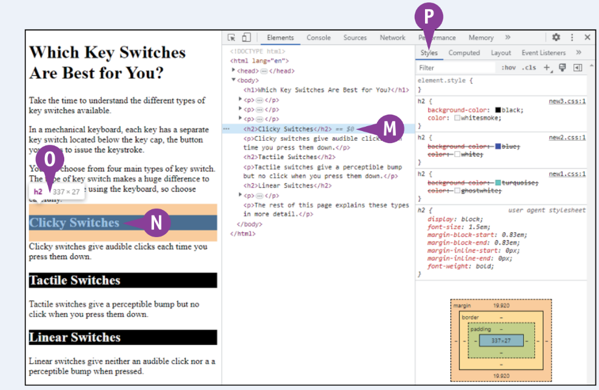

## Weboldalad továbbfejlesztése
Ebben a fejezetben megtudod, hogyan működnek a keresőmotorok, és hogyan végezheted el a weboldaladon a keresőoptimalizálást (SEO); hogyan azonosíthatod és csökkentheted az elérhetőségi problémákat a weboldalakon; és hogyan használhatod az élő fejlesztőeszközöket a problémák megoldására. Emellett megismered a tesztelőszerverek használatát és a gyors fejlesztéshez szükséges front‐end keretrendszereket is.


### A keresőmotorok működésének megértése:
A keresőmotorok talán a legnépszerűbb eszközök az internet böngészésére. Egy webböngésző ablakot vagy fület nyitsz meg egy keresőmotorban, például a **Google** vagy a **DuckDuckGo**, majd beírod a keresésedet vagy néhány kulcsszót. A keresőmotor ezután visszaadja a keresési eredményeket, amelyeket böngészhet vagy követhet. A keresőmotorok általában négy lépést végeznek el. Az első három lépés a **webről információgyűjtés**, az **információ indexelése** és a **keresési eredmények rangsorolása**. Ezeknek a három lépésnek az alapjainak megértése segíthet abban, hogy optimalizáld weboldaladat a keresőmotorok számára.


### A keresőmotor információt gyűjt a böngészés során:
A keresőmotor első lépése a **"kúszás"** (crawling) elnevezésű folyamat, amelynek során információt gyűjt az internetről. Automatizált keresési folyamatok, úgynevezett **"pók"**-ok (spiders), **"kúszók"** (crawlers), vagy "kereső bot"-ok (search bots) járják be az internetet, kezdve egy ismert URL-ek listájáról, majd az ezeken az oldalakon található linkeket követve fedezik fel más oldalakat.

Amikor egy pók eléri egy webhelyet, első lépésként megtalálja és elolvassa a **robots.txt** nevű fájlt, amely utasításokat tartalmaz a webhely bejárásához. A 'robots.txt' fájl tartalmazhat egy olyan mappalistát, amelyet a póknak figyelmen kívül kell hagynia. A fájl blokkolhat bizonyos pókokat is, hogy megakadályozza a túl nagy forgalom generálását, ami túlterhelné a webszervert. További információkért a 'robots.txt' fájl használatáról és létrehozásáról lásd a **"Útmutató a kereső pókokhoz egy **robots.txt** fájllal"** című szakaszt később ebben a fejezetben.

A 'robots.txt' fájlban található utasításoknak megfelelően a pók felfedezi a webhelyet, követve mind a belső linkeket - az oldalon található linkeket, amelyek más oldalakra vezetnek - mind az külső linkeket, amelyek más webhelyekre vezetnek. A pók naplózza az általa felfedezett URL-eket, és egy folyamat, úgynevezett **URL normalizáció** segítségével standardizálja azokat, eltávolítva a felesleges paramétereket, kisbetűssé alakítva az összes karaktert, és megoldva az URL-ekben található átirányításokat.

:::note Megjegyzés:
A pók továbbá naplózza a weboldalak szövegét és egyéb tartalmát a későbbi felhasználás céljából, együtt az oldal metaadataival, például az oldal címével, leírásával és kulcsszavaival. A keresőmotor ezt az információt fogja felhasználni az oldal témájának és a hozzá releváns keresési kifejezéseknek a meghatározásához.
:::


### A keresőmotor indexeli a megszerzett információkat:
Minden pók visszaküldi a naplózott információkat a keresőmotornak, amely feldolgozza az adatokat, mielőtt azokat egy index nevű adatbázisban tárolná. Az index lényegében egy hatalmas lista weboldalakról, tartalmukról és kapcsolódó információkról. Az index az adatbázis, amelyet a keresőmotor használ a keresések eredményeinek megtalálásához.

A keresőmotor szervezi az indexet, hogy segítsen neki gyorsan releváns keresési eredményeket visszaadni. Az index csoportokba rendeződik, amelyeket témák szerint sorolnak be, és mindegyik csoportot különböző pontszámokkal lát el, amelyek kifejezik a csoport relevanciáját a konkrét kulcsszavak vagy keresési kifejezések szempontjából.

Az indexben a keresőmotor tárolja az oldalak közötti linkek részleteit is. A keresőmotor ezt az információt használja a webhely szerkezetének és annak kapcsolatának a teljes webhez viszonyított értékeléséhez, valamint ahhoz, hogy mennyire tekintélyesek a weboldalak és webhelyek.


### A keresőmotor minden bejárt oldalt rangsorol:
Az indexelési folyamat részeként a keresőmotor rangsorolja minden adatbázishoz hozzáadott weboldalt, értéket rendelve az oldalnak, ami kifejezi annak relevanciáját egy vagy több konkrét lekérdezéshez. Egyszerűen fogalmazva, a keresőmotor a rangsorolást úgy végezheti el, hogy felméri, hogy az adott oldalon hány kulcsszó és keresési kifejezés jelenik meg, hány külső link mutat erre az oldalra, és milyen magas minőségűek ezek a linkek. Például egy olyan oldal, amely sok olyan webhelyről kap linket, amelyet a keresőmotor magas minőségű és tekintélyesnek tart, magasabb rangsorolást kap.

A keresőmotor megpróbálja meghatározni az oldal tartalmának minőségét is, algoritmikusan keresve az eredeti, magas minőségű tartalmat, nem pedig az alacsony minőségű tartalmat, amely máshol is elérhető. Ennek a vizsgálatnak a részeként a keresőmotor elemezni fogja a kulcsszavak és keresési kifejezések használatát az oldal tartalmában, beleértve azok gyakoriságát és hol jelennek meg az oldalon.


## Optimalizáld weboldaladat a keresőmotorok számára
Ahhoz, hogy minél több minőségi látogatót vonzz a weboldaladra, érdemes optimalizálni azt a keresőmotorok számára. Ez a keresőoptimalizálási folyamat segíthet weboldaladnak magasabb helyezést elérni a keresőmotorok találati oldalain, ezáltal láthatóbbá téve azt az információt kereső internetezők számára. Az **SEO** (keresőmotor optimalizálás) segíthet csökkenteni weboldalad visszautasítási arányát is, azaz azoknak a látogatóknak a százalékát, akik látogatást tesznek a weboldaladon, de nem maradnak ott, hanem **"ugrálnak"** egy másik oldalra, mert úgy döntöttek, hogy az oldalad nem felel meg az igényeiknek.


### Azonosítsd azokat a kulcsszavakat, amelyekkel az emberek keresik a termékedet vagy szolgáltatásodat:
Először is, dolgozz azon, hogy azonosítsd azokat a kulcsszavakat és keresési kifejezéseket, amelyeket az emberek használnak a terméked vagy szolgáltatásod keresésekor. 

Ezután kiemelten szerepeld ezeket a kulcsszavakat és keresési kifejezéseket a weboldaladon, hogy a keresőmotorok "pókjai" felfedezzék és rangsorolják az oldalad a keresések eredményeiben.


A kulcsszavak és keresési kifejezések azonosításához kezdd azzal, hogy egy alaplistát hozol létre brainstormingolva kollégáiddal. Bevonhatod ügyfélszolgálati képviselőidet és segélyszolgálatodat is, hogy kulcsszavakat és keresési kifejezéseket szerezz be ügyfélkérdésekből és problémákból, amelyekkel a terméked vagy szolgáltatásod kapcsán szembesülnek. Ezután vizsgálj meg olyan eszközöket, mint a Google Kulcsszótervező, **https://ads.google.com/aw/keywordplanner/home**; a SEMrush, **www.semrush.com**; és a Hootsuite, **www.hootsuite.com**.

:::tip Tipp:
Kezdd a Google Kulcsszótervezővel, amely ingyenes, feltéve, hogy rendelkezel egy Google Ads fiókkal; ha nincs fiókod, pár perc alatt létrehozhatsz egyet. A Google Kulcsszótervező segítségével kereshetsz azonosított kulcsszavak alapján, megtekintheted az új kulcsszavakat, megkaphatod a keresési volumeneket és előrejelzéseket, valamint elolvashatod a jelentéseket.
:::


### Add a kulcsszavakat a weboldal oldalaihoz:
Miután azonosítottad a weboldalad számára szükséges kulcsszavakat, használd őket megfelelően az oldalakon. Az alábbiak négy kulcsfontosságú területe:
* **Címke címsorok:** Fogalmazd meg az oldal címsorait úgy, hogy pontosan összefoglalják az oldal tartalmát, de tartalmazzák az összes releváns kulcsszót is.

* **Meta címkék:** Győződj meg róla, hogy minden oldal tartalmazza a meta címkéket, amelyek pontosan leírják a tartalmát. Használd az alkalmazkodó keresőkulcsszavakat és kifejezéseket a meta címkékben.

* **Fejléc címkék:** Logikusan strukturáld az oldalaidat megfelelő szintű fejlécekkel, használva az h1 elemeket a fő részekhez, az h2 elemeket az h1 részek felosztásához, és az h3 elemeket az h2 alrészekre. Tartalmazzák a releváns keresési kulcsszavakat és kifejezéseket a fejlécekben, minden fejlécet ésszerűen röviden tartva és mindegyik fejlécet egyedivé téve az adott oldalon.

* **Oldaltartalom:** Használd a kulcsszavakat és kifejezéseket ott, ahol a tartalmad ezeket lefedi. Győződj meg róla, hogy minden kulcsszó vagy kifejezés releváns mindenhol, ahol használod őket. Kerüld a csábítást, hogy olyan forró keresési kifejezéseket is beilleszts a meta címkékbe, amelyek nem fedik le az adott témákat. 

:::warning Érdemes megjegyezni:
A keresőmotorok tudatában vannak annak, hogy a webmesterek megpróbálnak befolyásolni a "pókokat", ezért az algoritmusok úgy vannak beállítva, hogy leminősítsék azokat az oldalakat, amelyek meta címkéi olyan tartományt jelölnek, amit az oldalak tartalma valójában nem nyújt.
:::


### Szolgáltass magas minőségű tartalmat, és tartsd azt naprakészen:
A megfelelő kulcsszavak és keresési kifejezések használata nélkülözhetetlen, de ugyanolyan fontos weboldalak létrehozása, amelyek magas minőségű tartalmat nyújtanak. Az ilyen tartalom fontos mind a keresőmotorok számára, amelyek összehasonlítják az oldaltartalmat a kulcsszavakkal annak minőségének meghatározása érdekében, mind a látogatóid számára, akik valószínűleg pontos információkért, megbízható tanácsokért és meggyőző gondolatokért látogatják webhelyedet.

:::tip Tipp:
Amint weboldalad elérhetővé válik, ne pihenj a babérjaidon. Ehelyett fejleszd és valósítsd meg a frissítési ütemtervet, hogy biztosítsd, hogy oldalaid mindig a legfrissebb információkat tartalmazzák, és ne váltakozzanak elavulttá.
:::


### Optimalizáld weboldalad technikai aspektusait:
Szükséges továbbá optimalizálni a weboldal technikai aspektusait is, biztosítva, hogy elérhető legyen a keresőmotorok számára, hogy a kódja minél tisztább és teljesebb legyen, valamint hogy a webhely reagáljon az összes kliensre. Valószínűleg weboldaladnak rendelkeznie kell egy robots.txt fájlal, hogy megmondja a "pókoknak", hogyan járják be az oldalt. További információkért lásd a következő szakaszt.


### Fejlessz ki visszahivatkozásokat (backlinks) weboldaladhoz:
A keresőmotorok a visszahivatkozásokat, azaz más weboldalakról érkező linkeket a te weboldaladra, kulcsfontosságú tényezőként használják a weboldalad rangsorolásának meghatározásában a keresési eredmények között. Ez azt jelenti, hogy fontos, hogy minél több magas minőségű, tekintélyes külső webhelyet sikerüljön rávenni, hogy linkeljenek a weboldaladra.

A visszahivatkozások kialakításához lépj kapcsolatba azokkal a weboldalakkal, amelyeket szeretnél linkelni a saját oldaladra. Minél erősebb a tartalmad, annál könnyebb lesz visszahivatkozásokat kialakítani. Azáltal, hogy vendégeket hívsz meg a weboldaladra, ösztönözheted őket, hogy linkeljenek a weboldaladra.


### Elemezd ki weboldalad teljesítményét:
Elemezd ki weboldalad teljesítményét egy olyan eszköz segítségével, mint például a Google Analytics, **https://analytics.google.com**, amely lehetővé teszi weboldalad forgalmának és látogatói viselkedésének nyomon követését. Ez az elemzés megmutatja, hogy mely részei a weboldaladnak teljesítenek az elvárásoknak, és melyek igényelnek javítást.


## Útmutató kereső pókokhoz egy **'robots.txt'** fájllal
Ha webhelye olyan mappákat tartalmaz, amelyeket nem szeretne, hogy a keresőmotorok pókjai bejárjanak, készítsen egy robots.txt fájlt, hogy elmondja a pókoknak, mely mappákat hagyják ki. A fájl tartalmazhat az összes pókra vonatkozó utasítást, vagy különböző utasításokat különböző pókokra. Például megtilthatja az összes póknak, hogy ne járja be a privát mappákat, vagy konkrét pókoknak mondhatja meg, hogy egyáltalán ne járják be a webhelyét, hogy csökkentsék a szerver terhelését. 

:::note Megjegyzés:
Legyen világos, hogy a robots.txt csak tanácsadó jellegű: A pókok figyelmen kívül hagyhatják, és még akkor is, ha a pók engedelmeskedik a ne járja be az utasításnak, a keresőmotor  akkor is indexelni tudja az oldalakat.
:::


### Annak megértése, hogy egy **robots.txt** fájl mit és mit nem csinál:
A robots.txt fájl utasításokat ad a webhelyét feltérképező pókokhoz. A fájl egy vagy több direktívakészletből áll. Az első direktíva, a User-agent: meghatározza az érintett pókokat. A második és az azt követő Disallow: utasítás felsorolja azokat a mappákat, amelyeket a pókoknak ki kell hagyniuk.

A 12-1. táblázat felsorolja a széles körben feltérképező pókokat User‐agent neveikkel együtt.
|Table 12-1: Spiders and Their User‐Agent Names|
|:----------------------------------------------:|

|Description|User-agent Name|
|:----------|:--------------|
|Googlebot|Googlebot|
|Bingbot|Bingbot|
|Baidu Spider|Baiduspider|
|YandexBot|YandexBot|
|Sogou Spider|Sogou web spider|
|Yahoo! Slurp|Slurp|
|DuckDuckBot|DuckDuckBot|
|Exabot|Exabot|
|Facebot (Facebook)|facebookexternalhit|
|Alexa Crawler|ia_archiver|
|MJ12bot|MJ12bot|
|AhrefsBot|AhrefsBot|
|SemrushBot|SemrushBot|
|DotBot|DotBot|
|Applebot (Apple)|Applebot|
|Twitterbot (Twitter)|Twitterbot|
|SeznamBot|SeznamBot|
|Archive.org bot|ia_archiver|
|Discordbot|Discordbot|
|Gigabot|Gigabot|


### Hozzon létre egy robots.txt fájlt:
Hozzon létre egy csak szöveges fájlt, és mentse el robots.txt néven. A fájlban helyezzen el utasításkészleteket a pókokhoz.

Egy pók megszólításához írja be a User‐agent: parancsot és a pók nevét. A következő példa arra utasítja a Bing Bingbotját, hogy hagyja ki a **/private/** mappát:

```
User-agent: Bingbot
Disallow: /private/
```

Ha egy pókot név szerint szólít meg, valószínűleg több pókot is név szerint kell megszólítania. Hozzon létre egy User-agent: és Disallow: beállítást minden egyes befolyásolni kívánt pókhoz. A következő példa arra utasítja a Facebotot, hogy egyáltalán ne térképezze fel a webhelyet a Disallow beállításával: **/;** utasítja a DuckDuckBot-ot, hogy hagyja ki a **/test/** mappát és a **/dev/** mappát; és elmondja a Yahoo! Slurp a **/dev/** mappa kihagyásához:

```
User-agent: facebookexternalhit
Disallow: /
User-agent: DuckDuckBot
Disallow: /test/
Disallow: /dev/
User-agent: Slurp
Disallow: /dev/
```

Az összes pók megszólításához írja be a következőt: **User-agent:** *-t. A következő példa arra utasítja az összes pókot, hogy hagyja ki a **/private/** mappát és a **/temp/** mappát:

```
User-agent: *
Disallow: /private/
Disallow: /temp/
```

### A 'robots.txt' fájl üzembe helyezése:
Miután létrehozta a 'robots.txt' fájlt, másolja azt a webhely gyökérkönyvtárába. Ez az egyetlen hely, ahol a pókok keresik a fájlt.


### Weblap megjelölése indexelés mellőzésére:
Egy adott weboldalt megjelölhet egy ```noindex``` metacímkével, hogy a pókokat **ne** indexeljék. Ehhez helyezze el a következő metacímkét a weboldal fejrészében:
```html
<meta name ="robots" content="noindex">
```

## A webhelyek akadálymentesítési problémáinak megértése
Annak érdekében, hogy webhely a lehető legszélesebb közönség élvezhesse, elérhetővé kell tennie azt a fogyatékkal élők számára is. Ez azt jelenti, hogy webhelyét úgy kell megtervezni és megvalósítani, hogy figyelembe vegye a látási, hallási, kognitív és agyi károsodásokat. Ez több munkát jelent, de növeli webhelye közönségét, és sokszínűbb és befogadóbb online közösséget teremt.

Ez a rész azonosítja a gyakori akadálymentesítési akadályokat, és bemutatja a megoldási módokat.


### Vizuális akadálymentesítési problémák kezelése:
A látássérült látogatók számos akadálymentesítési problémát tapasztalhatnak a webhelyek elérésekor.
* **Színkontraszt:** A látássérült látogatók, például gyengénlátó, színvak vagy diabéteszes retinopátia esetén nehézséget okozhat a színek megkülönböztetése. A probléma minimalizálása érdekében használjon nagy kontrasztú színeket weboldalain, különösen az olyan lényeges tartalmak esetében, mint a szöveg.

* **Betűméret:** Sokan nehezen tudják elolvasni a kis betűtípusokat. A probléma csökkentése érdekében minden szöveges tartalomhoz legalább 16 képpontos betűméretet használjon.

* **Szöveg formázása:** A sűrű szövegtömbök még a jó látású látogatók számára is áthatolhatatlannak bizonyulhatnak. A probléma enyhítése érdekében strukturálja a szöveges tartalmat címsorok és alcímek használatával, hogy a látogatók könnyen navigálhassanak a tartalom között. A világosan strukturált tartalom a kognitív fogyatékkal élő látogatóknak és a mobileszközöket, különösen a kis képernyős eszközöket használóknak is segít.


### Auditív akadálymentesítési problémák kezelése:
A hallássérült felhasználók számára nehézségekbe ütközhet a webhelyén található hangtartalom elérése és megértése.
* **Hangtartalom feliratok nélkül:** A hallássérült felhasználók részben vagy teljesen a feliratokra hagyatkozhatnak hangtartalom lejátszásakor. A problémák elkerülése érdekében minden hangtartalomhoz biztosítson feliratot.

* **Hangtartalom átirat nélkül:** Hasonlóképpen biztosítson átiratokat a szöveges hangtartalomhoz, hogy a hallássérült felhasználók elolvashassák a tartalom szövegét. Ha egy hangtartalom szövegmentes, ezt írásban jelezze.


### Kognitív akadálymentesítési problémák kezelése:
A kognitív fogyatékkal élő felhasználóknak a webhelyek két aspektusa is nehézségbe ütközhet.
* **Összetett nyelv:** Lehetőleg legyen világos és egyértelmű a nyelvezet. Ez nemcsak a kognitív fogyatékkal élőknek segít, hanem azoknak is, akiknek nem az angol az anyanyelvük. Ha az ilyen felhasználók gépi fordítást választanak a weboldalak jobb olvasásához, a világos nyelvezet segít az érthető fordítások elkészítésében.

* **Bonyolult navigáció:** Tegye a webhely navigációját a lehető legegyszerűbbé. A webhelytől függően ez azt jelentheti, hogy többféle navigációs eszközt is tartalmazhat, például linkeket a bal oldali oldalsávon, valamint egy navigációs sávot a tetején, amely azokat a kategóriákat és szinteket mutatja, amelyeken keresztül a felhasználó navigálhat az aktuális oldal eléréséhez. Győződjön meg arról, hogy a felhasználó gyorsan visszatérhet a webhely kezdőlapjára, függetlenül attól, hogy milyen mélyre nyúlik a webhelyen.


### A billentyűzet kisegítő lehetőségeivel kapcsolatos problémák kezelése:
Győződjön meg arról, hogy webhelye elérhető a billentyűzettel, hogy a látogatók csak a billentyűzet segítségével navigálhassanak rajta, ne pedig a mutatóeszközt kellene használniuk.

:::warning Leggyakoribb problémák:
A billentyűzet hozzáférhetőségével kapcsolatos leggyakoribb probléma a billentyűzet-csapda létrehozása. A billentyűzet csapda olyan elem, például egy modális üzenetablak vagy előugró ablak, amely megtartja a fókuszt, amikor a látogató oda navigált, és mutatóeszköz használata szükséges ahhoz, hogy az oldal egy másik részére lépjen. Csak a billentyűzet használatával a látogató az elem csapdájában marad. A billentyűzet beszorulásának elkerülése érdekében ne használjon modális üzenetablakokat és felugró ablakokat, és minden oldalt csak billentyűzettel teszteljen a közzététel előtt.

A billentyűzettel kapcsolatos másik probléma a mutatóeszköz használatát igénylő elemeket tartalmazó űrlapok, például választógombok és legördülő listák. A probléma elkerülése érdekében tesztelje az űrlapokat, és ellenőrizze, hogy a bennük lévő összes elem elérhető-e a billentyűzettel.
:::


### Mobil akadálymentesítési problémák kezelése:
Webhelyének sok látogatója fog mobileszközöket, például okostelefonokat és táblagépeket használni, ezért létfontosságú, hogy weboldalai mobilon is elérhetők legyenek. Általában két fő kérdés dominál:
* **Kis betűméretek:** A kis betűméretek még nagy képernyőkön is fájdalmassá tehetik az olvasást, de kis képernyőkön megakadályozhatják, hogy az olvasók megfejtsék a szavakat, hacsak nem nagyítanak. A problémák elkerülése érdekében gyakoroljon reszponzív tervezést a 10. fejezetben leírtak szerint, és tesztelje weboldalait olyan eszközökön amik kis képernyőkkel rendelkeznek, hogy biztosan olvashatóak legyenek.

* **Komplex navigáció:** A kognitív akadálymentesítési problémákkal kapcsolatban ebben a részben korábban már tárgyaltuk, hogy a lehető legegyszerűbbé tegye webhelye navigációját, hogy a mobileszközöket használó látogatók könnyen tudjanak navigálni a webhelyen.


## Ismerd meg a Chrome Élő Fejlesztői Eszközeit
A legtöbb böngésző ma beépített, élő fejlesztői eszközöket tartalmaz, amelyek lehetővé teszik egy weboldal kódjának megvizsgálását, módosítását és a változtatások mentését a fájlba. Ezek az eszközök gyorsabb megoldást kínálhatnak a problémákra az élő weboldalakon, mint a kód szerkesztése egy kódszerkesztőben, a szerkesztett fájl feltöltése, majd annak ellenőrzése, hogy a problémák eltűntek-e. Ez a szakasz bemutatja a Chrome élő fejlesztői eszközeit, amelyeket röviden Fejlesztőeszköz (DevTools) néven is ismerünk.

:::warning Tartsd észben!
Általában nagyon óvatosan kell használni az élő fejlesztői eszközöket, amikor élő oldalakon dolgozol, azaz azokon az oldalakon, amelyek nyilvánosan elérhetőek a webhelyeden. Ha van tesztelő környezeted (staging server), akkor inkább ott dolgozz, hogy nagyobb mozgásteret kapj a hibák elkövetéséhez.
:::


### A Chrome Fejlesztőeszközök megjelenítése:
Indítsd el a Chrome-ot szokásos módon, majd menj arra a weboldalra, amelyen dolgozni szeretnél. Jobb kattintással ***(A)*** megjelenik a helyzeti menü, majd kattints az **"Elem ellenőrzése"** ***(B)*** lehetőségre. Billentyűzetről egyszerűen nyomd meg a ***Ctrl + Shift + I*** billentyűkombinációt Windows vagy Linux rendszeren, vagy a ***⌘ + Option + I*** billentyűkombinációt a Mac-en.

A helyzeti menüből szintén megjelenítheted a weboldal forráskódját azzal, hogy rákattintasz a **"Oldal forráskódának megtekintése"** ***(C)*** lehetőségre. Windows és Linux rendszeren kihagyhatod a helyzeti menü megnyitását, és egyszerűen használhatod a ***Ctrl + U*** billentyűparancsot, hogy megtekintsd az oldal forráskódját.


A Chrome ablakban megjelenik a **Fejlesztőeszközök** ablak, amint az a közeli ábrán is látható. Alapértelmezetten a Chrome a jelenlegi weboldalt egy ablakon belüli panelre ***(D)*** zsugorítja a bal oldalon, és a Fejlesztőeszközök ablakot a jobb oldalon rögzített állapotban jeleníti meg. A rögzítési pozíciót megváltoztathatod a **Fejlesztőeszközök menü gomb** megnyomásával, majd a **balra rögzítés**, **alulra rögzítés**, **jobbra rögzítés** vagy **leválasztás külön ablakba** lehetőség kiválasztásával, szükség szerint. A Fejlesztőeszközök leválasztása külön ablakba különösen hasznos lehet, ha számítógépeden több monitor van csatlakoztatva.


Elsőre, amikor megjeleníted a Fejlesztőeszközöket, általában az alábbi komponenseket láthatod:
* **Tab sáv ***(F)*****: Ezen a sávon kattinthatsz a fülekre, hogy navigálj a Fejlesztőeszközök fő ablakai között.

* **Elemek ablak ***(G)*****: Ez az ablak lehetővé teszi a weboldal HTML szerkezetének vizsgálatát. Az Elemek ablak megjeleníti a Dokumentum Objektum Modell fát, az elemek szerkezetét a HTML dokumentumban. A Dokumentum Objektum Modellt röviden **DOM fá**nak nevezik.

* **Elemek ablak fül sáv ***(H)*****: Ez a fül sáv lehetővé teszi különböző információk megjelenítését a **Styles** fül, a **Computed** fül, a **Layout** fül, az **Event Listeners** fül, a **DOM Breakpoints** fül, a **Properties** fül vagy az **Accessibility** fül kiválasztásával.

* **Konzol fiók ***(I)*****: A Fejlesztőeszközök két lehetőséget biztosítanak konzol parancsok megadására: az alapértelmezés szerint az alján megjelenő **Konzol fiók** és a **Konzol ablak**, amelyet megjeleníthetsz a **Konzol fül** ***(J)*** kattintásával a fül sávon. A Konzol fiók megjelenését az **Esc** billentyű lenyomásával ki- vagy bekapcsolhatod. Alternatívaként kattints a Fejlesztőeszközök menü gombra , majd válaszd a Konzol fiók elrejtése vagy a Konzol fiók megjelenítése lehetőséget, szükség szerint. A Konzol fiók gyors bezárásához kattints a **Bezárás** ***(K, ⌧)*** gombra.


### Válassz egy témát és beállításokat a Fejlesztőeszközök számára:
A Fejlesztőeszközöknek két témája van: a **Világo**s** téma és a **Sötét** téma. Alapértelmezetten a Fejlesztőeszközök a Világos téma szerint indulnak, de átválthatsz a Sötét téma használatára, ha az előnyösebb számodra. A Sötét téma kellemesebb lehet a szemednek, ha gyengén megvilágított helyen dolgozol. Beállíthatod a témát **Rendszer Preferenciára** is, hogy a Fejlesztőeszközök automatikusan alkalmazkodjanak a számítógép operációs rendszerének beállításához.


A téma kiválasztásához és a beállítások konfigurálásához kattints a Fejlesztőeszközök ablak jobb felső sarkában található **Beállítások** ikonra **(⚙️)**. Megjelenik a Beállítások ablak, amely először a Beállítások fülön jeleníti meg a preferenciákat.

Az "Appearance" (Megjelenés) szakaszban kattints a **Téma ***(L)***** lehetőségre, majd válaszd ki a **"Rendszer preferencia"**, **"Világos"** vagy **"Sötét"** lehetőséget, ahogy szükségesnek látod.

Amíg a **Beállítások** képernyőn vagy, tekintsd át a többi beállítást, hogy tisztában legyél azokkal. Itt van két funkció, amelyeket azonnal aktiválhatsz:
* Az **"Automatically Reveal Files in Sidebar"** ***(M)*** beállítás lehetővé teszi, hogy amikor egy elemre kattintasz az Elemek ablakban, a Fejlesztőeszközök kibontják az elem forrásfájlját a Forrás panelen, és kiemelik az elem kódját. Ez segít a könnyebb navigációban és a kód módosításában.

* **Autocompletion** ***(N)***: A Fejlesztőeszközök javaslatokat tesznek a kód kiegészítésére gépelés közben.

Amikor befejezted a beállítások kiválasztását, kattints az **"Bezárás"** ***(O, ⌧ )*** gombra, hogy bezárd az Beállítások ablakot, és visszatérj a Fejlesztőeszközökhöz.


## CSS hibaelhárítás a Chrome Fejlesztőeszközökkel
A Chrome Fejlesztőeszközei tartalmaznak funkciókat a CSS problémák hibakeresésére. Például előfordulhat, hogy néha, amikor egy weboldalt megjelenítesz a böngészőben, a formázás jelentősen különbözik attól, amit eredetileg szándékoztál.

Egy módja annak, hogy azonosítsd és megoldd az ilyen problémákat, az adott CSS fájlok megnyitása és azok tartalmának átolvasása. Ez hatékony hibaelhárítási módszer lehet, de előfordulhat, hogy a Fejlesztőeszközök használata gyorsabban és kevesebb erőfeszítéssel segít kideríteni a problémákat.


### Nyisd meg a Fejlesztőeszközöket:
Amikor CSS problémába ütközöl, és nem kapod meg a kívánt kinézetet, nyisd meg a Fejlesztőeszközöket azzal, hogy jobb kattintással ***(A)*** kiválasztod a problémás oldalt, majd rákattintasz az **"Elem ellenőrzése"** ***(B)*** lehetőségre a helyzeti menüben. A Chrome megjeleníti a Fejlesztőeszközöket.


### Navigálj az Elemek ablakban és a DOM fa struktúrájában:
Alapértelmezetten a Fejlesztőeszközök a nézetablakot ***(C)*** jelenítik meg bal oldalon, ami a weboldalt kisebb méretben mutatja. Átméretezheted a nézetablakot úgy, hogy az elválasztó vonalat húzod, ami a Fejlesztőeszközök ablaktól választja el – ebben az esetben a **jobb oldali határt** ***(D)***.
Alapértelmezés szerint az **Elemek** ablak jelenik meg legelőször a Fejlesztőeszközök területén; ha az Elemek ablak nem az elsődleges, kattints az **Elemek fülre** ***(E)***, hogy előtérbe hozd az ablakot.
Az Elemek ablak megjeleníti az aktív HTML dokumentum DOM fáját. Szükség szerint bővítheted és összecsukhatod a DOM fa részeit. Kattints a **"Kibontás"** ***(F)*** gombra egy rész kibontásához. Kattints a **"Összecsukás"** ***(G)*** gombra egy rész összecsukásához.


### Elem ellenőrzése:
Az elem ellenőrzéséhez mozgasd az egeret fölé a DOM fában. A Fejlesztőeszközök kiemelik az oldal megfelelő szakaszát a nézetablakban.




A közelben látható ábra mutatja a következőt: amikor az egérmutatót a ```h1``` elem ***(H)*** fölé tartod, a Fejlesztőeszközök kiemelik a címsort ***(I)*** a nézetablakban, és egy felugró buborék ***(J)*** jelenik meg, amely megmutatja az elem **típusát** ***(K)*** és **méretét** ***(L)***.

A CSS problémák azonosításához egy elemmel kapcsolatban kattints az elemre a DOM fában. A **"Stílusok"** ablak megjeleníti az elemre alkalmazott formázást.

A közelben látható ábra mutatja az eredményt, amikor egy ```h2``` elemre ***(M)*** kattintasz. A Fejlesztőeszközök kiemelik az elemet ***(N)*** a nézetablakban, és egy felugró buborék ***(O)*** jelenik meg. A **"Stílusok"** ablak ***(P)*** a Fejlesztőeszközök jobb oldalán megjeleníti az elemre alkalmazott stílusokat.


## CSS hibaelhárítás a Chrome Fejlesztőeszközökkel (folyatás)
A **"Styles" (Stílusok)** ablak a Chrome Fejlesztőeszközökkel lehetővé teszi számodra, hogy pontosan láthasd, milyen stílusokat alkalmaz a böngésző a kiválasztott elemre. Az "Styles" ablakban található információk elemzésével gyorsan azonosíthatod az eltéréseket a **HTML** dokumentum használt különböző stíluslapjai között. Ki tudod kapcsolni az egyes tulajdonságokat a stíluslapokban, hogy finomhangold a stílusok sorrendjét, amíg a dokumentum formázása úgy jelenik meg, ahogy azt szeretnéd.


### Vizsgáld meg az egy elemre alkalmazott stílusokat:
Amint rákattintottál az elemre, amelyet meg szeretnél vizsgálni, a **Stílusok** ablak megjeleníti az adott elemre alkalmazott stílusokat. A közeli ábrán öt ```h2``` stílust láthatsz működésben.


* Az ```element.style``` ***(A)*** kiolvasás az elemhez közvetlenül alkalmazott inline stílusokat mutatja — ebben az esetben az ```h2``` elemre vonatkozóan. A példában nem alkalmaznak ```inline``` stílust, ami gyakran előfordul, ha formázást alkalmazol belső vagy külső stíluslapokon keresztül. Azonban a **Stílusok** ablak továbbra is megjeleníti az ```element.style``` kiolvasást, hogy ellenőrizhesd, nincs-e ```inline``` stílus alkalmazva — vagy alkalmazhatsz inline stílust, ha úgy szeretnéd.

* Három ```h2``` stílus van, egy-egy a **"new3.css"** ***(B)***, a **"new2.css"** ***(C)*** és a **"new1.css"** ***(D)*** fájlban. Az HTML dokumentum három külső stíluslapot kapcsol be, a **"new1.css"**, **"new2.css"** és **"new3.css"** fájlokat, ebben a sorrendben alkalmazva. Ahogyan látható, mindegyik stíluslap meghatározza az ```h2``` stílust, megadva a ```background-color``` tulajdonságot és a ```color``` tulajdonságot. A három stíluslap közül az utolsó, **"new3.css"**, felülbírálja az előző két stíluslapot, így a böngésző az ő beállításait használja. A **Stílusok** ablak elsőként listázza a három külső stíluslap közül a ***"new3.css"***-t, mert az ***h2*** elem ezt használja. A **Stílusok** ablak **keresztülhúzást** ***(E)*** jelenít meg az ```h2``` elem tulajdonságaira a **"new2.css"** és **"new1.css"** stíluslapokban, hogy jelezze, ezek a tulajdonságok felül lettek írva.

* Az ```h2``` stílus a **"user agent stylesheet"** ***(F)*** része — ez a stíluslap, amelyet a böngésző használ. A böngésző saját stílusai a stílusláncolat legalacsonyabb szintjén helyezkednek el, és azokat az elemeket formázzák, amelyeket másként nem formáztak.


### Alkalmazz vagy állíts be egy **inline** stílust:


Ha felül szeretnéd írni a formázást egy adott elem egy példányára, alkalmazhatsz egy ```inline``` stílust a stílusinformációk hozzáadásával az elemhez. A stílusdefiníció megjelenik az Stílusok ablak tetején, amikor az elemet kiválasztod a DOM-ban. Ha már van ```inline``` stílus, akkor azt igény szerint módosíthatod.

Például, a közeli ábrán az ```element.style``` definíció most sárga színt alkalmaz ***(G)***:
```css
element.style {
    color: yellow;
}
```

Amikor hozzáadod ezt az információt az **Stílusok** ablakban, a Fejlesztőeszköz automatikusan beilleszti a ```style``` attribútumot a nyitó ```<h2>``` címkébe ***(H)***. A ```color``` tulajdonság a **"new3.css"** stíluslapban felül van írva, és **áthúzással** jelenik meg ***(I)***. És a nézetablakban az ```h2``` elem formázást kap ***(J)***.


### Kapcsold be vagy ki a stílustulajdonságokat:
Amikor különböző ütköző tulajdonságokkal kell kísérletezned az általad kiválasztott elem DOM-ban, menj az **Stílusok** ablakhoz, és mozgasd az egeret azon stílus fölé, amelyet meg szeretnél változtatni. A Fejlesztőeszköz egy jelölőnégyzetet jelenít meg minden tulajdonsághoz, lehetővé téve, hogy bekapcsold a tulajdonságokat a kijelölésükkel ***(K)*** vagy kikapcsold azokat a kijelölésük eltávolításával ***(L)***.

Amikor egy tulajdonság jelölőnégyzetét eltávolítod, az adott tulajdonság következő előfordulása válik aktívvá a stílusláncolatban. A példában a következő tulajdonság kijelölésének megszüntetésének hatására az ```element.style```-on belül a ```color: yellow;``` helyett a ```color: whitesmoke;``` lesz aktív a **"new3.css"** fájlban. Hasonlóan, ha kikattintod a(z) ```background‐color: black;``` tulajdonságot a(z) **"new3.css"** fájlban, a következő ```background‐color: blue;``` tulajdonság lesz aktív a(z) **"new2.css"** fájlban. A megjelenítőablak mutatja a változások hatását ***(M)***.

A Chrome Fejlesztőeszköz lehetővé teszi számodra, hogy szerkeszthesd az HTML dokumentum szövegét a DOM-ban. Ez a képesség hasznos lehet olyan változtatások végrehajtására, amelyeket azonosítasz, és amelyekre szükség lehet, amíg a CSS-en dolgozol. Szerkesztheted az HTML dokumentum HTML kódját is, amire különböző okokból lehet szükség, például a stílusláncolattal kapcsolatos problémák javításához. Szerkeszthetsz egy stíluslapot a **Források (Sources)** ablakban a Fejlesztőeszközben, és törölhetsz egy stíluslap linket az HTML dokumentum ```head``` **(fejléc)** eleméből szükség esetén.


### Szerkeszd az HTML dokumentum szövegét:
Amikor változtatást kell végrehajtanod az HTML dokumentum szövegén, amelyen a Fejlesztőeszközt használod, jobb kattints azon elemre, amelyet szeretnél szerkeszteni ***(A)***, majd kattints a szerkesztés szövegre ***(B)*** a kontextusmenüben.


A Fejlesztőeszköz megnyitja az elemet szerkesztésre. Írd be a javításaidat ***(C)***, majd kattints valahová máshova az alkalmazásukhoz és a **Szöveg Szerkesztési Módból** való kilépéshez. A változtatások megjelennek a DOM-ban és a nézetablakban.


### Szerkeszd az HTML dokumentum HTML kódját:
Amikor szerkeszteni szeretnéd az HTML dokumentum szövegét, amelyet a Fejlesztőeszközben vizsgálsz, jobb kattints azon elemre, amelyet szerkeszteni szeretnél ***(D)***, majd kattints az **Szerkesztés HTML-ként** lehetőségre ***(E)*** a kontextusmenüben.


A Fejlesztőeszköz megnyitja az **HTML-t** szerkesztésre. Végezd el a változtatásokat, majd kattints az alul lévő mini-szerkesztőn kívül azok alkalmazásához és az HTML szerkesztési módból való kilépéshez. A változtatások hatása megjelenik a nézetablakban.


### Nyisd meg a stíluslapot szerkesztéshez:
Amikor meg kell változtatnod az egyik stíluslapfájlt, amely a Fejlesztőeszközben dolgozott HTML dokumentumhoz kapcsolódik, kattints a stíluslapfájl nevére ***(F)*** az **Stílusok** ablakban. Minden név egy link, ahogy azt az aláhúzás is sugallja.


A Fejlesztőeszköz az Elemek ablakról átvált az Források ablakra, ahogy azt a közeli ábrán láthatod. Itt az **Oldal** ablak ***(G)*** megjeleníti az kiválasztott CSS fájl elérési útját. A jobb oldali ablak ***(H)*** megjeleníti a CSS fájl tartalmát, amelyet szabadon szerkeszthetsz. A Fejlesztőeszköz hasznos funkciókat biztosít, például az automatikus kiegészítést ***(I)***.

Amikor befejezted a munkát a CSS fájlon, kattints az **Elemek** ***(J)*** gombra, hogy újra megjelenítse az **Elemek** ablakot.


### Távolíts el egy stíluslapot az HTML dokumentumból:


Ha teljesen el kell távolítanod egy stíluslapot az HTML dokumentumból, navigálj az **Elemek** ablakban a DOM-hoz, és bontsd ki a dokumentum head szekcióját, ha össze van csukva. Jobb kattints a **stíluslapot jelölő link elemre** ***(K)***, majd kattints a **Törlés elemre** ***(L)*** a kontextusmenüben. A Fejlesztőeszköz törli az elemet, eltávolítva a stíluslap linkjét.


## Egy tesztelő szerver használata
Egy tesztelőszerver egy előprodukciós környezet, amelyet a weboldaladon történő változtatások és új oldalak tesztelésére használsz, mielőtt azokat élőben megjelenítenéd. A tesztelőszerver tartalmazza az élő oldal replikáját, általában ugyanazt a szoftvert futtatva, ugyanazzal a konfigurációval és ugyanazokkal az adatokkal.

:::tip Miért lehet fontos ennek használata?
A tesztelő szerver biztosít egy biztonságos környezetet, ahol tesztelheted az új oldalakat, frissítéseket, új funkciókat és teljesítményjavításokat **anélkül**, hogy azokat kitennéd a weboldal látogatóinak vagy befolyásolnád az oldal teljesítményét. Amint befejezted az új anyagok tesztelését és a problémák javítását, és biztos vagy benne, hogy minden működik, alkalmazhatod a változtatásokat az élő weboldalon.
:::


### Ismerd meg a tesztelő szerver előnyeit:
Egy tesztelő szerver számos előnyt kínálhat:
* **Biztos tesztelő környezetet biztosít**: A tesztelő szerver olyan tesztelő környezetet biztosít, amelyet ugyanúgy konfiguráltak, mint az aktuális weboldaladat, amelyet használhatsz az oldalak vagy alkalmazások változtatásainak teszteléséhez anélkül, hogy problémákat okoznál a weboldal látogatóinak. Ez a környezet lehetővé teszi, hogy azonosítsd a problémákat és javítsd azokat, mielőtt alkalmaznád a kódot az élő weboldalon.

* **Együttműködési helyként működik**: Te és kollégáid együtt dolgozhattok a kódokon a tesztelő szerveren. A közös munkaterület elősegítheti a hatékonyabb együttműködést, és gyorsabb fejlesztést eredményezhet, mint az elkülönült silókban való munkavégzés. Ez elméletben működik; a tapasztalatok eltérőek lehetnek.

* **Lehetővé teszi az egyszerűsített telepítést**: A kód tesztelése a tesztelő szerveren segít abban, hogy biztosítsd, hogy a kód megfelelően fog működni, amikor kikerül az élő weboldalra. Ez a tesztelési szakasz rutinosabbá és kevésbé stresszessé teszi a telepítést, ami általában üdvözlendő.


### Hol található a tesztelő szerver?
A tesztelő szerver elhelyezkedhet a **vállalat helyszínén**, a **hálózati infrastruktúra részeként**, vagy a **helyszínen kívül** egy **szerverfarmban** vagy **felhőalapú** környezetben. Jelenlegi írásom idején az helyszínen kívüli megoldások népszerűbbek, mint a helyszínen belüliek.

:::tip Értékeld meg, hogy szükséged van-e tesztelő szerverre.
Ha bármilyen méretű vagy összetettségű weboldalt üzemeltetsz, valószínűleg előnyös lehet számodra egy tesztelő szerver, az előző albekezdésben ismertetett okok miatt. De ha egyszerűen csak saját kis weboldalad van, és a weboldal látogatóinak zavarásának lehetősége inkább kisebb aggodalom, mint nagy aggodalom, akkor valószínűleg nincs szükséged tesztelő szerverre.
:::


### Hogyan állíts be egy tesztelő szervert?
Egy tesztelő szerver létrehozásához általában a következő hét lépést kell követned:
1.	**Válassz helyszínt a tesztelő szerver elhelyezéséhez**: Néhány vállalat és szervezet saját hálózatukon helyezi el a tesztelő szervereket, de általában az off-premises szervertárhely használata a tipikusabb. Feltéve, hogy szervertárhelyet fogsz használni, dolgozd ki, hogy milyen technikai jellemzőkkel kell rendelkeznie a szervernek a tervezett tesztelési és fejlesztési tevékenységekhez, és határozd meg a költségvetésed. Ezután nézd meg, melyik szolgáltató felelhetne meg az igényeidnek, értékelve mind az olyan szolgáltatókat, amelyek dedikált szervereket kínálnak, mind azokat, amelyek felhőalapú szervereket biztosítanak.

2.	**Válassz szerverkonfigurációt**: Miután kiválasztottad a szolgáltatót, válaszd ki, hogy melyik szerverkonfigurációt szeretnéd használni a szolgáltató kínálatából. A legtöbb szolgáltató széles választékot kínál különféle konfigurációkkal, végtelen típusú processzorokkal, különféle RAM mennyiségekkel és a szerénytől a hatalmas tárhelyig terjedő tárolókapacitással. Határozd meg az operációs rendszert, amelyet szeretnél - általában Windows vagy Linux. Győződj meg arról, hogy könnyen frissítheted a konfigurációt, ha a weboldal tesztelési igényei növekednek.

3.	**Telepítsd az operációs rendszert, a webszervert és a webes veremrendszert**: Amint ellenőrzésed alatt van a szervered, telepítsd az operációs rendszert, a webszervert és a szükséges fejlesztői környezetet.

4.	**Biztosítsd a szerveredet**: Még akkor is, ha a szerver fizikailag egy szerverfarmban helyezkedik el, vagy csak egy felhőalapú virtuális gépként létezik, biztosítanod kell azt. Ellenőrizd, hogy csak azok a szolgáltatások fussanak, amelyekre szükséged van, és állíts le más szolgáltatásokat. Zárd le a portokat az illetéktelen behatolások ellen, és konfigurálj tűzfalat, hogy segítsen elkerülni a nem kívánt támadásokat.

5.	**Állítsd be a szervert fejlesztésre és tesztelésre**: Hozz létre egy környezetet a weboldal fejlesztéséhez és teszteléséhez. Hozz létre felhasználói fiókokat azoknak az embereknek, akik hozzáférnek a tesztelő szerverhez, és állíts be megfelelő engedélyeket minden felhasználói fiókhoz. Konfigurálj egy biztonsági mentési módszert, hogy képes legyél helyreállítani a szervert, ha hiba történik. Amint a szerver működik, ellenőrizd a biztonsági mentést és teszteld a helyreállítási rendszert.

6.	**Dokumentáld a szervert**: Ahogy dolgozol a szerver beállításán, rögzítsd a konfigurációt, hogy más rendszergazdák gyorsan és zökkenőmentesen tudjanak dolgozni a szerveren.

7.	**Másold át a weboldaladat a szerverre**: Másold át a weboldaladat a szerverre vagy közvetlenül a fejlesztői környezetből, vagy egy verziókezelő rendszer segítségével. Te és kollégáid ezután elkezdhetitek használni a szerveret.


## Front-end keretrendszer megértése
Amikor gyorsan szeretnél weboldalt vagy webalkalmazást építeni, érdemes lehet használni egy **front-end** keretrendszert a folyamat felgyorsításához és szabványosításához. Számítástechnikai szóhasználatban a "front-end" az alkalmazás felhasználói felülete, míg a háttérrendszer adatainak tárolását és feldolgozását végző részét jelenti az alkalmazásnak.

A front-end keretrendszer egy előre elkészített HTML, CSS és JavaScript kódokból, valamint UI komponensekből, például gombokból és űrlapokból álló készlet, amely lehetővé teszi az interfészek gyorsabb kialakítását, mint a manuális fejlesztés. Különböző front-end keretrendszerek állnak rendelkezésre, ahogyan azt a szakasz végén ismertetjük.


### A front-end keretrendszerek előnyei és hátrányai:
A front-end keretrendszereknek az alábbi előnyei vannak:
* **Gyors fejlesztést tesznek lehetővé**: Egy front-end keretrendszer előre elkészített komponensei és sablonjai segítségével sokkal gyorsabban létrehozhatsz egy weboldalt vagy webalkalmazást, mint ha mindent a nulláról kezdenél.

* **Egy egységes megjelenést biztosítanak**: A komponensek és sablonok segítenek abban, hogy weboldalaid és alkalmazásaid egységes megjelenést kapjanak. Ez különösen hasznos lehet, ha más fejlesztőkkel dolgozol egy projekten.

* **Átjárható böngészőkben futó kódot hoznak létre**: A front-end keretrendszerek olyan kódot hoznak létre, amely jól fut különböző böngészőkben és eszközökön, lehetővé téve, hogy a fejlesztésre koncentrálj, anélkül, hogy komoly időt kellene fordítanod a tesztelésre és hibaelhárításra.

* **Közösségi támogatással rendelkeznek**: Sok fejlesztő vesz részt a front-end keretrendszerek fejlesztésében, javításában és dokumentálásában. Tehát amikor egy keretrendszert használsz, profitálhatsz a közösség tudásából és tapasztalatából.

Ami felfelé megy, az lefelé is megy, és a front-end keretrendszereknek vannak hátrányai is, amelyek ellensúlyozzák az előnyeiket:

* **Meredek tanulási görbével járnak**: Időt kell fordítanod arra, hogy kiválaszd a számodra legjobb keretrendszert, valamint arra, hogy megtanuld, hogyan kell használni azt.

* **A szabványosítás csökkenti a rugalmasságot**: A gyártott komponensek használata felgyorsítja a fejlesztést, de korlátozva vagy azokra a komponensekre vagy, hacsak nem írsz egyedi kódot. Attól függően, hogy milyen weboldalakat és alkalmazásokat fejlesztesz, ez a korlátozás problémát jelenthet vagy sem, de érdemes figyelembe venni.

* **A keretrendszer felesleges teherrel növelheti weboldalad betöltési idejét**: A keretrendszer használata extra kódot adhat weboldaladhoz, ami lassíthatja annak betöltési idejét. Hasonlóképpen, egy keretrendszer növelheti egy alkalmazás fájlméretét.

* **A keretrendszer-frissítések weboldal-frissítéseket is igényelhetnek**: Amikor a használt front-end keretrendszer frissül, lehetséges, hogy frissítened kell mind a keretrendszerrel kapcsolatos tudásodat, mind pedig a keretrendszert használó kódodat.


:::tip Érdemes-e használni front-end keretrendszert?
Az, hogy érdemes-e front-end keretrendszert használnod a webfejlesztés során, egy bonyolult döntés lehet. Általában véve előnyös lehet egy keretrendszer használata egy olyan projektnél, amely:
* Nagy és bonyolult.
* Valószínűleg hosszú távon skálázódni vagy kiterjesztődni fog.
* Bonyolult felhasználói interakciót, sok adatmanipulációt és valós idejű frissítéseket igényel.
* Szűk időkerettel és szoros költségvetéssel rendelkezik.

Egy keretrendszer hasznos lehet, ha csak korlátozott tapasztalattal rendelkezel a front-end fejlesztés terén. Ha ez a helyzet, a keretrendszer segíthet abban, hogy kevesebb erőfeszítéssel létrehozz egy működőképes előtétet. Azonban figyelembe kell venned azt az időt is, amit a front-end keretrendszerrel való gyors tanulással töltöttél, mielőtt hatékonyan tudnál vele dolgozni.
:::

### Melyek a vezető front-end keretrendszerek?
A 12-2. táblázat felsorolja a legjobb 10 front-end keretrendszert 2023 áprilisáig, megadva azok kezdeti kiadási évét, az általuk generált kód relatív súlyát és azok körülbelüli nehézségét. A táblázat említi azokat a jelentős cégeket is, amelyek használják a keretrendszereket.
|Table 12-2: Top 10 Front‐End Frameworks|
|:-------------------------------------:|

|Framework|Released|Weight|Difficulty|Used By|
|:--------|:-------|:-----|:---------|:------|
|React|2011|Light|Easy|PayPal, Netflix, Walmart|
|Angular|2010|Heavy|Hard|BMW, Forbes|
|JQuery|2006|Light|Easy|LinkedIn, Slack|
|Vue.js|2015|Light|Easy|GitLab, Xiaomi|
|Backbone.js|2010|Light|Easy|Airbnb, SoundCloud|
|Ember.js|2011|Heavy|Hard|LinkedIn, Square|
|Semantic‐UI|2013|Heavy|Easy|Xerox, Zendesk|
|Svelte|2016|Light|Easy|Spotify, Square|
|Foundation|2011|Heavy|Hard|eBay, National Geographic|
|Preact|2015|Light|Easy|Uber, Comcast|