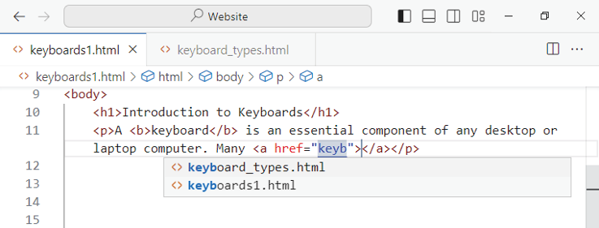

## Tanulmányozza a weboldal anatómiáját

A HTML-ben minden weboldalnak ugyanaz az alapstruktúrája, függetlenül attól, hogy mennyire egyszerű vagy összetett a weboldal.

Egy HTML weboldal egy DOCTYPE definícióval kezdődik, amely meghatározza a dokumentum kódolási típusát. Ezután következik a használt nyelv meghatározása, például lang="en" az angol nyelv megjelölésére. Ezután a weboldal egy fej- és egy testelemből áll. A head elem tartalmazza a dokumentumra vonatkozó információkat, például az oldal címét és a hivatkozások alap URL-címét. A body elem tartalmazza a weboldal többi tartalmát, például a címsorokat, a szöveget és a linkelt médiafájlokat. 

### A weboldal négy fő elemének azonosítása
Minden érvényes HTML-oldalnak négy kulcselemet kell tartalmaznia, amint azt a közeli kód szemlélteti: 
- DOCTYPE nyilatkozat. Ez a nyilatkozat közli a böngészővel a HTML-oldal dokumentumtípusát. A böngészőnek szüksége van erre az információra ahhoz, hogy a dokumentum kódjait helyesen értelmezze. 

- `<html>` címkék. A weblap egésze a nyitó `<html>` tag és a záró `</html>` tag között jelenik meg. Ezek a címkék a kétrészes címkék szabványos formátumát mutatják: A záró tag egy előremenő perjelből, /, és a nyitó taggel megegyező szövegből áll. A `<p>` nyitó taggel például azt mondja a HTML-nek, hogy kezdjen el egy bekezdést, a `</p>` záró taggel pedig befejezi a bekezdést. 

- head elem. Ez az elem tartalmazza a dokumentum metaadatait, beleértve a kódoláshoz használt karakterkészletet és a címet, amelyet a legtöbb webböngésző a címsorban jelenít meg.

- body elem. Ez az elem tartalmazza a weboldal tartalmát, például a címsorok, bekezdések és listák szövegét, valamint a külső tartalomra, például képekre mutató hivatkozásokat.

### A DOCTYPE deklaráció megértése
Minden HTML-oldal a dokumentumtípus deklarációjával kezdődik a DOCTYPE kulcsszóval. A HTML5 dokumentum DOCTYPE deklarációja egyszerű és rövid:
```html
<!DOCTYPE html>
```
Tekintettel arra, hogy a HTML5 már 15 éve használatban van, valószínűleg ezzel a DOCTYPE deklarációval fogsz leggyakrabban találkozni. Ha azonban régebbi weboldalakkal dolgozik, valószínűleg más DOCTYPE-deklarációkkal is találkozik, ezért hasznos, ha felismeri őket.

A HTML 4-es verziója és az Extensible Hypertext Markup Language (XHTML) összetettebb DOCTYPE deklarációkat használ, amelyek tartalmazzák az oldal által használt dokumentumtípus-definíció (DTD) részleteit. A HTML 4 Strict szabvány például a következő DOCTYPE deklarációt használja:
```html
<!DOCTYPE HTML PUBLIC "-//W3C//DTD HTML 4.01//EN" "http://www.w3.org/TR/html4/strict.dtd">
```
Hasonlóképpen, az XHTML 1.1 szabvány a következő DOCTYPE deklarációt használja:
```html
<!DOCTYPE html PUBLIC "-//W3C//DTD XHTML 1.1//EN">
```
"http://www.w3.org/TR/xhtml11/DTD/xhtml11.dtd">
Az XHTML doctype nyitó `<html>` tagje tartalmazza az xmlns attribútumot, amely a dokumentum által használt XHTML névtér adatait adja meg:
```html
<html xmlns="http://www.w3.org/1999/xhtml">
```
A névtér az elemek egy adott osztálya, amelyben minden elemnek egyedi neve van. Az XHTML például más névteret használ, mint a HTML 4, de a külön névterekben egyes nevek azonosak.

### A HTML érvényesség és érvényesítés megértése
Egy HTML-dokumentumnak érvényesnek kell lennie ahhoz, hogy megfelelően és következetesen jelenjen meg.

## A Visual Studio kódjának megmondása, hogy melyik mappát használja
A HTML-fájlok létrehozása előtt mondja meg a Visual Studio Code-nak, hogy melyik mappában tárolja őket. Ez lehet Befter en tinting mappa vagy fider, amelyet most hoz létre a Visual Studio Code-on belül. Miután a mappa azonosítása után utasítja a Visual Studio Code-ot, hogy bízzon a mappa szülőmappájában - a mappát tartalmazó mappában.

A Visual Studio Code elsődleges oldalsávja tartalmaz egy Intéző ablaktáblát, amely lehetővé teszi a mappák és fájlok létrehozását, kezelését és megnyitását. A Visual Studio Code Intéző ablaktáblájában való munkavégzés egyszerűbb és gyorsabb, mint a File Explorer ablakban való munka.

### Hozzon létre egy mappát a webhelyéhez
1. A Windows Visual Studio Code programjában kattintson a Menü (=), majd a Fájl elemre. \
    MacOS és Linux rendszeren kattintson a Fájl lehetőségre.
    Megnyílik a Fájl menü.

2. Kattintson a Mappa megnyitása lehetőségre. \
    Megjelenik a Mappa megnyitása párbeszédpanel.

3. Keresse meg azt a mappát, amelyben tárolni szeretné a webhelyét tartalmazó mappát.

::: note Megjegyzés:
Ha egy meglévő mappát szeretne használni, navigáljon arra a mappára, és válassza ki. Folytassa a 6. lépéssel.
:::

4. Kattintson az Új mappa elemre. \
    A Visual Studio Code létrehoz egy új mappát a mappában, megadja az alapértelmezett nevet Új mappa, és kiválasztja a nevet.

5. Írja be a mappa nevét, majd az alkalmazáshoz nyomja meg az Enter billentyűt.

6. Kattintson a Mappa kiválasztása elemre. \
    A Mappa megnyitása párbeszédpanel bezárul.

    Megnyílik a Do You Trust the Authors of the Files in This Folder? párbeszédpanel. A Ha meg akarja bízni az ezt a mappát tartalmazó mappát, válassza a Megbízhat a szülőmappa összes fájljának szerzőiben jelölőnégyzetet.


7. Kattintson az Igen, megbízom a szerzőkben gombra.

::: note Megjegyzés:
Ha nem bízik a fájlok szerzőiben, kattintson a Nem, nem bízom a szerzőkben lehetőségre.
:::

A Do You Trust the Authors of the Files in This Folder? párbeszédpanel bezárul. A Visual Studio Code megnyitja az elsődleges oldalsávot az Explorer ablaktábla megjelenítésével.

`B)` Megjelenik a kiválasztott mappa.

`C)` Az Összecsukás (~) gombra kattintva összecsukhatja az Intéző ablaktábla egy részét.

`D)` You can click Collapse ( ) to collapse a section of the Explorer panel.

`E)` Az Explorer ablaktábla egy szakaszának kibontásához kattintson a Bővítés (>) gombra.

::: note Megjegyzés:
Az Explorer sáv mappaszakasza fölé mozgatva a mutatót megjelenítheti az Új fájl gombot és az Új mappa gombot.
:::

`F)` Az Új fájl (+) gombra kattintva új fájlt hozhat létre a mappában.

`G)` Az Új mappa (E) gombra kattintva új mappát hozhat létre a mappában.


::: tip TIPP:
**Hogyan akadályozhatom meg, hogy a mappa neve megjelenjen a Visual Studio Code címsorának keresőmezőjében?**

Miután megnyitott egy mappát, annak neve megjelenik a Visual Studio Code alkalmazás címsorában található Keresés mezőben. A név eltávolításához zárja be a mappát a Fájl - Windowson kattintson a Menü (=), majd a Fájl - gombra, majd a menüben kattintson a Mappa bezárása gombra.
:::

## Az első weboldalad létrehozása
Miután beállítottad a Visual Studio Code-ot úgy, hogy a weboldal mappáját használja, létrehozhatod az első weboldaladat.  Ebben a szakaszban elkezded az oldalt, hozzáadsz egy címet a lap fejlécéhez, és beszúrsz néhány helykitöltő szöveget az oldal törzsébe.  Ha beállítottad az AutoSave funkciót a Beállításokban, a Visual Studio Code automatikusan menti a munkádat.  Ha nem, akkor használd a Control + S kombinációt a Windows vagy Linux rendszeren, vagy a Command + S kombinációt a Mac rendszeren, amikor menteni szeretnéd a fájlokat.

Teljesítsd ezt a szakaszt a következő többi szakasz előtt, amelyekben megtekinted az oldalt, majd hozzáadsz címeket, szöveget és más elemeket.

### Készítsd el az első weboldaladat:
1. A Visual Studio Code-ban kattints az Explorerre. Megnyílik a főoldalsáv, amely megjeleníti az Explorer ablakot. 

::: note Megjegyzés:
Ha a Visual Studio Code nem bővíti ki automatikusan az Explorer ablak mappa részét, kattints a Kibővítés ( > ) gombra, hogy kibővítsd.
:::

2. Kattints az Új fájlra. Egy szerkesztőmező megjelenik.

3. Írd be a fájlnevet, beleértve a .html fájlkiterjesztést, majd nyomd le az Enter-t. A példa a keyboardsl.html fájlnevet használja. \
    A Visual Studio Code létrehozza a fájlt, és megjeleníti a főablakban. A beillesztés pont megjelenik a fájl első sorában, amelyet 1-es számmal jelölnek.

4. Írd be: \
    Az AutoComplete lista megnyílik, és az elérhető AutoComplete bejegyzéseket mutatja, amelyek a karakterrel ! kezdődnek.

5. Kattints az első elemre, amelyet Emmet rövidítésként azonosítanak. \
    `A)` A `<!DOCTYPE html>` deklaráció határozza meg, hogy a dokumentum HTML5.

    `B)` A nyitó `<html>` tag a lang="en" attribútumot tartalmazza, ami az angol nyelvet állítja be.

    `C)` Az nyitó `<head>` és záró `</head>` tag határolja a head szekcióját, amely meta információkat és az oldal címét tartalmazza.

    `D)` A nyitó `<body>` és záró `</body>` tag határolja a body szekcióját, amely üres.

    `E)` A záró `</html>` tag zárja le a weboldalt.


::: note Megjegyzés:
Az Emmet rövidítést kibővítheted a Tab gombbal, amikor a rövidítés kiemelve van.
:::

6. Kattints duplán a Dokumentumra a 7. sorban. A Visual Studio Code kijelöli a szót.

7. Írd be azt a címet, amit adni szeretnél a weboldalnak. Megjegyzés: A weboldal címe megjelenik a böngésző cím sávjában. Ha a weboldal egy böngésző fülön van, a cím ott jelenik meg.

8. Kattints a 10. sorba, és írd be a `<p>` nyitó taget, valamint a szöveget, amit választasz, majd a záró `</p>` taget — például:
    ```html
    <p>Do you use a keyboard with your computer?</p>
    ```

`F)` Kattinthatsz az Explorer () ikonra, hogy bezárd az elsődleges oldalsávot, így több helyet biztosítva magadnak a weboldal szerkesztéséhez.


::: tip Tipp
**Mi az a kis, olvashatatlan szövegdoboz a Visual Studio Code ablakának jobb oldalán?**

Ez a doboz a Minimap-et tartalmazza, egy vizuális funkciót a kódod gyors navigálásához. A Minimap lényegében egy kis méretű nézetet nyújt a kódból a fő ablakban. Mozgasd az egérmutatót a Minimap felett, hogy megjelenítse a szürke kiemelést, ami egy képernyőnyi kódot mutat neked, görgess fel és le a kódban, hogy megtaláld azt a részt, amit meg szeretnél nézni, majd kattints arra a részre a fő ablakban. Ha nem találod hasznosnak a Minimap-et, kattints a Menüsávban a “Nézet” opcióra, majd válaszd ki a “Minimap kikapcsolása” lehetőséget.
:::

## Nyisd meg az internetes oldalt egy böngészőben.
A Visual Studio Code nem rendelkezik beépített böngészővel weboldalak megtekintésére, azonban gyorsan megnyithatsz egy weboldalt böngészőben annak megtekintéséhez. Az oldal megjelenítése segít abban, hogy könnyen láthasd az HTML kódban végzett változtatások eredményeit. Bármelyik böngészőt használhatod, amit előnyben részesítesz; ebben a példában a Google Chrome-ot fogjuk használni.

Ez a rész feltételezi, hogy létrehoztál egy weboldalt a Visual Studio Code-ban, amint azt az előző részben, a "Hozz létre az első weboldalad" című részben elmagyarázták.

### Nyisd meg az internetes oldalt egy böngészőben.
1. A Visual Studio Code-ban nyisd meg a weboldaladat, majd kattints jobb gombbal a weboldal fülére. \
    Megnyílik a helyzeti menü.

2. Kattints a "Megnyitás a fájlkezelőben" lehetőségre. \
    Egy Fájlkezelő ablak nyílik meg a weboldal mappájában.

::: note Megjegyzés:
Ha megjelenik az elsődleges oldalsáv és látható az Explorer panel, akkor jobb gombbal kattinthatsz a weboldal fájljára, majd válaszd ki a "Megnyitás a fájlkezelőben" lehetőséget a helyzeti menüből.
:::

::: note Megjegyzés:
Ha a weboldalt meg akarod nyitni az alapértelmezett böngésződben, egyszerűen duplán kattints a fájlra.
:::

3. Jobb gombbal kattints a weboldal fájljára, válaszd ki vagy emeld ki a "Megnyitás ezzel" lehetőséget a helyzeti menüből, majd kattints az alkalmas böngészőre - például a Google Chrome-ra.

::: note Megjegyzés:
Ha a számítógépeden nagy képernyő van, akkor a Visual Studio Code ablakát és a böngésző ablakát megosztva használni segíthet hatékonyabban dolgozni. Ha két monitorod van, érdemes lehet a Visual Studio Code-ot az egyik monitorra, a böngészőt pedig a másikra helyezni.
:::


Megnyílik egy böngészőablak vagy lap, amely a weboldalt mutatja. Most már elrendezheti a böngésző ablakot és a Visual Studio Code ablakát úgy, hogy mindkettőt láthassa. A következő lépések egy egyszerű módszert mutatnak be a Windows Snap funkció használatával.
4. Kattintson a böngészőablak címsorára, és húzza balra vagy jobbra, amíg a mutató el nem éri az ablak szélét. \
    `A)` A Windows Snap átméretezi és elhelyezi az ablakot, hogy illeszkedjen a képernyő feléhez.

    `B)` A Windows Snap egy bélyegképet jelenít meg egymás megnyitott ablakaihoz, amelyeket a képernyő másik felére helyezhet el.

5. Kattintson a Visual Studio Code ablakára \
    `C)` A Windows Snap az ablakot a képernyő másik felére helyezi.

    Most már módosíthatja a Visual Studio Code ablakát.

    `D)` Kattintson a Frissítés lehetőségre (például a Google Chrome-ban) a weboldal frissítéséhez, hogy megjelenjen a legutóbbi módosítások.


::: tip Tipp
**Melyik böngésző a legjobb az oldalak megtekintéséhez munka közben?**

A főbb böngészők bármelyike – Google Chrome, Microsoft Edge, Mozilla, Firefox, Apple Safari – bármelyik ezek közül jól fog működni. Az oldalak következetes működésének biztosítása érdekében váltogassa a különböző böngészőket az oldalak megtekintéséhez. \
A böngészők közötti váltás legegyszerűbb módja, ha a jobb gombbal a fájlra kattint a Fájlkezelő ablakban, kattintson vagy jelölje ki a Megnyitás elemet, majd kattintson a használni kívánt böngészőre.
:::

## Add Headings and Text
Jelenleg a weboldalaknak előnyös egy olyan struktúrával rendelkezniük, amely különböző szintű címeket használ. Az HTML hat különböző címszintet biztosít, ahol az h1 a legmagasabb szintű cím, az h6 pedig a legalacsonyabb szintű. Általában két vagy három címszint elegendő. Ebben a szakaszban három szintű címszintet adunk hozzá a weboldaladhoz, a címeket egyszerű szövegrészletekkel választjuk el. 

A képernyők ebben a részben megmutatják a Visual Studio Code ablakot és a Google Chrome böngészőablakot, amelyeket függőlegesen csempézünk el a Windows Snap segítségével. Követheted ezt a elrendezést, vagy rendezheted az ablakokat úgy, ahogy neked a legjobban megfelel.

1. A Visual Studio Code-ban, amikor a weboldalad meg van nyitva, válaszd ki az egész 10. sort, az egyik bekezdést a test elemen belül.

2. Írd be a h1-et, hogy elkezdj egy nyitó `<h1>` címke létrehozását egy Emmet rövidítéssel: h1 A felugró menü megnyílik, az alapértelmezett módon a h1 Emmet rövidítési elem van kiválasztva.

3. Kattints a h1-re, vagy egyszerűen nyomj . A Visual Studio Code kibontja a rövidítést a teljes címkévé, a nyitó `<h1>` címkévé és a `</h1>` címkévé, az elhelyezési pontot közéjük helyezi.

4. Írd be a legfelső szintű címke szövegét.

5. Kattints a záró `</h1>` címke után, majd nyomd meg az Entert új sor létrehozásához. 

6. Írd be a p-t, hogy elkezdj egy nyitó `<p>` címkét egy Emmet rövidítéssel. A felugró menü megnyílik, az alapértelmezett módon a p Emmet rövidítési elem van kiválasztva.

7. Kattints a p-re vagy nyomj . A Visual Studio Code kibontja a rövidítést a teljes címkévé. 

8. Írj egy bekezdést a test szövegéhez.

9. Kattints az Újratöltésre ( ). Címek és szövegek hozzáadása A legtöbb weboldalnak hasznos struktúrája van, amely különböző címszinteket használ. Az HTML hat különböző címszintet biztosít, ahol az h1 a legmagasabb szintű cím, az h6 pedig a legalacsonyabb szintű. Általában két vagy három címszint elegendő. Ebben a részben hozzáadunk három címszintet a weboldaladhoz, és szövegrészleteket helyezünk el köztük. A képernyők ebben a részben megmutatják a Visual Studio Code ablakot és a Google Chrome böngészőablakot, amelyeket függőlegesen csempézünk el a Windows Snap segítségével. Követheted ezt a elrendezést, vagy rendezheted az ablakokat úgy, ahogy neked a legjobban megfelel. 


Első weboldalak létrehozása A Google Chrome megjeleníti a weboldalon történt változásokat. A Az első szintű cím jól kirajzolódik. 
10. Kattints a 12. sor elejére. 

11. Írj be szöveget, amely tartalmaz második szintű címeket, az `<h2>` és `</h2>` címkék közé, valamint bekezdéseket, az `<p>` és `</p>` címkék közé — például:
    ```html
    <h2>Lehet-e cserélni a billentyűzetet egy laptopon?</h2>
    <p>Nem, de csatlakoztathatsz egy külső billentyűzetet.</p>
    <h2>Mik az előnyök és hátrányok egy külső billentyűzettel?</h2>
    <p>Egy laptop használata egy külső billentyűzettel előnyökkel és hátrányokkal jár.</p>
    ```

12. Kattints az Újratöltésre ( ) a böngésző frissítéséhez. 

13. Folytasd az oldalt úgy, hogy beírsz szöveget, amely tartalmaz harmadik szintű címeket, az `<h3>` és `</h3>` címkék közé, és további bekezdéseket — például:
    ```html
    <h3>Külső billentyűzet előnyei</h3>
    <p>Íme néhány jó dolog egy külső billentyűzet használatáról.</p>
    <h3>Külső billentyűzet hátrányai</h3>
    <p>Íme néhány rossz dolog egy külső billentyűzet használatáról.</p>
    ```

14. Kattints az Újratöltésre ( ) a böngésző frissítéséhez. 
`B)` Jól láthatóak a három szintű címek. 


::: tip TIPP
**Hogyan lehet szöveget kiválasztani a Visual Studio Code-ban?**

A Visual Studio Code lehetővé teszi számodra a legtöbb szokásos kiválasztási módszer használatát. Például tartsd lenyomva az Alt és nyomj fel/le/jobbra/balra, hogy kiválaszd a szöveget a billentyűzettel. Kattinthatsz és húzhatod az egérrel; vagy kattinthatsz oda, ahonnan a kiválasztást kezdenéd, majd nyomd meg az Alt+Kattintás-t ahhoz, hogy befejezd. A szó kiválasztásához duplán kattinthatsz, vagy a bekezdés teljes kijelöléséhez háromszorosan.
:::

## Nest One Element Within Another Element
Ahogyan ebben a könyvben már láttad, az HTML lehetővé teszi egy elem elhelyezését egy másik elemen belül. Például, a weboldal teljes tartalmát tartalmazza az html elemen belül: Az html elemen belül található a head elem és a body elem, melyek mindegyike más elemeket tartalmaz. 

Egy elem elhelyezése egy másik elemen belül azt jelenti, hogy egy elemet befoglalunk egy másik elembe. Amikor egy elemet befoglalsz egy másik elembe, fontos, hogy zárd le a befoglalt elemet, mielőtt lezáródna az elem, amelybe befoglaltad. 

### Grasp How Nesting Works
Egy elem befoglalása egy másik elemen belül Értsd meg, hogyan működik a befoglalás Ahhoz, hogy egy elemet befoglalj egy másik elemen belül, először írd be a tartalmazó elem nyitó és záró címkéjét. Például, egy weboldal body eleme használja az nyitó `<body>` címkét és a záró `</body>` címkét:
```html
<body></body>
```

Ezután beágyazhatsz egy elemet a nyitó és záró címkék közé. Például, beágyazhatsz egy bekezdést, ahogyan itt láthatod. 
```html
<body>
    <p>Itt egy bekezdés.</p>
</body>
```

Ha sok elemet fogsz beágyazni, valószínűleg külön sorokra akarod helyezni a külső elem címkéit, hogy könnyen látható legyen, hogy hol kezdődik és végződik az elem. A beágyazott elemek behúzása segít vizuálisan megkülönböztetni őket anélkül, hogy megváltoztatnád az HTML szemantikáját, mivel a böngészők figyelmen kívül hagyják a behúzást. 
Például: 
```html
<body>
    <h1>Itt egy első szintű cím</h1>
    <p>Itt egy bekezdés.</p>
</body>
```

Az elemek beágyazásának kulcsa az, hogy egy beágyazott elemet be kell zárnod, mielőtt bezárnád az elemet, amelybe beágyaztad. Ha a beágyazott elemet zárod le az elem bezárása előtt, hibák jelentkeznek, és az HTML nem lesz érvényes. A következő példa bezárja a body elemet a bekezdés bezárása előtt:
```html
<body>
    <h1>Itt egy első szintű cím</h1>
    <p>Itt egy bekezdés.
</body>
</p>
```

Ez a példa hibát okoz, mint például Láttam egy végtagot, miután a body bezáródott.

## Megjegyzések hozzáadása
Az HTML lehetővé teszi a megjegyzések felvételét. Egy megjegyzés olyan szöveg, amely megjelenik az HTML forráskódjában, de amelyet a böngésző nem jelenít meg a weboldalon. A megjegyzések hozzáadása hasznos lehet, mind emlékeztetőként a weboldal létrehozása során, mind akkor, amikor dokumentálni akarod azt másoknak vagy saját magadnak. A megjegyzéseket használhatod meglévő elemek elrejtésére egy weboldalon, megakadályozva azok megjelenítését — például ha valami nem működik. Ez általában ideiglenes megoldás. Általában eltávolítod a megjegyzéseket, mielőtt a weboldalt elérhetővé tennéd az interneten.

1. Nyisd meg a weboldalad a Visual Studio Code-ban és a böngésződben. 

2. Kattints oda, ahová be akarod szúrni a megjegyzést.

3. Írd be a **<!--** kezdeti megjegyzési címkét.
    ```html
    <!--
    ```
    `A)` Visual Studio Code automatikusan beilleszti --> a címkét, hogy befejezze azt:
    ```html
    <!-- -->
    ```

4. Írd be a megjegyzés szövegét — például: \
    ```html
    <!-- Itt egy megjegyzés. -->
    ```
    `B)` A megjegyzés más színben jelenik meg a Visual Studio Code-ban. 

5. Kattints az Újratöltésre ( ). A megjegyzés nem jelenik meg a böngészőben. 

6. Kattints azzal a célra, hogy megelőzd az első elemet, amelyet el akarsz rejtetni. 

7. Írd be a **<!--** kezdeti megjegyzési címkét. 

8. Kattints az utolsó elem végére, amelyet el akarsz rejtetni. 

9. Írd be a **-->** záró megjegyzési címkét.

::: note Megjegyzés:
Egy megjegyzés több soron is elterjedhet.
:::

10. Kattints az Újratöltésre ( ). \
    `C)` A megjegyzéssel bezárt elemek már nem jelennek meg.


## Közvetlen formázás alkalmazása
A legegyszerűbb módja a weboldal megjelenésének megváltoztatásának a közvetlen formázás, vagyis a formázási elemek alkalmazása a szövegre vagy egy objektumra. Például kiemelheted a szöveg különböző részeit, például félkövéren, dőlten vagy aláhúzással, a megfelelő címkék elhelyezésével körülöttük.

A közvetlen formázás könnyen és hatékonyan működik, de nem hatékony. A formázás CSS segítségével sokkal hatékonyabb és könnyebb frissíteni. Azonban érdemes megismerni és megérteni a közvetlen formázást, mert valószínűleg sok weboldalon találkozni fogsz vele.

### Közvetlen formázás alkalmazása:
1. Nyisd meg a weboldaladat a Visual Studio Code-ban és a böngésződben.
2. Kattints a szó elé, amelyre félkövéren szeretnéd alkalmazni a formázást.
3. Írd be a nyitó `<b>` tag-ot:
    ```html
    <b>
    ```

4. Kattints a szó után, majd írd be a záró `</b>` tag-ot, így a címkék be fogják zárni a szót, így:
    ```html
    <b>keyboard</b>
    ```

5. Frissítsd az oldalt (Ctrl + R). \
    `A)` A szó félkövérben jelenik meg a böngészőben.

6. Kattints a szöveg elé, amelyre dőlt és aláhúzott formázást szeretnél alkalmazni.

7. Írd be a nyitó `<i>` tag-ot és a nyitó `<u>` tag-ot:
    ```html
    <i><u>
    ```

8. Kattints a szöveg után, majd írd be a záró `</u>` tag-ot és a záró `</i>` tag-ot.

::: note Megjegyzés:
Zárd le a beágyazott `<u>` tag-ot a tartalmazó `<i>` tag-ot zárásakor.
:::

9. Frissítsd az oldalt (Ctrl + R). \
   `B)` A szöveg dőlt és aláhúzott formázásban jelenik meg a böngészőben.


## Az oldal forráskódjának megtekintése
Általában, amikor egy weboldalt megnyitsz egy böngészőben, az alkalmazás megjeleníti az HTML eredményeit, például egy fényes, grafikus weboldalt. De néha előfordulhat, hogy inkább szeretnéd megtekinteni az oldal forráskódját. Az oldal forráskódjának megtekintése segíthet megérteni, hogyan van megvalósítva egy adott elem HTML-ben, vagy lehetővé teheti számodra egy olyan probléma azonosítását, amely megakadályozza az oldal helyes megjelenítését. 

A technikák az oldal forráskódjának megtekintésére eltérhetnek böngészőnkként. Ez a rész mutatja meg neked, hogyan nézheted meg az oldal forráskódját a Google Chrome, Firefox, Microsoft Edge és Safari böngészőkben.

### Egy oldal forráskódjának megjelenítése böngészőben
A Google Chrome, a Mozilla Firefox és a Microsoft Edge böngészőkben egy oldal forráskódját megjelenítheted úgy, hogy jobb klikkelsz az oldalon, majd kiválasztod a Megjelenítés Forráskódban lehetőséget a felugró menüből.

MacOS-en a Safari nehezebbé teszi ezt a folyamatot. Először is, hozzá kell adnod a Fejlesztés menüt a menüsorhoz. Ehhez kattints a Safari-re, majd a Beállításokra, hogy megnyisd a Safari beállítások ablakát; kattints az Advanced (Haladó) fülre, hogy megjelenítsd a Haladó beállításokat; és válaszd ki a Fejlesztői menü megjelenítése a menüsorban lehetőséget (). Ezután kattints a Fejlesztők-re a menüsorban, majd válaszd a Forráskód megjelenítése lehetőséget; vagy használhatod a Control + klikk-et vagy jobbklikket az oldalon, majd válaszd ki a Forráskód megjelenítése lehetőséget a felugró menüből.

Egy összetett oldal forráskódja első ránézésre nyomasztó lehet, de ha az elejére nézel, felismerheted a szabványos elemeket, mint például a DOCTYPE deklaráció (A), a nyitó `<html>` tag (B), a nyitó `<head>` tag (C), különböző `<meta>` tag-ok (D), a nyitó `<title>` tag (E), és a záró `</title>` tag (F).


## Érvényesítsen egy weboldalt
Az HTML helyességének ellenőrzéséhez validálhatod azt. Különböző módszerek állnak rendelkezésre az HTML validálására. Például néhány kód szerkesztő, integrált fejlesztői környezet és webes szerkesztő eszköz rendelkezik beépített validálási funkciókkal.

Ez a szakasz bemutatja, hogyan lehet validálni az HTML-t a W3C Markup Validation Service segítségével, ami egy online erőforrás, amelyet a World Wide Web Consortium (W3C) nyújt, a fő nemzetközi szabványosítási szervezet a World Wide Web számára. Validálhatsz úgy, hogy feltöltöd a fájlt, ahogy itt láthatod; megadod az ellenőrzendő weboldal URI-ját; vagy egyszerűen beilleszted vagy begépeled a kódot egy mezőbe.

### A weboldal validálása:
1. Nyiss meg egy böngészőablakot a [https://validator.w3.org](https://validator.w3.org) címre.

2. Kattints a Fájl feltöltésével történő validálásra, hogy kövesd ezt az példát. \
    `A)` Kattinthatsz a URI alapú validálásra, ha egy már online lévő weboldalt szeretnél ellenőrizni.

    `B)` Kattinthatsz a Közvetlen bemenet alapján történő validálásra, ha a kódot beilleszted - vagy begépeled - egy mezőbe.

3. Kattints a Fájl kiválasztása lehetőségre. \
    Megjelenik a Megnyitás párbeszédpanel.

4. Navigálj a megfelelő mappához.

5. Kattints a fájlra.

6. Kattints a Megnyitás lehetőségre.

7. Kattints az Bővítés (váltás) gombra a További lehetőségek mellett. \
    Megjelenik a További lehetőségek szakasz.

    `C)` A fájlnév megjelenik a Fájl mezőben.

    `D)` Kattinthatsz a Karakterkódolás (✔) gombra, és meghatározhatod a kívánt karakterkódolást a "(automatikus észlelés)" helyett.

    `E)` Kattinthatsz a Dokumentumtípus (✔) gombra, és meghatározhatod a kívánt dokumentumtípust a "(automatikus észlelés)" helyett.

    `F)` az Hibaüzenetek csoportosítása típus szerint (O váltása) gombra az üzenetek csoportosításához. Az Üzenetek listázása sorrendben beállítás az alapértelmezés.

    A Markup Validation Service ellenőrzi a fájlban lévő HTML-t.

    `G)` A hibalista azonosítja a talált hibákat a HTML-ben.

    `H)` A fájl tartalmazza a `<bdy>` tag-ot, egy a `<body>` tag elírását, amely a body elemet zárja egy HTML-dokumentumnak.

    `I)` Mivel a `<body>` tag hiányzik, a záró `</body>` tag is hibát okoz.

    `J)` Egy másik hiba azért következik be, mert nincs `</bdy>` záró tag, amely a `<bdy>` tag-ot zárná.


9. A hibákat megvizsgálva javítsa ki a HTML-t, kattintson a Fájl kiválasztása gombra, és töltse fel a javított fájlt.

10. Kattintson az Ellenőrzés gombra. A Markup Validation Service ellenőrzi a fájlban lévő HTML-t. \
    `K)` A „Dokumentum ellenőrzése befejeződött. Nincsenek hibák vagy megjelenítendő figyelmeztetések.” jelzi, hogy a fájl érvényes.

    `L)` A Bezárás (X) gombra kattintva bezárhatja a böngészőablakot.


::: tip Tipp:
**Miért mutat hibát a Markup Validation Service egy olyan HTML-fájl esetében, amely helyesen jelenik meg egy böngészőben?**

A WEB hatalmas mennyiségű hibás HTML-t tartalmaz, ezért a böngészők úgy vannak kialakítva, hogy tolerálják a hibákat, és hogy weboldalakat a lehető legjobban jelenítsék meg. Ez azt jelenti, hogy egy weboldal böngészőben történő megtekintése nem hatékony annak ellenőrzése, hogy az oldal HTML-je érvényes-e. Annak érdekében, hogy weblapjai minden böngészőben helyesen jelenjenek meg, mindenképpen ellenőrizze minden oldal HTML-jét, és távolítsa el a hibákat.
:::

## Másik weboldal létrehozása
Ebben a szakaszban létrehozol egy második weboldalt a Visual Studio Code segítségével, ugyanazokat a technikákat alkalmazva, mint az előző fejezetben létrehozott első oldal esetén. Ezt az oldalt azért hozod létre, hogy egy hiperhivatkozás célját szolgálja, amit később létrehozol a fejezet későbbi részében. Az oldalnak nem kell bonyolultnak lennie; csak jelen kell lennie annak érdekében, hogy létrehozd a kapcsolatot hozzá a korábbi oldalról.
1. A Visual Studio Code-ban kattints az Explorer (Tárló) ( ) ikonra. \
    Megnyílik a fő oldalsáv, amely megjeleníti a Tárló ablakot.

2. Vigyázz a mappa fejlécére és kattints az Új fájl ( ) ikonra. \
    Megjelenik egy szerkesztő doboz.

3. Írd be a fájlnevet, beleértve a .html kiterjesztést, majd nyomd meg az Enter billentyűt. \
    Az példában a fájlnevet keyboard_types.html-nek használják.

    A Visual Studio Code létrehozza a fájlt és megjeleníti a fő ablakban.

4. Írj be egy ! karaktert. \
    Az Automatikus Kiegészítés listája megjelenik, amely az ! karakterrel kezdődő elérhető Automatikus Kiegészítés bejegyzéseket mutatja.

5. Kattints az Emmet rövidítés elemre. \
    A Visual Studio Code kibővíti a rövidítést, és a weboldal vázának kódját helyettesíti a felkiáltójel helyén.

6. Az alapértelmezett "Document" cím szöveg kiválasztva marad, írj be a weboldal címét.

7. Kattints a `</body>` tag elé, és írj be néhány egyszerű HTML-t. Íme egy példa
    ```html
    <h1>Types of Computer Keyboards</h1>
    <p>Many types of computer keyboards are available.</p>
    <p>With a little research, you can find just the right type of keyboard for you!</p>
    ```

 \


## A hiperhivatkozások lényegének megértése
A weben hiperhivatkozásokat használnak, gyakran egyszerűen linkeknek nevezve, hogy kapcsolatokat hozzanak létre különböző weboldalak vagy oldalrészek között. Ha egy linkre kattintunk az egyik oldalon, a böngésző megjeleníti a kapcsolt oldalt, vagy ugyanabban a böngészőablakban vagy fülön, vagy egy új böngészőablakban vagy fülön.

Ebben a szakaszban megtanulod a hiperhivatkozások alapjait, és azonosítod azokat az HTML elemeket, amelyek alkotják a hiperhivatkozást. A következő szakaszokban először egyszerű hiperhivatkozásokat, majd olyan hiperhivatkozásokat hozol létre, amelyek átirányítják a böngészőt egy másik célpontra.

### Identify the Components of a Hyperlink
Az HTML-ben a hiperhivatkozás egy `<a>` tag-ot használ, ahol az "a" betű az anchor rövidítése. A hiperhivatkozás `<a>` tag-ja a következő formátumot használja:
```html
<a href="cím">link text</a>
```

Itt a href - hyperlink referencia - attribútum azt jelzi, hogy az anchor címke egy hiperhivatkozást tartalmaz. A hivatkozás címe, amelyet dupla idézőjelek között adnak meg, megadja a hiperhivatkozás célját. A hivatkozás szöveg, amely megjelenik az `<a>` nyitó címkéje és a záró `</a>` címke között, a weboldalon megjelenő szöveget biztosítja a hivatkozás jelzésére.
Például a következő hiperhivatkozás megjeleníti a "keyboard types" szöveget, és a www.kybz.info webhelyen található keyboard_types.html nevű oldalra mutat.
```html
<a href="https://www.kybz.info/keyboard_types.html">keyboard types</a>
```

A közelben látható illusztráció bemutatja a linkelt szót a kontextusban. Ha az egeret egy hivatkozásra (A) helyezed, a legtöbb böngésző megjeleníti a hivatkozás célját. Ebben a példában a Google Chrome az ablak bal alsó sarkában (B) jeleníti meg a hivatkozás célját.


## Hogyan hozzon létre hiperhivatkozást weboldalai között
Most, hogy két weboldalt hozott létre, hiperhivatkozásokat hozhat létre közöttük. Hogy  hiperhivatkozást készítsen, szúrjon be egy horgonycímkét a weboldal megfelelő helyére, és adja meg a hivatkozás célhelyét, és írja be az oldalon megjelenítendő szöveget, amely a hivatkozást ábrázolja.

Az ebben a részben található példa hiperhivatkozást hoz létre a számítógépén tárolt fájlok között, nem pedig a webszerveren tárolt fájlok között.

### Hogyan hozzon létre hiperhivatkozást weboldalai között
1. A Visual Studio Code programban kattintson Fájlkezelőre (Explorer). \
    Megnyílik az elsődleges oldalsáv, amelyen az Intéző panel látható.

::: note Megjegyzés:
Ha a webhely mappája össze van csukva, kattintson a Kibontás (Expand) gombra a kibontásához.
:::

2. Kattintson arra a weboldalra, amelyen a hiperhivatkozást létre kívánja hozni. A weboldal a Visual Studio Code ablakának fő részében jelenik meg.

3. Kattintson a beillesztési pont elhelyezéséhez arra a helyre, ahol a hivatkozást szeretné elérni.

4. Írja be a. \
    Megnyílik az Automatikus kiegészítés lista, amely az „a” karakterrel kezdődő, elérhető automatikus kiegészítési bejegyzéseket mutatja.

5. Kattintson az első elemre, amelyet Emmet rövidítés-nek (Emmet Abbreviation-nak) azonosítanak. \
    A Visual Studio Code kiterjeszti a rövidítést a hiperhivatkozás horgonycímkéjére, amint az alábbiakban látható.
    ```html
    <a href=""></a>
    ```
    `A)` Visual Studio Code a beszúrási pontot a dupla idézőjelek közé helyezi.

6. Kezdje el beírni a dupla idézőjelek közé tartozó hivatkozás célhelyét. A példa a keyboard_types.html-t használja. így elkezdheti begépelni a keyb parancsot. \
    Megnyílik az Automatikus kiegészítés lista, amely megjeleníti a mappák lehetséges egyezéseit.

7. Ha az egyezés helyes, kattintson rá. \
    Ellenkező esetben fejezze be a cél beírását.

`B)` A cél kék aláhúzott szövegként jelenik meg a kódban, jelezve, hogy egy hivatkozás.




8. Kattintson az `<a>` címkét bezáró > és a `</a>` címkét megnyitó < jelre.

9. Írja be azt a szöveget, amelyet az oldalon megjeleníteni szeretne a hivatkozáshoz. Ez a példa a „billentyűzettípusok” szavakat használja.

10. Írja be a mondat befejezéséhez szükséges szöveget.

11. Kattintson a jobb gombbal az oldal nevére az Intéző ablaktáblában, majd kattintson a Felfedezés lehetőségre a Fájlkezelőben (Reveal in File Explorer) gombra a fájl Fájlböngésző ablakban való megjelenítéséhez. Ezután kattintson a jobb gombbal a fájlra, kattintson vagy jelölje ki: Megnyitás elemet (Open With…), és kattintson a böngészőre. \
    A weboldal az Ön által választott böngészőben nyílik meg.

12. Kattintson a linkre. \
    Megjelenik a hivatkozott oldal.


::: tip TIPP.
**Milyen más típusú hiperhivatkozásokat hozhatok létre HTML használatával?**

Az ebben a részben bemutatott egyszerű hivatkozásokon kívül létrehozhat olyan hivatkozásokat, amelyek új böngészőlapokat vagy ablakokat nyitnak meg, olyan hivatkozásokat, amelyek a böngészőt egy másik célhelyre irányítják át, valamint olyan hivatkozásokat, amelyek e-mail üzeneteket indítanak el. Lásd az "5. fejezetet a hivatkozásokkal való munkával kapcsolatos részletes információkért” részben.
:::

## A HTTP állapotkódok értelmezése
A HTTP öt állapotkód-kategóriát használ a webszerverek és az ügyfelek közötti interakciók figyelésére. Az információs válasz azt jelzi, hogy a szerver feldolgozza a kérést, míg a sikeres válasz azt jelzi, hogy a szerver teljesíteni tudja az ügyfél kérését. Az átirányítási üzenet azt jelenti, hogy a kiszolgáló átirányítja a kliens kérését, ügyfélhiba-válasz keletkezik, amikor a kiszolgáló problémát azonosít az ügyfél kérelmével kapcsolatban, és kiszolgálóhiba-válasz történik, amikor a kiszolgáló problémába ütközik a kérés teljesítése során. Ezek az állapotkódok értékes eszközökként szolgálnak a webes kommunikáció problémáinak azonosításához és hibaelhárításához.

### HTTP állapotkódok és jelentésük
A 2-1. táblázat szemlélteti a webböngészés és -fejlesztés során gyakran előforduló HTTP-állapotkód-válaszokat.

|  | Table 2-1: | HTTP Status Codes and Their Meanings |
| :- | :- | :- |
| HTTP kód | Állapot | Magyarázat |
|  |  | **Információs válaszok** |
| 100 | Folytatás (Continue) | Az ügyfélnek folytatnia kell a kérést, ha az még nem fejeződött be; ha a kérés befejeződött, az ügyfélnek figyelmen kívül kell hagynia ezt a kódot. |
| 101 | Protokollváltás (Switching Protocols) | A kiszolgáló a kliens frissítési kérését követően a megadott protokollra vált. |
| 102 | Feldolgozás (Processing) | A szerver egy WebDAV kérést dolgoz fel, de még nem kapott választ. |
|  |  | **Sikeres válaszok** |
| 200 | OK | A fájlkérelem sikeresen befejeződött. |
| 201 | Létrehozva (Created) | Egy POST vagy PUT kérés sikeres volt, új erőforrást, például weboldalt hozott létre. |
| 202 | Elfogadva (Accepted) | A szerver megkapta a kérést, de még nem intézkedett. |
| 204 | Nincs tartalom (No Content) | A szervernek nincs elküldhető tartalma a kéréshez, de visszaküldi a fejléceket, ha hasznosak lesznek. |
| 205 | Tartalom visszaállítása (Reset Content) | A szerver utasítja a felhasználói ügynököt, hogy állítsa vissza a kérést küldő dokumentumot. |
| 206 | Részleges tartalom (Partial Content) | A szerver egy olyan Range fejlécre ad választ, amely az erőforrásnak csak egy részét kéri le. |
|  |  | **Átirányítási üzenetek** |
| 300 | Több választási lehetőség (Multiple Choices) | A szervernek több erőforrása van a kéréshez, és az ügyfélnek egyet kell választania. |
| 301 | Véglegesen áthelyezve (Moved Permanently) | A kért URL véglegesen megváltozott a szerver által visszaadott új URL-re. |
| 302 | Található (Found) | A szerver egy másik URL-címen találta a kért erőforrást, de a kliensnek továbbra is az eredeti URL-t kell használnia, mert a változás állítólag ideiglenes. |
| 303 | Lásd Egyéb (See Other) | A szerver arra utasítja a klienst, hogy küldjön egy GET kérést egy másik URL-re. |
| 307 | Ideiglenes átirányítás (Temporary Redirect) | Ugyanaz, mint a 302-nél, de az ügyfélnek ugyanazt a HTTP-módszert, például a POST-t kell használnia az új kéréshez. |
| 308 | Állandó átirányítás (Permanent Redirect) | Ugyanaz, mint a 301-nél, de a kliensnek ugyanazt a HTTP-módszert kell használnia, például a POST-t az új kéréshez. |
|  |  | **Ügyfél hibaválaszai** |
| 400 | Rossz kérelem (Bad Request) | Az ügyfélkérelem formátuma nem megfelelő, vagy megtévesztő útválasztást tartalmaz. |
| 401 | Jogosulatlan (Unauthorized) | A kliensnek hitelesítenie kell magát az oldal eléréséhez. |
| 403 | Tilos (Forbidden) | Az ügyfélnek nincs engedélye az oldal eléréséhez. |
| 404 | Nem található (Not Found) | A szerver nem találja az ügyfél által kért oldalt. Egyes szerverek 403-as hiba helyett 404-es hibát küldenek, hogy elfedjék azt a tényt, hogy az oldal létezik, de a kliens számára tilos hozzáférni. |
| 426 | Frissítés szükséges (Upgrade Required) | A szerver visszautasítja a kérést az ügyfél által használt protokollal, de teljesítheti a kérést, ha a kliens frissít a megadott protokollra. |
| 429 | Túl sok kérés (Too Many Requests) | A szerver korlátozza a klienst, mert az ügyfél túl sok kérést küldött egy adott időtartamon belül. |
| 451 | Jogi okok miatt nem érhető el (Unavailable for Legal Reasons) | A szerver elutasítja a kérést, mert nem tudja legálisan biztosítani a tartalmat; például azért, mert a tartalom egy adott területre korlátozva van, amelyen az ügyfél kívül tartózkodik. |
|  |  | **Szerverhiba-válaszok** |
| 500 | Belső szerverhiba (Internal Server Error) | A szerver hibát szenvedett, amelyet nem tud megoldani. |
| 501 | Nincs végrehajtva (Not Implemented) | A szerver nem fogadja el a használt kérési módot. A szervereknek el kell fogadniuk a GET és READ kéréseket. |
| 502 | Rossz átjáró (Bad Gateway) | A szerver megpróbálta továbbítani a kérést egy másik szerverhez, de érvénytelen választ kapott. |
| 503 | A szolgáltatás nem elérhető (Service Unavailable) | A szerver nem tudja teljesíteni a kérést, mert túlterhelt, vagy a szerver, amelyről az információkat kapná, nem működik. |
| 504 | Gateway Timeout (Átjáró időtúllépés) | A szerver átjáróként működik, továbbítja a kliens kérését egy másik szervernek, de nem kapott választ attól a szervertől a megadott időszakban. |
