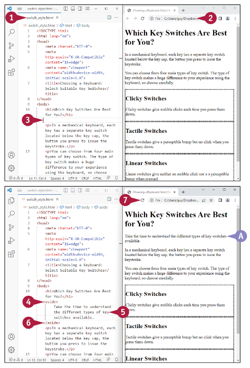

## Ismerje meg a weboldalak strukturálásának elemeit
A HTML lehetővé teszi, hogy a weboldalak strukturálásához sokféle elemet használjon. Néhány elem, mint például a fejléc és a lábléc elem, szemantikusak, ami azt jelenti, hogy a nevük egyértelműen kifejezi szerepüket: A fejléc elem a weboldal vagy egy másik weboldal tetejére kerül, a lábléc elem pedig az oldal aljára kerül. Más elemek nem szemantikusak, ami azt jelenti, hogy a nevük nem fejezi ki egyértelműen a szerepüket; például a span elem egy rövid szövegrészletet, a div elem pedig egy hosszabb szövegrészletet határoz meg, anélkül, hogy kifejezné, hogy az oldalt ezek a szakaszok képviselik.

### Szemantikus és nem szemantikus elemek megragadása
A weboldalak strukturálásához szemantikus elemeket fog használni, mint például a fejléc elem, a figure elem és a section elem. A weboldalak formázásához szemantikus és nem szemantikus elemeket is fog használni, például a span elemet és a div elemet.

A 3-1. táblázat ismerteti a leghasznosabb nem szemantikus és szemantikus elemeket.

|  | 3-1. táblázat: Nem szemantikus elemek és szemantikus elemek |
| :- | :- |
| **Elem** | **Magyarázat** |
|  | **Nem szemantikus elemek** |
| *span* | Egy bekezdés vagy más rövid elem egy részét jelöli ki. |
| *div* | Egy vagy több bekezdést vagy más elemet jelöl ki. |
|  | **Szemantikus elemek** |
| *article* | Tartalmaz egy "cikket", a weboldal önálló részét. Például egy weboldal több cikk elemet tartalmazhat, amelyek mindegyike külön témát tartalmaz. |
| *aside* | Általában kis mennyiségű tartalmat tartalmaz, amely közvetve kapcsolódik a közeli tartalomhoz vagy oldalhoz. |
| *details* | Olyan extra információkat tartalmaz, amelyeket az olvasó kibontva elolvashat vagy összecsukva elrejthet. Az esetében például egy details elem egy widgetként működhet, amely megjelenítheti vagy elrejtheti a benne lévő információkat. |
| *figcaption* | Egy ábraelem feliratát tartalmazza. Ez az elem beágyazható akár az első gyermekelemként vagy az ábra elem utolsó gyermekelemeként is szerepelhet. |
| *figure* | Egy illusztrációt tartalmaz, például egy fényképet, egy diagramot vagy egy kódlistát. |
| *footer* | A weboldal vagy egy adott elem alján megjelenítendő információt tartalmaz, például szerzői jogi információk, elérhetőségi adatok vagy az oldal utolsó frissítéséne időpontja. |
| *header* | A weboldal vagy egy adott elem tetején megjelenítendő információkat	tartalmaz, például egy fejléc és bevezető vagy navigációs hivatkozások. |
| *main* | Az oldal fő tartalmát tartalmazza. Egy HTML-fájl csak egy fő elemet tartalmazhat. A fő elem tartalmazhat olyan elemeket, mint cikk, oldal, lábléc, fejléc, és nav elemeket, de nem helyezhető el egyik ilyen elemen belül sem. |
| *mark* | Megjelölt vagy kiemelt szöveget tartalmaz. A böngészők alapértelmezés szerint a mark elemet fekete színnel jelenítik meg sárga háttéren. |
| *nav* | Navigációs linkeket tartalmaz. A linkek célpontjai lehetnek akár az oldalon belül, akár azon kívül. |
| *section* | Egy weboldal egy szakaszát tartalmazza. Például, ha egy oldal több témát tárgyal a h2 szinten, akkor minden egyes témához létrehozhat egy-egy szakaszelemet. |
| *summary* | Tartalmaz egy látható címet a részletek elemen belül. A néző rákattinthat a címsorra a részletek megjelenítéséhez. |
| *time* | Egy időpontot vagy egy dátumot és egy időpontot tartalmaz. Az idő elem rendelkezik egy datetime attribútummal, amely gépileg olvasható időpontot szolgáltat, amelyet a keresőmotorok és a böngészők 		használhatnak. |


A fenti ábra egy szemantikus elemekkel strukturált weboldal bontását mutatja.

## Elemek kiválasztása span és div elemekkel
A HTML span és div elemei lehetővé teszik, hogy csak annyi szöveget adjon meg, amennyire szüksége van, hogy meg tudja formázni. A span elemet jellemzően a bekezdésen belüli szöveg azonosítására használja, vagy egy másik rövid elemben. Például egy span elemet használhatsz olyan szöveg azonosítására, amelyhez meghatározott betűtípus-formázást szeretne alkalmazni. Hasonlóképpen, egy div elemet használhat egy "felosztás" megadására vagy egy adott szövegrészletet, amely általában egy vagy több bekezdésből áll. Ezután alkalmazhatja a formázást, például egy keretet az egész részre.

### Elemek kiválasztása span és div elemekkel
**Szöveg kiválasztása a span elemmel**

::: note Megjegyzés: 
A szakasz végigdolgozásához a következőkre van lehetőség: kikapcsolhatja a Visual Studio Code HTML Auto Záró címkék funkciót ideiglenesen. 

Lásd az első tippet.
:::

1. A Visual Studio Code-ban nyissa meg a fájlt, amelyet
használni kíván.

2. Nyissa meg a fájlt egy böngészőablakban.

3. A Visual Studio Code-ban kattintson oda ahol el akarja kezdeni a tartományt.

4. Írja be a nyitó `<span>` taget, beleértve a stílusattribútumot és a formázást a piros színt alkalmazva a szövegre:
    ```html
    <span style="color:red">
    ```

5. Írja be a span szöveges tartalmát.

::: danger Megjegyzés:
A spanban lévő szöveg felhasználásához kattintson a szöveg végére.
:::

6. Írja be a záró `</span>` taget:
    ```html
    </span>
    ```

7. Írjon be bármilyen szöveget, amely a span element után következik - például a maradék bekezdést.

8. Kattintson a frissítésre \
    A böngésző megjeleníti a frissített weboldalt. 

    `A)` A span elem szövege piros színnel jelenik meg


### Szöveg kiválasztása a div elemmel
1. Kattintson arra a helyre, ahol a div elemet szeretné elkezdeni.

2. Írja be a nyitó `<div>` taget, beleértve a stílus attribútumot és a jobbra igazítást alkalmazó formázást is a szöveghez:
    ```html
    <div style="text-align:right">
    ```

3. Nyomja meg kétszer az "Enter" billentyűt, majd írja be a befejező
    ```html
    </div> taget:
    </div>
    ```

4. Kattintson a gombra a beszúrási pont üres sorba helyezéséhez.

5. Írjon be egy h2 elemet és egy vagy több p elemet, például:
    ```html
    <h2>Teljes méretű billentyűzetek</h2>
    <p>A teljes méretű billentyűzetek általában körülbelül 17 hüvelyk szélesek.</p>
    ```

6. Kattintson a záró `</div>` kód után, nyomja meg a, majd írjon be egy másik p elemet - például: `<p>`A teljes méretű billentyűzetek általában 104 és 108 gombot tartalmaznak.`</p>`

7. Kattintson a Frissítés gombra \
    A böngésző megjeleníti a frissített weboldalt.

    `B)` A div elemben lévő szöveg jobbra van igazítva.

    `C)` A div elem utáni szöveg balra áll vissza, az alapértelmezetthez.


::: info Tippek
**Hogyan állíthatom le a Visual Studio Code záró címkék automatikus beillesztését?**
Kapcsolja ki az Automatikus záró címkék funkciót. Nyomja meg a "Control "+ "," billentyűkombinációt Windowson vagy Linuxon, vagy nyomja meg a "" + "," Macen a Beállítások képernyő megjelenítéséhez. Kattintson a Keresés beállításai gombra, és írja be a html bezárása, majd szüntesse meg az Engedélyezés/tiltás jelölőnégyzetet HTML-címkék automatikus lezárásánál ( ).

**Hogyan formázhatom még a span elemeimet és a div elemeket?**
Ahelyett, hogy a stílusformázást soron belül alkalmazná, használhatja a külső CSS-t a span elemek és div elemek formázására, ahogyan azt a 8. fejezetben ismertetjük. Ez a szakasz az elemeket soron belül formázza, hogy a példa könnyen áttekinthető maradjon. A külső CSS használata gyorsabb, hatékonyabb, és rugalmasabb, mint a közvetlen formázás.
:::

## Fejlécelemek és láblécelemek létrehozása
A fejléc elem segítségével fejlécet hozhat létre egy weboldalhoz. A fejléc elem a nyitó `<header>` taggel kezdődik és a záró `</header>` taggel végződik; közöttük, általában egy vagy több fejlécet, valamint az oldalnak szükséges bevezető információkat helyezhet el. Lehet, hogy a fejléc elemet arra is használhatja, hogy navigációs hivatkozásokat adjon egy hosszú weboldal különböző részeihez. Hasonlóképpen létrehozhat egy láblécet a HTML-ben a lábléc elem segítségével, amely a nyitó `<footer>` taggel kezdődik és a záró `</footer>` taggel végződik.

### Fejlécelemek és láblécelemek létrehozása

1. A Visual Studio Code-ban hozzon létre és mentsen el egy új fájlt, vagy nyisson meg egy meglévő fájlt, amit szeretne használni.

2. Nyissa meg a fájlt egy böngészőablakban, hogy láthassa az elvégzett módosítások eredményét.

3. A Visual Studio Code programban kattintsa a beszúrási pontot oda, ahol el akarja kezdeni a fejlécet.

4. Írja be a nyitó `<header>` taget, beleértve a stílusattribútumot a pontozott keret alkalmazásához:
```html
<header style="border-style:dotted">
```

5. Nyomja meg kétszer, majd írja be a záró `</header>` címkét:
```html
</header>
```

6. Kattintson a gombra a beszúrási pont elhelyezéséhez az üres sorba.

7. Írjon be a fejlécben megjelenítendő tartalmat elemhez, például:
```html
<h2>Billentyűzetméretek magyarázata</h2>
<p>Tanulja meg az alapvető tudnivalókat a következőkről a számítógépek különböző méreteiről billentyűzetek különböző típusairól.</p>
```

8. Kattintson a Frissítés ( ) gombra. \
    A böngésző megjeleníti a frissített oldalt.

    `A)` A fejléc pontozott kerettel jelenik meg.


9. Kattintson arra a helyre, ahol a láblécet szeretné kezdeni.

10. Írja be a nyitó `<footer>` taget, beleértve a stílusattribútumot, hogy először rendelje a background-color tulajdonsághoz a színt, majd a border-style tulajdonságot a solid típusú szolid tulajdonsággal:
    ```html
    <footer style="background-color:aqua; border-style:solid">
    ```

::: note Megjegyzés:
A két tulajdonságot különítsük el egy pontosvesszővel.
:::

11. Írjon szöveget a lábléc elemhez, például:
    ```html
    <p>Copyright &copy; 2023 M.Jones Productions</p>
    ```

::: note Megjegyzés:
A © a HTML-kód a copyright szimbólum, &copy;. Lásd a "A HTML entitáskódok megértése" című fejezetben található további információkért.
:::

12. Írja be a záró `</footer>` taget:
    ```html
    </footer>
    ```

13. Kattintson a Frissítés ( ) gombra. \
    `A)` A böngésző megjeleníti a frissített oldalt.

    `B)` A lábléc egyszínű szegéllyel jelenik meg és vízszínű háttérrel.


::: tip Tippek
Létrehozhatok több fejléc elemet egy weboldalon?
Igen - annyi fejlécelemet hozhat létre, amennyire szüksége van. Minden egyes fejlécelemnek különállónak kell lennie:
Nem lehet egy fejlécelemet egy másik fejlécelembe fészkelni. Nem helyezhet el fejléc elemet egy lábléc elemen belül - ahogyan azt valószínűleg elvárná - vagy egy cím elemen belül. Hasonlóképpen, több lábléc elemet is létrehozhat, de nem helyezhet lábléc elemet egy láblécelembe, fejlécelembe vagy címelembe.
:::

## Cikk elemek hozzáadása az oldalhoz
Amikor egy oldal önálló tartalmi témákat tartalmaz, használhatja az elemet ezek az oldalak
bemutatására. Egy cikk bármilyen hosszúságú és bonyolultságú lehet, amennyit a téma és a
lefedettség megkíván. A példa cikkek ebben a részben nagyon rövidek a könyvoldal korlátai miatt.

### Cikk elemek hozzáadása az oldalhoz:
1. A Visual Studio Code-ban hozzon létre és mentsen el egy új fájlt, vagy nyissa meg a már meglévő fájlt, amelyet szeretne használni.

2. Nyissa meg a fájlt egy böngészőablakban, hogy láthassa a változások eredményeit.

3. A Visual Studio Code-ban kattintson oda, ahol el szeretné helyezni az első cikk elemet.

4. Írja be az `<article>` nyitó címke kódot, beleértve a style attribútumot a border-style: dotted értékkel, hogy az elem terjedelme könnyen látható legyen.
    ```html
    <article style="border-style: dotted">
    ```

5. Írja be a cikk tartalmát, például:
    ```html
    <h2>clicky Switches</h2>
    <p>clicky switches give audible clicks each time you press them down.</p>
    ```

6. Írja be a záró `</article>` címkét:
    ```html
    </article>
    ```

7. Kattintson a Frissítésre (C). \
    `A)` böngésző frissíti az oldalt, és a cikk megjelenik pontozott kerettel.


8. Nyomja meg az Enter billentyűt, majd írja be a nyitó `<article>` címkét egy másik cikkhez, ismét
kijelölve a pontozott keretet:
    ```html
    <article style="border-style: dotted">
    ```

9. Írja be a cikk tartalmát - például:
    ```html
    <h2>Tapintási kapcsolók</h2>
    <p>A tapintási kapcsolók érzékelhető dudort adnak, de nincs kattanás, amikor lenyomják őket.</p>
    ```

10. Írja be a záró `</article>` címkét:
    ```html
    </article>
    ```

11. Kattintson az Frissítésre (C). \
    A második cikk megjelenik.
12. Ismételje meg a 8-10. lépéseket egy harmadik cikk hozzáadásához - például:
    ```html
    <article style="border-style: dotted">
        <h2>Liner kapcsolók</h2>
        <p>A lineáris kapcsolók nem adnak ki hallható kattanást vagy érzékelhető dudort, amikor lenyomják.</p>
    </article>
    ```

13. Írjon megjegyzést arról, hogy szükséges egy másik cikket hozzáadni:
    ```html
    <!-- optikai kapcsolók hozzáadása -->
    ```

14. Írjon egy bekezdést - például:
    ```html
    <p>Az oldal többi része részletesen ismerteti ezeket a típusokat.</p>
    ```


15. Kattintson az Frissítésre (C). \
    `C)` A harmadik cikk megjelenik.

    `D)` A bekezdés a harmadik cikk után következik.

::: tip Tipp
**Hogyan állíthatom meg, hogy a keret érintse meg a cikk szöveteit?**

A cikk elemre padding-ot alkalmazhat, hogy némi helyet teremtsen a keret és az elem tartalma között. Ebben a szakaszban próbálja meg megváltoztatni a `<article style="border-style:dotted">`-t `<article style="border-style: dotted; padding:10px">`-ra, ami 10 pixel paddingot helyezz el felülre, alulra, balra és jobbra. Különböző paddingot is alkalmazhat az egyes oldalakon. További részletekért lásd a 9. fejezetben található "Padding és keretek megadása egy elemhez" részt.
:::

## Hozzon létre kiemelt idézeteket az aside elemmel
Az HTML szemantikus elemei közé tartozik az aside elem, amelyet arra használhat, hogy elválassza a tartalmat a körülötte lévő tartalomtól. Az aside elem hasznos lehetőség lehet a weboldal egy részének kiemelésére vagy az olvasó figyelmének felhívására az aside elem elhelyezkedésében. Az aside elemnek nincs konkrét pozíciója, de a style attribútumot használhatja az aside elem pozícionálásához és formázásához, szükség szerint, hogy illeszkedjen a weboldalához.

### Készítsen kiemelt idézeteket az aside elemmel:
1. A Visual Studio Code-ban hozzon létre és mentse el az új fájlt, vagy nyissa meg a meglévő fájlt, amelyet használni szeretne.

2. Nyissa meg a fájlt egy böngészőablakban, hogy lássa a változtatások eredményeit.

3. A Visual Studio Code-ban kattintson arra a helyre, ahol el szeretné helyezni az aside elemet.

4. Írja be az `<aside>` nyitó címkét:
    ```html
    <aside>
    ```
5. Írja be a aside elemen megjeleníteni kívánt tartalmat - például: Szánjon időt arra, hogy megismerje a különböző billentyűkapcsoló típusokat.

6. Írja be a `</aside>` záró címkét:
    ```html
    </aside>
    ```

7. Kattintson a Frissítésre (C). \
    `A)` Az aside elem megjelenik az oldalon.

    Mivel nem adott meg stílusformázást, az aside elem úgy jelenik meg, mint a többi bekezdés.



8. Kattintson az `<aside>` nyitó címke záró > jele előtt, és gépelje be a style attribútumot, megadva a width:33% és float: right értékeket, így a címke így néz ki:
    ```html
    <aside style="width:33%; float:right">
    ```

9. Kattintson a Frissítésre (C). \
    `B)` Az aside elem megjelenik az oldal harmadánál és jobbra lebeg.

10. Kattintson a float: right után, a dupla idézőjel elött, és folytassa a style attribútum formázását, hozzáadva a background-color:lightskyblue és a padding:10px értékeket. A teljes címke így néz ki:
    ```html
    <aside style="width:33%; float: right; background-color: lightskyblue; padding:10px">
    ```

11. Kattintson a Frissítésre (C). \
    `C)` Az aside elem egy világoskék háttért kap és minden oldalon 10 pixel paddinget.


::: tip TIPP
**Milyen egyéb felhasználási módjai vannak az *aside* elemnek?**
Az aside elemet a kiemelt idézetek létrehozásán kívül, ahogyan ebben a szakaszban is láthatjuk,
széles körben alkalmazzák oldalsávok létrehozásához, navigációs elemek implementálásához és
reklámozáshoz.
:::

## Oldal felosztása az Elemek szakasz használatával
A HTML-ben a section elem használatával oszthatod fel a weboldalad több részre. Mivel a section egy szemantikus elem, a részekre való felosztásnak logikusnak kell lennie, de praktikus célokra is használható Például alkalmazhat formázást egy szakaszelem összes gyermekelemére egyidejűleg, ha megadja a szakaszelem formázását.

1. A Visual Studio Code-ban hozzon létre és mentsen el egy új fájlt, vagy nyissa meg a meglévő fájlt, amit használni szeretne.

2. Nyissa meg a fájlt egy böngészőablakban, hogy láthassa a változtatások eredményét.

3. A Visual Studio Code-ban kattintson arra a helyre, ahol el szeretné kezdeni az első section elemet.

4. Nyisd meg a kezdő `<section>` tag-et: `<section>`
5. Írd be az első szakasz tartalmát. A példa tartalmaz egy h2 elemet és egy p elemet:
    ```html
    <h2>Introduction</h2>
    <p>The Anne Pro 2 from Obinslab is a 60%-size mechanical keyboard with built-in wireless connectivity.</p>
    ```

6. Írd be a záró `</section>` tag-et: `</section>`

7. Kattints a frissítés gombra. \
    `A)` A section elem tartalma megjelenik a weboldalon. 

    Nincs látható jele hogy a section elem létezik.


8. Kattints a Visual Studio Code ablakra és írd be a nyitó `<section>` elemet, ezúttal tartalmazza a style attribútumot és megadja a borderstyle:dahed:
    ```html
    <section style="border-style:dashed">
    ```

9. Írd be a második rész tartalmát. A példa egy h2 elemet valamint egy p elemet is tartalmaz:
    ```html
    <h2>Review Considerations</h2>
    <p>This review is intended for general users, not for gamers specifically.</p>˛
    ```

10. Írja be a záró `</section>` tag-et: `</section>`

11. Kattints a frissítés gombra. \
    `B)` A szakasz tartalma szaggatott vonallal jelenik meg.

12. Kattintson a záró `</section>` címke elé, és írja be a `<section>` alszakasz nyitócímkéjét, beleértve a style attribútumot és a backgroundcolor:lightyellow megadását:
    ```html
    <section style="background color: lightyellow">
    ```

13. Irj le egy h3 és egy p elemet. Például:
    ```html
    <h3>Switch Type/h3>
    <p>The review keyboard uses blue (clicky) key switches.</p>
    ```


14. Írja be az `</section>` alszakasz záró címkéjét:
    ```html
    </section>
    ```

15. Kattints a frissítés gombra. \
    `C)` Az alszakasz megjelenik az oldalon.

::: tip Tipp
**Mi a különbség a *section* elem és a *div* elem között?**
Mind a section elem, mind a div elem lehetővé teszi a gyermekelemek csoportosítását és
opcionálisan formázás alkalmazását egyszerre; Gyakran látni fogja, hogy a Section és a Div többékevésbé felcserélhető. A szakasz azonban szemantikai elem, amelynek célja azt sugallni, hogy minden
tartalma ugyanarra a témára vonatkozik, míg a div egy nem szemantikai elem, amely nem hordoz
ilyen következményt.

A legjobb gyakorlat a szemantikai elemek, például a section elem és a article elem használata a
weboldal bizonyos szakaszainak logikus azonosításához, és a div elem használata csak akkor, ha nincs
megfelelő szemantikai elem
:::

## Összecsukható szakaszok létrehozása
A details elem lehetővé teszi olyan tartalomszakaszok létrehozását, amelyeket a felhasználó szükség szerint kibonthat és összecsukhat. Létrehozhat például egy Gyakran ismételt kérdések lapot a webhelyéhez, amely először olyan kérdések listájaként jelenik meg, amelyek válaszai nem láthatók. Egy kérdésre kattintva a felhasználó kibonthatja a tartalom szakaszt a válasz megjelenítéséhez; A válasz elolvasása után a felhasználó ismét rákattinthat a kérdésre, hogy még egyszer elrejtse a választ. A hatás létrehozásához használja a details elemet a kibontáshoz és az összecsukáshoz, az összefoglaló elemet pedig az eredetileg látható szöveg megjelenítéséhez.

1. A Visual Studio Code-ban hozz létre és ments el egy új fájlt, vagy nyisd meg a használni kívánt
meglévő fájlt.

2. Nyisd meg a fájlt egy böngészőablakban, hogy lásd az elvégzett módosítások eredményét.

3. A Visual Studio Code-ban kattintással helyezze a beszúrási pontot oda, ahol az első details elemet kezdeni szeretné.

4. Írja be a <`details>` nyitócímkét, nyomja le kétszer az (enter) billentyűt, majd írja be a záró `</details>` címkét:
    ```html
    <details>
    </details>
    ```

5. Kattintson a `<details>` címke és a `</details>` címke közé, és írja be a `<summary>` nyitócímkét, annak tartalmát és a záró `</summary>` címkét – például:
    ```html
    <summary>What is a mechanical keyboard?</summary>
    ```

6. Írja be azt a tartalmat, amelyet a details elem kattintásra megjelenít, például:
    ```html
    <p>A mechanical keyboard is a keyboard that uses key switches rather than a membrane to register keystrokes.</p>
    ```

7. Kattints a frissítés gombra. \
    `A)` A details elem megjelenik, de összecsukva, így csak az összefoglaló elem látható.
    
8. Kattints a bővítés gombra. (a → átvált ↓-ra) \
    `B)` A details elem kinyílik, láthatóvá válik a tartalma.

    `C)` Kattints a bezárás gombra (a ↓ átvált →-ra) ha el szeretnéd tüntetni a details elemet.


9. Kattins a details elem után a Visual Studio Code-ban, majd írj egy új details elemet, amely tartalmazza a summary elemet. Például:
    ```html
    <details>
        <summary>What advantagesdo mechanical keyboards offer?</summary>
        <p>Mechanical keyboards feel better to type on and enable some people to type faster.</p>
    </details>
    ```

10. Kattintson a `</details>` második details elem záró címkéje elé (nem látható).

11. Írj egy beágyazott details elemet. Add meg style attribútomként a margin-left:20px értéket, mint ebben a példában:.
    ```html
    <details style="margin-left:20px">
        <summary>Keyboard Feedback</summary>
        <p>Keyboard feedback can contribute to both typing enjoyment and speed.</p>
    </details>
    ```


12. Kattints a frissítés gombra. \
    Megjelenik a frissített lap.

    `D)` A külső details elemet és a beágyazott details elemet is kibonthatja.

::: tip Tipp
**Muszáj alkalmaznom a *summary* elemet minden egyes *details* elemben?**

Általában hasznos a summary elem beillesztése, mert lehetővé teszi a megfelelő szöveg
megjelenítését a Részletek elem kiterjesztése nyilához () a details elem mellett. Azonban elhagyhatja
a summary elemet anélkül, hogy hibát okozna. Ha így tesz, az HTML a Részletek alapértelmezett
szövegét jeleníti meg a Kiterjesztés nyilához ().
:::