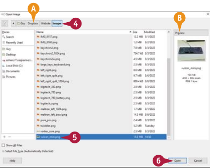
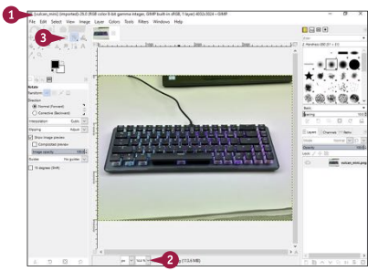

## Ragadd meg az alapokat webes képformátumok terén.
Számítógépek számos különböző képformátumot használnak, a legtöbb digitális kamera által rögzített JPEG formátumtól a fotográfusok által preferált RAW formátumig, az animált GIF formátumtól a vállalati TIFF formátumig. A legtöbb webböngésző lenyűgöző skálájú képformátumot tud megjeleníteni, azonban annak érdekében, hogy weboldalad általánosan elérhető legyen és gyorsan betöltődjön, megfelelő formátumokat kell választanod a weboldalaidban szereplő képekhez. Ez a szakasz áttekintést nyújt a kulcsfontosságú képformátumokról. A következő szakaszok részletesen bemutatják, hogyan használhatod a GIMP alkalmazást megfelelő képfájlok létrehozásához.

### Annak megértése hogy, miért fontos a képfájl mérete
Ha weboldalakat készítesz, amelyeket az interneten közzéteszel, valószínűleg a fájlméreteket ésszerű minimumon akarod tartani, hogy a weboldalaid gyorsan betöltsék, még akkor is, ha a webhelyet hostoló szerver forgalmas, és a látogatók lassabb internetkapcsolatot használnak. Ha belső webhelyhez készítesz oldalakat, amelyeket az összes látogató gyors kapcsolatokon keresztül érhet el, a fájlméret kevésbé aggasztó lehet, de még így is a legtöbb vállalat és szervezet inkább megőrzi a sávszélességet, mintsem pazarolja azt.

Az HTML fájlok és a CSS fájlok csak szöveget tartalmaznak, így kis fájlméretekkel és gyors átvitellel rendelkeznek. A képfájlok, hangfájlok és videofájlok általában sokkal nagyobbak, és jelentősen növelhetik az adatmennyiséget, amit egy böngészőnek át kell küldenie a weboldal betöltéséhez. Tehát általában kompakt fájlformátumokat szeretnél választani ilyen médiafájlokhoz. Emellett olyan fájlokat is szeretnél létrehozni, amelyek megfelelő minőségűek a webhely számára, és nem a legmagasabb minőségű fájlokat szeretnéd közzétenni, amelyek nagyobb fájlmérettel rendelkeznének.

### Azok a tényezők, amelyek befolyásolják a képfájl méretét:
- **Felbontás.** Minél nagyobb egy kép méretei, annál több pixel található az képen, és annál nagyobb a fájlméret. Például egy 512 pixel széles és 384 pixel magas kép 196 608 pixelt tartalmaz; egy 1024 pixel széles és 768 pixel magas kép pedig 786 432 pixelt tartalmaz - négyzetes mértékegységben négyzetesen többet - mert kétszer olyan széles és kétszer olyan magas. Minden pixel adatot tartalmaz, ami hozzájárul a fájlmérethez.

- **Fájlformátum.** Különböző fájlformátumok különböző tömörítési algoritmusokat használnak,amelyek befolyásolják a fájlméretet. A kulcskülönbség a veszteséges tömörítés és a veszteségmentes tömörítés között van, amelyek a fájlméretet befolyásolják. A JPEG fájlformátum veszteséges tömörítést használ, ami csökkenti a fájlméretet, de csökkenti a képminőséget is, míg a PNG fájlformátum veszteségmentes tömörítést használ. Ennek eredményeként a JPEG fájlok általában kisebbek, mint a PNG fájlok, de alacsonyabb képminőséggel rendelkeznek.

- **Színmélység.** Minden színnek adatot kell igényelnie a fájlban történő reprezentáláshoz, tehát minél több színe van egy képnek, annál nagyobb lesz a fájlmérete.

- **Tömörítési szint.** Néhány fájlformátum, például a JPEG, lehetővé teszi a használt tömörítés szintjének beállítását. A nagyobb tömörítés kisebb fájlméreteket eredményez, de általában csökkenti a képminőséget is.

- **Képtartalom.** Minél bonyolultabb a kép tartalma, annál több adatra van szükség a fájlban történő reprezentáláshoz. Például egy színes tájkép fényképe sok színt tartalmaz és sok adatra van szükség, míg egy egyszerű vonalrajz - mondjuk, egy piros nyíl fekete háttérrel - viszonylag kevés adatra van szükség.

- **Kép metaadatok.** A metaadatok olyan adatok, amelyek leírják a képet, például annak GPS helyzetét,  a kamera záridőjét és rekeszértékét, valamint a színek számát. A metaadatok általában csak egy szerény mennyiségű helyet foglalnak el.

### A legelterjedtebben használt webes képformátumok megértése
A weben található legtöbb kép az alábbi négy formátumból egyiket használja:
• **JPEG.** A JPEG, a Joint Photographic Experts Group, veszteséges tömörítést használ, és jelentős mértékű fájlméretcsökkentést tud elérni. Szabályozhatod a tömörítés szintjét. A JPEG jó választás fényképekhez weboldalakon.

• **PNG.** A PNG, a Portable Network Graphics, veszteségmentes tömörítést használ a teljes minőségű képek eléréséhez, egy szerény mértékű fájlméretcsökkentéssel. A PNG fájlok elfogadható választás fényképekhez weboldalakon, de általában lényegesen nagyobbak, mint a JPEG fájlok ugyanazzal a tartalommal.

• **GIF.** A GIF, a Graphics Interchange Format, egy régebbi fájlformátum, amely legfeljebb 256 különböző színt használ. Ez a korlátozás csökkenti a fájlméretet, és a GIF veszteségmentes tömörítést alkalmaz annak további csökkentése érdekében. A színek korlátozása miatt a GIF alkalmatlan a fényképekhez, de alkalmas logókhoz és más grafikákhoz, amelyek csak egy korlátozott színkészletre van szükség. A GIF lehetővé teszi egyszerű mozgóképek létrehozását is.

- **SVG.** Az SVG, a Scalable Vector Graphics, az Extensible Markup Language, XML, szövegét használja két dimenziós képek leírásához. Az SVG alkalmas olyan képek létrehozásához, amelyek alakzatokat és vonalakat használnak. A legtöbb fénykép- és grafikaszerkesztő képes JPEG, PNG és GIF fájlok létrehozására, valamint különféle egyéb formátumokra. A legtöbb illusztrációs alkalmazás exportálhat rajzokat SVG fájlként.

## Indítsd el a GIMP-et és hajtsd végre az alapvető lépéseket.
A GIMP — a GNU Képmanipulációs Program — egy erőteljes eszköz a képfájlok szerkesztéséhez. Ebben a szakaszban elkezded használni a GIMP-et a program indításával és egy képfájl megnyitásával benne. Amikor a képfájl megnyitva van, szükség szerint nagyítasz vagy kicsinyítesz. Amikor befejezted a változtatásokat a képfájlon, amint azt a következő szakaszokban részletezve lesz, az Overwrite parancsot használod a változtatások visszamentéséhez az eredeti képfájlba, felülírva azt. Ezután bezárod a képfájlt — és bezárod a GIMP-et is, ha már befejezted a munkát vele. Lásd a "GIMP telepítése" című részt az 1. fejezetben a GIMP telepítésével kapcsolatos utasításokért.

### Indítsd el a GIMP-et és nyiss meg egy képfájlt.
1. Indítsd el a GIMP-et a számítógéped operációs rendszeréhez tartozó szokásos módon. \
    Például Windows esetén kattints a Start gombra a Start menü megnyitásához, majd kattints a GIMP-re.

::: note Megjegyzés:
A Mac-en kattints a **Launchpad** ikonra, hogy megjelenítse a Launchpad képernyőt, majd kattints a **GIMP**-re.
:::

Linux esetén jelenítsd meg az alkalmazások listáját, majd kattints a **GIMP**-re.

A GIMP megnyílik.
2. Kattints a Fájl menüre. \
    A Fájl menü megnyílik.

3. Kattints az "Megnyitás" lehetőségre.
::: note Megjegyzés:
Windows és Linux rendszereken a Ctrl + O billentyűkombinációval is megjelenítheted a Megnyitás párbeszédpanelt. macOS rendszeren a Command + O billentyűkombinációval teheted ugyanezt.
:::

Az Open Image panele jelenik meg.

4. Navigálj el abba a mappába, amely tartalmazza a megnyitni kívánt képfájlt. \
    `A)` A breadcrumb sáv mutatja az aktuális mappa elérési útvonalát.

5. Kattints a képfájlra. \
    `B)` Az Előnézet dobozban megjelenik a kép előnézete.
::: note Megjegyzés:
Ha az "Előnézet létrehozásához kattintson" üzenet jelenik meg az Előnézet dobozban, kattints rá a jelenlegi kép előnézetének létrehozásához.
:::

6. Kattints az "Open" gombra.
::: note Megjegyzés:
Ha megnyílik a "Click to create preview" párbeszédpanel, ami felkínálja a kép beágyazott színprofiljának átalakítását a GIMP beépített sRGB színprofiljára, kattints a "Keep" gombra.
:::

A képfájl megnyílik.
::: note Megjegyzés:
Több képfájlt is megnyithatsz egyszerre.
:::

`C)` A kép megjelenik az ablak közepén.

`D)` A Eszköztár megjelenik a bal felső sarokban.

`E)` A kép (thumbnail) formájában megjelenik a kép lapján az ablaktálcán, amely lehetővé teszi a navigálást az egyik nyitott képtől a másikig.

::: tip TIPP:
**Miért sötét a GIMP felülete a számítógépemen, ellentétben a könyvben láthatóval?**
A GIMP lehetőséget biztosít arra, hogy különböző színtémákból válassz a felhasználói felület számára. A téma megváltoztatásához kattints a Edit és Preferences menüpontra a Beállítási panel megnyitásához, majd kattints a Theme lehetőségre a bal oldalon. A Theme ablakban lépj a Kiválasztott téma mezőbe, és kattints az általad kívánt témára, majd kattints az OK gombra. Az alapértelmezett téma a Sötét; a könyv a Rendszer témát használja, amely olvashatóbb a nyomtatott oldalon, mint a Sötét téma.
:::

## Folytatva a GIMP indításához és alapvető lépések végrehajtásához szükséges lépéseket:

A GIMP lehetővé teszi, hogy közelítse vagy távolítsa el a képet, hogy lássa azt a területet, amellyel dolgozni szeretne. A GIMP két egyszerű módot kínál a nagyításra: először a Nézet menü Zoom folytatása a menüsorban; másodszor pedig a Zoom felugró menü a státuszsávban.  A Zoom felugró menü különféle előre beállított nagyítási százalékokat kínál, például 800%, 400%, 200%, 100%, 50%, 25% és 12,5%. A Zoom folytatás menü nagyobb rugalmasságot kínál, beleértve az "Illeszkedés a képablakba" parancsot és a "Nagyítás a kiválasztáshoz" parancsot, így általában hasznosabb.

### Közelítés vagy távolítás a képfájlon
`A)` Gyors nagyításhoz egy előre beállított százalékra kattinthatsz a Zoom lehetőségen, 
majd választhatsz a Zoom felugró menüből.

1. Kattints a View lehetőségre. \
    A View menü megnyílik.

2. Kattints a Zoom lehetőségre. \
    A Zoom folytatás menü megnyílik.

    `B)` Ha más százalékra szeretnél nagyítani, kattints az "Other" lehetőségre, állítsd be a nagyítási arányt, 
    például 1:6, vagy a nagyítási százalékot, például 18%, a Zoom arány párbeszédpanelen, majd kattints az OK gombra.

    `C)` Visszaállíthatod az előző nagyítási szintre a "Nagyítás visszaállítása" lehetőséggel.

3. Kattints az "Fit Image in Window" lehetőségre. \
    Az kép megjelenik a megadott nagyítási szinten.

    Az előző példát követve a teljes kép megjelenik az ablakban.

### Változások mentése egy képfájlba és annak bezárása.

::: note Megjegyzés:
A kép módosítását követően a GIMP Felülírás parancsát használva
mentheti el a módosításokat az eredeti fájlba.
Ezután bezárja a fájlt. Ez az eljárás furcsának tűnhet, de hatékony.
Az alternatíva a módosítások mentése a GIMP XCF formátumú fájlba,
majd exportáld ezt a fájlt a kívánt képformátumban.
:::

1. A képen végzett módosítások után, kattintson a Fájl gombra. \
    Megnyílik a Fájl menü.

2. Kattintson a Felülírás gombra. Ez a parancs megmutatja a fájl nevét, amelyet felülírja - például Overwrite vulcan_mini.png. \
    A GIMP exportálja a fájlt, beleértve a módosításokat is, felülírja a meglévő fájlt.

    `D)` Az állapotsor leolvasása azt mutatja, hogy a fájl exportálása megtörtént.

3. Kattintson a Bezárás (X) gombra. \
    A képfájl bezáródik.

4. Ha készen áll a GIMP bezárására, kattintson a Bezárás (X). \
    A GIMP bezáródik.

::: tip TIPS
<!-- | **Tudok nagyítani és kicsinyíteni a billentyűparancsok segítségével?** | **Mi az XCF?** |
| :- | :- |
| Igen. Nyomja meg a - gombot a kicsinyítéshez vagy a + nagyításhoz. Nyomja meg a Control+Shift+J a Fit Image in Window parancshoz. Nyomja meg az 5 gombot a nagyításhoz 1600%-ra,4 800%-ra,3 400%-ra,2 200%-ra vagy 1 100%-ra. A Shift hozzáadása a tört értékekhez tartozó billentyűkombinációkhoz: Nyomja meg a Shift+2 billentyűt a 50%-hoz, Shift+3 a 25%-hoz, Shift+4 a 12,5%-hoz, vagy Shift+5 a 6,25%-hoz. | Az XCF a GIMP natív képe formátuma, amelyben a GIMP alapértelmezeten tárolja a képadatokat. A rövidítés jelentése eXperimental Computing Facility. | -->

**Tudok nagyítani és kicsinyíteni a billentyűparancsok segítségével?**

Igen. Nyomja meg a - gombot a kicsinyítéshez vagy a + nagyításhoz.
Nyomja meg a Control+Shift+J a Fit Image in Window parancshoz.
Nyomja meg az 5 gombot a nagyításhoz 1600%-ra,4 800%-ra,3 400%-ra,2 200%-ra vagy 1 100%-ra.
A Shift hozzáadása a tört értékekhez tartozó billentyűkombinációkhoz:
Nyomja meg a Shift+2 billentyűt a 50%-hoz, Shift+3 a 25%-hoz,
Shift+4 a 12,5%-hoz, vagy Shift+5 a 6,25%-hoz.

**Mi az XCF?**

Az XCF a GIMP natív képe formátuma,
amelyben a GIMP alapértelmezeten tárolja a képadatokat.
A rövidítés jelentése eXperimental Computing Facility.
:::

## Kép elforgatása vagy kiegyenesítése
A GIMP lehetővé teszi, hogy egy képet az óramutató járásával megegyező irányban 90°-kal, 90°-kal az óramutató járásával ellentétesen vagy 180°-kal elforgasson. Ezek a gyors elforgatások kiválóan alkalmasak a fejjel lefelé fordított vagy rossz tájolású fényképezőgéppel készített fényképek rögzítésére. A GIMP rendelkezik a Tetszőleges forgatás paranccsal is, amellyel elforgathat egy képet pontosan a kívánt szögben. A Tetszőleges elforgatás különösen hasznos egy kép kiegyenesítéséhez ferdén felvett képet.

A GIMP lehetővé teszi azt is, hogy egy képet vízszintesen vagy függőlegesen megfordítson. Egy kép vízszintes megfordítása a képet jobbra és balra, míg a kép függőleges megfordítása a kép tetejét és alját kapcsolja át.

1. Nyissa meg a kívánt képfájlt elforgatni vagy kiegyenesíteni.

2. Ha szükséges, nagyítsa ki vagy kicsinyítse a képet.

::: note Megjegyzés:
Ha a képet egyenesre kell igazítania de nem elforgatni, lépjen a 6. lépésre.
:::

3. Kattintson a Kép gombra. Megnyílik a Kép menü.

4. Kattintson a Transform (Átalakítás) gombra. \
    Megnyílik a Transform folytatás menü.

    `A)` A Vízszintesen megfordítva gombra kattintva megfordíthatja a képet.
    a kép vízszintes irányba történő átfordításához.

    `B)` Kattintson a Függőlegesen átfordítás gombra a kép
    függőleges átfordításához.

5. Kattintson a megfelelő Forgatás parancsra. Ebben a példában a 180°-os elforgatás parancsra kattint. \
    `C)` A kép a megadott módon elfordul.

6. Ha a képet egyenesbe kell hoznia, kattintson a Kép gombra.Megnyílik a Kép menü.

7. Kattintson a Transform (Átalakítás) gombra. \
    Megnyílik a Transform folytatás menü.

8. Kattintson a Tetszőleges elforgatás gombra. \
    Megnyílik az Elforgatás párbeszédpanel.

    `D)` A célkereszt jelzi a középpontot. a forgatás középpontját. Lásd a tippet.

9. Húzza a csúszkát a szög beállításához.

    `E)` Ha ismeri a pontos szöget forgatáshoz szükséges pontos értéket, megadhatja azt a Szög mezőbe.

    `F)` A kép elfordul, így lehetővé válik az elforgatás hatásának előnézetét mielőtt alkalmazza azt.

10. Kattintson a Forgatás gombra. \
    Az Elforgatás párbeszédpanel bezárul.

    `G)` A kép úgy forog el, ahogyan ahogyan megadtad.

    Most már tovább módosíthatja a képet, szükség szerint; mentse el; és zárja be.

::: tip TIP
**Hogyan használhatom az Elforgatás párbeszédpanelen az X-középpont mezőt és az Y-középpont mezőt?**

Alapértelmezetten a GIMP a képet a középpontja körül forgatja el, ami jellemzően a kívánt érték. Ha a képet egy másik pont körül szeretné elforgatni, jelölje meg a pontot a célkereszt vagy a Center X és Center Y mezőben lévő értékek kézi beállításával. A Center X érték vezérli a vízszintes pozíciót, a Center Y érték pedig a függőleges pozíciót szabályozza. A Reset gombra kattintva visszaállíthatja a forgatás és a szálkereszt pozíciójának visszaállítását. Kattintson a Rotate gombra, amikor készen áll az elforgatás végrehajtására.
:::

## Kép kivágása
Hacsak nem hihetetlen pontossággal komponálja meg fotóit, valószínűleg le kell vágnia őket hogy pontosan azt mutatják, amit akarsz, idegen tartalom nélkül. A GIMP lehetővé teszi a vágást képeket könnyedén. Sok kép esetén szabadon kell vágnia a kívánt pontos méretre. Mások esetében érdemes lehet egy adott képarányra levágni, például 3:2-re – minden két egységnyi magassághoz három egység széles.

1. Nyissa meg a kívánt képfájlt amit akkar vágni.

2. Ha szükséges, nagyítsa ki vagy kicsinyítse a képet, hogy láthassa többet láthat, mint az a terület, amelyre szeretne levágni a képet. \
    Használhatja a Zoom felugró menü vagy a Nagyítás folytatás menüt a Nézet menüből.

3. Kattintson a Crop Tool ( ) eszközre. \
    A Crop Tool eszköz aktívvá válik.

    Megjelenik a vágási mutató ( ).

4. Húzza átlósan a kijelöléshez a területet, amelyet meg szeretne tartani.

::: note Megjegyzés: 
Átlósan húzva bármelyik irányba.
:::

Egy keret jelenik meg a terület körül amelyet kiválasztott.

5. Ha szükséges, húzzon egy sarkot vagy oldalt a keretet vagy terület beállításához.

::: note Megjegyzés:
A kijelölési területet mozgathatja a belsejébe kattintva és annak húzássával.
:::

6. Ha kijelölte a területet a kívánt területet, kattintson duplán a keretre a vágás végrehajtásához.

::: note Megjegyzés:
Nyomja meg az Enter-t a vágás végrehajtását.
:::

`A)` Megjelenik a levágott kép.
Most módosíthatja a képet tovább, ha szükséges; mentse el; és
bezárhatja.

::: tip TIPP
**Hogyan vághatok egy képet egy adott képarányra?**

Kattintson a Crop Tool gombra a Crop Tool eszköz aktiválásához. A GIMP ablak bal oldalán lévő Crop ablaktáblában alul az Eszköztár mellett, jelölje be az első, névtelen legördülő listától balra lévő jelölőnégyzetet. Kattintson a lista legördülő gombra, majd kattintson az Aspect ratio gombra. A legördülő lista alatti szövegdobozban válassza ki a meglévő képarányt, és írja be fölé a kívánt képarányt, például 3:2-t. A GIMP ezután a következőképpen korlátozza a vágási területet Kép kivágása
:::

## Kép átméretezése
Gimp lehetővé teszi, hogy átméretezz egy képet a számodra megfelelő méretre, legyen szó a kép szélességének és magasságának növeléséről vagy csökkentéséről. A felbontásból adódóan amivel a jelenlegi digitális kamerák és okostelefonok a fotókat készítik valószínűbb, hogy csökkentened kell a kép méretét amikor azzal dolgozol, de előfordulhat, hogy nagyítanod kell a kisebb grafikákon.

Egy kép átméretezése közben kiválaszthatod, hogy milyen interpolációt használj. Interpolációs vezérlők szabályozzák, hogy az alkalmazás hogyan számolja ki a színértékeket azokban a pixelekben, amelyeket egy kép átméretezésekor helyez be. Szükség esetén a kép felbontását is állíthatja.

1. Nyisd meg a képet, amelyet szeretnél átméretezni.
::: note Jegyzet:
Általában az átméretezés előtt elfordítja, kiegyenesíti és levágja a képet szükség szerint.
:::
`A)` A kép felbontása a címsorban jelenik meg.
2. Kattints a képre. \
    A kép menü megjelenik.

3. Kattints a Kép méretezése lehetőségre. \
    A Kép méretezése ablak megnyílik.

4. Ha szeretnéd a magasságot és a szélességet külön állítani, kattints a kapcsolva-ra.

5. Ellenőrizd, hogy a px van kiválasztva a legördülő listában. Ha nem, akkor kattints a nyílra és válaszd ki a pixelt.

6. Kattints a szélességre és írd be a szélességet pixelben.

7. Ha külön válaszottad a szélességet és magasságot, kattints a Magasságra és írd be a magasságot pixelben.

8. Ha beállítod a felbontást, és külön szeretnéd beállítani a vízszintes és függőleges felbontást, kattints a „Kapcsolva” lehetőségre.

9. Erősítsd meg, hogy a pixel/mm jelenik meg a legördülő listában. Ha nem kattints a nyílra és válaszd ki a pixel/mm-et.

10. Kattints az X felbontásra és írd be a vízszintes felbontást.

11. Ha külön válaszottad a felbontást, kattints az Y felbontásra és írd be a függőleges felbontást.

12. Kattints az Interpolációra, és aztán kattints a majd kattints arra az interpolációs típusra, amelyet használni szeretnél: Nincs, Kocka, Lineáris, NoHalo vagy LoHalo. Lásd a tippet tanácsért.

13. Kattints a méretezésre. \
    `A)` Kép méretezés ablak bezáródik.

    `B)` A GIMP átméretezi a képet a megadott paraméterekkel.

    `C)` A kép igazított felbontása megjelenik a címsorban.
    
    Innentől szerkesztheted a képet tovább, ha kell; mentsd el; és zárd be.

::: tip Tipp
**Milyen fajta interpolációt használj egy kép újra méretezésénél?**

Amikor csökkented a kép méretét, válaszd a LoHalo lehetőséget az Interpoláció legördülő listájában; ha a LoHalo nem a várt eredményt hozza az adott kép esetében, próbáld ki helyette a NoHalo-t. Ha pedig növeled a kép méretét, válaszd a Kockás vagy Lineáris lehetőséget. A kockás interpoláció több feldolgozási teljesítményt igényel, mint a lineáris interpoláció, így tovább tarthat.
:::

## Színek számának csökkentése
Minél több szín található egy képen, annál nagyobb lesz a fájlmérete, ezért érdemes lehet csökkenteni a képek színeinek számát annak érdekében, hogy csökkentsük a fájlméretet. A GIMP Indexelt Színek Átalakítás funkció lehetővé teszi a színek számának csökkentését vagy egy megadott maximális számra, például 256 színre, vagy egy olyan palettára, amelyet optimalizáltak a weben való használatra. Általában a weben optimalizált paletta a legjobb választás a weboldalakban használt képekhez.

1. Nyisd meg azt a képfájlt, amelyben csökkenteni szeretnéd a színek számát.

2. Kattints az Image (Kép) opcióra. \
    Megnyílik az Image (Kép) menü.

3. Kattints a Mode (Mód) opcióra. \
    Megjelenik a Mód folytatása menü.

    `A)` A pont (•) jelzi az aktuális színmódot — ebben az esetben az RGB-t.

    `B)` Kattinthatsz a Grayscale (Árnyalatos) opcióra, ha a kép színeit árnyalatos tónusokká szeretnéd konvertálni.

4. Kattints az Indexed (Indexelt) opcióra. \
    Az Indexelt Színkonvertálás párbeszédpanel megnyílik.

    `C)` Ha egy meghatározott számú színre szeretnéd csökkenteni a képet, kattints a megfelelő paletta generálása (változik) opcióra. Ezután kattints a maximális szín száma lehetőségre, és add meg a számot.

5. Kattints a web-optimalizált paletta használata (változik) opcióra.

6. Válaszd ki a fel nem használt és duplikált színek eltávolítása a colormapból opciót.

7. Kattints a színátmenetes színezés ( ) opcióra, majd kattints a nincs opcióra.

::: note Megjegyzés:
Az árnyékolás egy olyan technika, amelyet arra használnak, hogy korlátozott színpalettával szimuláljanak egy szélesebb színtartományt. Az árnyékolás kis pöttyöket helyez el különböző színekkel egymás közelében, hogy új színek illúzióját keltsék.
:::

8. Kattints a konvertálás opcióra. \
    Az Indexelt Színkonvertálás párbeszédpanel bezárul.

    A GIMP végrehajtja a színkonverziót.

    Most tovább módosíthatod a képet, amennyiben szükséges, mentheted, majd bezárhatod.

::: tip Tipp:
**Mi az RGB?**

Az RGB az angol „Red, Green, Blue” rövidítése, egy színmodell, amelyet színek reprezentálására használnak számítógépes képernyőkön és más digitális kijelzőkön. Az RGB színeket a vörös, zöld és kék fény változó intenzitásainak kombinálásával hozza létre. Az alkalmazott elsődleges színek mennyisége határozza meg az eredményes színt. Például, az egyenlő mennyiségű vörös, zöld és kék fény fehéret hoz létre, míg egyáltalán nincs fény feketét eredményez. Az RGB-ben az eredményes szín világosabb lesz, ahogy több szín kerül hozzáadásra. Minden színcsatorna az RGB-ben egy értéket képvisel a 0–255 tartományban, ahol a 0 a szín hiányát jelenti, míg a 255 a maximális intenzitást. A fekete az RGB(0,0,0); a fehér pedig az RGB(255,255,255) színkódú.
:::