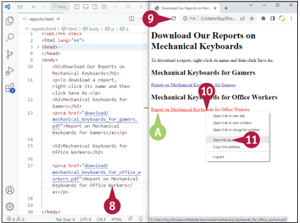
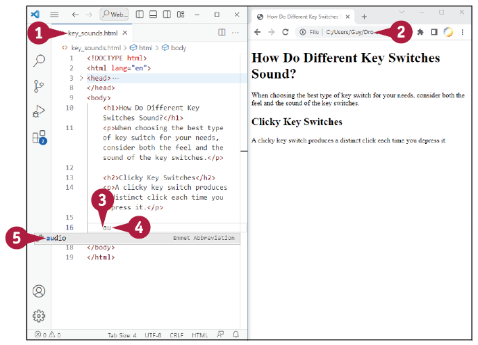
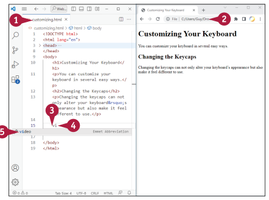

## Grasp the Essentials of Links
Linkek a Web egyik meghatározó jellemzői. Egy link, vagy formálisan egy hiperlink, egy olyan elem, amelyre kattinthat, hogy azonnal eljusson egy másik weboldalra vagy egy másik webhelyre, vagy hogy végrehajtson egy műveletet, például elindítson egy e-mail üzenetet. Sok link aláhúzott szövegként jelenik meg, de létrehozhat linket képekként vagy más grafikai objektumokként is.

Ebben a részben megtudhatja, hogy milyen különböző típusú linkek léteznek, és felismerheti azok összetevőit. Emellett megtanulja, hogyan különböznek az abszolút linkek a relatív linkektől, és felfedezi, melyik típust kell használni a weboldalain.

### A különböző típusú linkek megértése
Az HTML különböző típusú linkeket támogat, lehetővé téve, hogy különböző módon használja a linkeket weboldalain. 

A legegyszerűbb típusú link a szövegalapú link. Alapértelmezés szerint a szövegalapú linkek kék betűtípussal jelennek meg aláhúzással (A), de más formázást is választhatsz. Amikor egy szöveghivatkozásra kattintasz, alapértelmezett formázása skarlát betűtípusra és aláhúzásra változik, lehetővé téve számodra, hogy lássad, mely hivatkozásokra kattintottál már korábban.

Az ábrázolás elemként képet használ a hivatkozás megjelenítéséhez. Egyéb objektum-hivatkozások más objektumokat használnak fel - például alakzatot - a megjelenítési komponensként.

Amikor a mutatót egy link fölé mozgatod, az a szokásos nyílmutatóról a linkmutatóra (B) változik, egy felfelé mutató jobb kézzel, kinyújtott mutatóujjal, amely tőled távolabb van. Ez a mutatóváltás lehetővé teszi, hogy könnyen felismerje a linkeket bármilyen formában is jelennek meg.


### Azonosítsa a hivatkozás összetevőit
A szöveghivatkozásnak az alábbi összetevői vannak, ahogyan azt a közeli ábrázolás mutatja.
- Az anchor elem hozza létre a link-et. Az anchor elem egy nyitó `<a>` címkét és egy záró `</a>` címkét használ.

- Az `<a>` címke jelzi a anchor kezdetét. A következőkben megvitatott href attribútum a `<a>` címke belsejében jelenik meg.

- Az href attribútum tartalmazza a hiperlink referenciainformációját, azaz azt a célt, amelyre a link mutat. A href= után a hivatkozás célja dupla idézőjelek között jelenik meg.

- A link szövege a `<a>` címke és a `</a>` címke között jelenik meg.

- A `</a>` címke zárja le az anchor-t.


### Abszolút linkek és relatív linkek közötti különbségek és kiválasztásuk közötti döntés
Az HTML lehetővé teszi az abszolút linkek vagy relatív linkek használatát.

Az abszolút link magában foglalja a link céljának teljes címét, beleértve azt a prefixet, amely megmondja a böngészőnek, milyen protokollt használjon. Például az alábbi link abszolút:

```html
href="https://www.kybz.info/index.html"
```

Az URL meghatározza a használandó protokollt, HTTPS, és megadja a teljes elérési utat a weboldalt tartalmazó fájlhoz - ebben az esetben a fájl index.html.

A relatív link csak azt a címrészletet tartalmazza, amely szükséges a cél eléréséhez a linket tartalmazó oldalról. Ha a cél egy olyan weboldal, amely ugyanabban a mappában található, mint az oldal, amely tartalmazza a linket, a relatív link csak a céloldal fájlnevet tartalmazhatja - például:

```html
href="page2.html"
```

Ha a cél fájl egy másik mappában van, a relatív linknek elegendő információt kell tartalmaznia annak eléréséhez. Például az alábbi link egy olyan fájlra mutat, amely a képek mappában található ugyanazon a webhelyen:

```html
href="images/logo14.png"
```

## Hozzon létre egy linket egy weboldalra.

Általában relatív linkeket szeretnél használni saját weboldalaid között, mert a linkek továbbra is működnek, amikor áthelyezed a webhelyedet egyik helyről a másikra. Például előfordulhat, hogy a weboldaladat helyi számítógépeden fejleszted ki, majd áthelyezed a webtárhelyedre, feltöltve a mappákat, így az oldalak relatív pozíciói változatlanok maradnak.

Abszolút linkeket használj, amikor weboldalaidról külső webhelyekre mutatsz. Mivel a címek teljesek, nem érinti az, ha áthelyezed a webhelyet a helyi számítógépedről a webtárhelyedre.

Sok link más weboldalakra vezet, vagy ugyanarra a weboldalra, vagy egy másik weboldalra. Valószínűleg sok oldalt kell összekapcsolnod a weboldaladon belül, hogy a látogatók gyorsan és könnyen tudjanak navigálni az oldalak között.

Ebben a szakaszban egy hivatkozást hozol létre az egyik weboldalon található szövegből egy másik weboldalra ugyanazon a webhelyen. A példát követve az úticél weboldalnak - az oldalnak, amelyre a link mutat - már léteznie kell; szükség esetén hozd létre az oldalt a példa követése előtt.

### Hozzon létre egy linket egy weboldalra.
1. A Visual Studio Code-ban hozzon létre és mentsen el egy új fájlt, vagy nyissa meg azt a meglévő fájlt, amelyet szeretne használni.

2. Nyissa meg a fájlt egy böngészőablakban, hogy láthassa a változtatások eredményeit.

3. A Visual Studio Code-ban kattintson az érintési pontra, vagy válassza ki a meglévő szöveget, ahol be kívánja szúrni a linket.

::: note Megjegyzés:
A példa a meglévő szöveg kiválasztását és annak helyettesítését a linkkel mutatja be.
:::

4. Írja a-t. \
    `A)` szövegkibővítések listája megjelenik.

5. Kattintson az a-ra. \
    A Visual Studio Code beilleszti a `<a>` címkét, beleértve a href attribútumot, és az érintési pontot elhelyezi a két idézőjel közé:

    ```html
    <a href=""></a>
    ```


6. Írja be a céloldal nevének az első betűjét. \
    `B)` Megjelenik egy olyan oldalak listája, amelyek ezzel a betűvel kezdődnek.

7. Kattintson a céloldalra. \
    `C)` A lap neve megjelenik a hiperhivatkozás referenciájaként.

8. Nyomja le a Tab-ot (nem látható). \
    Az érintési pont átmozdul a `<a>` és `</a>` címkék közé.

9. Írja be a szöveget, amelyet a link megjelenítésére szeretne használni.

10. Kattintson a Frissítés ikonra . \
    `D)` A link megjelenik.

    A példában a link H2 formázást kapott.

    A linkre kattintva megtekintheti a kapcsolt oldalt.


::: tip TIPP
**Hogyan hozok létre egy linket egy másik weboldalra?**

Kezdd el a `<a>` címkét, ahogy azt a fő szövegben elmagyarázták, majd írd be, vagy — még jobb — illessze be az oldal teljes URL-jét, például www.stochastic.info/introduction.html. Kattintson az érintési pont áthelyezéséhez a `<a>` és `</a>` címkék közé, majd írd be a szöveget, amelyet a linknek megjeleníteni szeretnél.

**Hogyan hozok létre egy olyan linket, amely új lapon nyílik meg?**

Hozd létre a `<a>` címkét, ahogy azt a fő szövegben elmagyarázták, de add hozzá a target attribútumot a _blank értékkel — például.
```html
<a href="40board.html" target="_blank">
```
:::

## Készíts egy hivatkozást egy másik helyre ugyanazon az weboldalon.
Az HTML lehetővé teszi, hogy létrehozz egy hivatkozást egy másik helyre ugyanazon az oldalon. Ez a típusú hivatkozás különösen hasznos hosszabb weboldalak esetén vagy olyan oldalaknál, amelyek több különböző szakaszt tartalmaznak. Például hivatkozásokat helyezhetsz el egy oldal tetején olyan szakaszokhoz, amelyek továbbiak az oldalon lefelé; és ezekben a szakaszokban hivatkozásokat helyezhetsz el az oldal tetejére.

Ehhez a típusú hivatkozáshoz egy nevezett horgonyt helyezel el a megfelelő ponton az weboldalon. A horgony egy horgonytagekből, `<a></a>`, áll, amely tartalmazza a név attribútumot.

### Készíts egy hivatkozást egy másik helyre ugyanazon az weboldalon:
1. Nyiss meg a Visual Studio Code-ot, vagy hozz létre és ments el egy új fájlt, vagy nyisd meg a meglévő fájlt, amelyet használni szeretnél.

2. Nyisd meg a fájlt egy böngészőablakban, hogy láthasd a változtatások eredményeit.

3. A Visual Studio Code-ban kattints arra a helyre, ahol be szeretnéd szúrni a horgonyt az oldal tetején. 

::: note Megjegyzés:
Nyomj entert, hogy szükség esetén üres sorokat adj hozzá.
:::

4. Írd be a nyitó `<a>` taget. Tartalmazd a név attribútumot, és rendeld hozzá a "top" nevet, így: `<a name="top">`

5. Írd be a záró `</a>` taget: `</a>`

6. Görgess le az oldal aljára.


::: note Megjegyzés:
Az állóvonalat a fájl végére helyezheted, ha a Control+End -t nyomod Windows-on vagy Linux-on. Mac-en a ⌘+ gombot nyomd meg.
:::

7. Ha görgetsz, kattints arra a helyre, ahol be szeretnéd szúrni a hivatkozást az oldal tetejére való visszatéréshez (nem látható).

8. Írd be a "p" karaktert az automatikus kiegészítési lista megjelenítéséhez, majd kattints a "p"-re. \
    `A)` A nyitó `<p>` tag és a záró `</p>` tag jelenik meg.

9. Írd be az "a" karaktert. Megjelenik a kiegészítési lista.

10. Kattints az "a"-ra. \
    `B)` Megjelenik a nyitó `<a>` tag és a záró `</a>` tag, együtt az href attribútummal.

11. Írd be a "#top" linkcímet.

12. Nyomd meg a tabulátor billentyűt.(nem látható) \
    Az állóvonal az `<a>` tag utánra mozog.

13. Írd be a hivatkozás szövegét — például: Return to top of page

14. Kattints a Frissítés gombra ( ). Az weboldal frissül.

15. Görgess le az oldal aljára.

16. Kattints a hivatkozásra. Az oldal teteje jelenik meg.


::: tip TIPP
**Hogyan hozhatok létre egy hivatkozást egy adott horgonyhoz egy másik weboldalon?**

Egy másik weboldalon egy adott helyre való hivatkozáshoz a cím végére helyezd a # jel és az alapnév megnevezését.
Például, ha az switch_types.html nevű fájlban a start nevű alapnévre szeretnél hivatkozni, akkor a kapcsolódó URL-ben switch_types.html#start formátumot használnál. Abszolút URL esetén a teljes címet kell megadnod — például, [https://www.kybz.info/switch_types.html#start](https://www.kybz.info/switch_types.html#start).
:::

## Szöveges tipp megadása egy hivatkozáshoz
Amikor egy látogató az egérmutatót egy weboldalon egy hivatkozás fölé helyezi, a böngésző általában megjeleníti a hivatkozás célját valamilyen felhasználói felületi elemen — például az állapotsávban. Ez a megjelenítés gyakran segít a látogatónak, ha tudja, hogy keresnie kell, de néhány megjelenítés túl diszkrét ahhoz, hogy figyelmet vonzzon.

Ahhoz, hogy biztosítsd, hogy a látogató észrevegye a hivatkozást, további szöveget adhatsz hozzá, amely akkor jelenik meg, amikor az egérmutató a hivatkozás fölé kerül. Ehhez a hivatkozás alapjának címkejéhez hozzá kell adnod a "title" tulajdonságot, és ennek a tulajdonságnak a megjelenített szöveget kell hozzárendelned. Szöveges tipp megadása egy hivatkozáshoz:

1. Nyisd meg a Visual Studio Code-ban a meglévő fájlt, amelyet használni szeretnél.

2. Nyisd meg a fájlt egy böngészőablakban.

3. Mozgasd az egérmutatót a hivatkozás fölé. \
    `A)` A hivatkozás célja megjelenik.

4. A Visual Studio Code-ban kattints arra a helyre, ahol be szeretnéd szúrni a megjelenítendő szöveget a hivatkozáshoz.

::: note Megjegyzés:
Helyezd az állóvonalat a meglévő attribútumok közé, ne az attribútum belsejébe vagy értékébe.
:::

5. Írd be a "title" szót, egyenlőségjelet, majd a megjeleníteni kívánt szöveget, például a következő rövid példában: 
    ```html
    title="Click here to display information about different keyboard types."
    ```

6. Kattints a Frissítés gombra ( ). A böngésző frissíti a weboldalt.

7. Mozgasd az egérmutatót a hivatkozás fölé. \
    `B)` Megjelenik a képernyőtipp.


## Irányítsd át a böngészőt egy másik oldalra
Néha szükséged lehet arra, hogy átirányítsd a látogatókat egyik weboldalról a másikra. Például, ha két domain-ed van, egy elsődleges és egy másodlagos, lehet, hogy át szeretnéd irányítani a látogatókat a másodlagos domainről az elsődleges domainre.

Általában ezt az átirányítást a szerver szintjén végzed, ami hatékonyabb; konzultálj a webtárhely-szolgáltatóddal az átirányítás konfigurálásával kapcsolatban. De ha a körülmények nem teszik lehetővé az átirányítást a szerveren keresztül, akkor az átirányítást megvalósíthatod a megfelelő weboldal fejlécében lévő http-equiv meta tag használatával, amint azt itt elmagyarázták. Irányítsd át a böngészőt egy másik oldalra:

1. Nyisd meg a Visual Studio Code-ot, vagy hozz létre és ments el egy új fájlt, vagy nyisd meg a meglévő fájlt, amelyet használni szeretnél. \
    `A)` Ha létrehozol egy új fájlt, írj be minden szükséges szöveget, hogy elmagyarázd, hogy az oldal át fogja irányítani a látogatókat.

2. Nyisd meg a fájlt egy böngészőablakban.

3. A Visual Studio Code-ban kattints arra a helyre, ahol az elhelyezési pontot az `<header>` tag-ek közé szeretnéd helyezni.

4. Az alábbi kódsor egy `<meta />` tag-et tartalmaz, amelyet úgy állít be, hogy frissítse az oldalt:
    ```html
    <meta http-equiv="refresh" content="1; URL=https://www.kybz.info"/>
    ```

    Ez a kódsor egy másodperces késleltetés után átirányítja a böngészőt az oldalra.

5. Kattints a Frissítés gombra ( ). Az oldal frissül, majd automatikusan átirányítódik a megadott URL-re egy másodperc múlva.

::: note Megjegyzés:
Megváltoztathatod a content= értékét az időzítés változatossá tétele érdekében. Például, content=0 azt jelenti, hogy nincs késleltetés.
:::

## Hivatkozás létrehozása fájl letöltéséhez
Az HTML lehetővé teszi, hogy létrehozzon egy hivatkozást, amely letölt egy fájlt a weboldalról a látogató számítógépére. A letöltési hivatkozást úgy hozhatja létre, hogy egy horgony (anchor) taget helyez el a megfelelő helyre az oldalon, hozzárendeli a letöltendő fájl elérési útvonalát és nevét a href attribútumhoz, és megadja a hivatkozás szövegét.Fontold meg, hogy emlékeztesd a látogatókat arra, hogy használhatják a "Mentés másként" parancsot a fájl mentésére.

A letöltési fájlok elhelyezése egy külön könyvtárban, például egy letöltési (download) könyvtárban, könnyebbé teszi azok kezelését mint ha szétszórnád őket a weboldal HTML dokumentumaiban.

1. A Visual Studio Code-ban vagy hozz létre és ments el egy új fájlt, vagy nyiss meg egy már meglévő fájlt, amelyet használni szeretnél.

2. Nyisd meg a fájlt egy böngésző ablakban.

3. A Visual Studio Code-ban kattintson a beszúrási pont elhelyezéséhez a letöltési hivatkozás beszúrásához.

4. Írja be az a taget, majd kattintson az a tagre. \
	A Visual Studio Code beilleszti a nyitó `<a>` taget, a href attribútumot, és a záró `</a>` taget.

5. Kezdd el gépelni az útvonalat a fájlhoz, amelyet letölti a hivatkozá.


6. Ha az előugró menüben megjelenik a fájl, kattintson rá. Ha nem, fejezze be a név beírását.

7. Nyomja meg a TAB-ot (nem látható). \
A beszúrási pont a nyitó `<a>` címke > jele után mozog.

8. Írja be a hivatkozásban megjelenítendő szöveget.

9. Kattints a Frissítésre. \
	`A)` A link megjelenik.

10. Kattintson a jobb gombbal a linkre. \
    Megjelenik a helyi menü.

11. Adja ki a Mentés másként parancsot. Például a Chrome-ban kattintson a Link mentése másként lehetőségre. \
    Megnyílik a Mentés másként ablak, és megadhatja hogy hová mentse el a fájlt.




## Hozzon létre egy hivatkozást, amely e-mail üzenetet indít el
A HTML lehetővé teszi egy hivatkozás létrehozását, amely elindítja az új e-mail üzenet létrehozását a látogató alapértelmezett levelezőalkalmazásában. Ez a funkció különféle célokra hasznos, például egyszerű módja annak, hogy a látogatók e-maileket küldhessenek a vállalatának vagy szervezetének. A link nem csak az üzenet e-mail címét, hanem tárgyát is megadhatja, ami különösen hasznos lehet olyan felhasználások esetén, mint például értékesítési kérdések vagy ügyfélszolgálati problémák.

E-mail üzenetet indító hivatkozás létrehozásához meg kell adnia a mailto protokollt, és alapértelmezés szerint meg kell adnia az üzenetbe beírni kívánt információkat.Hozzon létre egy hivatkozást, amely e-mail üzenetet indít

1. Visual Studio Code-ban nyisd meg a fájlt amit használni szeretnél.

2. Nyisd meg a fájlt egy böngésző ablakban.

3. A Visual Studio Code-ban kattints arra a pontra, ahova a hivatkozásnak kerülnie kell.

4. Írd be az 'a' betűt, majd kattints az 'a' elemre. \
    A Visual Studio Code beilleszti az nyitó `<a>` taget, href attribútumot és a záró `</a>` taget.

5. A dupla idézőjelek között írd be a mailto: kifejezést, amit ez az e-mail cím követ — például: 
    ```html
    <a href="mailto:help@kybz.info">
    ```

6. Ha hozzá szeretnéél adni egy tárgysor-t, írd be a ?subject= kifejezést, amelyet a szöveg követ – például:
    ```html
    <a href="mailto:help@kybz.info?subject=Ügyfél érdeklődés">
    ```

7. Nyomd meg TAB-ot(nem látható). \
	`A)` beszúrási pont átmozdul a nyitó `<a>` tag, > jele után.

8. Írja be a hivatkozáshoz megjelenítendő szöveget.

9. Kattints a Frissités-re. \
	`A)` A link megjelenik.
    
10. Kattints a link-re. \
	Az alapértelmezett e-mail alkalmazásod megnyílik, és létrehoz egy üzenetet a linkben megadott részletekkel.


## Link létrehozása egy képből
A szöveges hivatkozások a webes hivatkozások alapvető típusai, de a HTML lehetővé teszi hivatkozások létrehozását képekből és más objektumokból is. Hozzáadhat például olyan miniatűr képekre mutató hivatkozásokat, amelyek a teljes méretű képeket vagy a kapcsolódó információkat jelenítik meg. Mivel előfordulhat, hogy egyes látogatók nem látják a képeket, általában jó ötlet alternatív linket biztosítani, például szöveges linket és képlinket.

Ebben a példában egy weblapon már egy elhelyezett képre mutató hivatkozást ad hozzá. Ha szeretné, először hozzáadhatja a hivatkozást, és majd utána beillesztheti a képet.

1. A Visual Studio Code programban nyissa meg a használni kívánt fájlt.

2. Nyissa meg a fájlt egy böngészőablakban, hogy megtekinthesse az elvégzett változtatások eredményét.

3. A Visual Studio Code-ban kattints arra, hogy beilleszted a kurzort a létező kép `` tag-je elé, amelyet linkké alakítasz át.

4. Írja be az 'a' karaktert. \
    Megjelenik a kiterjesztések listája.

5. Kattints az a-ra. \
    `A)` Megjelenik a nyitó `<a>` címke és a záró `</a>` tag a href attribútummal együtt.

6. Kezdje el gépelni az céloldal fájlnevét. \
	Az automatikus kiegészítés lista megjelenik.

::: note Megjegyzés:
Külső oldalra mutató hivatkozás esetén írja be vagy illessze be a teljes URL-t. 
:::

7. Kattintson a megfelelő oldalra. \
    `B)` Megjelenik az oldal neve.


8. Húzza végig az egérmutatót a záró `</a>` tagen annak kijelöléséhez.

9. Húzza a kijelölt taget az `` tag végéhez. \
    `C)` A tag megjelenik az új helyén, mostantól az `` tag a hyperlink(hiperhivatkozás) megjelenítési eleme.

    `D)` Opcionálisan törölje az esetleges extra szóközöket.

10. Kattints a Frissítésre. \
    A weboldal lefrissül.

11. Vidd az egérmutatót a kép fölé (nem látható). \
    `E)` Megjelenik a hivatkozásmutató.

    `F)` Megjelenik a hivatkozási cél.

    A hivatkozásra kattintva megjelenítheti a céloldalt.


::: tip Tipp
**How can I make an image link more obvious to the visitor?**

Amikor a látogató a kép fölé viszi a mutatót, a hivatkozás mutatója és a hivatkozás címe vizuális jelzéseket ad a hivatkozás jelenlétéről. A hivatkozás nyilvánvalóbbá tétele érdekében fontolja meg a title attribútum hozzáadását a hivatkozáshoz olyan szöveggel, amely akkor jelenik meg az elemleírásban, amikor a mutató a kép felett van. Egyszerűen hozzáadhat szöveget a közelben, mondván az olvasónak, hogy kattintson a képre.
:::

## Több hivatkozás létrehozása egy képről
A HTML nem csak arra ad lehetőséget, hogy egy képet használjon kattintható elemként egy hivatkozáshoz, de arra is, hogy ugyanazon kép különböző területeit használja különböző hivatkozásokhoz. Egy ilyen, több hivatkozást kezelő képet képtérképnek nevezünk. Téglalap alakú, kör alakú és sokszög alakú területeket is megadhat.

Ez a rész egy egyszerű képtérkép létrehozását mutatja be, amelynek bal és jobb fele különböző hivatkozásokat aktivál. Bármilyen képet használhat, de általában olyat választana, amelynek azonosíthatóan eltérő tartalma van az egyes területeken, amelyeket egy másik célhelyhez fog leképezni.

1. A Visual Studio Code-ban nyissa meg a használni kívánt fájlt.

2. Nyissa meg a fájlt egy böngészőablakban.

3. A Visual Studio Code-ban kattintson arra a helyre, ahová be szeretné szúrni a képet.

4. Írja be az img parancsot. \
   Megjelenik az img tagek bővítménylistája.

5. Kattints az img-re. \
   Az `` tag megjelenik az src és az alt attribútumokat tartalmazva:

   ```html
   
   ```

6. A beszúrási ponttal a src_c= utáni kettős idézőjelek között kezdje el beírni a forráspályát. \
   A kiegészítő lista megjelenik.

7. Kattintson a megfelelő bejegyzésre. \
    A képfálj neve megjelenik.


8. Kattints a idézőjelek közötti "alt=" mögötti dupla idézőjelre, és írd be a kép alternatív szövegét.

9. Add hozzá a "width" attribútumot egy megfelelő értékkel.

10. Add hozzá a "height" attribútumot egy megfelelő értékkel.

11. Írd be a "usemap" attribútumot, és rendeld hozzá a térképnek adni kívánt nevet. Például:
    ```html
    usemap="#kbmap"
    ```

12. Kattints a Frissítés (C) gombra. \
    A weboldal frissül.

13. Kattints arra a helyre, ahol el szeretnéd helyezni a térképdefiníciót, majd írd be a "map" parancsot. \
    A kiegészítések listája megjelenik.

14. Kattints a "map" parancsra. \
    Megjelenik a nyitó `<map>` címke és a záró `</map>` címke:
    ```html
    <map name =""></map>
    ```

15. Az idézőjelek között írd be a 11. lépésben használt térképnevet a # jel nélkül:
    ```html
    <map name ="kbmap"></map>
    ```

16. Nyomd le a Tab billentyűt a beszúrási pont áthelyezéséhez a `</map>` címke elé, majd nyomd le az Enter billentyűt többször, hogy üres sorokat szúrj be a `</map>` címke elé.


::: tip TIPP
**Hogyan készítsek elő egy képet képtérképként való használatra?**

Szükség esetén készítsen egy átméretezett verziót a képről, ahogyan azt a 4. fejezetben tárgyaltuk. Ezután nyissa meg ezt a verziót a grafikai alkalmazásában, és az alkalmazás kiválasztási eszközeivel határozza meg a hivatkozni kívánt területeket. Téglalap esetén négy értékre van szükség: a bal felső sarok és a jobb alsó sarok vízszintes és függőleges koordinátáira. Kör esetén három értékre van szükség: a középpont vízszintes és függőleges koordinátáira, majd a sugárra. Sokszög esetén annyi vízszintes és függőleges koordinátapárra van szükség, amennyi a forma körvonalazásához szükséges, egyenes vonalakat feltételezve a csúcsok között.
:::

## Több hivatkozás létrehozása egy képről (folytatás)
Amikor képtérképet hoz létre, az area taggel definiálhatja az egyes kattintható területeket. A terület alakjának megadásához használja az area tag shape attribútumát: a "shape=rect" téglalapot, a "shape=circle" kört, a "shape=poly" pedig sokszöget hoz létre. A terület koordinátáinak megadásához használja a coords attribútumot. Például a shape="rect" coords="257,0,512,196" egy téglalapot határoz meg, amelynek bal felső sarka 257 képponttal van a kép bal szélétől és 0 képponttal a tetejétől, a jobb alsó sarka pedig 512 képponttal a bal szélétől és 196 képponttal a tetejétől.

17. Az első üres sorba írja be az "area" szót. \
    Megjelenik a bővítések listája.

18. Kattintson az "area.r" elemre. \
    A Visual Studio Code beszúrja egy téglalap alakú terület alapcímkéjét:
    ```html
    <area shape="rect" coords="" href="" alt="">
    ```

19. A beszúrási ponttal a "coords" utáni kettős idézőjelek között írja be a téglalap képpontkoordinátáit - például:
    ```html
    coords="0,0,256,196"
    ```

20. Nyomja le a Tab billentyűt a beszúrási pont áthelyezéséhez a "href" utáni kettős idézőjelek közé, majd írja be a céloldalt gépeléssel vagy a bővítések listájának használatával.

21. Nyomja le a Tab billentyűt a beszúrási pont áthelyezéséhez az "alt" utáni kettős idézőjelek közé, majd írja be az alt szöveget.

22. Nyomja le a billentyűt a beszúrási pont áthelyezéséhez a záró kettős idézőjelek mögött, majd írja be a title attribútumot és a hozzárendelni kívánt szöveget.


23. Ismételje meg a 17-22. lépéseket a következő üres sorban a második terület létrehozásához. \
    Ezúttal adja meg a koordinátákat, a célt, az alternatív szöveget és a címet a második terület számára.

    A példa a következő kódot használja:
    ```html
    <area shape="rect" coords="257,0,512,196" href="maltron_right.html" alt="Right-handed keyboard" title="Click here to display information on the right-handed model.">
    ```

24. Kattintson a Frissítés (C) gombra. \
    A weboldal frissül.

25. Vigye az egérmutatót a kép fölé. \
    `A)` A terület ScreenTip-je megjelenik.

    `B)` A terület cél URL-je megjelenik.


::: tip TIPP
**Létrehozhatok átfedő területeket egy képtérképen?**

Nem. Ha a területek átfedik egymást, akkor csak az átfedés előtt definiált területek fognak működni.

**Le kell képeznem a kép teljes egészét?**

Nem, nem kell leképeznie a kép teljes egészét. Csak azokat a területeket kell definiálnia, amelyeket le szeretne képezni, és a kép többi részét hagyja leképezetlenül.
:::

## Hangfájl beágyazása egy weboldalra
A HTML audio eleme lehetővé teszi hangfájlok beágyazását egy weboldalra. Beállíthatja, hogy a hangfájl automatikusan lejátszódjon, bár egyes böngészők letiltják vagy némítják az automatikus lejátszást. Általában jobb, ha olyan vezérlőket jelenít meg, amelyek lehetővé teszik a látogatók számára a lejátszás vezérlését.

Háromféle hangfájlt használhat: MP3 fájlokat, WAV fájlokat és Ogg Vorbis fájlokat. A Chrome, Firefox, Edge és Opera mindhárom típust támogatja; a Safari nem támogatja az Ogg Vorbis formátumot. Az MP3 fájlok általában a legjobb választást jelentik, mivel az MP3 egy tömörített formátum, míg a WAV nem.

### Hangfájl beágyazása
1. Nyissa meg a kívánt fájlt a Visual Studio Code-ban.

2. Nyissa meg a fájlt egy böngészőablakban.

3. A Visual Studio Code-ban kattintson arra a helyre, ahová be szeretné illeszteni a hangfájlt.

4. Írja be az "au" kifejezést. \
   A kiegészítő lista megjelenik.

5. Kattintson a "Hang" lehetőségre. \
   Megjelenik a nyitó `<audio>` címke és a záró `</audio>` címke, a közöttük lévő src attribútummal.

6. A beszúrási pontnál az src utáni idézőjelek között kezdje el beírni a hangfájl elérési útját. \
    Megjelenik a kiterjesztések listája.

7. Kattintson a fájlra. \
    Megjelenik a fájl neve.

8. Nyomja le a jobbra nyilat a beszúrási pont áthelyezéséhez a záró idézőjelek után, majd írjon be egy szóközt (nincs mutatva).

9. Írja be a controls parancsot.

10. Kattintson a `</audio>` címke elé.




11. Írja be a szöveget, amelyet a böngésző megjeleníthet, ha nem tudja lejátszani a hangfájlt - például, A böngésző nem tudja lejátszani ezt a hangfájlt.

::: note Megjegyzés:
A nyitójelek közé beírt címke közötti szöveg `<audio>` címke és a záró `</audio>` csak akkor jelenik meg, ha a böngésző nem tudja lejátszani a audiofájlt.
:::

12. Kattintson a Frissítés gombra. \
    `B)` A hangvezérlő akkor jelenik meg, ha a böngésző képes lejátszani a hanganyagot.

13. Kattintson a Lejátszás gombra. \
    `A)` hang lejátszása megkezdődik.

    `C)` A hangerő beállításához kattintson a Hangerő gombra.


::: note Megjegyzés:
A hangvezérlo más a
különböző böngészőkben, de az ikonjai
általában könnyen észrevehető.
:::

::: note Megjegyzés:
A hang automatikus lejátszásához, adja hozzá az autoplay attribútumot a megnyíló audióhoz. `<audio>` címkéhez - például.:
```html
<audio src="media.tactile.mp3" autoplay controls>
```
A controls attribútum elhagyhatod ha nem kívánod megjeleníteni a vezérlőelemeket.
:::

::: tip TIPP
**Használjak automatikus lejátszást a hanghoz?**

Az igények és a körülmények eltérőek, de általában csak akkor érdemes a hang automatikus lejátszását használni, ha a látogató a következőre számít. Hogy az oldalon lejátsszák a hangot - például ha egy linket követett, hogy meghallgasson egy dalt. Ellenkező esetben a váratlanul és talán indiszkréten felcsendülőhang kevésé pozitív reakciót vált ki a látogatókból. Ne feledje azt sem, hogy egyes böngészők elnyomják az automatikus lejátszást, mert az oly gyakran nemkívánatos. Ezt figyelembe véve mindig tartalmazza a controls attribútumot a lejátszás vezérlőelemeinek megjelenítéséhez, hogy a látogató lejátszhassa a hangot, szüneteltethese, és beállíthatja a hangerőt.
:::

## Videofájl beépítése egy weboldalba
A HTML videó eleme lehetővé teszi, hogy videófájlokat illesszen be egy weboldalba. Az audióhoz hasonlóan beállíthatja a videofájlt automatikusan lejátszani, de egyes böngészők letiltják vagy elnémítják az automatikus lejátszást. Ha az automatikus lejátszás használatát egy videó esetében, érdemes lehet elnémítani a lejátszást.

Azért hogy ne zavarja a felhasználókat, amikor a weboldal betöltik és ne keljen nekik kersniük némitó gombot ha a hangerő véletlenül túl magas lenne.

1. Nyissa meg a Visual Studio Code-ban a faájlt, amelyet használni szeretne.

2. Nyissa meg a fájlt egy böngészőablakban.

3. A Visual Studio Code-ban kattintson oda ahova be szeretné illeszteni a videót.

4. Írja be a vi billentyűket. \
    Megnyílik a kiterjesztések listája.

5. Kattintson a video gombra. \
    `A)` A nyitó `<video>` tag és a záró `</video>` címke jelenik meg, az src attribútummal közöttük.

6. A beszúrási pont a src= után lévő idézőjelek között van, kezdje el begépelni a videofájl elérési útvonalát. \
    Megjelenik a kiterjesztések listája.

7. Kattintson a fájlra. \
    Megjelenik a fájl neve.

8. Nyomja meg a gombot a beszúrási pont áthelyezéséhez a záró idézőjelek mögé, és írjon be egy szóközt (nem látható).

9. Írja be a vezérlőelemeket.

10. Írjon be egy szóközt, width=, és a szélességet - például:
    ```html
    width="90%"
    ```

11. Kattintson a `</video>` tag elé.




12. Írja be a böngésző által megjelenítendő szöveget ha nem tudja a felhasznaló lejátszani a videofájlt -például: A böngésző nem tudja lejátszani ezt a videót videót.

::: note Megjegyzés:
A nyitójelek közé beírt szöveg `<video>` címke és a záró `</audio>` címke között található szöveg csak akkor jelenik meg,ha a böngésző nem tudja lejátszani a videofájlt.
:::

13. Kattintson a Frissítés gombra. \
    `B)` A videó akkor jelenik meg, ha a böngésző képes lejátszani a videofájlt.

14. Kattintson a Lejátszás gombra. \
    A hang lejátszása megkezdődik.

    `C)` A hangerő  gombra kattintva beállíthatja a hangerő beállításához.

    `D)` Kattintson a Teljes képernyő a videó teljes méretűre történő kibontásához.


::: note Megjegyzés:
A videóvezérlésnek más a megjelenése a különböző böngészőkben, de a ikonjai általában könnyen érthetőek.
:::

::: note Megjegyzés:
A videó automatikus lejátszásához, adjuk hozzá az autoplay attribútumot a nyitó `<video>` taghez - például.:
```html
<video src="intro1.mov" autoplay controls>
```

Hagyja ki a controls attribútumot, ha nem szeretné megjeleníteni a vezérlőelemeket.
:::

::: tip TIP
**Milyen filmformátumokat használhatok?**

A HTML közvetlenül támogatja az MP4 formátumot, más néven MPEG-4-et, az Ogg videóformátumot és a WebM formátumot. Az MP4 közel univerzális kompatibilitással rendelkezik, így általános használatra jó választás; ez a formátum is aa YouTube is ajánlja.
:::

## YouTube-videó beágyazása egy weboldalba
Ahelyett, hogy a saját weboldalán tárolt videofájlt helyezné el valamelyik weboldalán, a YouTube segítségével beágyazhat egy YouTube-on tárolt videofájlt a weboldalába. Egy YouTube-videó beágyazásához egy iframe elemet helyez el a weboldalon, és annak forrását a YouTube megfelelő URL-címére állítja be.

Ha a videó a sajátja, kezdje azzal, hogy feltölti azt a YouTube-fiókjába, beállítja a részleteit, és közzéteszi. Ha a videó valaki másé, jelenítse meg a YouTube-on. Bárhogy is legyen, szerezze be a videó YouTube-azonosítót, ahogyan azt a tippben elmagyaráztuk.

1. Nyissa meg a Visual Studio Code-ban a fájlt, amelyet a
használni kíván.

2. Nyissa meg a fájlt egy böngészőablakban.

3. A Visual Studio Code-ban kattintson a kívánt beszúrási pontra.

4. Kattintsa meg az i billentyűt. \
    Megjelenik a bővítmények listája.

5. Kattintson az iframe gombra. \
    A Visual Studio Code beilleszti a nyitó `<iframe>` címkét, az src attribútumot és a frameborder attribútumot, valamint a záró `</iframe>` címkét.

6. A beszúrási pont az idézőjelek között az src= után, adja meg a beágyazáshoz a YouTube URL-címet. Ez a YouTube tartományból, a beágyazási mappából és a a videó YouTube azonosítójábol áll - például:

*[www.youtube.com/embed/9CzCDziLsro](www.youtube.com/embed/9CzCDziLsro)*

7. Kattintson a Frissítés gombra. \
    A Megjelenik a beágyazott videó.


8. A beillesztési pont mozgatásához a záró dupla idézőjelek után kattintson, majd írjon be egy szóközt (nem látható).

9. Írja be a width= és a megfelelő szélességet pixelben, majd egy szóközzel a height= értéket, és egy megfelelő magasságot pixelben - például:
    ```html
    magasság="375"
    ```

10. Kattintson a Frissítés  gombra. \
    `B)` A videó az Ön által megadott méretben jelenik meg.

11. Kattintson a Lejátszás gombra (nem látható). \
    A videó lejátszik.

    `C)` A Hangerő gombra kattintva beállíthatja a hangerőt.


::: tip TIP
**Hol találom a videó YouTube azonosítóját?**

Ha épp most tette közzé a videót, nézze meg a Videó közzététele párbeszédpanel Videókapcsolat mezőjében. Ha már régebben közzétette a videót, lépjen a YouTube-fiókjanak Csatorna oldalára, mozgassa át az egeret a videó fölé, majd kattintson a Részletek gombra a Videó részletei képernyő megjelenítéséhez; ezután nézze meg a Videókapcsolat leolvasását a jobb oldalon. Ha a videó nem az Öné, nyissa meg a videot, kattintson a cím mezőre, és olvassa el az URL v= utáni részét. Például az URL-címen: *[www.youtube.com/.watch?v=9CzCDziLsro](www.youtube.com/.watch?v=9CzCDziLsro)*, a videó azonosítója *9CzCDziLsro*.
:::
