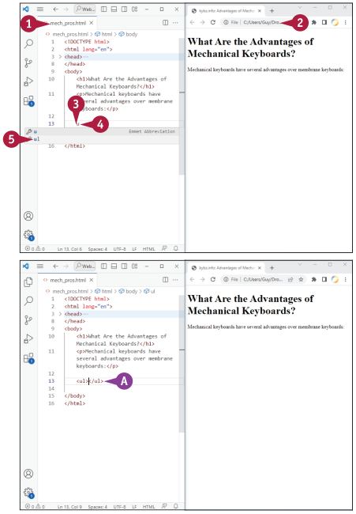

## A listák különböző típusainak megértése
Ha tételes információkat kell bemutatnia egy weboldalon, használhat egy listát. A HTML
háromféle lista létrehozatalát teszi lehetővé – számozott listákat, felsorolásos listákat és
definíciós listákat – és összetett listákat hozhat létre a listák egymásba ágyazásával. Például
létrehozhat egy felsorolásos allistát egy számozott listán belül, vagy létrehozhat egy
számozott allistát eltérő számozással egy másik számozott listán belül.

Ez a rész ismerteti a listatípusokat, és bemutatja azok különbségeit. A következő négy rész
mutatja be hogyan lehet számozott listát, felsorolásos listát, definíciós listát és beágyazott
listát létrehozni.

### Számozott listák
A HTML-ben a számozott listát rendezett listának nevezzük, mert az elemek meghatározott sorrendben jelennek meg, például egy listában számozott lépések egy feladat végrehajtásához. Számozott lista indításához be kell írnia a nyitó `<ol>` taget; a lista befejezéséhez pedig a záró `</ol>` taget:
```html
<ol>
</ol>
```
Ezek a tagek közé minden listaelemet be
kell írni, az elején a nyitó `<li>` taggel és a
záró `</li>` taggel, köztük az szöveget.
Például a következő kód a három lépéses
számozott listát készíti el ami az alábbi
ábrán látható.
```html
<ol>
    <li>Unplug your computer from power.</li>
    <li>Connect the keyboard to the USB port.</li>
    <li>Connect the computer to power again.</li>
</ol>
```


A böngésző automatikusan megjeleníti a
számokat a tételeken, 1-gyel kezdődően,
hacsak nem ad meg más számot a kezdő
attribútumnak az `<ol>` taget használva —
például `<ol start="5">`.Megadhat mást is
számozási típusnak, például a‐b‐c vagy i‐ii‐
iii, a type attribútumot használva az `<ol>`
tagbe – például: `<ol type="a">` kisbetűs a‐b‐c
számozáshoz.
### Felsorolás listák

A HTML-ben a felsorolásos listákat
rendezetlen listának nevezzük, mivel
a tételeknek nincs számsorrendje.
A felsorolásos lista indításához adja meg a
nyitó `<ul>` taget; a lista befejezéséhez írja
be a záró `</ul>` taget:
```html
<ul>
</ul>
```
Ezek a tagek közé minden listaelemet be
kell írni, az elején a nyitó `<li>` taggel és a
záró `</li>` taggel, köztük az szöveget.
Például a következő kód létrehozza a négy-
felsorolás ahogyan a alábbi ábrán látható:
```html
<ul>
    <li>Clicky</li>
    <li>Tactile</li>
    <li>Linear</li>
    <li>Optical</li>
</ul>
```


A böngésző automatikusan megjeleníti az
egyes elemek felsoroláspontját az
alapértelmezett érték használatával golyó,
tömör kör. Megadhat egy másik felsorolási
jelet is a type attribútim használatával az
`<ul>` tagben — például type="square" a
kitöltött négyzetekhez.
### Definíciós listák
A definíciós lista egy olyan lista, amely elempárokból áll, mint például egy kifejezés és
annak meghatározás egy szószedetben ill szókincs.
A definíciós lista elkezdéséhez a nyitó `<dl> `taget; a lista befejezéséhez, a záró `</dl>` taget
kell használni:
```html
<dl>
</dl>
```
E címkék közé minden egyes kifejezéspárt be kell írni – először a „definíciós kifejezést” –
a meghatározandó kifejezés – egy nyitó `<dt>` tag és egy záró `</dt>` tag között, valamint
második „definícióleírás” a nyitó `<dd>` tag és egy záró `</dd>` tag között. Például a
következő kód létrehozza az ábrán látható kéttagú listát:

A böngésző automatikusan megjeleníti az
egyes elemek felsoroláspontját az
alapértelmezett érték használatával golyó,
tömör kör. Megadhat egy másik felsorolási
jelet is a type attribútim használatával az
`<ul>` tagben — például type="square" a
kitöltött négyzetekhez.
```html
<dl>
    <dt>tenkey</dt>
    <dd>The section of a computer keyboard that contains the number keys and arrow keys</dd>
    <dt>tenkeyless</dt>
    <dd>Of a keyboard, not having a tenkey section</dd>
</dl>
```


### Beágyazott listák
Ha összetett listára van
szüksége, beágyazhatja
a három féle lista
bármelyikét egy másik
listába. Például a
következő kód létrehozza
egy számozott listát a
felsorolással rendelkező
altételekkel az alábbi
ábrán láthatóan.
```html
<ol>
    <li>Unplug your computer from power.</li>
    <li>Connect the keyboard to the USB port.
        <ul type="square">
            <li>Use a USB adapter if necessary.</li>
            <li>Use a USB port on the computer if possible.</li>
        </ul>
    </li>
    <li>Connect the computer to power again.</li>
</ol>
```


## Számozott lista készítése
A HTML lehetővé teszi számozott listák létrehozását, amelyeket a HTML rendezett listáknak
hív az ol elem használatával. A listát a nyitó <ol> taggel kezdi, és a záró </ol> taggel fejezi
be. A tagek között minden számozott elemhez létrehoz egy listaelemet, li elemet, elhelyezve
az elem szövegét egy nyitó <li> tag és egy záró </li> tag között.
A böngésző automatikusan elkezdi a számozást a lista első eleménél. A lista számozásának
kezdése manuálisan is változtatható. Különféle számozási módokat is használhat a tippben
leírtak szerint.

### Számozott lista létrehozása
1. A Visual Studio Code-ban
nyissa meg a fájlt amelyben
létre kíván hozni egy számozott
lista.

2. Nyissa meg a fájlt egy
böngészőablakon.

3. A Visual Studio Code-ban
kattintson arra a részre ahol
elszeretné kezdeni a listát.

4. Írja be az o-t. Megjelenik a
bővítmények listája.

5. Kattintson az ol-ra. \
    `A)` A Visual Studio Code
    beilleszti a nyitó `<ol>`
    taget és a záró `</ol>`
    taget, elhelyezve a beillesztést pontot közöttük.

6. Nyomja meg az enter gombot egy üres sor hozzáadásához a
kódok között
(nem látható).

7. Kattintson a beillesztési pont elhelyezéséhez az üres sorban.

8. Írja be a li-t, majd kattintson a li gombra bővítések listáján. \
    `B)` A Visual Studio Code beilleszti a nyitó `<li>` taget és a záró `</li>` taget, elhelyezve a beillesztést pont közöttük.


9. Írja be a listaelem szövegét.

10. Nyomja meg az enter gombot,
majd ismételje meg a 8. és 9 lépést
további listaelemek hozzáadásához.

11. Kattintson a Frissítés gombra.
a weboldal újra fog tölteni \
    `C)` A számozott lista megjelenik

12. Kattintson a beillesztési pont
elhelyezéséhez a záró `</ol>` tag utáni
sorra.

13. Szúrjon be egy img elemet a 4. fejezetben tanult alapján.

14. Az `` tag `>` bezárása után, ismételje meg a 4–9. lépéseket egy másik ol elem beillesztéséhez. Adja hozzá a start= attribútumot a nyitó `<ol>` tagre, és adja meg a következő listához szükséges érték tételét – például:
    ```html
    <ol start="4">
    ```

15. Kattintson a Frissítés gombra. a weboldal újra fog tölteni \
    `D)` A kép megjelenik

    `E)` Megjelenik a második számozott lista, a megadott számtól kezdve.


::: tip TIPP
Milyen számozási típusokat használhatunk egy rendezett listához?
A HTML lehetővé teszi ötféle számozás használatát a rendezett listákban úgy, hogy a type
attribútumot tartalmazza a megfelelő kulcsszót a nyitó `<ol>` tagben. A létrehozáshoz
használja a type="1" értéket, vagy hagyja ki a type argumentumot decimális számozás: 1,
2, 3. Használja a type="a"-t kisbetűs számozáshoz: a, b, c. Nagybetűs számozáshoz
használja az "A" típust: A, B, C. Kisbetűs római számokhoz a type="i" használja: i, ii, iii.
Nagybetűs római számokhoz az "I" típust használja: I, II, III.
:::

## Felsorolás lista készítése
Egy felsorolást, amit HTML-ben rendezetlen listaként jelölsz, a `<ul>` elemmel hozol létre. A
listát megnyitod a `<ul>` nyitótaggel, és bezárod a `</ul>` zárási taggel. Ezek között minden
felsorolt pontnak egy-egy `<li>` elemet hozol létre. A pontok szövegét a megfelelő `<li>`
nyitó- és zárótag közé helyezed.
A böngésző automatikusan megjeleníti alapértelmezett felsorolójelet, egy "disc" vagy kitöltött
kör formájában, minden `<li>` elem előtt. Megadhatod egy másik típusú felsorolójelet is,
amint azt a tippben ismertetik.

### Felsorolás lista készítése
1. A Visual
Studio
Code-ban
nyisd meg
azt a fájlt,
amelyben
létre
szeretnéd
hozni a
felsorolást.

2. A fájlt
nyissa meg
egy
böngésző
ablakon

3. A Visual
Studio
Code-ban
kattints
oda, hogy
elhelyezd az
írókútot ott,
ahol el
szeretnéd
kezdeni a
felsorolást.

4. Írd be a "u"
karaktert.
Megjelenik a
kiterjesztések listája.

5. Kattints az
"ul" elemre. \
    `A)` A Visual Studio
    Code beszúrja a
    megnyitó `<ul>` taget
    és a záró `</ul>`
    taget, közéjük helyezi
    az írókútot.

6. Nyomd meg a
`<Enter>` gombot
egy üres sor
hozzáadásához a kódok közé (nem jelenik meg).



7. Kattints arra, hogy
az írókút a üres sorra
kerüljön.

8. Írd be a "li"
karaktert, majd
kattints a "li"-ra a
kiterjesztési listán. \
    `B)` A Visual
    Studio Code
    beszúrja a megnyitó
    `<li>` taget és a záró
    `</li>` taget, közéjük
    helyezi az írókútot.

9. Írd be a lista
elemének szövegét.

10. Nyomj meg egy
`Enter`-t, majd
ismételd meg a 8. és 9. lépést más lista
elemek
hozzáadásához.

11. Kattints a
Frissítésre ().
Az internetes oldal
frissül. \
    `C)` A
    felsorolás
    megjelenik.


## Hozz létre egy meghatározási listát.
A HTML definíciós listája lehetővé teszi, hogy a kifejezések listáját a definícióikkal vagy
magyarázataikkal együtt mutassa be. A listát a nyitó `<dl>` tag beírásával kezdjük, és a záró
`</dl>` taggel fejezzük be. Ezek közé a címkék közé be kell írnia egy definíciós kifejezés
minden párját és annak meghatározását. A definíciós kifejezés egy nyitó `<dt>` címke és egy
záró `</dt>` címke közé esik, míg a definíció leírása egy nyitó `<dd>` címke és egy záró `</dd>`
címke közé esik.

### Definíciós lista létrehozása
1. A Visual Studio Code-ban nyissa meg a fájlt amelyben létre szeretné hozni a definíciós
listát.

2. Nyissa meg a fájlt egy böngészőablakban.

3. A Visual Studio Code-ban kattintsa a beszúrási pontot a kívánt helyre, ahol a definíciós
listát szeretné kezdeni.

4. Írjon d-t.
Megjelenik a bővítések listája.

5. Kattintson a dl-re. \
    `A)` A Visual Studio Code beszúrja a nyitó `<dl>` címkét és a záró `</dl>` címkét, közéjük pedig
    beszúrja a kurzort.

6. Nyomd meg kétszer az Enter billentyűt, hogy két üres sort adj a kódok közé (nem jelenik
meg).
7. Kattints arra, hogy az egérkurzor az első üres sorra kerüljön.
8. Írd be az d szót, majd kattints az dt-re a kiterjesztési listán. \
    `B)` A Visual Studio Code beszúrja a nyitó `<dt>` címkét és a záró `</dt>` címkét, közéjük pedig
    beszúrja a kurzort.


9. Írd be a meghatározó kifejezés szövegét.

10. Írd be az dd szót, majd kattints az dd-re a kiterjesztési listán. A Visual Studio Code
beszúrja a nyitó `<dd>` címkét és a záró `</dd>` címkét, közéjük pedig beszúrja a kurzort.

11. Írd be a meghatározás leírásának szövegét.

12. Kattintson a frissítésre. A weboldal frissül. \
    `C)` Megjelenik a meghatározási lista.

13. Kattints a záró `</dd>` címke elé.

14. Ismételd meg a 8. és 11. lépést további meghatározó párok beírásához.

15. Kattintson a frissítésre. A weboldal frissül. \
    `D)` Az új meghatározó párok megjelennek a listában.


::: tip Tipp:
**Hogyan tudok két különálló meghatározási leírás elemet felsorolni ugyanarra a meghatározó kifejezésre?** \
Csak használj két dd elemet a megfelelő helyen a meghatározási listában. Például:
```html
<dl>
    <dt>Course</dt>
    <dd>Coding 101</dd>
    <dt>Faculty</dt>
    <dd>Bill Sykes</dd>
    <dd>Dianne Opta</dd>
</dl>
```
:::

## Ágyazz egy listát egy másik lista belsejébe
Az HTML lehetővé teszi bármilyen listatípus ágyazását bármilyen másik listatípusba. Például
ágyazhatsz egy pontozott listát egy számozott lista belsejébe, egy meghatározási lista
belsejébe, vagy egy másik pontozott listába. Több szinten is ágyazhatsz listákat, ha
szükséges. Az ágyazás lehetővé teszi összetett listák létrehozását az információk
egyértelmű ábrázolásához a weboldalaidon.

A böngésző a lista hierarchiáját mutatja az indentálással, minden ágyazott szintnél. Egy
ágyazott pontozott listánál alapértelmezetten a böngésző egy kör alakú jelölőt mutat, nem
pedig a tárcsa jelölőt. Ez segít abban, hogy vizuálisan könnyebben azonosíthatóak legyenek
az ágyazott pontozott listák.

### Ágyazz egy listát egy másik lista belsejébe
1. A Visual Studio Code-ban nyisd meg azt a fájlt, amelyben létre szeretnéd hozni a
bonyolult listát.

2. A fájlt egy böngészőablakban nyisd meg.

3. A Visual Studio Code-ban hozz létre egy külső listát az előző fejezetben elmagyarázott
technikák segítségével. A példa egy számozott listát használ a legkülső listaként.

4. Kattints arra, hogy a kurzor a záró `</li>` címke elé kerüljön annál a lista elemnél, amely
után el szeretnéd helyezni az ágyazott listát.

5. Nyomj egy Entert, hogy létrehozz egy üres sort (nem látható).

6. Írd be a listatípus kétbetűs azonosítóját, amelyet ágyazni szeretnél - ul, ol, vagy dl -, majd
kattints a megfelelő elemre a kiterjesztési listán. Ebben a példában az ul azonosítót
használják, hogy egy pontozott listát ágyazzanak egy számozott lista belsejébe. \
    `A)` A Visual Studio Code beszúrja a megnyitó címkét és a záró címkét az elemhez, és a
    beszúrás pontját közéjük helyezi.
7. Nyomj egy Entert, hogy létrehozz egy üres sort (nem látható).


8. Írd be az li szót, majd kattints az li-re a kiterjesztési listán. A Visual Studio Code beszúrja
a nyitó `<li>` címkét és a záró `</li>` címkét, közéjük pedig beszúrja a kurzort.

9. Írd be az első lista elemet.

10. Ismételd meg a 8. és 9. lépést további lista elemek hozzáadásához, amennyiben
szükséges.

11. Kattintson a frissítésre. A weboldal frissül.
    `B)` Az ágyazott lista megjelenik.Az indentálás jelzi, hogy az ágyazott lista a külső lista
    alárendeltje. \
    `C)` Alapértelmezetten a böngésző kör alakú jelölőt mutat egy ágyazott pontozott listánál.
    Meghatározhatod egy tárcsát a `<ul type="disc">` használatával, vagy egy négyzetet a `<ul type="square">` használatával.


::: tip Tipp:
Szükséges az HTML kódot behúzni az ágyazott listákhoz?
Nem. A HTML kódban lévő behúzások pusztán az emberek kényelme érdekében vannak,
nem a számítógépeké. Az ágyazott lista behúzását egyszerűen csak azért teszi az HTML-t
könnyebben olvashatóvá, mert könnyebben láthatod, hol kezdődnek és végződnek az
ágyazott elemek. Ennek a növekvő olvashatóságnak köszönhetően általában javasolt a kód
behúzása. A Visual Studio Code tovább segít ebben azzal, hogy függőleges vonalakat
jelenít meg, amelyek jelzik a listák és listaelemek terjedését.
:::

## Tanuljuk meg a HTML-t táblázatokhoz
A HTML segítségével táblázatokat hozhatsz létre, amelyek cellákból állnak, és ezek a cellák
a sorok és oszlopok metszéspontjainak megfelelően jönnek létre.

Ebben a szakaszban megismered, hogy milyen elemeket használ a HTML táblázatok
létrehozásához, és hogyan rendezd ezeket az elemeket a táblázatok létrehozásához. A
következő szakaszokban ezt a tudást használod fel, táblázatokat hozol létre és formázod
azokat.
### A táblázat komponenseinek azonosítása
Az asztal négy fő elemet tartalmaz, melyeket a közeli ábrán azonosítottunk, és az alábbi
listában magyarázunk:
- Sor. Egy sor egy vízszintes cellasor. A táblázat felső sora gyakran egy fejlécsor.
- Cella. Egy cella a táblázatot felépítő téglalapok egyike. Egy cella egy sor és egy oszlop metszéspontjának eredményeként jön létre.
- Oszlop. Egy oszlop egy cellák függőleges sorozata.
- Keret. A keret a cellák és a táblázat külső része körül lévő téglalap. A keret láthatatlan, hacsak nem formázzuk úgy, hogy látható legyen.


### Az HTML elemek megértése egy táblázathoz.
Táblázat létrehozásához helyezz egy table elemet az oldalra. A tábla elem egy nyitó `<table>` címkéből és egy záró `</table>` címkéből áll, így:
```html
<table>
</table>
```
A table elem a tábla sorainak konténereként szolgál. Egy sor létrehozásához helyezz egy tr
elemet a table elemen belül, így:
```html
<table>
    <tr>
    </tr>
</table>
```
A tr elem tartalmazza az adott sorban megjelenő cellákat. Ezek a cellák lehetnek vagy table
headers, cellák, amelyeket általában címek megjelenítésére használnak, vagy table data,
normál cellák a címeken kívüli szöveg vagy más tartalom számára.

A táblafejlécek a th elemet használják, ami egy nyitó `<th>` címkét és egy záró `</th>` címkét
tartalmaz. Az alábbi példa csak egy két cellás sorból áll, amelyek táblafejléceket
tartalmaznak:
```html
<table>
    <tr>
        <th>Header 1</th>
        <th>Header 2</th>
    </tr>
</table>
```

A tábla adatcellái a td elemet használják, ami egy nyitó `<td>` címkét és egy záró `</td>` címkét
tartalmaz. Folytatva a példát, a következő kód egy két soros, két oszlopos táblázatot hoz
létre, egy sorral táblafejlécekkel és egy sorral táblaadatokkal:
```html
<table>
    <tr>
        <th>Header 1</th>
        <th>Header 2</th>
    </tr>
    <tr>
        <td>Data 1</td>
        <td>Data 2</td>
    </tr>
</table>
```
Alapértelmezetten a böngészőben megjelenő táblázatnak nincs kerete, ami megnehezíti a
cellák határainak és a táblázat terjedésének meghatározását, ahogyan azt a közeli
illusztráción láthatod.
A tábla `<table>` címkéjéhez hozzáadva egy keretet a következő példa szerint, egy keretet
helyez a tábla köré, ahogyan azt a közelben láthatod. Általában belső vagy külső CSS-t
használnál a megfelelő keretek alkalmazásához a táblázatra, ahogyan azt a 9. fejezetben
ismertetjük; de ez a példa az egyszerűség kedvéért egy beágyazott stílust használ:
```html
<table style="border: 1px solid black;">
```
A táblafejléc celláihoz és a táblaadat celláihoz egy-egy keret hozzáadása, ahogyan az alábbi
példában látható, lehetővé teszi, hogy lássuk, hol végződnek a cellák:
```html
<table style="border: 1px solid black;">
    <tr>
        <th style="border: 1px solid blue;">Header 1</th>
        <th style="border: 1px solid blue;">Header 2</th>
    </tr>
    <tr>
        <td style="border: 1px solid blue;">Data 1</td>
        <td style="border: 1px solid blue;">Data 2</td>
    </tr>
</table>
```


## Alkoss táblát
HTML táblázat létrehozásához helyezz el egy táblázat elemet a weboldalon a megfelelő helyre.
Ezután minden sorhoz egy táblázat sor, azaz "tr" elemet helyezz el a táblázatban,
mielőtt kitöltenéd a sorokat a táblázat fejléc,
"th", és táblázat adat, "td", elemeivel, amelyek a cellákat alkotják.
Egy sorban lévő "th" vagy "td" elemek
száma meghatározza, hány oszlopa van.
### Tábla alkotása (lépések)
1. Nyisd meg a Visual Studio Code-ot, és
nyisd meg azt a fájlt, amelyben létre
szeretnéd hozni a táblázatot.

2. Nyisd meg a fájlt egy
böngészőablakban.

3. A Visual Studio Code-ban kattints oda,
ahol be szeretnéd illeszteni a táblázatot.

4. Írd be a "t" betűt. Megjelenik a
kiterjesztések listája.

5. Kattints a "table" lehetőségre.
A Visual Studio Code beilleszti a nyitó
`<table>` címkét és a záró `</table>` címkét,
és a kurzort közéjük helyezi.

6. Nyomd meg az Enter billentyűt egy
üres sor hozzáadásához (nem látható).

7. Írd be a "tr" szót, majd kattints a "tr"
lehetőségre a kiterjesztések listáján.
A Visual Studio Code beilleszti a nyitó
`<tr>` címkét és a záró `</tr>` címkét, és a
kurzort közéjük helyezi.

8. Nyomd meg az Enter billentyűt egy üres sor hozzáadásához (nem látható).

9. Írd be a "th" szót, majd kattints a "th" lehetőségre a kiterjesztések listáján.
A Visual Studio Code beilleszti a
nyitó `<th>` címkét és a záró
`</th>` címkét, és a kurzort közéjük
helyezi. Ez lehetővé teszi, hogy
könnyedén beírd a táblázat
fejlécének szövegét vagy más
tartalmát.


10. Írd be az első táblázatfejléc
szövegét.

11. Kattints a záró `</th>` címke
után, majd kövesd a 8. és 10.
lépést további táblázatfejléc cellák
hozzáadásához, amennyiben
szükséges.

12. Kattints a Frissítésre ( ).
Az weboldal frissül. \
    `A)` Megjelennek a táblázatfejlécek.

13. Kattints a záró `</tr>` címke
után, majd nyomd meg az Enter
billentyűt egy üres sor
létrehozásához.

14. Kövesd a 7. és 11. lépést egy új
sor létrehozásához és kitöltéséhez.
Ezúttal írd be a "td"-t, hogy
táblázatadat cellákat hozz létre,
nem táblázatfejléc cellákat.

15. Kattints a Frissítésre ( ).
Az weboldal frissül. \
    `B)` Megjelennek a táblázatcellák.


::: tip Tippek
**Hogyan tudok hozzáadni egy keretet a táblázathoz?**

Gyorsan hozzáadhatsz egy keretet úgy, hogy hozzáadod a stílus attribútumot a nyitó `<table>`
címkehez.
Például, ha megváltoztatod a címkét erre: `<table style="border: 1px solid black;">`, akkor egy 1
képpont vastag fekete színű keret jelenik meg a táblázat körül.
További információért nézd meg a "Táblázatkeretek formázása" című részt később ebben a fejezetben.
:::

## Táblázatban sorok vagy oszlopok hozzáadása
Az HTML lehetővé teszi sorok vagy
oszlopok hozzáadását egy táblázathoz,
amelyet beillesztettél egy weboldalra.
Sor hozzáadásához létrehozol egy új "tr"
elemet a táblázat megfelelő helyén,
majd kitöltöd azt vagy táblázatfejléc
cellákkal, vagy táblázatadat cellákkal.
Oszlop hozzáadásához táblázatfejléc
cellákat vagy táblázatadat cellákat
adhatsz hozzá a meglévő sorok
megfelelő pontjain.
### Táblázatban sorok vagy oszlopok hozzáadása
1. Nyisd meg a Visual Studio Code-ot,
és nyisd meg azt a fájlt, amely
tartalmazza a táblázatot, ahhoz,
amelyhez sorokat vagy oszlopokat
szeretnél hozzáadni.

2. Nyisd meg a fájlt egy
böngészőablakban.

3. A Visual Studio Code-ban kattints
arra a pontra, ahol be szeretnéd
illeszteni a sort vagy az oszlopot - a
meglévő sorok közé, az utolsó záró
`</tr>` címke után vagy az utolsó záró
`</tr>` címke után.
A példa az új sor hozzáadását mutatja be az utolsó meglévő sor után.

4. Nyomd meg az Enter billentyűt egy üres sor létrehozásához (nem látható).

5. Írd be a "tr" szót, majd kattints a "tr" lehetőségre a kiterjesztések listáján.
A Visual Studio Code beilleszti a nyitó `<tr>` címkét és a záró `</tr>` címkét, és a kurzort közéjük helyezi.

6. Nyomd meg az Enter billentyűt egy üres sor hozzáadásához (nem látható).

7. Írd be a "td" szót, majd nyomj egy tab-ot a `<td>` címke és a `</td>` címke beillesztéséhez, majd írd
be a szöveges tartalmat közéjük.


8. A következő sorokban írd be a
sor többi celláját.

9. Kattints a Frissítésre ( ).
Az weboldal frissül. \
    `A)` Az új cellasor megjelenik a
    táblázatban.

10. Kattints arra a pontra az első
sorban, ahol oszlopot szeretnél
hozzáadni - a nyitó `<th>` vagy `<td>`
címke előtt, a záró `</th>` vagy `</td>`
címke és a következő nyitó `<th>`
vagy `<td>` címke között, vagy az
utolsó záró `</th>` vagy `</td>` címke
után.
A példa egy új oszlop hozzáadását
mutatja be az utolsó meglévő
oszlop után.

11. Nyomd meg az Enter billentyűt
egy üres sor létrehozásához, ha
szükséges, majd írd be az új cella
címkéit és tartalmát ezen a soron.

12. Ismételd meg az 11. lépést, hogy
beírd az új cellát minden másik
sorhoz.

13. Kattints a Frissítésre ( ).
Az weboldal frissül. \
    `B)` Az új oszlop megjelenik.


::: tip Tippek
**Mi történik, ha a sorok különböző számú cellát tartalmaznak?**

Az HTML a táblázat elrendezését olyan elegánsan kezeli, amennyire csak lehetséges,
és üres helyet hagy az oszlopban, ahol a cella hiányzik.
A hiányzó cella vagy cellák a sor jobb végén lesznek.
Például ha egy táblázat első sora öt cellát tartalmaz, de a második sor csak három cellát tartalmaz,
akkor a második sor utolsó két oszlopa üres lesz.
:::

## Táblázat szélességének és oszlop szélességének meghatározása
Az HTML lehetővé teszi a táblázat szélességének
meghatározását a `style` attribútum
hozzáadásával a nyitó `<table>` címkehez,
és a szélesség megadását a stílus részeként.
Ha nem határozod meg a szélességet, a böngésző
a táblázatot lehetőleg összenyomva jeleníti meg,
ami segíthet a táblázatok elhelyezésében kisebb
képernyőkön.

Megadhatod a fix méretet vagy a rendelkezésre
álló hely alapján mért méretet is.Hasonlóan, az
oszlopok szélességét a `style` attribútum
hozzáadásával tudod szabályozni a nyitó `<th>`
vagy `<td>` címkehez az adott oszlophoz tartozó
cellában, és a szélesség megadását a stílus
részeként.

### Táblázat szélességének és oszlop szélességének meghatározása
::: note Megjegyzés:
Általában belső vagy külső CSS-t
használnál a táblázat szélességének és oszlop
szélességének vezérléséhez,ahogyan azt a 9.
fejezetben megbeszéltük. Ez az példa az
egyszerűség kedvéért beágyazott stílusokat
használ.
:::

1. Nyisd meg a Visual Studio Code-ot, és nyisd
meg azt a fájlt, amely tartalmazza a táblázatot, amelyre hatást szeretnél gyakorolni.

2. Nyisd meg a fájlt egy böngészőablakban. \
    `A)` A böngésző összenyomottan jeleníti meg a táblázatot.

3. A Visual Studio Code-ban kattints arra a pontra, ahol a kurzort el szeretnéd helyezni a nyitó
`<table>` címke záró > előtt.

4. Írj be egy szóközt, majd írd be a `style="width:100%"` szöveget.

::: note Megjegyzés:
A width:100% megadása azt eredményezi, hogy a táblázat a böngésző ablak teljes
szélességét elfoglalja.
:::

5. Kattints a Frissítésre ( ).
Az weboldal frissül. \
    `B)` A táblázat most már elfoglalja az ablak teljes szélességét.

6. A Visual Studio Code-ban kattints arra a pontra, ahol a kurzort el szeretnéd helyezni a nyitó `<th>`
vagy `<td>` címke záró > előtt, azzal a cellával kapcsolatban, amelynek méretét be szeretnéd állítani.


7. Írj be egy szóközt, majd írd be a
`style="width:`, utána pedig az általad
kívánt szélességet, és zárd le a stílus
részt a `"` jellel. Például, ha a cellát
tartalmazó oszlopnak 15 százaléknyi
szélességet szeretnél adni, írd be a
következőt: `style="width:15%"`.

8. Kattints a Frissítésre ( ).
Az weboldal frissül. \
    `C)` Az általad megváltoztatott oszlop
most már elfoglalja a megadott
szélességű helyet.

9. Add hozzá a `style` attribútumot
minden másik oszlopban található
cellához, amelynek szélességét be
szeretnéd állítani.

10. Kattints a Frissítésre ( ).
Az weboldal frissül.
Az oszlop szélesség megváltozik, ahogy
azt megadtad.


::: tip Tippek
**Mi történik ha különböző szélességeket határozol meg több cellának ugyanabban az oszlopában?**

A böngésző a legnagyobb megadott szélességet alkalmazza, így az összes oszlopban lévő cella azt a
szélességet fogja kapni.
Hogyan tudom szabályozni egy sor magasságát?
Az adott sorhoz rendelj stílust a nyitó `<tr>` címkében a `style` attribútummal,
és adj meg egy magasságot pixelben. Például, `<tr style="height:225px">` beállítja a sor magasságát
225 pixelre.
:::

## Táblázatszegélyek formázása
Alapértelmezés szerint a HTML-táblázatok láthatatlan szegéllyel jelennek meg, ami hasznos lehet az
elrendezési effektusok eléréséhez. Sok asztal esetében azonban valószínűleg látható szegélyekre van
szükség. Ahhoz, hogy megkapjuk őket, meg kell mondanod a HTML-nek, hogyan kell formázni a
határokat. Ehhez adja hozzá a style attribútumot a táblázat megfelelő részének nyitócímkéjéhez,
például magához a táblázatelemhez vagy egy td elemhez, és adja meg a használandó stílusformázást.
Megjeleníthet külön szegélyeket magának a táblázatnak és az egyes celláknak, vagy összecsukhatja a
táblázat és a cellaszegélyeket egyetlen sorba.

Megjegyzés: Általában CSS-t kell használni a táblázatszegélyek formázásához, amint azt a 9.
fejezetben tárgyaltuk. Ez a példa az egyszerűség kedvéért szövegközi stílusokat használ.
1. A Visual Studio Code-ban nyissa meg azt a fájlt, amely azt a táblát tartalmazza, amelynek szegélyeit
formázni szeretné.

2. Nyissa meg a fájlt egy böngészőablakban. \
    `A)` A böngésző alapértelmezés szerint szegélyek nélkül jeleníti meg a táblázatot.

3. A Visual Studio Code-ban kattintással helyezze a beszúrási pontot a nyitó `<table>` címke záró > elé.

4. Írjon be egy szóközt, majd a style= karakterláncot, és a dupla idézőjelek közötti formázást, például
"border:1px solid blue", hogy a címke így nézzen ki:
    ```html
    <table style="border: 1px solid blue">
    ```

5. Kattintson a Frissítés gombra ( ).
A weboldal frissül. \
    `B)` A szegély megjelenik a table körül.

6. Ide kattintva helyezze a beszúrási pontot a formázni kívánt cella nyitó `<th>` vagy `<td>` címkéjének
záró `>` elé.


7. Írjon be egy szóközt, majd a style= karakterláncot, és a dupla idézőjelek közötti formázást, például "border:1px solid blue", hogy a címke így nézzen ki:
    ```html
    <th style="border:1px solidblue">
    ```

8. Ismételje meg a 6. és 7. lépést minden más formázni kívánt cellára.
Kattintson a Frissítés gombra

9. Kattintson a Frissítés gombra ().
A weboldal frissül. \
    `C)` Megjelennek a cellaszegélyek. \
    `D)` Hézag jelenik meg a táblázat szegélye és a cellaszegély, valamint a szomszédos cellák szegélyei
    között.

10. Írj be egy pontosvesszőt és a border-collapse:collapse kódot a nyitó `<table>` taghez, így néz ki a
tag: `<table style="border: 1px solid blue;border-collapse:collapse">`

11. Kattintson a Frissítés gombra ( ).
A weboldal frissül. \
    `E)` A szegélyek egyetlen vonallá összecsukva jelennek meg.


::: tip TIPP
**Mi a kulcsszavak a keretformázáshoz?**

Első lépésként határozza meg a szélességet képpontban – például 1px vagy 2px. Ezután határozza
meg a vonalstílust, a következőket használva: solid, dotted, dashed, double, groove, ridge, inset, vagy
outset; használja a none értéket a keret nélkül, vagy a hidden-t a keret elrejtéséhez. Ezután határozza
meg a színt, vagy egy szín nevet használva — például red, darksalmon, vagy lightgoldenrodyellow —
vagy egy hexadecimális értéket használva, például #00D2D2.
:::

## Táblázat kitöltésének és térközének beállítása
Alapértelmezés szerint a HTML szorosan helyezi a kereteket a cellák és táblázatok köré, de
lehetőséget biztosít arra, hogy megváltoztassa a távolságot két paraméter beállításával, a padding és
a spacing segítségével. A padding a cella széle és a cellatartalom közötti tér; a HTML
alapértelmezetten 1 pixelnyi paddingot állít be. A paddingot az összes irányban egyszerre beállíthatja
a cellpadding attribútum segítségével. A spacing a cellák közötti tér; a HTML alapértelmezetten 2
pixel távolságot állít be. A táblázat egészére vonatkozóan a cellspacing attribútum segítségével
állíthatja be a távolságot.

### Táblázat kitöltésének és térközének beállítása
1. A Visual Studio Code-ban nyissa meg azt a fájlt, amely azt a táblát tartalmazza, amelynek a
paddingjét és távolságát szeretné megváltoztatni.

2. Nyissa meg a fájlt egy böngészőablakban.
A példatáblázat szegélyei össze vannak csukva, ami megakadályozza hogy a táblakeretek és
cellakeretek közötti tér megjelenjen.

3. Ha a táblázatnak össze vannak csukva a keretei, válassza ki a border‐collapse:collapse szöveget
majd nyomja meg a (DEL) gombot a szöveg törléséhez.

4. Kattintson a Frissítés gombra ( ).
A weboldal frissül. \
    `A)` A korábban összecsukott keretek megjelennek.

5. Kattintson a beszúrási pont elhelyezéséhez a nyitó `<table>` tag záró `>` jele elé.

6. Írja be a cellpadding= kifejezést, és a pixel értékét a dupla idézőjelek közé. Például, a következő
kód 10 pixelnyi padding-get ad hozzá:
cellpadding="10px"

7. Kattintson a Frissítés gombra ( ).
A weboldal frissül. \
    `B)` Minden cellakeret és cellatartalom között 10 pixelnyi padding jelenik meg.


8. A Visual Studio Code-ban írja be a cellspacing= kifejezést, és a pixel értékét a dupla idézőjelek közé.
Például, a következő kód 20 pixel távolságot ad hozzá a cellák között:
cellspacing="20px"

9. Kattintson a Frissítés gombra ( ).
A weboldal frissül. \
    `C)` A cellakeretek között 20 pixel távolság jelenik meg.


::: tip TIPP
Hogyan állíthatom be különböző mennyiségű paddinget a cellák különböző oldalain?
A legjobb módja annak, hogy különböző mennyiségű paddinget állítsunk be a cella vagy cellák felső,
alsó, bal és jobb oldalaira, a CSS használatával érjük el, ahogy azt a 9. fejezetben részleteztük. A CSS
lehetővé teszi a padding beállítását az összes oldalra egyszerre a padding attribútum segítségével,
vagy az oldalak egyenkénti beállítását a padding-top, padding-bottom, padding-left és padding-right
attribútumok segítségével.
:::

## Oszlopcsoportok létrehozása
A HTML lehetővé teszi oszlopcsoportok létrehozását egy táblázatban. Az oszlopcsoportok hasznosak
lehetnek különböző formázások alkalmazásához különböző oszlopokhoz.
Egy oszlopcsoport létrehozásához használhatja a colgroup elemet, amely egy nyitó `<colgroup>` taggel
kezdődik és egy záró `</colgroup>` taggel végződik. Az oszlopcsoporton belül létrehozhat egy col
elemet, és a span attribútum segítségével meghatározhatja, hogy hány oszlopot foglal el.

### Create Groups of Columns
1. A Visual Studio Code-ban nyissa meg azt a fájlt, amely tartalmazza a táblázatot, amelyben
oszlopcsoportot szeretne létrehozni.

2. Nyissa meg a fájlt egy böngészőablakban.

3. A Visual Studio Code-ban kattintson a beszúrási pont elhelyezéséhez közvetlenül a nyitó `<table>`
tag után.

4. Nyomja meg az (enter) billentyűt egy üres sor létrehozásához (nem látható).

5. Írja be a co szót.
A kiterjesztések listája megnyílik.

6. Kattintson a colgroup lehetőségre.
`A)` A Visual Studio Code beszúrja a nyitó `<colgroup>` taget és a záró `</colgroup>` taget, a beszúrási
pontot közéjük helyezi.

7. Nyomja meg kétszer az (enter) billentyűt egy üres sor létrehozásához (nem látható).


8. Kattintson az üres sorra, majd írja be a col elem definícióját, amely meghatározza az oszlopokat az
oszlopcsoportban és a alkalmazandó formázást, ahogyan az alábbiakban látható. Itt a span="2" azt
jelenti, hogy a csoport az első két oszlopot tartalmazza, míg a style attribútum a háttérszínt határozza meg.
    ```html
    <col span="2" style="background-color: lightsteelblue;">
    ```

9. Kattintson a Frissítés gombra ( ).
A weboldal frissül. \
    `B)` Az első két oszlop most része a oszlopcsoportnak, és a light steel-blue háttérszín jelenik meg
    rajtuk.


::: tip TIPP
Lehet-e sorcsoportot létrehozni egy táblázatban?
Igen. Feloszthat egy táblázatot három részre: egy fejlécszakaszra, amely tartalmazza a fejléc sorokat,
a test szakaszra és egy láblécszakaszra, amely tartalmazza a lábléc sorokat. Úgy tudja létrehozni a
fejlécszakaszt, hogy elhelyez egy nyitó `<thead>` taget a szakasz első sorának nyitó `<tr>` tagje elé, és
egy záró `</thead>` taget a szakasz utolsó sorának záró `</tr>` kódja után. Hasonlóképpen, csomagolja
be a test szakaszt egy nyitó `<tbody>` tagbe és egy záró `</tbody>` tagbe, és zárja be a láblécszakaszt
egy nyitó `<tfoot>` tagbe és egy záró `</tfoot>` tagbe
:::


## Asztalok, sorok és cellák igazítása
Az HTML lehetővé teszi az asztalok, sorok és cellák igazításának irányítását. Igazíthat egy táblázatot
vízszintesen az oldalon. Vízszintesen igazíthatja a cellák tartalmát. Emellett függőlegesen is
igazíthatja a cellák vagy az egész sorok tartalmát. A vízszintes igazítás irányításához beállíthatja az
alkalmas elem align attribútumát. A függőleges igazításhoz beállíthatja a valign attribútumot.
1. A Visual Studio Code-ban nyissa meg azt a fájlt, amely
tartalmazza a táblázatot, amelynek az igazítását
módosítani szeretné.
2. Nyissa meg a fájlt egy böngészőablakban. \
    `A)` A táblázat balra van igazítva a weboldalon. \
    `B)` A táblázat fejlécei középre vannak igazítva. \
    `C)` A táblázat adatcellái balra vannak igazítva.

3. A Visual Studio Code-ban kattintson a beszúrás
helyére a záró `>` előtt az nyitó `<table>` címkeben.
Asztalok, sorok és cellák igazítása Az HTML lehetővé
teszi az asztalok, sorok és cellák igazításának irányítását.
Igazíthat egy táblázatot vízszintesen az oldalon.
Vízszintesen igazíthatja a cellák tartalmát. Emellett
függőlegesen is igazíthatja a cellák vagy az egész sorok
tartalmát. A vízszintes igazítás irányításához beállíthatja
az elem align attribútumát. A függőleges igazításhoz
beállíthatja a valign attribútumot. Asztalok, sorok és
cellák igazítása

4. Írjon be egy szóközt, majd írja be az align= és left,
center vagy right kifejezéseket idézőjelek között,
például:
    ```html
    <table align="center">
    ```

5. Kattintson az Újratöltésre. A weboldal frissül. \
    `D)` A táblázat az új igazítást veszi át - ebben az
    esetben középre igazítást.


6. A Visual Studio Code-ban kattintson arra a helyre, ahol beszúrási pontot szeretne elhelyezni a záró
`>` előtt a nyitó `<th>` vagy `<td>` címkében, a cella igazításának módosításához.
7. Írjon be egy szóközt, majd írja be az align= és left, center vagy right kifejezéseket idézőjelek között,
például: `<td align="right">`
8. Kattintson az Újratöltésre .
Az weboldal frissül. \
    `E)` A cella tartalma az új igazítást veszi át - ebben az esetben jobb igazítást.
7. lépéseket minden cellára.

::: note Megjegyzés:
Ha más cellák igazítását is meg szeretné változtatni az oszlopban, ismételje meg a 6. és 7. cellát.
:::
::: note Megjegyzés:
Általában a cellák, sorok és táblázatok igazításának irányításához CSS-t használna.
Részletekért lásd a 9. fejezetet.
:::


::: tip TIPP
Hogyan szabályozhatom a táblázatcellák függőleges igazítását? A függőleges igazításhoz adj hozzá a
valign attribútumot a megfelelő elem nyitó címkejéhez, és meghatározhatod top, middle vagy
bottom értéket, ahogy illik. Például az összes cellára alkalmazott felső igazításhoz használhatod a `<tr valign="top">` kódot; az alsó igazítás alkalmazásához egy táblázatfejléc cellájára pedig a `<th valign="bottom">` kódot.
:::

## Cellák létrehozása, amelyek átívelnek sorokon vagy oszlopokon.
AZ HTML LEHETŐVÉ TESZI OLYAN CELLÁK LÉTREHOZÁSÁT, AMELYEK FÜGGŐLEGESEN KÉT VAGY TÖBB SORT, VÍZSZINTESEN
PEDIG KÉT VAGY TÖBB OSZLOPOT ÁTÍVELNEK. AHHOZ, HOGY LÉTREHOZZON OLYAN CELLÁT, AMELY TÖBB SORT ÖLEL FEL,
A MEGFELELŐ CELLA NYITÓ CÍMKEJÉBEN MEG KELL ADNIA A ROWSPAN ATTRIBÚTUMOT, ÉS MEG KELL HATÁROZNIA, HÁNY
SORT KELL ÁTÍVELNIE A CELLÁNAK, MAJD CSÖKKENTENIE KELL A KÖVETKEZŐ SOROKBAN TALÁLHATÓ CELLÁK SZÁMÁT
ENNEK MEGFELELŐEN. HASONLÓKÉPPEN, AHHOZ, HOGY LÉTREHOZZON EGY OLYAN CELLÁT, AMELY TÖBB OSZLOPOT ÖLEL
FEL, A MEGFELELŐ CELLA NYITÓ CÍMKEJÉBEN MEG KELL ADNIA A COLSPAN ATTRIBÚTUMOT, ÉS MEG KELL HATÁROZNIA,
HÁNY OSZLOPOT KELL ÁTÍVELNIE A SORON BELÜL, MAJD CSÖKKENTENIE KELL ENNEK MEGFELELŐEN A CELLÁK SZÁMÁT
EBBEN A SORBAN.

### Terjeszthető cellák létrehozása
Az HTML fájljában hozza
létre a táblázatot szokás
szerint a nyitó `<table>`
címkével és a záró
`</table>` címkével. A
példa táblázat itt egy 3
képpont széles szilárd lila
szegélyt, 10 képpontos
cellatöltést és 4 képpontos cellatávolságot mutat.
```html
<table style="border:3px solid purple; cellpadding="10" cellspacing="4">
</table>
```


A `<table>` címke és a `</table>` címke között hozza létre a sorokat és cellákat az ebben
a fejezetben korábban elmagyarázott technikák segítségével. Amikor eléri azt a cellát,
ahol terjedő cellát szeretne létrehozni, illessze be a megfelelő rowspan vagy colspan
attribútumot, és rendelje hozzá a megfelelő oszlopok számát. Például a második állítás
egy három soros terjedő cellát (A) hoz létre, míg a harmadik és a negyedik állítás
mindegyike egy két oszlopos terjedő cellát (B, C) hoz létre.
```html
<tr>
    <th rowspan="3" style="border:1px solid blue">Három soros terjedő</th>
    <th colspan="2" style="border:1px solid blue">Két oszlopos terjedő</th>
    <th colspan="2" style="border:1px solid blue">Több oszlopos terjedő</th>
</tr>
```
Ez a sor öt cellából áll - egy cella a sor terjedőjéhez, valamint két -két cella a két
oszlopos terjedőhöz. A táblázat minden más sorának összesen öt cellát kell
tartalmaznia, de a sor terjedő cella elfoglalja az első cellát a második és a harmadik
sorban, így ezek a sorok csak négy cellát igényelnek:
```html
<tr>
    <td style="border:1px solid blue"></td>
    <td style="border:1px solid blue"></td>
    <td style="border:1px solid blue"></td>
    <td style="border:1px solid blue"></td>
</tr>
```
A táblázat utolsó sorának öt cellát kell tartalmaznia.

## Háttérszín vagy kép beállítása táblához
Ahhoz, hogy egy
táblázatot vonzóbbá
vagy egyedi
megjelenésűvé
tegyen, beállíthat
neki háttérszínt vagy
háttérképet.
Háttérszín
alkalmazásához a
táblázat nyitó `<table>` címkejében a style attribútumot kell megadnia, és a background-color(A)
értéket. Háttérkép alkalmazásához pedig a táblázat nyitó `<table>` címkejében a style attribútumot
kell megadnia, és a background-image értéket, valamint az elérési utat a képhez.

### Háttérszín beállítása egy táblázathoz
Az HTML fájlban hozza létre a táblázatot szokásos módon a nyitó < table> címkével és a
záró `</table>` címkével. A `<table>` címkében szerepeljen a style attribútum, és
határozza meg a background-color és a szín értékét (A). Használhatja a szín nevét,
például "blanched-almond", vagy a hexadecimális kódot, például *#333333* a Gray20
világosszürke színhez.
```html
<table style="background-color:blanchedalmond;border:3px solid purple;"
cellpadding="10" cellspacing="4">
```


### Háttérkép beállítása egy táblázathoz
Háttérkép beállításához vegye fel a style attribútumot a nyitó `<table>` címkében, és határozza meg a
background-image-t, amit egy URL és az elérési út követ, a képfájl útvonalával, zárójelben elválasztva
egyetlen idézőjellel. Például az alábbi `<table>` címke tartalmazza a realforce.jpeg nevű képet az
images mappában:
```html
<table style="background-image:url('images/realforce.jpeg'); background-repeat:no-repeat;
background-size:cover;border: 3px solid black">
```


## Táblázat befészkelés egy másik táblába
Az HTML lehetővé teszi, hogy egy táblázatot helyezzen be egy másik táblázatba. Ezt a képességet
akkor találhatja hasznosnak, amikor összetett táblázat-elrendezéseket kell létrehoznia a weboldalain.
Egy táblázat beágyazásához a beágyazott
táblázat elemét helyezi el az külső táblázat
megfelelő cellájában. Az külső táblázatot néha
szülő táblázatnak nevezik, a beágyazott
táblázatot pedig gyermek táblázatnak.

### Táblázat befészkelés egy másik táblába
1. A Visual Studio Code-ban nyissa meg azt a
fájlt, amelyben beágyazott táblázatot szeretne
létrehozni.

2. Nyissa meg a fájlt egy böngészőablakban.

3. A Visual Studio Code-ban kattintson arra a
helyre, ahol meg szeretné jeleníteni a külső
táblázatot.

4. Hozza létre a külső táblázatot a fejezet elején bemutatott "Táblázat létrehozása" részben
ismertetett technikákkal: Először szúrja be a táblázat elemet, majd szúrja be a tr elemeket, és töltse
ki őket th és td elemekkel szükség szerint.

5. Kattintson az Újratöltésre ( ).
A weboldal frissül. \
    `A)` A minta külső táblázat külső kerettel rendelkezik, így könnyen látható, hogy mekkora területet
    foglal el a táblázat. \
    `B)` Hasonlóan, a cellák is rendelkeznek keretekkel.

6. Kattintson arra a helyre, ahol be szeretné ágyazni a táblázatot, a cella címkéi között.


7. Hozza létre a beágyazott táblázatot ismét a fejezet elején
bemutatott "Táblázat létrehozása" részben ismertetett
technikákkal: Először szúrja be a táblázat elemet, majd szúrja
be a tr elemeket, és töltse ki őket th és td elemekkel szükség
szerint.

8. Kattintson az Újratöltésre ( ).
A weboldal frissül. \
    `C)` A minta beágyazott táblázatnak piros külső kerete van. \
    `D)` A beágyazott táblázat celláinak kék külső kerete van.

9. Adj hozzá további cellákat a beágyazott táblázathoz,
szükség szerint.

10. Kattintson az Újratöltésre ( ).
A weboldal frissül. \
    `E)` A cellák megjelennek a beágyazott táblázatban. \
    `F)` A külső táblázat mérete átalakul, ahogy szükséges ahhoz,
    hogy befogadja a beágyazott táblázatot.


::: tip TIPP
**Hány szint mélyen ágyazhatok be táblázatokat?**

Elméletben beágyazhatod a táblázatokat annyi szint mélyen, amennyire csak szükséged van. Azonban
a gyakorlatban általában célszerű korlátozni a beágyazást két vagy három szintre. Mélyen beágyazott
táblázatok nehezen olvashatóvá és karbantarthatóvá tehetik a kódodat, valamint lassabbá tehetik az
oldal betöltését, mert a böngészőnek meg kell jelenítenie az összes beágyazott táblázatot. A mély
beágyazás problémákat is okozhat a hozzáférhetőségi funkciókkal vagy hozzáférhetőségi
hardverekkel.
:::