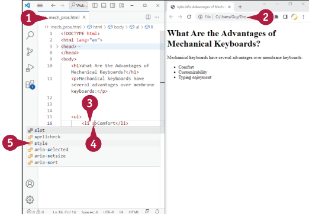

## Kezdő lépések a CSS-sel

Ebben a fejezetben a Cascading Style Sheets, azaz a CSS használatával kezdhetsz el dolgozni. Azután, hogy megtanultad hogyan működik a CSS és hogyan lehet megkülönböztetni a soron belüli, belső és külső CSS-t, elkezdheted használni ezeket a CSS-típusokat a formázás alkalmazásához. Ezután áttérhetsz az elemválasztókkal, osztályválasztókkal és ID-választókkal való munkához.


### A CSS működésének megértése

A Cascading Style Sheets, általában CSS rövidítéssel, egy stíluslap nyelv, amit arra használnak, hogy HTML-ben írt dokumentumokat jelenítsen meg, mint például weboldalak vagy más jelölőnyelvek. CSS egy sor olyan szabály bevezetésével működik, amelyek szabályozzák a megjelenített elemeket alkotó weboldalt. A CSS-szabályok szükség szerint vonatkozhatnak konkrét elemekre vagy elemcsoportokra. CSS szabályokat három helyen lehet definiálni: először soron belüli, azaz az elemen belül; másodszor belsőleg, azaz máshol ugyanabban a HTML-dokumentumban; vagy harmadszor, külsőleg, azaz egy külön fájlban, amely a dokumentumhoz kapcsolódik.

### A CSS esés

A CSS háromféleképpen használható a weboldalakon: soron belüli CSS-ként, belső CSS-ként és külső CSS-ként. A következő alfejezetek az egyes típusokat magyarázzák el.
A közeli ábra azt szemlélteti, hogy a CSS hogyan esik lefelé a CSS három szintjén - a tetején a soron belüli CSS, a belső CSS a következő, és a külső CSS a harmadik – az alapszintig, ahol a felhasználó által végrehajtott böngészőbeállítások találhatóak. Stílus a felső szintről lefelé áramlik a soron belüli CSS által beállított információ a középső szintre, felülbírálva minden olyan stílusinformációt, amely a belső CSS által van meghatározva. A belső CSS által meghatározott stílusinformációk viszont a középső szintről lefelé haladnak az alsó szintre, felülírva a külső CSS által meghatározott stílusinformációkat. Viszont, a külső CSS felülírja a felhasználó böngészőjének beállításait.


### Soron belüli CSS

A soron belüli CSS olyan stílusformázás, amelyet közvetlenül egy HTML elemben határoz meg a stílus attribútummal az elem nyitó címkében, és megadja a kívánt formázást. A soron belüli CSS-t már használtuk megelőző példákban. Például a következő utasítás tartalmazza a stílus attribútumot a nyitó `<table>` címkét és hozzárendeli a keretformázást, így egy 1 pixel széles, egyszínű, egyszínű vonal, és kék színű:
```html
<table style="border:1px solid blue">
```
Amint láthatod, a stílusdefiníció dupla idézőjelek közé kerül. Ha egynél több formázási típust kell megadni ugyanabban a stílusdefinícióban, pontosvesszővel kell elválasztani a stílustípusokat. A következő utasítás például hozzáadja a border-collapse tulajdonságot, és collapse értéket állít be, ami a táblázat és a cellák határait egyetlen sorba zsugorítja, ahelyett, hogy külön sorokban jelennének meg:
```html
<table style="border:1px solid blue;border-collapse:collapse">
```

### Belső CSS

A belső CSS olyan stílusformázás, amelyet a HTML-fájlban határoz meg, de nem egy adott elemen belül. A belső CSS nem egy adott elemre, hanem a HTML-fájl egészére vonatkozik.
A belső stíluslap létrehozásához a weboldal fejrészében elhelyez egy stíluselemet, és a
a stílusokat a stíluselemen belül határozza meg. A következő példa egy belső stíluslapot mutat be
amely tartalmazza a h1 stílus és a p stílus definícióját: 
```html
<head>
    <title>Internal Mechanisms</title>
    <style>
        h1 {
            font-size: 28px;
            color:blueviolet;
            text-align: center;
        }
        p {
            color:black;
            font-size: 14px;
            line-height: 1.5;
        }
    </style>
</head>
```

### Külső CSS
A külső CSS egy olyan stíluslap, amelyet egy külön fájlban hoz létre, majd a HTML-dokumentumokhoz kapcsolja, hogy amelyekben alkalmazni szeretné. A külső CSS fájl .css kiterjesztésű.

## Elemek formázása soron belüli CSS-szel

Ha a dokumentum egyes elemeire speciális formázást kell alkalmaznia, akkor a következő lehetőségek közül választhat soron belüli CSS-t használhat. Az soron belüli CSS lényegében azt jelenti, hogy egy mini stíluslapot hozunk létre egy adott elemen belül, például egy fejlécben vagy egy listaelemben. A soron belüli CSS alkalmazásához a stílus attribútumot hozzá kell adnia az elem nyitó címkéhez, majd megadjuk a stílusformázást.
Az soron belüli CSS használata munkaigényes, és megnehezíti a weboldalak frissítését, ezért a következőket kell tennie csak akkor használjon soron belüli CSS-t, ha feltétlenül szükséges a kívánt hatások eléréséhez.
1.  A Visual Studio Code-ban nyissa meg a fájlt amelyben a formázást szeretné a soron belüli CSS használatával.
2. Nyissa meg a fájlt egy böngészőablakban.
3. A Visual Studio Code-ban kattintson a záró > nyitó címke formázni kívánt elem előtt.
4. Írjon be egy szóközt, amelyet **s** követ.
5. Kattintson a **stílusra**.

    `A:` A Visual Studio Code beilleszti a stílust attribútumot, a beszúrási pont elhelyezésével idézőjelek közé helyezzük utána, és megjeleníti a tulajdonságlistát.

6. Kattintson a formázni kívánt tulajdonságra. Ez a példa a **színt** használja.

    `B:` A Visual Studio Code beszúrja a tulajdonságot. Adott esetben megjeleníti az értéki listát. A példában a Visual Studio Code megjeleníti a színek listáját.

7. Ha megjelenik a kívánt érték, kattintson rá. Ellenkező esetben írja be az értéket.




`C)` Megjelenik az érték.

`D:` A Visual Studio Code beír egy pontosvesszőt, ;, arra az esetre, ha folytatni kell a stílusdefiníciót.

8. Kattintson a **Frissítés** gombra. A weboldal frissül.

`E:` Megjelenik a formázás.

9. Kattintson a beillesztési pont elhelyezéséhez a pontosvessző után.
10. Kezdje el begépelni a tulajdonság nevét, majd kattintson a tulajdonságra a tulajdonságlistán.
Például írja be a **fo** szót, majd kattintson a **font-weight**-re.
11. Ha megjelenik az értékek listája, kattintson az értékre. Ellenkező esetben írja be az értéket.
Például megadhatja a **félkövér** betűtípust a `font-weight`-re.
12. Kattintson a **Frissítés** gombra. A weboldal frissül. 

`F:` Megjelenik a formázás.


::: tip TIP
**Hogyan használhatom a leghatékonyabban a soron belüli CSS-t?**

Talán ellentmondásos módon a leghatékonyabb módja az soron belüli CSS használatának az, ha elkerüljük, ahol csak lehetséges. Próbáld meg használni soron belüli CSS-t csak akkor, ha egy adott elemnek olyan formázásra van szüksége, amelyet máshol nem fog alkalmazni. Például, ha egy h1 elem különleges megjelenést igényel, a soron belüli CSS jó megoldás lehet. De ha több, bár nem mindegyik h1 elemnek van szüksége erre a különleges megjelenésre, az osztály- vagy ID-szelektor jobb megoldás.
:::
## Oldal formázása belső CSS használatával

Ha speciális formázást kell alkalmaznia a HTML-dokumentumon keresztül, felülírva a külső CSS által alkalmazott formázást, akkor belső CSS-t használhat. A belső CSS alkalmazásához a HTML-dokumentum fejrészéhez hozzáad egy stíluselemet, és abban létrehozza a stílusdefiníciókat. A böngésző ezután ezeket a stílusdefiníciókat előnyben részesíti a linkelt külső CSS-ben szereplő, azonos neveket használó stílusdefiníciókkal szemben. A HTML-dokumentum elemeiben található soron belüli CSS azonban felülbírálja a belső CSS-t.
1.  A Visual Studio Code-ban nyissa meg a fájlt, amelyben egy belső stíluslapot szeretne létrehozni.
2. Nyissa meg a fájlt egy böngészőablakban.
3. A Visual Studio Code-ban kattintson a pontra a fejrészben, ahol a belső stílust szeretné elhelyezni lapon.
4. Írjon be egy szóközt, **st** után. Megjelenik a bővítések listája.
5. Kattintson a **stílusra**.
 A Visual Studio Code beilleszti a nyitó `<style>`  és a záró `</style>` címkét, a beillesztés helyét pedig pont kerül közéjük.
6. Nyomja meg az `Enter` billentyűt a címkék közötti üres sor létrehozásához (nem látható).
7. Az üres sorba írja be a az első meghatározni kívánt stílus nevét,
amelyet egy szóköz és egy kezdőbetű zárójel követ - például: `h2 {`

    `A:` A Visual Studio Code beilleszti a záró zárójelet, hogy megfeleljen.

8. Nyomja meg az `Entert` egy üres sor létrehozásához a zárójelek között (nem látható).


9. Az üres sorban kezdje el írni a nevét a tulajdonságnak amelyiket be szeretné állítani.

Megjelenik a tulajdonság lista.

10. Kattintson a tulajdonságra.

A Visual Studio Code beilleszti a tulajdonságot. Ha szükséges, akkor megmutatja az értékeket egy listában.
A példában a Visual Studio Code megjelenít egy listát színekről.

11. Ha megjelenik a kívánt érték válassza ki, ellentkező esetben adja meg az értéket.

`D:` Megjelenik az érték. 

12. Egy új sorban ismételje meg a **9**-**11**. lépést, hogy a további formázásokat megadja, ahogy kell.

13. Ismételje meg a **7**-**11**. lépést, adja meg a stílusokat.

14. Kattints a **frissítés** gombra.
A weboldal frissül.

`E:` A formázás megjelenik.


::: tip TIPP

**Mi történik, ha ugyanaz a stílus több külső CSS-fájlban van definiálva, amelyek ugyanahhoz a weboldalhoz vannak linkelve?**

Ha ugyanaz a stílus kétszer vagy annál többször van definiálva több, ugyanahhoz a weboldalhoz kapcsolódó külső CSS-ben, a
böngésző a stílus utolsó definícióját használja. Például, ha a főszövegben lévő mindkét CSS-fájl definiálja a p
stílust, a böngésző a második CSS-fájl p stílusdefinícióját használja, mivel a böngésző ezt a
fájlal később találkozik a kódban.
:::

Általában, a legjobb módja a weboldal formázásának a külső CSS. Használhat egy külső CSS fájlt, vagy akár több külső CSS fájlt is bármelyik HTML fájlhoz. Ahhoz, hogy készítsen egy külső CSS fájlt, készítenie kell egy fájlt .css fájl kiterjesztéssel, amiben megadhatja a stílusokat. Ez után össze kell kötni a külső CSS fájlt a HTML fájlhoz. Nézze meg a "CSS fájl összekötése egy weboldalhoz" további utasításokért.

1. A Visual Studio Code-ban kattintson az **Explorer**-re.
Az Explorer sor megjelenik.

2. Vigye a kurzort a weboldal választóra az Explorer-ből.


3. Ha a CSS fájljait különböző mappákba rakta, akkor kattintson arra a mappára.

`A:` Készíthet új mappát, ha a **New Folder**-ra kattint, beírja a mappa nevét, majd nyom egy **entert**.

4. Kattintson a **New File**-ra.
Egy szövegdoboz amibe el tudja nevezni az új fájlt megjelenik.

5. Írja be a fájl nevét, majd nyomjon egy **entert**.
A fájl megjelenik, készenáll a használatára.

::: note Megjegyzés: 
A type="text/css" beillesztése a
a külső CSS fájlra mutató hivatkozásban nem
nem feltétlenül szükséges, de úgy tekintik, hogy
jó gyakorlatnak számít. A típus megadása a
megadása biztosítja, hogy a böngésző tudja, hogy
hogy CSS fájlról van szó.
:::

6. Írjon **/*** ahhoz, hogy egy kommentet hozzon létre.

7. Írja be a kommentet. A példa egy **top-level heading style**-t használ.

8. Írjon ***/** a komment végére.

9. Nyomjon **entert**, majd írjon egy **h** betűt, hogy megkezdje a h1-et.
A stílus lista megjelenik.

10. Kattintson a **h1**-re.
A Visual Studio Code beilleszti a h1-et.


11. Írjon egy szóközt, amelyet egy **{**,
A Visual Studio Code beilleszti a záró **}**.

12. Nyomjon egy **enter**-t, hogy egy új sort hozzon létre.

13. Kezdje el írni az első tulajdonságot amit be szeretne állítani.

14. Kattintson a tulajdonságra.
Ha megfelelő, akkor a Visual Studio Code megjelenik.

15. Ha megjelenik az érték, akkor kattintson rá.

`B:` A weblap most már a stílusokat használja a
a linkelt stíluslap stílusait.

::: note Megjegyzés:  
Ha a Visual Studio Code nem mutatja a listát, akkor írja be az értéket a tulajdonsághoz.
:::

16. A következő sorokban adjon meg további
tulajdonságok és értékek, amíg be nem fejezi
a stílus definiálásáig.

17. Készítsen több stílusokat, ahogy kell.


::: tip TIPP

**A stílus tulajdonságait különböző sorokban kell elhelyeznem, mint a példában?**

Nem. A bemutatott elrendezés az olvashatóság és a könnyű karbantartás érdekében optimalizált konvenció. De lehet több tulajdonságot is elhelyezhet egy sorban például, `p {font-size; medium font-weight:500;color: burlywood;}` - egyetlen sorban is működik.
:::

Miután készített egy külső CSS fájlt, kösse össze a weboldallal, amit formázni szeretne. Ahhoz, hogy összekösse a fájlokat, egy `<link>` tag-et kell elhelyezni a header-ben minden weboldalnál.

Egyszerre összeköthet több külső CSS fájlt is egy weboldalhoz, ha több `<link>` tag-et használ. Például ha az összes weboldala hasonló stílusú, azokat egy CSS fájlba helyezze el. Akkor készítsen több CSS fájlt, ha minden oldal különböző stílusokat, vagy tartalmat képvisel.

## Külső CSS fájl linkelése a weboldalhoz

1. A Visual Studio Code-ban nyissa meg a weboldalat, amelyiket hozzá szeretné kötni a külső CSS fájlhoz.

2. Nyissa meg a fájlt a keresőablakban.

3. A Visual Studio Code-ba kattintson a head szekcióra, ahová szeretné elhelyezni a link-et.

4. Írjon be egy **l**-betűt.
A lista megjelenik.

5. Kattintson a **link**-re.
A Visual Studio Code beilleszti a `<link>` tag-et, beleértve a `rel` attribútumot amit a `stylesheet`hez adtunk meg, valamint a `href` attributumot is, üresen.
```html
<link rel="stylesheet" href="">
```
6. A `href=` után a CSS fájl elérési útvonalát kell megadni.

7. Kattints arra a stylesheetre, amelyiket szeretnéd összekötni.

`A:` Visual Studio Code beírja a stíluslap nevét a kódba.


8. Kattintson a beillesztési pont elhelyezéséhez csak a `<link>` záró > betűje előtt címke elé (nem látható).

9. Írja be a **type="text/css"**.

::: note Megjegyzés: 
A type="text/css" beillesztése a külső CSS fájlra mutató hivatkozásban nem feltétlenül szükséges, de úgy tekintik, hogy jó gyakorlatnak számít. A típus megadása biztosítja, hogy a böngésző tudja, hogy a CSS fájlról van szó.
:::

10. Kattintson a **Frissítés** gombra. A weboldal frissül.

`B:` A weblap most már a stílusokat használja a linkelt stíluslap stílusait.


::: tipp TIPP

**Mi történik, ha ugyanaz a stílus több külső CSS-fájlban van definiálva, amelyek ugyanahhoz a weboldalhoz vannak linkelve?**

Ha ugyanaz a stílus kétszer vagy annál többször van definiálva több, ugyanahhoz a weboldalhoz kapcsolódó külső CSS-ben, a böngésző a stílus utolsó definícióját használja. Például, ha a főszövegben lévő mindkét CSS-fájl definiálja a p stílust, a böngésző a második CSS-fájl `p` stílusdefinícióját használja, mivel a böngésző ezt a fájlal később találkozik a kódban.
:::

## Elem, osztály és azonosító szelektorok megkülönböztetése

A HTML-dokumentumok formázásához CSS segítségével alkalmazza a stílusokat a megfelelő részekre.  A HTML lehetővé teszi a stílusok alkalmazását az elemekre három elsődleges szelektor-típus segítségével: element, osztály-szelektorok és ID-szelektorok.
Ez a szakasz elmagyarázza és szemlélteti a háromféle szelektor közötti különbségeket. A
"Stílusok alkalmazása elemszelektorok használatával", "Stílusok alkalmazása osztályszelektorok használatával" és "Stílusok alkalmazása.
„Stílusok alkalmazása ID-szelektorok használatával" című fejezet későbbi részei gyakorlati példákat mutatnak az egyes elemekkel való munkára.

### **Elemválasztók**

Az elemválasztó lehetővé teszi egy adott HTML elem összes példányának kijelölését a weboldalon.
Például, ha egy oldalon lévő összes bekezdéselemre szeretne egy stílust alkalmazni, akkor a p szelektor segítségével használhatja a p szelektort. Egy elemválasztó megadásához egyszerűen a HTML elem nevét használja. Például a következő szelektor kiválasztja a h1 elemet, és az aliceblue színt alkalmazza:

```css
h1 {
     color: aliceblue
}
```

### **Osztály szelektorok**

Az osztályválasztó lehetővé teszi, hogy olyan elemeket célozzon meg, amelyek egy adott osztályattribútummal rendelkeznek. Például, ha a HTML-fájlja tartalmaz gomb osztályú elemeket, akkor ezt az osztályt használhatja az elemek megcélzására. A  címre osztályválasztó megadásához az osztály nevét használja, amelyet egy pont előz meg, például .button. A alábbi példa a .button osztályt választja ki, és a bisque színt alkalmazza:
```css
.button {
  color: bisque
}
```
Az osztályszelektorokkal való munkához szükség lehet egy megfelelő osztály létrehozására. Lásd a "Osztály létrehozása elemek osztályának létrehozása a HTML-fájlban" című fejezet későbbi részében az osztály létrehozására vonatkozó utasításokat.

### **ID-szelektorok**

Az ID-szelektor segítségével olyan elemet célozhat meg, amely egyedi ID-attribútummal rendelkezik. Az ID-szelektor megadásához használja az ID nevét, amelyet # előz meg. Például, ha egy adott elemhez hozzárendelte az ID kulcsszót, az adott elemet a #keynote azonosító szelektor használatával célozhatja meg. A következő példa a keynote azonosítót, és a chartreuse színt alkalmazza:
```css
#keynote {
   color: chartreuse
}
```

### Stílusok alkalmazása elemválasztók használatával

Amikor egy stílust kell alkalmaznia egy HTML-dokumentum egy adott elemének összes példányára,
elemválasztót kell használni. Például a p elem összes példányára történő stílus alkalmazásához a
dokumentum összes elemére, a p szelektor használatával. Az elemválasztók használata a stílusok alkalmazásának szabványos módja. Normális esetben az element szelektorokat használjuk a legtöbb stílusformázás alkalmazásához, az osztály- és ID-szelektorokat pedig a speciális stílusok alkalmazásához.
Formázást alkalmazzunk egyes elemekre, szükség szerint.

**Stílusok alkalmazása elemkiválasztók használatával**

1. A Visual Studio Code-ban nyissa meg a külső CSS fájlt, amelyhez hozzá kívánja adni az elem szelektort.

2. Egy böngészőablakban nyisson meg egy HTML-fájlt, hogy amelyet a külső CSS-fájlt csatolt.

3. A Visual Studio Code-ban kattintson a beszúrási pontra oda, ahol az elemválasztó van.

`A:` Opcionálisan írjon be egy megjegyzést a elemválasztóhoz, amelyet létrehozunk.

4. Írja be a stílus nevét, amelyet szóköz és `{` - például:`h2 {`

`B:` A Visual Studio Code beszúrja a megfelelő zárójelet, `}`.

5. Nyomja meg az "**Enter**" billentyűt egy üres sor létrehozásához (nem látható).

6. A beszúrási ponttal az üres soron írja be a stílus formázását. Ez a példában a `text-align: center`; értéket használja:
```css
h2 {
  text-align: center
}
```

7. Kattintson a **Frissítés** gombra
A weboldal frissül.

`C:` Az elem által alkalmazott formázás jelenik meg.


### Stílusok alkalmazása osztályválasztók használatával

Amikor egy stílust kell alkalmaznia egy HTML-dokumentum több különböző típusú elemére, az elemeket egy osztályhoz rendelheti, majd egy osztályválasztó segítségével alkalmazhatja a stílust. Az  oldalon például, ha a dokumentum több olyan kulcsfontosságú részt tartalmazna, amelyek mindegyike egy-egy címsorból és szöveges bekezdésből áll, akkor ezeket a címsorokat és bekezdéseket hozzárendelheti egy osztályhoz, majd alkalmazhatja azt a stílust az osztályra. Ez a példa egy külső CSS-t használ, amelyről feltételezi, hogy csatlakoztatva van a kívánt HTML fájlhoz.

**Stílusok alkalmazása osztálykiválasztók használatával**

**A HTML-fájlban lévő elemek osztályának létrehozása**

1. A Visual Studio Code-ban nyissa meg a fájlt, amelyet osztályszelektorok segítségével fog formázni.

2. Nyissa meg a fájlt egy böngészőablakban.

3. A Visual Studio Code-ban kattintson a beillesztési pontot közvetlenül a > zárójel előtt a nyitó címke elé a kívánt elemre.

4. Írjon be egy szóközt, majd a **class=** és az class nevét idézőjelben - például:
`class="alignright"`

5. Ismételje meg a **3.** és **4.** lépést az összes többi osztályhoz.

**Az osztályszelektor létrehozása a CSS-fájlban**

1. A Visual Studio Code programban nyissa meg a külső CSS-fájlt, amelyhez hozzá kívánja adni az osztályválasztót.

`A:` Opcionálisan írjon be egy megjegyzést az osztályról.

2. Kattintson a beillesztési pont elhelyezéséhez arra a helyre, ahová a az osztályválasztót létre kívánja hozni.

3. Írjon be egy pontot, az osztályszelektor nevét. **{** - például: `.alignright }`

`B:` A Visual Studio Code beszúrja a megfelelő zárójelet.


4. Nyomja meg az "**Enter**" gombot egy üres sor létrehozásához (nem látható).

5. Adja meg a stílus formázását,
vagy az összes részlet beírásával, vagy
a listákból kiválasztott elemekkel, amelyek
Visual Studio Code megjelenít, amikor
gépelés közben. A bemutatott példa esetében
beírhatja a **tex**-et, a **text-align** gombra kattintva a
a tulajdonságok listáján, majd kattintson a
**jobbra** az értékek listáján.

6. Kattintson a **Frissítés** gombra

    A weboldal frissül.

`C:` Az osztályhoz rendelt elemek
átveszik az osztály formázását. A
példában az elemek
jobbra igazítottak.


::: tip TIPP

**Milyen korlátozások vannak az osztályszelektorok használatára?**

- Az osztályneveknek betűvel, aláhúzással vagy kötőjellel kell kezdődniük; nem kezdődhetnek betűvel számmal.
- Az osztálynevek nem tartalmazhatnak szóközöket, de a szavak elválasztására használhat kötőjelet vagy aláhúzást.
- Egy HTML-dokumentumon belül minden egyes osztálynévnek egyedinek kell lennie.
:::

### Stílusok alkalmazása ID-szelektorok használatával

Amikor egy HTML fájl egyetlen elemére kell alkalmaznia egy stílust, használjon ID szelektorokat a következő elemek azonosítására
elem azonosítására. Először a HTML-fájlban hozzáadja az id attribútumot az elem nyitó tagjéhez.
és hozzárendel egy, a fájlban egyedi nevet. Ezután hozzáadja az ID-szelektort a fájl CSS-éhez.

Egyetlen elem formázása az ID-szelektor használatával kényelmesebb, mint az elem formázása
inline CSS használatával, mivel az ID-szelektor formázása egy külső stíluslapban is lehet, amelyet
annyi HTML-fájlra alkalmazhat, ahány HTML-fájlra csak szükséges.

**Stílusok alkalmazása ID-szelektorok használatával**

### **ID hozzárendelése egy elemhez a HTML fájlban**

1. A Visual Studio Code-ban nyissa meg a fájlt
amely a formázandó elemet tartalmazza
ID-szelektorral formázni.

2. Nyissa meg a fájlt egy böngészőablakban.

3. A Visual Studio Code-ban kattintson a
beszúrási pontot közvetlenül a záró
az elem nyitó címkéje elé
amelyet formázni szeretne.

4. Írjon be egy szóközt, majd az **id=** és az id
nevet dupla idézőjelben - a
például:
`id="takeaway"`

**Hozzuk létre az azonosító szelektorát a CSS fájlban**

1. A Visual Studio Code-ban nyissa meg a
külső CSS fájlt, amelyhez a
az ID-szelektor hozzáadásához.

    `A:` Opcionálisan írjon be egy megjegyzést a
ID-szelektorhoz, amelyet létre fog hozni.

2. Kattintson a beillesztési pont elhelyezéséhez arra a helyre, ahol a
az ID-szelektor létrehozását kívánja létrehozni.

3. Írjon be egy **#**, az ID-szelektor nevét, és
majd **{** - például:
`#takeaway {`

`B:` A Visual Studio Code beszúrja a megfelelő
záró `}`.


4. Nyomja meg az "**Enter**" billentyűt egy üres sor létrehozásához.
(nem látható).

5. Adja meg a formázást a
stílus beállítását, vagy az összes
részleteket, vagy az elemek kiválasztásával a
listákból, amelyeket a Visual Studio Code
gépelés közben jelenít meg. A példa
ezt a kódot használja a
elemet vastag betűtípussal, egy
5 pixeles kék szegéllyel a szöveg körül
20 pixeles térközzel a szöveg között
a kettő között:
```css
#takeaway {
font-weight: 900;
padding: 20px;
border: 5px solid
blue;
}
```

6. Kattintson a **Frissítés** gombra. A weboldal frissül.

`C:` Az ID-vel jelölt elem
megjelölt elem veszi fel a formázást.


::: tip TIPP

**Mi történik, ha nem egyedi azonosítókat használok egy HTML-dokumentumban?**

A HTML-dokumentumban ismétlődő, nem egyedi azonosítók két fő problémát okozhatnak. Az első,
a CSS csak az első olyan elemet fogja kiválasztani, amely az azonosítót használja; az ismételt azonosítót tartalmazó további elemeket figyelmen kívül hagyja.
ID-t, így azok nem kapják meg a kívánt formázást. Másodszor, mivel a segítő technológiák a
egyedi azonosítókra támaszkodnak az oldalakon való navigáláshoz és a velük való interakcióhoz, a képernyőolvasók és más segédtechnológiák a következő esetekben
nem működnek megfelelően, ami megnehezíti a fogyatékkal élő felhasználók számára a weboldalak használatát.
:::