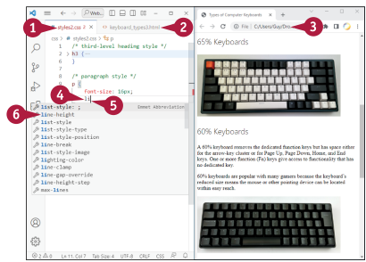

## A betűtípusok megértése és használata

A betűtípusokkal való munka kulcsfontosságú része a webfejlesztésnek, mivel a betűtípusok szabályozzák a megjelenést.
a szöveget a weboldalakon, és segíthetnek a weboldal üzenetének, hangvételének és stílusának közvetítésében.
A CSS ad a betűtípusok és a szöveg stílusának vezérlésére, az olyan alapvető tulajdonságoktól kezdve, mint a betűtípusok
család és a betűméret, egészen az olyan speciálisabb tulajdonságokig, mint a felső- és alulírott betűk, valamint a szövegárnyékok.
Ez a szakasz áttekintést ad a szabályozható betűtípus-tulajdonságokról. A következő szakaszok
bemutatják, hogyan végezhet változtatásokat a tulajdonságokon.

### Betűtípuscsaládok

A betűtípuscsalád olyan betűtípusok halmaza, amelyeknek van egy közös
kialakításuk. Például a serif betűtípusok, kis
kiemelkedések zárják le a betűk vonalait,
míg a sans-serif betűtípusoknál nincsenek serifek. Times New Roman
és a Baskerville példák a serif betűtípusokra; az Arial és a
Helvetica a sans-serif betűtípusok példái.
A weboldalon a szöveghez használt betűtípus megadásához a következőket kell tennie
a font-family tulajdonsággal állíthatja be a betűtípuscsaládot.
A font-family több értéket is megadhat a következőhöz
tartalék betűtípusok megadása a preferencia sorrendjében.
Például,a következő kód a Helvetica, az Arial és a sans- betűtípust határozza meg.
serif betűtípuscsaládot a body elemhez:
```css
body {
font-family: Helvetica, Arial,
sans-serif;
}
```
Itt, ha a webböngésző nem rendelkezik Helvetica-val, akkor
visszaáll az Arialra; ha pedig az Arial sincs, akkor az
a sans-serif betűtípusra vált vissza. A szöveg megjelenik
valamilyen formában, mivel a böngésző mindig rendelkezik serif betűtípussal.
és egy sans-serif betűtípus áll rendelkezésre.

### Betűméret
A font-size tulajdonság lehetővé teszi a betűtípus méretének beállítását.
méret beállítását fix vagy relatív méret segítségével.
mérést. A fix méretek különböző mértékegységeket használhatnak,
például pixel, amelyet px-nek nevezünk; tipográfiai ems,
em; root ems, a root betűtípushoz viszonyított egységek.
a dokumentum root méretéhez viszonyítva, amelyet a rem jelöl; vagy a font százalékos aránya a
az alapértelmezett mérethez képest, amelyet % jelöl. Egy relatív mérés
összehasonlító értéket használ, például x-kicsi, közepes,
large vagy xx-large.
A következő példa a nagy betűméretet adja meg a
body elemhez:
```css
body {
font-size: large;
}
```
A root-ems-ben történő méretezés a betűméreteket a
a HTML body elemhez beállított betűtípushoz képest.
dokumentumhoz. A következő stílusdefiníció például a
a body elem font-size tulajdonságát 16px-re állítja be:
```css
body {
font-size: 16px;
}
```
Ezáltal a dokumentum root em-je szintén 16px-es lesz. A
ezután megadhatja a többi elem betűméretét a root em-ekben.
A következő stílusdefiníció például a
font-size tulajdonságát a p elemhez 1rem-re állítja be,
így az is 16px-es lesz:
```css
p {
font-size: 1rem;
}
```
Hasonlóképpen, a font-size: 1.5rem használatával beállíthatja a
24 pixeles betűméret beállítását egy másik elemhez ugyanabban az
dokumentumban.
A root ems használatával történő méretezés lehetővé teszi a betűtípus egyszerű beállítását.
méreteket a dokumentumban: Csak a
a body betűméret tulajdonságának pixelértékét kell csak megváltoztatni.
elemet. A többi elem mérete ekkor megváltozik
automatikusan.

### Betűsúly
A font-weight tulajdonság lehetővé teszi a betűtípus súlyának - vastagságának vagy vastagságának - szabályozását.
karaktereket. A font-súlyt beállíthatja egy kulcsszó értékére - világosabb, normál, félkövér, vagy
bolder -, vagy egy 100 (a legkönnyebb) és 900 (a legmerészebb) közötti számra. A következő
példa a h3 elemhez félkövér betűsúlyt ad meg:
```css
h3 {
font-weight: bold;
}
```
### Betűszín
A color tulajdonság segítségével megadhatja a betűtípusok és más objektumok színét. A következő példa a
a deepskyblue színt a stílushoz:
```css
h3 {
color: deepskyblue;
}
```
A "A színek CSS-ben történő beállításának módjainak megértése" című részben talál magyarázatot a különböző módokra, amelyekkel a
állíthat be színeket, például a színnév megadásával vagy az RGB-értékek megadásával.

### Aláhúzás, felülhúzás és áthúzás

A CSS háromféle szövegdíszítés alkalmazását teszi lehetővé: a szöveg alatti aláhúzás, a felülhúzás
a szöveg fölött, és áthúzás a szövegen. Különböző stílusú vonalak közül választhat, például
egyszínű, szaggatott vagy hullámos; beállíthatja a vonalak színét; és megadhatja a vonalvastagságot. A következő példa 5. képpont vastagságú egyszínű, piros felülvonalat ad meg:
```css
h4 {
text-decoration: overline solid red 5px;
}
```
### Egyéni betűtípusok használata külső forrásból

A böngésző által biztosított beépített betűtípusok mellett a CSS lehetővé teszi külső forrásból származó egyéni betűtípusok használatát is.
forrásokból származó betűtípusokat. A betűtípusokat elhelyezheti a saját webkiszolgálóján, ha van engedélye a terjesztésükre; vagy pedig
a böngésző letöltheti a betűtípusokat egy betűtípus-könyvtárból.
Az egyéni betűtípusok weboldalakon történő használatáról a fejezet későbbi részében található "Egyéni betűtípusok használata weboldalakon" című szakaszban olvashat.
egyéni betűtípusok weboldalakon történő telepítéséről.

## A betűcsalád megadása

A betűcsalád gyakran a legjobb hely a stílus betűformázásának megkezdésére. A CSS lehetővé teszi, hogy
megadhatja a kívánt betűtípust név szerint, de megadhat egy tartalék betűtípus-listát is, amelyet akkor használhat, ha a
preferált betűtípus nem áll rendelkezésre.
A betűtípuscsalád megadásához a font-family tulajdonságot a stílusdefinícióba kell felvenni, és be kell állítani a következő értéket
a megfelelő betűcsaládot vagy betűcsaládokat állítja be.

### A betűcsalád megadása


1. A Visual Studio Code-ban nyissa meg a külső
CSS fájlt, amelyen dolgozni szeretne. 
2. Szintén a Visual Studio Code-ban nyisson meg egy
HTML fájlt, amelyhez a
külső CSS-fájlt. 3. Nyissa meg a HTML fájlt egy böngészőben
ablakban.

`A)` A példában a h3 elemek egy
serif betűtípust használnak.

`B)` Opcionálisan írjon be egy megjegyzést, amely leírja
a létrehozott stílust - például
például:
/_ harmadik szintű fejléc
stílus _/ 


4. Kezdje el a stílusdefiníciót a
    stílusnév beírásával, amelyet egy szóköz és { - például:

```css
h3 {
A Visual Studio Code automatikusan beilleszti
a megfelelő zárójelet, }
```

5. Nyomja meg az üres sor létrehozásához(nem látható).
6. Írja be a betűtípust.
    Megjelenik a bővítmények listája.

7. Kattintson a font-family gombra.


`C)`. Visual Studio Code beilleszti a font-family tulajdonságot.A Visual Studio Code megjelenít egy listát
betűtípuscsaládok listáját.

8. Ha a kívánt betűtípuscsalád
megjelenik, kattintson rá.
Ha nem, akkor írja be a
kívánt betűtípuscsaládot. Lásd a tippet
példát.


`D)` A font-family tulajdonság megjeleníti
a betűtípuscsalád részleteit
választott. 9. Kattintson a Frissítés gombra.
A weboldal frissül és megjelenik
az új formázást.

`E)` A példában a h3 elemek
sans-serif betűtípusra változnak.

::: tip Tipp:
**Hogyan adhatom meg egy betűcsalád adatait?**
Írja be a betűtípuscsalád nevét. Ha a név szóközöket vagy speciális karaktereket tartalmaz, írja be a nevet a következő szövegbe
idézőjelbe - például: font-family: "Helvetica Neue". Ha a név nem tartalmaz
nem tartalmaz szóközöket vagy speciális karaktereket, írja be a nevet díszítés nélkül - például: font-family:
Helvetica. A betűtípusok tartalékhalmazának megadásakor vesszővel válassza el őket - például,
font-family: "Helvetica Neue", Helvetica, sans-serif a Helvetica Neue betűtípust adja meg;
ennek hiányában Helvetica; és ennek hiányában sans-serif betűtípus.
:::

<!---New page-->

## Állítsa be a betűméretet és a betűvastagságot
A betűméret és a betűvastagság hatalmas különbséget jelenthetnek egy weboldalon megjelenő szöveg kinézetében. A CSS lehetővé teszi számodra, hogy megadhasd a betűméretet a font-size tulajdonság segítségével, és hogy szabályozhasd a betűvastagságot a font-weight tulajdonság használatával.
A betűméretet vagy egy konkrét magasságra állíthatod be, például pixel vagy tipográfiai ems mértékegységgel, vagy relatív méretre, például nagyobbra. A betűvastagságot vagy egy kulcsszó értékre, például könnyebb vagy vastagabb, vagy egy számra állíthatod be 100 és 900 között, ahol 100 a legkönnyebb, és 900 a legvastagabb.

### Állítsa be a betűméretet és a betűvastagságot


1. A Visual Studio Code-ban nyisd meg azt a külső CSS fájlt, amelyen dolgozni szeretnél.
2. Szintén a Visual Studio Code-ban nyisd meg azt az HTML fájlt, amelyhez hivatkoztál a külső CSS fájlra.
3. Nyisd meg az HTML fájlt egy böngészőablakban.
::: note Megjegyzés: Ha új stílust kezdesz, gépeld be a nevét, majd egy szóközt és a Visual Studio Code automatikusan beírja a megfelelő zárójelet.
:::
4. Kattints arra a helyre a stílusban, ahova hozzá akarod adni a betűméretet.


5. Gépeld be a "font" szót.Megjelenik a kibővítési lista.

6. Kattints a "font-size"-ra.

`A)` Visual Studio Code beilleszti a font-size tulajdonságot. A Visual Studio Code megjeleníti a betűméretek listáját.

7. Ha a használni kívánt betűméret szerepel a listában, kattints rá. Ha nem, gépeld be a betűméretet. Ebben a példában 24px-et használunk.

<!---170. oldal--->


8. Kattints a Frissítés gombra.
Az internetes oldal frissül.
A Betűméret változása megjelenik.

9. Új sorba írd be a "font" szót.
Megjelenik a kibővítési lista.

10. Kattints a "font-weight"-ra.


`C)`Visual Studio Code beilleszti a font-weight tulajdonságot.
A Visual Studio Code megjeleníti a betűvastagságok listáját.

11. Kattints arra a betűvastagságra, amelyet szeretnél. A példa könnyebb súlyt használ.
A Visual Studio Code beírja a betűvastagság értékét a kódodba.

12. Kattints a Frissítés gombra.
Az internetes oldal frissül.

`D)`A betűvastagság változása megjelenik.

::: tip Tipp:
A betűvastagság numerikus értékei hogyan működnek?
A 100 a legkönnyebb súlyt jelenti, és a "vékony" jelentésűre képezi le; a 400 a szabványos betűvastagságot jelenti, és a "normál" jelentésűre képezi le; míg a 900 a legnehezebb súlyt jelenti, és a "fekete" jelentésűre képezi le. A többi érték, amelyeket használhatsz, a következők: 200, ami a "könnyebb" jelentésűre képezi le; 300, ami a "világos" jelentésűre képezi le; 500, ami a "közepes" jelentésűre képezi le; 600, ami a "félvastag" jelentésűre képezi le; 700, ami a "vastag" jelentésűre képezi le; és 800, ami a "vastagabb" jelentésűre képezi le.
:::

## Állítsa be a sor magasságát és a betűközt
A CSS lehetővé teszi számodra, hogy beállítsd a sor magasságát és a betűtávolságot az HTML dokumentumaidban. A sor magasságának beállításához a line-height tulajdonságot állítod be a stílusban. Használhatsz vagy egy konkrét mértéket, például 24px-et, hogy a sor magassága 24 pixel legyen, vagy a betűméret többszörösét, például 1.5-öt, hogy a sor magassága a betűméret másfélszerese legyen.
A betűtávolság beállításához be kell foglalnod a letter-spacing tulajdonságot a stílusban, és meg kell határoznod a kívánt távolságot minden betű között.

### Állítsa be a sor magasságát és a betűközt



1. A Visual Studio Code-ban nyisd meg azt a külső CSS fájlt, amelyen dolgozni szeretnél.
2. Szintén a Visual Studio Code-ban nyisd meg azt az HTML fájlt, amelyhez hivatkoztál a külső CSS fájlra.
3. Nyisd meg az HTML fájlt egy böngészőablakban.
   Megjegyzés: Ha új stílust kezdesz, gépeld be a nevét, majd egy szóközt és a Visual Studio Code automatikusan beírja a megfelelő zárójelet.
4. Kattints arra a helyre a stílusban, ahova hozzá akarod adni a sor magasságát.
5. Gépeld be a "li" szót. Megjelenik a kibővítési lista.


6. Kattints a "line-height"-ra.

`A)`A Visual Studio Code beilleszti a line-height tulajdonságot.A Visual Studio Code megjeleníti az értékek listáját.

7. Ha megjelenik az érték, amelyet szeretnél, kattints rá (nem látható). Ellenkező esetben gépeld be az értéket. Ebben a példában a gépelt érték 1.5, hogy a sor magassága legyen a betűméret másfélszerese.

`B)`A betűméret 16px.

8. Kattints a Frissítés gombra.Az internetes oldal frissül.


`C)`A bekezdéselemek (p elemek) sor magassága megváltozik.

9. Egy üres sorban a stílusban gépeld be a "le" szót.
   Megjelenik a kibővítési lista.
10. Kattints a "letter-spacing"-re.


`D)`A Visual Studio Code beilleszti a letter-spacing tulajdonságot.A Visual Studio Code megjeleníti az értékek listáját.

11. Gépeld be azt a betűtávolságot, amelyet szeretnél. Ebben a példában a gépelt érték 2px, hogy két pixelnyi tér legyen minden betű között.
12. Kattints a Frissítés gombra. Az internetes oldal frissül.

`E)`A bekezdéselemek betűtávolsága megváltozik.

::: tip Tipp:
Általában a sor magasságát érdemes a betűméret többszörösére állítani, mivel ez jobb eredményeket nyújt. Ez lehetővé teszi, hogy a sor magassága arányosan változzon a betűmérettel. Ennek az arányos változásnak köszönhetően könnyebb fenntartani egy összhangban lévő elrendezést különböző képernyőméretek esetén.

Ezt a típusú mértéket néha mértékegységek nélkülinek nevezik, mivel nem használ mértékegységeket, mint például pixelek vagy ems mértékegységeket.
:::

<!--174. oldal:--->


## Feljegyzéseket és alsó indexeket hozz létre.
### Adj hozzá feljegyzéseket és alsó indexeket egy HTML fájlhoz:
1. Nyisd meg a Visual Studio Code-ot, és nyisd meg azon külső CSS fájlt, amelyen dolgozni szeretnél.

2. Szintén a Visual Studio Code-ban nyisd meg azt a HTML fájlt, amelyhez hivatkoztál a külső CSS fájlra.

3. Nyisd meg az HTML fájlt egy böngészőablakban.

`A)`. Az példa HTML fájl tartalmaz egy karaktert, amely feljegyzést igényel.

`B)`. Tartalmaz továbbá egy karaktert, amely alsó indexet igényel.

4. Kattints a beszúrási pont elé azon karakter előtt, amely feljegyzést igényel.

5. Írd be a nyitó `<sup>` címkét.

6. Mozgasd a beszúrási pontot a karakter utánra, majd írd be a záró `<sup>` címkét.

7. Kattints a karakter elé, amely alsó indexet igényel, majd írd be a nyitó `<sup>` címkét.

8. Mozgasd a beszúrási pontot a karakter utánra, majd írd be a záró `</sup>` címkét.

9. Kattints a Frissítés ( ) gombra.

`A)` weboldal frissül.

`C)` A feljegyzés megjelenik.

`D)` Az alsó index megjelenik.

<!--175. oldal:--->
### Állítsd be a feljegyzés stílusát és az alsó index stílusát:


1. A Visual Studio Code-ban kattints a külső CSS fájl fülére.

2. Egy új sorban írd be a sup szót, egy szóközt, és egy { karaktert. A Visual Studio Code automatikusan beilleszti a záró kapcsos zárójel karaktert, }.

3. Nyomj Entert, hogy beszúrj egy üres sort.

4. Írd be a v szót. Megjelenik a kibontási lista.

5. Kattints a vertical-align lehetőségre. 


`E)`Ekkor a Visual Studio Code beilleszti a vertical-align tulajdonságot.

6. Kattints a super értékre.

`F)` A szuper érték megjelenik.

7. Írd be a font-size: következőleg a kívánt értéket. A példa 0.6em értéket használ.

8. Ismételd meg a 2-től 7-ig terjedő lépéseket az alsó index stílusának definiálásához. Rendeld hozzá a sub értéket a vertical-align 
tulajdonsághoz. A font-size tulajdonsághoz rendeld hozzá ugyanazt az értéket. Például:

```css
sub {
  vertical-align: sub;
  font-size: 0.6em;
}
```

9. Kattints a Frissítés ( ) gombra. A weboldal frissül.

`G)`Az új formázást a feljegyzések és az alsó indexek alkalmazzák.

<!--176. oldal--->
### Színek beállításának megértése a CSS-ben

CSS lehetővé teszi a szín beállítását többféle módon. A legegyszerűbb mód azoknak a színeknek a használata, amelyek beépítve vannak a CSS-be, például piros, zöld és királykék. Ha szélesebb színskálára van szükséged, színkóddal, RGB vagy RGBA értékkel, vagy HSL vagy HSLA színértékkel is meghatározhatod a színt. Ez a részletesen magyarázza ezeket a különböző módszereket.


**Szín beállítása a színnév használatával**

A CSS-nek széles körű beépített színei vannak, amelyek az ábécé sorrendjében futnak az aliceblue-tól az antiquewhite-on át a yellowig és a yellowgreenig. Ezek közül az egyiket egyszerűen megadhatod a nevével. Az alábbi példa alkalmazza a saddlebrown színt:
```css
color: saddlebrown;
```

**Szín beállítása hexadecimális színkóddal**

A CSS lehetővé teszi, hogy hexadecimális színkóddal adj meg színeket. Például a hexadecimális színkód #800080 a lila színt jelenti, a #FFA500 kód az narancsot, míg a #4169E1 kód a királykék színt jelenti. Az alábbi példa alkalmazza a királykék színt:
```css
color: #4169e1;
```

**Szín beállítása RGB vagy RGBA színérték használatával**

RGB a vörös, zöld, kék rövidítése. Az RGB egy olyan additív színmodellt használ, amely a vörös, zöld és kék fény különböző mennyiségeinek összeadásával hozza létre a színeket. Az RGB érték kifejezi a vörös fény mennyiségét, a zöld fény mennyiségét és a kék fény mennyiségét, mindegyiket egy 0–255 közötti egész számként. Például a világospiros RGB(255, 0, 0) - a legnagyobb érték a vörös számára, zöld és kék nulla. Az alábbi példa alkalmazza a feketét:
```css
color: rgb(0, 0, 0);
```
RGBA, ahol az alfa érték beállítja a szín átlátszóságát vagy opacitását, 0-tól 1-ig terjedő skálán, ahol a 0 a teljes átlátszóságot, az 1 pedig a teljes opacitást jelenti. Az alábbi példa alkalmaz egy félig átlátszó piros színt:
```css
color: rgba(255, 0, 0, 0.5);
```

**Szín beállítása HSL vagy HSLA színérték használatával**

HSL a Hue (színárnyalat), Saturation (telítettség), Lightness (világosság) rövidítése. A Hue megadja a szín pozícióját a színskála szerint, 0 foktól 360 fokig terjedően. A Saturation megadja a szín intenzitását százalékban, ahol a 0% szürkét, a 100% pedig teljesen telített színt jelent. A Lightness megadja a szín fényességét százalékban, ahol a 0% fekete, a 100% fehér, és az 50% a tiszta szín. Az alábbi példa alkalmaz egy teljesen áttetsző kék színt:
```css
color: hsl(240, 100%, 50%);
```
HSLA az HSLA rövidítése, ahol az alfa érték beállítja a szín átlátszóságát vagy opacitását, 0-tól 1-ig terjedő skálán, ahol a 0 a teljes átlátszóságot, az 1 pedig a teljes opacitást jelenti. Az alábbi példa alkalmazza a korábbi kék színt 50% átlátszósággal:
```css
color: hsla(240, 100%, 50%, 0.5);
```

<!--177. oldal--->


1. A Visual Studio Code-ban nyisd meg azt a külső CSS fájlt, amelyben szeretnéd beállítani a betűszíneket.

2. Szintén a Visual Studio Code-ban nyisd meg azt az HTML fájlt, amelyhez hivatkoztál a külső CSS fájlra.

3. Nyisd meg az HTML fájlt egy böngészőablakban.

::: note Megjegyzés: Ha új stílust kezdesz, írd be a nevét, egy szóközt, majd egy { karaktert. A Visual Studio Code automatikusan beilleszti a megfelelő záró kapcsos zárójelet, }.
:::

4. Kattints a stílusban arra a helyre, ahová hozzá akarod adni a színt.


5. Írd be a co szót. Megjelenik a kibontási lista.

6. Kattints a color lehetőségre. A Visual Studio Code beilleszti a color tulajdonságot.

`A)`Megjelenik az értékek listája.

7. Ha szín nevével szeretnéd megadni a színt, kattints a névre. Ellenkező esetben írd be a hexadecimális kódot, az RGB vagy RGBA kódot, vagy a HSL vagy HSLA kódot a színhez.
A szín értéke megjelenik a kódban.

8. Kattints a Frissítés ( ) gombra. A weboldal frissül.

`C)`Az elem átveszi a szín formázását.


<!--what the fuck-->


## Szövegárnyékok alkalmazása
A text-shadow tulajdonság a CSS-ben lehetővé teszi, hogy szövegárnyékokat alkalmazz egy stílushoz. Ez a tulajdonság négy argumentumot fogad: vízszintes árnyék, függőleges árnyék, elmosódás sugár és szín. A vízszintes árnyék.
Az "argument" meghatározza a vízszintes távolságot az árnyék és a szöveg között; egy negatív érték az árnyékot balra mozgatja, míg egy pozitív érték jobbra mozgatja az árnyékot. A "v-shadow" argumentum meghatározza a függőleges távolságot az árnyék és a szöveg között; egy negatív érték felfelé mozgatja az árnyékot, míg egy pozitív érték lefelé mozgatja azt. A "blur-radius" argumentum meghatározza az alkalmazott elmosódás mértékét az árnyékra. A "color" argumentum meghatározza a színt.

### Szövegárnyékok alkalmazása


1. Nyisd meg a külső CSS fájlt a Visual Studio Code-ban, amelyben szeretnéd alkalmazni a szövegárnyékokat.

2. Szintén a Visual Studio Code alkalmazásban nyisd meg az HTML fájlt, amelyhez csatoltad a külső CSS fájlt.

3. Nyisd meg az HTML fájlt egy böngészőablakban.

::: note Megjegyzés: Ha új stílust indítasz, írd be a nevet, egy szóközt, majd a {. A Visual Studio Code automatikusan beírja a záró kapcsos zárójelét, }.
:::

4. Kattints azon a stíluson, ahol alkalmazni szeretnéd a szövegárnyékokat.

5. Ird be a TE szót.Megjelenik  az automatikus kibővítés lista.


6. Kattintson a Szövegárnyékokra

`A)`Visual Studio Code displays the values list.A Visual Studio Code megjeleníti az értékek listáját.

7. Írd be a vízszintes távolságot. Ebben a példában 3px-t használunk.

8. Írd be egy szóközt, majd a függőleges távolságot. Ebben a példában 6px-t használunk.

9. Írd be egy szóközt, majd az elmosódás sugárát. Ebben a példában 6px-t használunk.

10. Írd be egy szóközt, majd a színt. Ebben a példában feketét használunk.

11. Kattintson a Frissítés gombra. A weboldal frissül.

`B)` Megjelenik a szöveg árnyéka.

## Monospaced fontot megjelenítés.
A CSS lehetővé teszi a monospace betűtípus megjelenítését a weboldalakon. A monospace betűtípus minden karakternek azonos szélességet ad, nem engedi, hogy a karakterek szélessége változzon. A monospace betűtípus hasznos információk megjelenítésére, például programkódokra, és a technikai kifejezéseket lehet megkülönböztetni a rendes szövegtől.

A monospace betűtípus használatához létrehozhatsz egy osztályt a CSS fájlodban, és megadhatod a megfelelő betű családot, például Courier-t, a rendszer monospace betűtípusával biztosítva egy visszaesést. Ezután egy span elemet használhatsz, hogy minden releváns szövegrészletet megjelölj az osztályhoz tartozónak.

### Monospaced fontot megjelenítése:


1. A Visual Studio Code-ban nyisd meg a külső CSS fájlt, amelyben szeretnéd alkalmazni a monospace betűtípust.

2. Szintén a Visual Studio Code-ban nyisd meg azt az HTML fájlt, amelyhez csatoltad a külső CSS fájlt.

3. Nyisd meg az HTML fájlt egy böngészőablakban.

4. A CSS-ben írd be az osztályválasztó nevét - például:
`.mono {`

5. Add meg a "font-family" tulajdonságot, és rendeld hozzá a monospace betűtípusokat - például:
```css
font-family: "Courier New",
Courier, monospace;
```


6. Zárd le a stílusdefiníciót egy záró kapcsos zárójellel, }.

7. Kattints az HTML fájlra.
Az HTML fájl aktívvá válik.

8. Hozz létre egy span elemet, amely körülveszi minden kifejezést. Rendeld hozzá a mono osztályt minden spanhez. Például:
```css
<span class="mono">actuation
force</span>
```

9. Kattints a Frissítésre ( ).
A weboldal frissül.

`A)`A span elemekkel megjelölt kifejezések megjelennek monospace betűtípussal.


## Szövegdekoráció alkalmazása.
A CSS biztosítja a text-decoration tulajdonságot a szöveg "dekorációjának" alkalmazásához. Használhatod az overline értéket egy vonal alkalmazásához a szöveg felett, az underline értéket egy vonal alkalmazásához a szöveg alatt, a linethrough értéket áthúzás alkalmazásához, egy vonal egyenesen a szöveg felett. Miután meghatározta a vonaltípust, beállíthatod annak színét, például csokoládé vagy sötétsaláta; beállíthatod a stílusát, például pontozott, szaggatott, hullámos vagy folytonos; és beállíthatod a vastagságát.

### Szövegdekoráció alkalmazása:


1. A Visual Studio Code-ban nyisd meg azt a külső CSS fájlt, amelyben definiálni szeretnéd a szöveg dekorációt.

2. Szintén a Visual Studio Code-ban nyisd meg azt az HTML fájlt, amelyhez csatoltad a külső CSS fájlt.

3. Nyisd meg az HTML fájlt egy böngészőablakban.

::: note Megjegyzés: Ha új stílust kezdesz, írd be a nevét, egy szóközt, majd a {. A Visual Studio Code automatikusanbeírja a záró kapcsos zárójelét, }.
:::

4. Kattints arra a stílusra, amelyre alkalmazni szeretnéd a szövegdekorációt.


5. Írd be a "te" szót. Megjelenik az automatikus kibővítés lista.

6. Kattints a "text-decoration" lehetőségre.

`A)` Visual Studio Code beilleszti a text-decoration tulajdonságot. Megjelenik az értékek listája.

7. Kattints a line-through, overline vagy underline lehetőségre, ahogy szükséges. Ebben a példában az underline-t használjuk.


`B)` A Visual Studio Code beilleszti a kattintott vonaltípus kódját.

8. Kattints a Frissítés gombra.

`C)` A vonal megjelenik az alapértelmezett beállításokkal - egy egyszerű fekete vonal.

9. Írj be egy szóközt, majd a vonal színét - például:
text-decoration: underline
red

10. Írj be egy további szóközt, majd a vonal stílusát - például:
```css
text-decoration: underline
red wavy
```


11. Írj be még egy szóközt, majd a vonal vastagságát - például:
```css
text-decoration: underline
red wavy 5px
```
12. Kattints a Frissítés gombra.

`D)` A vonal megjeleníti a megadott formázást.

::: tip Tipp:
A text-decoration-line tulajdonság arra szolgál, hogy megadja a szövegdekoráció vonaltípusát. CSS-ben két módon lehet meghatározni a szöveg dekorációját. Az egyszerűbb módszer a text-decoration tulajdonság használata, mint például a fő szövegben, ahol a vonaltípust az első argumentumként, a színt a második argumentumként, a vonalstílust a harmadik argumentumként, és a vastagságot a negyedik argumentumként adjuk meg; az első argumentum kötelező, a többi három pedig opcionális. A hosszabb mód az, amikor a text-decoration-line tulajdonságot használod a vonaltípus beállítására, a text-decoration-color tulajdonságot a szín beállítására, a text-decoration-style tulajdonságot a stílus beállítására, és a text-decoration-thickness tulajdonságot a vastagság beállítására.
:::


## A HTML-entitások ismertetése
Az HTML entitások olyan kódok vagy karakterek, amelyeket az HTML-ben használnak a fenntartott karakterek és szimbólumok megjelenítésére. Az HTML entitások általában egy különleges kódot vagy nevet tartalmaznak, amelyet egy ampersand jel (&) és egy pontosvessző (;) között adnak meg. Például beírhatsz az HTML entitást &sum;, hogy az összegjel, Σ, megjelenjen egy HTML dokumentumban.

### Mik azok a HTML entitások?
Az HTML entitások olyan kódok, amelyeket be lehet írni az HTML-be, hogy megjelenítsék azokat a karaktereket és szimbólumokat, amelyeket nem lehet közvetlenül beírni az HTML-be.

Néhány HTML entitás fenntartott karakterek, ami azt jelenti, hogy karaktereket használnak az HTML nyelvben. Például az HTML címkék a kisebb-értékű szimbólumot, <, és a nagyobb-értékű szimbólumot, >, használják elhatárolásként, ezért az HTML nem engedi meg ezeknek a karaktereknek más célokra történő használatát, de biztosítja az HTML entitásokat, például `&lt`; a kisebb-értékű szimbólum beillesztésére és `&gt`; a nagyobb-értékű szimbólum beillesztésére az HTML dokumentumokba. Hasonlóképpen, mivel az HTML entitások az ampersand karaktert, &, használják, nem lehet közvetlenül használni az ampersand karaktert egy HTML dokumentumban. Ehelyett az HTML entitást, `&amp;` kell használni.

Más HTML entitások olyan karakterek, amelyek nem szerepelnek a szabványos számítógép billentyűzeteken. Ezek az entitások mindent lefednek a matematikai szimbólumoktól és pénznemjelektől a jelzésekig, mint például a bekezdésjel, ¶; és más nyelvek karakterig, mint például a görög, és láthatatlan karakterekig, mint például a szóközök.

Minden HTML entitásnak van egy entitás száma, ami &# karakterrel kezdődik, majd egy egyedi számmal folytatódik, és a pontosvesszővel, ; végződik. A szélesebb körben használt HTML entitásoknak is van egy entitás neve, ami & karakterrel kezdődik, és ; karakterrel végződik, amit a legtöbb ember könnyebben megjegyez. Például a japán jen szimbólum, ¥, az entitás szám `&#165;`-el rendelkezik, és az entitás nev `&yen;`-el. Ha az entitásnak van neve, akkor az entitást az HTML-ben lehet beírni vagy a számot.


<!--even whater the fucker-->


### Széles körben használt HTML entitások

A "8-1" tábla felsorolja a legszélesebb körben használt HTML-entitásokat. A táblázat az entitás számát és leírását, az entitás nevét, ha van, és az entitás megjelenését mutatja" – feltételezve, hogy látható megjelenésű.


## Speciális karakterek beszúrása HTML entitásokkal

Miután ismeri a beszúrni kívánt speciális karakter HTML-entitáskódját, gyorsan beillesztheti a kódot egy weboldalba, és megjelenítheti azt a karaktert. Ez a szakasz gyors példákat mutat be HTML entitások beszúrására. A széles körben használt HTML-entitáskódok listáját az előző, „HTML-entitások megértése” című részben találja. Más entitáskódokért keressen online.

### Speciális karakterek beszúrása HTML entitásokkal


1. A Visual Studio Code programban nyissa meg azt a HTML-fájlt, amelyen dolgozni szeretne.

2. Nyissa meg a HTML-fájlt egy böngészőablakban.

3. Kattintson arra a helyre, ahová be szeretné szúrni a speciális karaktert.

4. Írja be az entitás nevét vagy kódját a karakterhez. Ez a példa a `&mdash`; entitásnevet használja, amely egy em kötőjelet szúr be.


5. Kattintson a Frissítés gombra. A weboldal frissül.

`A)` Megjelenik az em kötőjel.

6. Kezdjen egy új bekezdést, és írja be a következő szöveget: `&ldquo;Ready?&#8221;`


7. Kattintson a Frissítés gombra. A weboldal frissül.

`B)` Megjelenik a bal oldali kettős idézőjel, amelyet `&ldquo;` határoz meg. Használhatja helyette a &#8220-at.

`C)` Megjelenik a jobb oldali kettős idézőjel, amelyet a `&#8221;` határoz meg. Használhatja az `&rdquo;` helyette.

::: note Megjegyzés: A nem törő szóköz olyan szóköz, amely az előző és a következő szót egyben tartja, még akkor is, ha egyébként sortörés választja el őket. Például az `Acme&nbsp;` Corporation biztosítja, hogy a szavak ugyanabban a sorban jelenjenek meg.
:::


## Hangulatjelek beszúrása

Az emojik, más néven hangulatjelek vagy smile-ik, az azonnali üzenetküldésben kezdõdtek, de mára az e-maileket, weboldalakat és az online élet más területeit is elfoglalták. A HTML lehetővé teszi hangulatjelek beszúrását egy HTML-dokumentumba, ha megadja a megfelelő entitásszámot az UTF!8 nevű Unicode-karakterkészletben, amely a világnyelvekben használt szabványos karakterek és szimbólumok többségét tartalmazza. A beszúrni kívánt hangulatjel entitásszámának, más néven kódpontjának megkereséséhez látogasson el egy olyan online webhelyre, mint az Emojipedia, www.emojipedia.org. Keressen vagy böngésszen a hangulatjel megkereséséhez, keresse meg a Codepoints kiolvasást, és másolja ki a számot.

### Hangulatjelek beszúrása


1. A Visual Studio Code programban nyissa meg azt a HTML-fájlt, amelyen
dolgozni szeretne.

2. Nyissa meg a HTML-fájlt egy böngészőablakban.

3. Kattintson arra a helyre, ahová be szeretné szúrni a hangulatjelet.


4. Írja be az `&#x` karakterláncot, majd a hangulatjel-kód pontot és egy pontosvesszőt, ;. Például a tűz hangulatjel kódpontja 1F525, ezért a következő utasítás beszúrja ezt a hangulatjelet: `&#x1F525;` &#x1F525;

5. Kattintson a Frissítés gombra. A weboldal frissül. 

`A)` Megjelenik az emoji.


## Egyéni betűtípusok használata weboldalakon

Ha túl kell lépnie a böngészőben elérhető betűtípusokon, használhatja a CSS képességét a külső forrásokból származó egyéni betűtípusok felvételére. Ha van engedélye a betűtípusok terjesztésére, akkor tárolhatja őket a webszerverén; ha nem, akkor a böngésző letöltheti a betűtípusokat egy betűkészlet-könyvtárból. Akárhogy is, meg kell határoznia a tartalék betűtípusokat, amelyek meghatározzák, hogy mely betűtípusokat kell használni, ha az egyéni betűtípusok nem állnak rendelkezésre. Megadhat egy halom tartalék betűtípust; a böngésző lefelé halad a halomban, amíg meg nem talál egy elérhető betűtípust.

### Egyéni betűtípusok biztosítása webszerverén

Ha saját betűtípusokat fejlesztett ki, vagy olyan betűtípusokat töltött le, amelyek terjesztésére jogosult, a betűtípusokat a webszerverén tárolhatja. A fájlok rendezettségének megőrzése érdekében hozzon létre egy mappát a betűtípusok számára, és tárolja őket ott, ahelyett, hogy ugyanabba a mappába helyezné őket, mint ahol a weboldalak vannak.

Ezután deklarálja a betűtípust. Ha egy külső CSS-fájlban dolgozik, amely egy olyan weboldalhoz kapcsolódik, amely a betűtípusokat használja, a deklarációt bárhová elhelyezheti; az egyszerűség kedvéért tegye a deklarációt a többi deklaráció mellé. Ha külső CSS-fájl helyett HTML-fájlban dolgozik, tegye a deklarációt a fejrészbe.

Deklarálja a betűtípust egy @font-face szabállyal, továbbá az src attribútum használatával a betűtípusfájl URL-útvonalának megadásához idézőjelben és zárójelben. Íme egy példa a MyFont nevű egyéni betűtípus-családra, amely a myfont.ttf nevű fájlban található a /fonts/ mappában.
```css
@font-face {
font-family: 'MyFont';
src: url('/fonts/myfont.ttf');
}
```
Ezután szükség szerint alkalmazza a betűtípust a stílusokhoz. A következő példa a MyFont-ot használja a törzselem preferált betűtípusaként, visszatérve a Helvetica Neue-re, ha a MyFont hiányzik, majd visszatérve a rendszer sans-serif betűtípusára, ha a Helvetica Neue nem érhető el.
```css
body {
font-család: 'MyFont', 'Helvetica Neue', sans-serif;
}
```

### Betűtípusok használata egy betűtípuskönyvtárból 


Ha nincs saját betűtípusa, és nincs engedélye mások betűtípusainak terjesztésére, beállíthatja weboldalait, hogy töltsenek le betűtípusokat egy betűtípuskönyvtárból. A betűtípuskönyvtárak széles választéka elérhető az interneten. Egyes betűtípuskönyvtárak ingyenesek, például a Google Fonts, a fonts.google.com; más betűkészlet-könyvtárak fizetett előfizetéssel rendelkeznek, például az Adobe Fonts, a fonts.adobe.com, amely a közeli ábrán látható.
 


Böngésszen a kiválasztott könyvtárban, és keresse meg a használni kívánt betűtípust, majd szerezze be a betűtípus beágyazási kódját. Például a Google Fonts szolgáltatásban kattintson egy betűtípusra az oldal eléréséhez, majd adja hozzá az egyes betűtípusokat a Kijelölt családok listájához (A). Ezután rákattinthat a `<link>` gombra (B), kiválaszthatja a hivatkozási kódot (C), és beillesztheti a HTML-dokumentumba.
 
Miután összekötötte a HTML-dokumentumot a betűtípus forrásával, elkezdheti használni a betűtípust a stílusdefiníciókban. Amikor egy böngésző lekéri a weboldalt, a hivatkozás hatására a böngésző letölti a betűtípust a "betűtípuskönyvtárból", és ezzel jeleníti meg az oldalt.