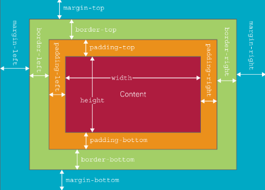
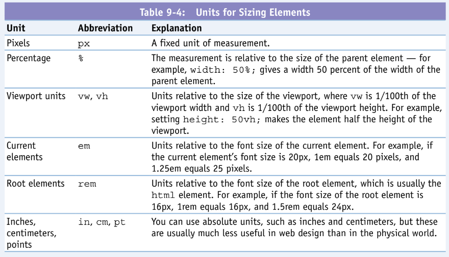
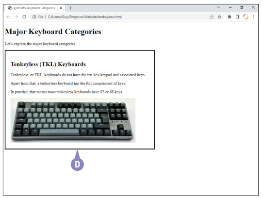
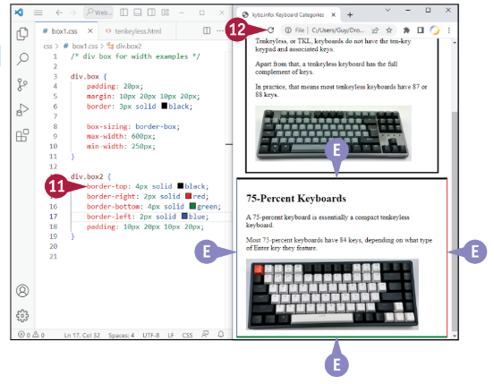
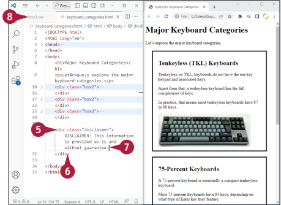

## Az álosztályok megértése

A 7. fejezetben megtanulta a CSS osztályok használatát, olyan szelektorokat, amelyek lehetővé teszik, hogy stílusokat alkalmazzon az elemekre.
egy adott osztályhoz tartozónak jelölsz meg.
Ha például .dramatic néven definiál egy stílust, akkor különböző
elemekre alkalmazhatja az osztály utasítások segítségével, például `<p class="drámai">` és `<h3 class="drámai">`.

A CSS pszeudo-osztályokat is biztosít, olyan előre definiált speciális szelektorokat,
amelyek lehetővé teszik a stílusok alkalmazását az alábbi elemekre az aktuális állapotuktól vagy más elemekkel való kapcsolatuktól függően. Ez a szakasz
bemutatja az álosztályok lényegét. A következő szakasz, "Kontextuális formázás alkalmazása a
Pszeudoosztályok alkalmazása", példákat mutat be az álosztályok használatára.


### Mik azok az álosztályok, és mikor használjuk őket?

Az álosztályok egy zseniális módja annak, hogy a HTML bizonyos állapotaira vagy attribútumaira formázást alkalmazzunk.
elemekre, amelyeket nem lehet a hagyományos szelektorok segítségével azonosítani. Egy pszeudo-osztály olyan elemeket választ ki, amelyek a
osztály által meghatározott állapotban vannak. Például a :hover pszeudo-osztály azt az elemet választja ki, amely felett a
mutató lebeg, míg a :only-child pszeudo-osztály azokat az elemeket választja ki, amelyek az elem egyetlen gyermeke.
az őket tartalmazó szülőelemnek.

A CSS specifikáció több mint 30 pszeudo-osztályt definiál. Ezeket az álosztályokat szabadon használhatja, de a
nem definiálhat saját pszeudo-osztályokat.

A 9-1. táblázat felsorolja a jelen írás időpontjában aktuális álosztályokat, de érdemes ellenőrizni, hogy vannak-e további
pszeudo-osztályok hozzáadására került sor, mire ezt a szöveget olvassa.


### Hogyan használjuk az álosztályokat

Az álosztályok használatához deklaráljon egy stílust a HTML-dokumentumhoz kapcsolódó külső CSS-fájlban vagy a
belső stíluslapban, magának a HTML-dokumentumnak a fejrészében. A következő példa a
`:hover` álosztály a h1 elemhez:


```css
h1:hover {
background-color: blueviolet;
color: antiquewhite;
}
```
Ezután az elemet normál módon használhatja egy HTML-dokumentumban. A  esetében
Például létrehozhat néhány h1 elemet így:

```html
<h1>Első címsor 1</h1>
<p>Első fő bekezdés.</p>
<h1>Második címsor 1</h1>
<p>Második test bekezdés.</p>
```

Ha a mutatót az egyik h1 elem fölé mozgatja, a háttér színe kéklilára változik,
a betűtípus színe pedig antikfehérre változik, ahogyan a szomszédos ábrán látható. Figyelje meg a különbséget
a második h1 elemtől, amely megtartja az alapértelmezett háttérszínt és betűszínt.

| 9-1.táblázat |  Álosztályok a CSS-ben |
|:-|:-|
|Pszeudo-osztály| Mit választ ki|
|:active| Egy elem, amelyet éppen aktiválnak, például kattintással.
|:any-link| Bármilyen link elem, beleértve a látogatott és nem látogatott linkeket is.
|:checked| Egy rádiógomb vagy jelölőnégyzet elem, amely be van jelölve.
|:default| Az alapértelmezett opció egy legördülő listában
|:disabled| Egy letiltott elem
|:empty| Olyan elem, amelynek nincsenek gyermekei
|:enabled| Bekapcsolt elem
|:first-child| A szülő elem első gyermeke
|:first-of-type| A típusának első eleme a szülő elemen belül
|:focus| Olyan elem, amely fókuszban van
|:hover| Egy elem, amely felett a mutató lebeg
|:indeterminate| Egy olyan jelölőnégyzet elem, amely nincs bejelölve vagy kipipálva.
|:in-range| Olyan beviteli elem, amelynek értéke egy megadott tartományon belül van.
|:invalid| Érvénytelen értékkel rendelkező beviteli elem
|:last-child| A szülő elem utolsó gyermeke
|:last-of-type| A szülői elemen belül a típusának utolsó eleme
|:link| Egy nem látogatott link elem
|:not()| Olyan elemek, amelyek nem felelnek meg egy adott szelektornak.
|:nth-child()| Azok az elemek, amelyek a szülőelem n-edik gyermekei.
|:nth-last-child()| Olyan elemek, amelyek a szülőelem végétől számított n-edik gyermekük
|:nth-last-of-type()| Azok az elemek, amelyek a típusuk n-edik elemei a szülő elemük végétől számítva.
|:nth-of-type()| Azok az elemek, amelyek a szülő elemen belül az n-edikek a típusukból.
|:only-child| Olyan elem, amely a szülőjének egyetlen gyermeke.
|:only-of-type| Egy olyan elem, amely az egyetlen a típusából a szülő elemen belül.
|:optional| Olyan bemeneti elem, amely nem kötelező, hanem opcionális.
|:out-of-range| Olyan bemeneti elem, amelynek értéke a megadott tartományon kívül esik
|:read-only| Olyan bemeneti elem, amely csak olvasható
|:read-write| Olyan bemeneti elem, amely írható-olvasható
|:required| Olyan bemeneti elem, amely kötelező
|:root| A html elem, a dokumentum gyökéreleme
|:target| Az aktuális URL céleleme
|:valid| Érvényes értékkel rendelkező bemeneti elem
|:visited| Egy meglátogatott link elem

## Kontextuális formázás alkalmazása álosztályokkal

Az előző, "Az álosztályok megértése" című részben megtanulta, hogy mik azok az álosztályok:
Intelligens szelektorok, amelyek lehetővé teszik, hogy olyan elemeket is kijelöljön, amelyeket egyébként nem tudna megcélozni.
Ez a szakasz azt mutatja be, hogyan használhatja az álosztályokat a HTML-ben a kontextuális formázás alkalmazására.
dokumentumokban. A példák a :first-child pszeudo-osztályt használják a formázás alkalmazására az első listára.
elemre, a :nth-child pszeudo-osztályt pedig arra, hogy a formázást a következő listák elemére alkalmazza.
rendezetlen listák elemeire.


1. A Visual Studio Code programban nyissa meg a külső CSS
fájlt, amelyen dolgozni szeretne.

:::note Megjegyzés: 
Pszeudo-osztályokat is használhat egy belső
stíluslapban. Ez a példa egy külső CSS-fájlt használ.
:::

2. Szintén a Visual Studio Code-ban nyisson meg egy HTML-fájlt.
amely a külső CSS-fájlhoz kapcsolódik.

3. Nyissa meg a HTML-fájlt egy böngészőablakban.

4. Kattintson a beillesztési pont elhelyezéséhez arra a helyre, ahová a
az álosztály stílusát meg kívánja határozni.

5. Írja be a befolyásolni kívánt elem nevét,
majd az álosztály nevét és a {.
A következő példa a :first-
gyermek pszeudo-osztályt alkalmazza az ul li elemre,
egy rendezetlen lista lista eleme:
A lista a következő elemeket tartalmazza: `ul li:first-child {`


::: note Megjegyzés: 
Az ul li egy összetett szelektor. Lásd a
a következő, "A CSS megértése" című szakaszt
Kombinátorok".
:::

A Visual Studio Code beírja a megfelelő záró }.

6. Nyomja meg a gombot egy üres sor létrehozásához, majd
írja be az első attribútumot.

7. A következő sorokban adjon meg további attribútumokat, mint például
szükség szerint.

8. Kattintson a Frissítés gombra.A weboldal frissül.

`A)` Minden rendezetlen listában az első gyermekelem felveszi az álosztály formázását.


9 A CSS fájlban írja be a CSS fájl nevét.
elem nevét, majd a
pszeudo-osztály neve és {. A következő
példa a :nth-child
pszeudo-osztályt az ul li elemre,
megadja a 2 elemet, a második
gyermek:

```css
ul li:nth-child(2) {
```

A Visual Studio Code beírja a megfelelő
záró }.

10. Nyomja meg a gombot egy üres sor létrehozásához, és
majd írja be az első attribútumot.

11. A következő sorokban adjon meg más
attribútumokat szükség szerint.


12. Hozzon létre bármilyen más álosztály-stílust
szükséges. A következő példa a következőt mutatja
a harmadik listaelem stílusát minden egyes
rendezetlen listában:

```css
ul li:nth-child(3) {
color:darkgoldenrod;
font-weight:900;
}
```

13. Kattintson a Frissítés gombra. A weboldal frissül.

`B)` A pszeudo-
osztályok által meghatározott formázást veszik fel.

::: tip TIP
**Hogyan alkalmazhatok formázást egy lista minden második elemére?**
Használja a :nth-child álosztály használatát, de a zárójelben 2 helyett 2n-t adjon meg. A következő példa
a chartreuse színt alkalmazza egy rendezetlen lista minden második elemére:
```css
ul li:nth-child(2n) {
color:chartreuse;
}
```
:::

## A CSS kombinátorok megértése

Ahogyan azt már láthattad ebben a könyvben, a CSS lehetővé teszi, hogy egy elemre egy stílust alkalmazzunk egy
egyszerű szelektor segítségével. Például a h1 szelektor segítségével az összes h1 elemre alkalmazhatunk stílust
egy HTML-dokumentumban. A CSS azonban azt is lehetővé teszi, hogy stílusokat alkalmazzon több egyszerű szelektor segítségével, amelyekhez a következő linkek kapcsolódnak
kombinátoroknak nevezett négy speciális karakterrel összekapcsolva.

Ebben a részben megismerkedhet a négy kombinátorral, és megtudhatja, hogyan működnek. A következő részben, a "Cél
Elements Using CSS Combinators" című fejezetben a kombinátorok segítségével összetett szelektorokat hozhat létre.


### A négy kombinátor megértése

A CSS négy kombinátort biztosít, speciális karaktereket, amelyeket egyszerű szelektorok összekapcsolására használhat, hogy létrehozza a következőket
összetett szelektorok létrehozásához. A 9-2. táblázat ismerteti a kombinátorokat. A következő alfejezetek példákat mutatnak a
a kombinátorok használatára.

| 9-2. táblázat: | CSS kombinátor karakterek ||
|:-|:-|:-|
|Kombinátor Karakter|Név|Példa|
| [egy szóköz] | Leszármazott szelektor | Az ul li kiválasztja az ul leszármazott li elemek utódai.
|>| Gyermek selector|`div` > `h2` kiválasztja azokat a h2 elemeket, amelyek a div gyermekei.
| + | Adjacent sibling szelektor | `h1` + `p` minden olyan p elemet kiválaszt, amely közvetlenül egy h1 elemet követ.elemet követi.
| ~ | Általános testvér szelektor |`h2` + `p` kiválaszt minden olyan p elemet, amely egy h2 elemet követ, függetlenül attól, hogy a p elem közvetlenül a h2 elem után van-e vagy sem.


### A Leszármazott Választó használata

Amikor egy elemet kell kiválasztanod, ami egy másik elem leszármazottja,
használd a leszármazott választót, vagyis egy szóközt. Például, ha egy rendezett listád van,
ami tartalmaz egy ágyazott rendezetlen listát, akkor így néz ki:
```html
<ol>
  <li>Szerezd be a billentyűsapka eltávolítót.
    <ul>
      <li>Sok online áruházban kaphatóak billentyűsapka eltávolítók.</li>
      <li>Vagy használj két kis csavarhúzót alternatívaként.</li>
    </ul>
  </li>
  <li>Helyezd be az eltávolítót a billentyűsapka alá.</li>
  <li>Húzd felfelé óvatosan.</li>
</ol>
```
Itt a rendezetlen lista a rendezett lista leszármazottja,
így a leszármazott választóval célozhatod meg a rendezetlen listát az ol és ul elemek közötti kapcsolat felhasználásával, például így:
```css
ol ul {
  color: aquamarine;
}
```


### A Gyermekválasztó használata

Amikor ki kell jelölnie az összes olyan elemet
egy szülő elem közvetlen gyermekei, használja a
gyermekválasztó, >. Tegyük fel például, hogy van egy
div elem, amely h2 elemeket tartalmaz, például:
```html
<div>
<h2>Működtető erő</h2>
<p>Az a távolság, ahol a
billentyűleütés regisztrálva.</p>
<h2>Csevegés</h2>
<p>Ha egy gombnyomás regisztrál
többszöri gombnyomásként.</p>
</div>
```
A gyermek szelektorral megcélozhatja a h2
elemeket a következőképpen:
```css
div > h2 {
color: blue;
}
```
Van némi átfedés a child szelektor
és a leszármazott szelektor között. A különbség a
a kettő között az, hogy a gyermek szelektor csak a
elem közvetlen gyermekeit, míg a
descendant szelektor az összes leszármazottat kiválasztja.
gyermekek, unokák, dédunokák,
és így tovább.


### A szomszédos testvérválasztó használata

Amikor egy
típusra, amely közvetlenül követ egy másik
meghatározott elemet követ, használja a szomszédos testvér
választót, a +-t. Például tegyük fel, hogy a HTML
dokumentum h2 elemeket tartalmaz, amelyeket p
elemek követik, például így:
```html
<h2>Chattering</h2>
<p>Amikor egy billentyű lenyomása regisztrálódik, mint
több billentyű lenyomása.</p>
<p>A csattogás általában
problémás.</p>
<h2>Kattintás</h2>
```
```html
<p>A billentyű lenyomásakor keletkező zaj.
kapcsoló aktiválásakor.</p>
<h2>Kattogás</h2>
<p>A zaj, amely akkor keletkezik, amikor a kapcsoló
a kapcsoló lecsapódik.</p>
```
A szomszédos testvérválasztó segítségével megcélozhatja a
minden egyes h2 elem után az első p elemet, így:

```css
h2 + p {
font-style: italic;
}
```

Itt csak az egyes h2 elemek utáni első p elemet jelöli ki.
kapja meg a dőlt betűs formázást. Az ezt követő p
elemek nem kapnak.


### Az Általános testvérválasztó használata

Ha egy adott típusú elemet kell megcéloznia, amely egy másik adott elemet követ, használja a
általános testvérválasztót, ~. Például, ha a HTML-dokumentum tartalmazza az előző példában bemutatott
alfejezetben látható, akkor a következőképpen alkalmazhat dőlt betűs formázást minden olyan p elemre, amely egy h2 elem után következik:
```css
{ h2 ~ p {
font-style: italic;
}
```

## Célelemek CSS kombinátorok használatával

Az előző, "A CSS kombinátorok megértése" című részben megismerkedtünk a négy CSS kombinátorral:
a leszármazott szelektor, a gyermek szelektor, a szomszédos testvér szelektor és az általános testvér szelektor.
szelektor. Ezek a kombinátorok lehetővé teszik, hogy az elemeket más elemekkel való kapcsolatuk alapján célozza meg.
elemekhez való viszonyuk alapján - például minden olyan h2 elemet megcélozhatunk, amely egy div elem közvetlen gyermeke.
Ebben a szakaszban a CSS kombinátorokat bizonyos elemek megcélzására alkalmazza.


**Nyissa meg a CSS fájlt és a HTML fájlt**


1. A Visual Studio Code-ban nyissa meg a
külső CSS-fájlt, amelyen dolgozni szeretne.

2. Szintén a Visual Studio Code-ban nyisson meg egy
HTML-fájlt, amelyhez a
külső CSS-fájlt.

3. Nyissa meg a HTML fájlt egy böngészőben
ablakban.

4. A Visual Studio Code programban kattintson a CSS
fájlra, hogy a beszúrási pontot oda helyezze, ahol
az első stílust szeretné definiálni.

**Egy elem megcélzása egy gyermek elemmel szelektor**


1. Írja be a szülőelem nevét, egy szóközt,
a gyermek elem nevét, majd egy újabb szóközt,
és { - például:
```css
Ol ul {
```
`A)` Visual Studio kód beszúrja a megfelelő
záró zárójelet, }.

2. Nyomja meg a gombot egy üres sor létrehozásához (nem
nem látható).

3. Az üres sorba írja be a stílust
formázást.

4. Kattintson a Frissítés gombra.A weboldal frissül.

`B)` Az ol ul gyermekelem ul
elem átveszi a formázást.

**Egy szomszédos elem megcélzása, Testvérválasztó**


1. Írja be az első elem nevét, a
szomszédos testvér szelektor, +; a második
elem nevét; egy szóközt; és { - a következőhöz
például:
```css
h2 + p {
```
`C)` A Visual Studio Code beszúrja a megfelelő
záró zárójelet, }.

2. Nyomja meg a gombot egy üres sor létrehozásához (nem
nem látható).

3. Az üres sorba írja be a stílust
formázást.

4. Kattintson a Frissítés gombra.
`A)` weboldal frissül.

`D)` Az első p elem minden h2
elem után veszi fel a formázást.

`E)` Az ezt követő p elemek nem
nem érinti.

Egy elem megcélzása általános Testvérválasztó


1. Térjünk vissza az előző alfejezet
példához, jelölje ki a + elemet, és írja be fölé a ~ karaktert:
h2 ~ p {

2. Kattintson a Frissítés gombra. A weboldal frissül.

`F)` Minden p elem minden h2 elem után
átveszi a formázást.

::: tip TIP
Kombinátorokat kombinálhatok összetett kiválasztásokhoz?
Igen, több kombinátor kombinálható egyetlen szelektorba. Például, ha ki akarja választani az összes
li elemet, amelyek egy ol elem leszármazottai, és amelyek egy h2 elemet követnek, akkor használhatja a
a következő szelektorral, a stílus megadásával a szokásos módon a zárójelek között, {}:
```css
h3 ~ ol li {}
```
:::

## Pseudo-elemek megértése

Ahogy azokkal az elemekkel is, amelyekkel most már kiterjedten dolgoztál, a CSS pseudo-elemeket is biztosít, olyan kiválasztókat, amelyek lehetővé teszik az HTML elemek specifikus részeinek formázását. Például használhatod a `::first-letter` pseudo-elemet az első betű kiválasztására egy blokk elemen belül, például egy címsor vagy egy bekezdés esetén.

Jelenleg 14 standard pseudo-elemet határoz meg a CSS. Nem minden böngésző valósítja meg teljesen az összes ilyen pseudo-elemet, ezért amikor pseudo-elemeket használsz HTML dokumentumaidban, teszteld azokat az összes olyan böngészőn, amelyet a weboldalad támogatni szeretnél.

A pseudo-elemek lehetővé teszik számodra, hogy olyan részeket célozz meg egy HTML dokumentumban, amelyeket másként nem tudnál elérni, és formázást alkalmazz ezekre a részekre.

A pseudo-elemek előre definiáltak a CSS specifikációkban. Nem hozhatsz létre saját pseudo-elemeket. Egy hasonló hatást érhetsz el egyedi attribútum létrehozásával egy HTML elem számára, majd a CSS attribútum kiválasztó használatával ennek az attribútumnak a célozására. Ez a téma túlmutat a könyv keretein.

Az alábbiakban a jelenleg elérhető 14 pseudo-elemet magyarázza a 9-3-as táblázat.

|Pseudo-elem	|	Mit csinál |
|:-|:-|
|::after	| 		Beszúr tartalmat egy elem után.|
|::backdrop	|	Stílust alkalmaz a háttérre egy modális vagy párbeszédablak mögött.|
|::before	|	Tartalmat szúr be egy elem elé.|
|::cue |	Stílust alkalmaz a szöveges tartalomra egy jelzés elemen belül egy videóban vagy hangfájlban.|
|::file‐selector‐button	| Stílust alkalmaz a fájlkiválasztó gombra, azon gombra, amely megnyitja a fájlkiválasztási párbeszédablakot a fájl feltöltéséhez.
|::first‐letter	|	Kiválasztja az első betűt az elem első sorában lévő szövegben.|
|::first‐line	|	Kiválasztja az elem szövegének első sorát.|
|::grammar‐error | Stílust alkalmaz a szövegre, amelyet helyesírási hiba miatt az értékeléskor az "spellcheck" attribútum azonosít.
|::marker	|	Stílust alkalmaz a lista tételjelére a listában.
|::part		|	Kiválaszt egy konkrét részt egy árnyék DOM elemen belül.
|::placeholder	|	Stílust alkalmaz a beviteli vagy szövegterület (textarea) elem helykitöltő (placeholder) szövegére.
|::selection	|	Kiválasztja azt a részt egy elemen belül, amelyet a felhasználó kijelöl.
|::spelling‐error	| Stílust alkalmaz a szövegre, amelyet helyesírási hiba miatt az "spellcheck" attribútum azonosít.
|::target‐text	|	Stílust alkalmaz a szövegre, amelyre az ablak görgetett.

Példák a Pseudo-elemek használatára
A ``::after`` pseudo-elem lehetővé teszi egy meghatározott elem megjelenítését egy adott elem után. Az alábbi példa a ::after elemet használja egy vízszintes fekete vonal megjelenítésére minden h2 elem után. A fekete vonalnak nincs tartalma, 3 pixel széles, 75 százalékát teszi ki az ablak szélességének, és 10 pixellel van középre igazítva a h2 elem alatt.
```css
h2::after {
content: "";
display: block;
height: 3px;
width: 75%;
background-color: black;
margin: 10px auto 0;
}
```
A kijelölés pseudo-elem lehetővé teszi, hogy stílust alkalmazz a felhasználó által kijelölt elem részére. Például, ha a felhasználó kijelöl valamennyi szöveget egy p elemen belül, az alábbi CSS formázást alkalmazza a kijelölésre:
```css
::selection {
background-color: aquamarine;
color: blue;
}
```

Ellenőrizd, hogy a neked fontos böngészőkön működnek-e a pseudo-elemek.
Általánosságban elmondható, hogy az összes jelenlegi böngésző támogatja ezeket az öt pseudo-elemet: `::after`, `::before`, `::first‐letter`, `::first‐line`, and `::selection`.

Nem minden böngésző támogatja a maradék kilenc pseudo-elemet. A támogatás változik nemcsak a böngésző verziójától függően, hanem attól is, hogy milyen platformon fut. Például a Google Chrome egyáltalán nem támogatja a ::cue pseudo-elemet, és nem teljes körűen támogatja a `::marker` pseudo-elemet, míg a Mozilla Firefox nem támogatja a ::backdrop pseudo-elemet.

Ennek korlátozott támogatása miatt mindenképpen teszteld azokat az HTML dokumentumokat, amelyek pseudo-elemeket használnak, az összes olyan böngészőben, amelyben szeretnéd, hogy a weboldalad működjön. Ha lehetséges, teszteld ezeket a dokumentumokat képernyőolvasókkal is, mert a pseudo-elemek problémákat okozhatnak néhány képernyőolvasó számára.

## Alkalmazz CSS-t pszeudo-elemekre.

Az előző részben, a „Pszzeudo-elemek megértése” című részben megtudtad, mi a CSS-ben a pszeudo-elemek és hogyan működnek. Ebben a részben két pszeudo-elemet használsz fel. A ::first-letter pszeudo-elem lehetővé teszi, hogy stílusokat alkalmazz az adott elem első karakterére, míg a ::first-line pszeudo-elem lehetővé teszi, hogy stílusokat alkalmazz az elem első sorára.

A pszeudo-elemek és a pszeudo-osztályok közötti kulcsfontosságú különbség az, hogy a pszeudo-elemek egy elem konkrét részét célozzák, míg a pszeudo-osztályok egy elemet céloznak egy adott állapotban, például amikor az egérkurzor fölötte lebeg.

### Alkalmazz CSS-t pszeudo-elemekre.


1. Nyisd meg a külső CSS fájlt a Visual Studio Code-ban, amelyen dolgozni szeretnél.

2. Szintén a Visual Studio Code-ban, nyisd meg azt az HTML fájlt, amelyhez csatoltad a külső CSS fájlt.

3. Nyisd meg az HTML fájlt egy böngészőablakban.

4. A stíluslapban kattints oda, hogy az illesztési pontot a pszeudo-elem hozzáadásának helyére tegye.
Add meg a `::first-letter` pszeudo-elemet.


1. Írd be az elemet, amelyre hatni szeretnél, utána ::first-letter, egy szóköz, és { — például:
```css
p::first-letter {
```
A Visual Studio Code beszúrja a megfelelő záró kapcsos zárójelet, }.

2. Nyomj Entert egy üres sor létrehozásához (nem látható).

3. Az üres sorban írd be az első tulajdonságot, amit alkalmazni szeretnél a formázáshoz.

4. A további sorokban add meg a szükséges egyéb formázásokat.

5. Kattints az Oldal frissítése gombra. Az internetes oldal frissül.

`A)`Az elem minden példánya első karaktere felveszi a formázást.

### Méretezés és elhelyezés CSS segítségével

**Add meg a ::first-line pszeudo-elemet.**


1. A CSS fájlban írd be az elemet, amelyre hatni szeretnél, utána ::first-line, egy szóköz, és { — például:
```css
p::first-line {
```
A Visual Studio Code beszúrja a megfelelő záró kapcsos zárójelet, }.

2. Nyomj Entert egy üres sor létrehozásához (nem látható).

3. Az üres sorban írd be az első tulajdonságot, amit alkalmazni szeretnél a formázáshoz.

4. A további sorokban add meg a szükséges egyéb formázásokat.

5. Kattints az Oldal frissítése gombra. Az internetes oldal frissül. 


`B)`Az elem minden példányának első sora felveszi a formázást.

::: tip TIPP
**Mi a legjobb módszer a pszeudo-elemek használatára az HTML dokumentumaimban?**

Használd a pszeudo-elemeket díszítés hozzáadására, inkább, mint tartalomhoz az HTML dokumentumaidban. Például használhatsz pszeudo-elemeket díszítő formák alkalmazásához olyan elemek után, mint például a címsorok. Habár pszeudo-elemeket használhatsz tartalom hozzáadásához a dokumentumokhoz, általában jobb, ha tényleges HTML elemeket használsz a tartalom hozzáadásához, majd szükség szerint alkalmazol stílusokat ezekre az elemekre. Kerüld a lap túlzott terhelését pszeudo-elemekkel, mert ezek lassabbá tehetik az oldal megjelenését a látogatók számítógépein.
:::

## Felülbírálhatod a CSS-t a !fontos nyilatkozattal.

Amikor több CSS tulajdonságot alkalmazol ugyanarra az elemre, néhány tulajdonság felülírhatja a másikat. Azoknak a tulajdonságoknak az irányításához, amelyeket alkalmazni szeretnél, a CSS nyújt egy nyilatkozatot, ami !fontos néven ismert, és amelyet használhatsz ahhoz, hogy megad egy CSS tulajdonságot, amelyet magasabb prioritással szeretnél hozzárendelni. Amikor egy tulajdonságot !fontosnak jelölsz, az felülírja bármely más stílus szabályokat, amelyek ugyanarra a tulajdonságra vonatkoznak.

Ez a szakasz egy egyszerű példát használ fel a !fontos nyilatkozat használatának szemléltetésére. A webfejlesztés során valószínűleg találkozni fogsz finomabb CSS problémákkal, amelyeket a !fontos nyilatkozat megoldhat.

### Felülbírálhatod a CSS-t a !fontos nyilatkozattal.


1. Nyisd meg a Visual Studio Code-ban azt a külső CSS fájlt, amelyen dolgozni szeretnél.

2. Szintén a Visual Studio Code-ban, nyisd meg azt az HTML fájlt, amelyhez hivatkoztad a külső CSS fájlt.

`A)`A minta HTML fájl tartalmaz egy dl elemet, egy meghatározás listát.

`B)`Minden dt elem tartalmaz egy meghatározó kifejezést.

`C)`Minden dd elem tartalmaz egy meghatározás leírást.

3. Nyisd meg az HTML fájlt egy böngészőablakban.

`D)`Megjelenik a meghatározás lista.


4. Kattints a CSS fájl fülére.

Megjelenik a CSS fájl.

5. Írj egy stílusdefiníciót az elemhez, amelyre több stílust fogsz alkalmazni. Ebben az példában a dt elemre és alkalmazd a piros színt és a 900 súlyt:
```css
dt {
color: red;
font-weight:900;
}
```

6. Kattints az Oldal frissítése ( ) gombra. Az internetes oldal frissül.

`E)`A meghatározó kifejezések piros félkövéren jelennek meg.

202


7. Kattints újra a CSS fájlban. A CSS fájl aktívvá válik.

8. Írj be egy második stílusdefiníciót ugyanarra az elemre, különböző formázással. Ebben a példában a dt elemre kék színt és 400 súlyt alkalmaz:
```css
dt {
color: blue;
font-weight:400;
}
```

9. Kattints az Oldal frissítése gombra.  Az internetes oldal frissül.

`F)` A meghatározó kifejezések kék formázást és vékonyabb kiemelést.


10. Kattints arra a helyre, ahol az illesztési pontot a kívánt tulajdonság végénél, ahol a fontos tulajdonság végénél szeretnéd elhelyezni (nem látható). Ebben a példában a vörös és a ; között kattints.

11. Írd be a !fontos kifejezést, például:
```css
dt {
color: red !important;
font-weight:900;
}
```

12. Kattints az Oldal frissítése gombra. Az internetes oldal frissül.

`G)`A meghatározó kifejezések piros színt kapnak, mert azt !fontosnak jelöltük, azonban a vastagságuk 400 marad.

::: tip TIPP
**Ha egy stíluslap kétszer definiálja ugyanazt a stílust, melyik definíciót használja a böngésző?**

Amikor több azonos stílusdefiníció van ugyanabban a stíluslap fájlban, a böngésző azt a stílust alkalmazza, amelyiket utoljára találta a stíluslap fájl fentről lefelé történő olvasása során. Ebben a szakasz példájában az első dt stílus pirosat és 900 súlyt alkalmaz, míg a második dt stílus kéket és 400 súlyt alkalmaz; így a böngésző kék és 400 súlyt használ.

Amikor több stílusforrás van, a stílus kaskádja ugyanúgy működik: A beágyazott stílusok felülbírálják a belső stílusokat, amelyek pedig felülbírálják a külső stílusokat.
:::

## A CSS dobozmodell megértése

A CSS egy dobozmodell nevű koncepciót használ az HTML elemek megjelenítésének leírására egy weboldalon. A CSS dobozmodell négy részből áll: a belső tartalomból, a körülötte lévő paddingből, a padding körüli keretből és a keret kívüli marginból.

Ez a szakasz rövid példákkal magyarázza el a CSS dobozmodellt. A következő három szakasz bemutatja, hogyan lehet használni a dobozmodellt, konkrét példákkal.

### Ábrázold a CSS dobozmodellt.


A CSS dobozmodell négy fő részből áll, ahogy azt a közelben látható ábrázolás is mutatja:

• Margin (A). A margin a doboz szélének és a szomszédos elemek közötti távolságot jelenti, fent vagy lent, illetve balra vagy jobbra.

• Border (B). A keret a doboz körüli vonal. Formázhatod a keretet szükség szerint - például beállíthatod a vonal vastagságát és színét. A keretet eltüntetheted a border tulajdonság none értékével.

• Padding (C). A padding a keret belső oldala és a tartalom külső oldala közötti tér. 

• Content (D). A tartalom megjelenik a padding belső részén. A tartalom lehet szöveg, kép vagy más objektum.

### A margók, keretek és padding beállításának három módjának megértése

A CSS lehetővé teszi, hogy mind a három külső elemet - a margót, a kereteket és a paddinget - három különböző módon állítsd be:

• Állíts be egyetlen méretet minden oldalra a margó, a keret vagy a padding tulajdonság használatával.

• Állítsd be minden oldalt külön-külön az egyéni tulajdonságok használatával. Például a margót beállítani a `margin-top` tulajdonsággal, a `margin-right` tulajdonsággal, a `margin-bottom` tulajdonsággal és a `margin-left` tulajdonsággal tudod.

• Állítsd be minden oldalt egyetlen állítással rövidített tulajdonságok használatával.

A következő részben bemutatom neked, hogyan használhatod ezeket a módszereket.


### Állíts be egyetlen méretet minden oldalra.

Amikor minden oldal margójának, keretének vagy paddingjének ugyanazt a mértéket szeretnéd használni, használhatod a margin tulajdonságot, a border tulajdonságot vagy a padding tulajdonságot. Például az alábbi stílus beállít egy három pixel vastag, szilárd kék keretet minden oldalra a doboz körül:
```css
.box {
border: 3px solid blue;
}
```

### Méret és Pozícionálás CSS-sel

### Mérés beállítása minden oldalra külön-külön
Amikor különböző beállításokat szeretnél használni egy CSS doboz különböző oldalaihoz, használhatod az egyes oldalakra vonatkozó tulajdonságokat. A tulajdonságok magukért magyaráznak, ahogy a közeli ábrán láthatod.
• Margó tulajdonságok: margin-top, margin-right, margin-bottom, margin-left
• Keret tulajdonságok: border-top, border-right, border-bottom, border-left
• Töltés tulajdonságok: padding-top, padding-right, padding-bottom, padding-left
A következő példa a négy margó tulajdonságot használja, hogy beállítsa a felső és alsó margókat 20 képponttal, valamint a bal és jobb margókat 10 képponttal:
```css
.box {
  margin-top: 20px;
  margin-right: 10px;
  margin-bottom: 20px;
  margin-left: 10px;
}
```

### Margók, Keretek és Töltések Beállítása Rövidített Tulajdonságok Segítségével



A margók, keretek és töltések beállításának harmadik módja a rövidített tulajdonságok használata. Ezek a tulajdonságok lehetővé teszik, hogy minden oldalra egyesével meghatározhass egy konkrét méretet, mindössze egy tulajdonság segítségével — a margó tulajdonság, a keret tulajdonság vagy a töltés tulajdonság.

Ezen tulajdonságok legegyszerűbb használati módja az, ha az értéket mindegyik oldalra szóközzel elválasztva megadod. Felülről kezdve óramutató járásával haladsz körbe a dobozon: először felül, másodszor jobbra, harmadszor lent, és negyedszer balra.

A következő példa 20 képpontos töltést állít be felül, 10 képpontot jobbra, 20 képpontot lent, és 10 képpontot balra:
```css
padding: 20px 10px 20px 10px;
```

Ha azt szeretnéd, hogy a felül és a lent azonos értéket kapjon, és a bal azonos értéket kapjon a jobbal, akkor két értéket használhatsz. A következő példa 20 képpontos töltést állít be felül és lent, valamint 10 képpontos töltést balra és jobbra:
```css
padding: 20px 10px;
```

Ha azt szeretnéd, hogy a felül és a lent különböző értékeket kapjon, de a bal és a jobb azonos értéket kapjon, akkor három értéket használhatsz. A következő példa 20 képpontos töltést állít be felül, 5 képpontos töltést balra és jobbra, valamint 10 képpontos töltést lent:
```css 
padding: 20px 5px 10px;
```

Bár érthetőek a két- és három-értékű használatok, a kódod a legkönnyebben olvasható lesz, ha mindig négy értéket adsz meg.

## Az elemek méretezésének módjainak megértése

Az elemek megfelelő megjelenítéséhez gyakran szükséges meghatároznod azok méreteit a weboldalakon. A CSS lehetővé teszi a méret megadását a width tulajdonság használatával a szélesség beállításához és a height tulajdonság használatával a magasság beállításához. Megadhatod a szélességet és a magasságot konkrét értékekkel, például a képpontok számával, vagy relatív értékekkel, például a konténer szélességének százalékával. Ez a szakasz magyarázza el az elemek méretezésével kapcsolatos alapokat. A következő szakasz, "Az Elem Méretének Megadása," példákon keresztül bemutatja a méretek beállításának gyakorlati példáit.


### Elemek Méretezési Módjainak Megértése


Az egyik legegyszerűbb módja egy elem méretének meghatározásának a width tulajdonság és a height tulajdonság beállítása megfelelő értékekre, például pixel vagy a böngésző tartalmának megjelenítéséhez elérhető nézet területének arányára. Ezeket a tulajdonságokat különböző mértékegységekre állíthatod, amelyeket a 9-4. táblázat magyaráz.


Ha szeretnéd a paddingot, a kereteket és a margót is figyelembe venni egy elem méretezésekor, használhatod a box-sizing tulajdonságot, amely lehetővé teszi a doboz méretének megadását. Használd a `box-sizing: border-box` értéket a keretdoboz méretének beállításához, beleértve a keretet és a paddingot, de kivéve a margót; vagy használd a `box-sizing: content-box` értéket a tartalomdoboz méretének beállításához, de legyél világos ebben. A közeli ábra szemlélteti a `box-sizing: content-box` és a `box-sizing: border-box` értékeket.


### Állíts Be Egy Fix Méretet Vagy A Szülőkonténer Százalékát
Az elemek megfelelő méretének kulcsa az, hogy tisztában legyél azzal, mit mérsz. Általában ez a tartalomterület, melynek magasságát a height tulajdonsággal, és a szélességét a width tulajdonsággal állíthatod be. Ezek a tulajdonságok nem tartalmazzák a tartalomterületen kívüli paddingot, a paddingon kívüli kereteket vagy a kereteken kívüli margókat.



### Válaszd Meg, Hogy A Tartalomdobozt Vagy A Keretdobozt Méretezed
Mondja Meg az Elem Maximum vagy Minimum Szélességét vagy Magasságát
Amikor biztosítani szeretnéd, hogy egy elem elrendezése következetes maradjon különböző méretű nézetek esetén, megadhatod az elem maximális szélességét és minimális szélességét a max-width tulajdonság és a min-width tulajdonság beállításával. Hasonlóképpen, megadhatod a maximális magasságot és minimális magasságot a max-height tulajdonság és a min-height tulajdonság beállításával.
A következő példa pixelben megadja a maximális és minimális szélességet egy div elemhez:
```css
div {
  max-width: 600px;
  min-width: 250px;
}
```

Ennek a div elemnek a minimális szélessége 250 képpont, a maximális szélessége pedig 600 képpont lesz.
Lehetséges, hogy a maximális és minimális szélességet a szülőelem szélességének százalékában is meg szeretnéd adni, mint a következő példában:
```css
div {
  max-width: 90%;
  min-width: 40%;
}
```
Ennek a div elemnek a szélessége legalább a szülőelem szélességének 40 százaléka lesz, és legfeljebb 90 százaléka.

## Elem Méretének Megadása
Az előző szakaszban, "Az Elemek Méretezési Módjainak Megértése," megtanultad az elemek méretezési módjait. Ebben a szakaszban alkalmazod néhány ezek közül.
A CSS lehetővé teszi számodra, hogy megadhasd az elemek fix méreteit, például a szélességet és a magasságot pixel vagy más abszolút mértékegységekben. Általában azonban jobb, ha relatív mértékegységeket használsz, mint például emek, remek vagy százalékok, hogy a weboldalaid alkalmazkodjanak a különböző képernyőméretekhez.

### Elem Méretének Megadása


1. A Visual Studio Code-ban nyisd meg azon külső CSS fájlt, amelyen dolgozni szeretnél.

2. Szintén a Visual Studio Code-ban nyiss meg egy olyan HTML fájlt, amelyhez hozzárendelted a külső CSS fájlt.
   Megjegyzés: Ebben a példában egy dobozolt div elemet használunk a keretpozíciók világosabb megjelenítéséhez.

3. Nyisd meg az HTML fájlt egy böngészőablakban.

4. Kattints a CSS fájlban, majd gépeld be a box-sizing: content-box; kódot.

5. A következő sorban ad meg egy méretet, például width: 90%;.


6. Kattints a Frissítés gombra. A weboldal frissül.

`A)` A tartalomdoboz elfoglalja az elérhető szélesség 90%-át. A padding és a keret további helyet foglal el.

7. Változtasd meg a box-sizing tulajdonság állítását box-sizing: border-box; -ra.

8. Kattints a Frissítés  gombra. A weboldal frissül.

`B.` A keretdoboz elfoglalja az elérhető szélesség 90%-át, több helyet hagyva.

## Méretezés és pozícionálás CSS-sel


9. Válaszd ki a width tulajdonságot, majd gépeld be a max-width tulajdonságot felette, egy értéket megadva pixelben - például:
```css
max-width: 600px;
```

10. Nyomj Enter-t, majd gépeld be a min-width tulajdonságot, ismét egy értéket megadva pixelben - például:
```css
min-width: 250px;
```

11. Kattints a Frissítés gombra. A weboldal frissül.

C. A keretdoboz elfoglalja a legtöbb szélességet.

12. Kattints a Maximalizálás gombra. Az ablak kitágul, hogy betöltse a teljes képernyőt.



D. A keretdoboz csak a maximális szélességéig terjed ki, 600 pixelig, és nem tölti ki a képernyő teljes szélességét.
   
:::note Megjegyzés:
 Húzd az ablakot egy keskeny szélességűre. Figyeld meg, hogyan csökken a keretdoboz szélessége, amíg el nem éri a minimális szélességét, 250 pixel, majd ott marad.
:::

::: tip TIPP
**Jó ötlet-e a box-sizing:border használata?**

Sokan hasznosnak találják a border box méretarányosítását, mert csökkenti a számításokba bevonandó tényezők számát - box-sizing: border; használatakor csak a margót kell hozzáadnod, ha van, és nem kell a paddingot, a keretvastagságot és a margót is hozzáadnod a tartalomterület szélességéhez és magasságához. De ha inkább a tartalomterület méreteivel szeretnél dolgozni, bátran tedd meg.

**Hogyan lehet az elem méretét és elrendezését a képernyő szélességéhez igazítani?**
Használj médialekérdezéseket. Lásd a részt "Médialekérdezések hozzáadása az oldalhoz" a 10. fejezetben részletekért.
:::
  
## Határozd meg egy elem töltését és kereteit

Ahogyan azt a "CSS Box modell megértése" szakaszban korábban, ebben a fejezetben megtanultad, a padding a tartalom külső része és a doboz körüli keret közötti tér — ha van ilyen. Sok elemnek előnyére válik legalább egy kis padding, hogy elkülönítse a keretet a tartalomtól. Beállíthatod ugyanazt a paddingot a tartalomdoboz minden oldalára, vagy külön értékeket állíthatsz be a felső, jobb, alsó és bal paddinghoz. Hasonlóképpen konfigurálhatsz egyetlen keretértéket minden oldalra, vagy külön kereteket állíthatsz be a négy oldalra.

### Határozd meg egy elem töltését és kereteit


1. Nyisd meg a Visual Studio Code-ot, és válaszd ki a külső CSS fájlt, amelyen dolgozni szeretnél.

2. Szintén a Visual Studio Code-ban, nyisd meg azt az HTML fájlt, amelyhez kapcsolódik a külső CSS fájl.

3. Nyisd meg az HTML fájlt egy böngészőablakban.

`A)` Ezek a lépések bemutatják a "75 százalékos billentyűzetek" szakasz formázását.

`B)` Az HTML fájlban ez a szakasz egy div elem, amelynek a box2 osztály van hozzárendelve.

4. Kattints a CSS fájl fülére.
   A CSS fájl megjelenik.


5. Gépeld be az elemre vonatkozó nevet, egy szóköz után pedig egy nyitó kapcsos zárójel, {. A példában így nézne ki: 
```css
div.box2 {
  ```
A Visual Studio Code beírja a megfelelő záró kapcsos zárójelét, }.

6. Nyomj Entert, hogy létrehozz egy üres sort (nem látható).

7. Az üres sorba gépeld be a border: és a kívánt keret részleteit. A példa egy három pixel széles szilárd kék keretet hoz létre.
```css
div.box2 {
  border: 3px solid blue;
}
```

8. Kattints a Frissítés gombra.A weboldal frissül.

`C)` A keret megjelenik. 


A keret túl közel van a tartalomhoz a bal oldalon és lent.

9. A CSS fájlban nyomj Enter-t egy új sor létrehozásához, gépeld be a `padding:` kódot, majd állítsd be a paddingot. Ebben a példában 10 képpontot használunk felül és alul, valamint 20 képpontot balra és jobbra:
```css
padding: 10px 20px 10px 20px;`
```
10. Kattints a Frissítés gombra. A weboldal frissül.

`D)` A padding megjelenik, tér hozzáadása. Ez különösen észrevehető a bal és alsó keretek és a tartalom között.



11. Próbáld meg beállítani a kereteket. Például az egyes keret tulajdonságokat használhatod különböző szélességű és színű keretek beállításához:
```css
border-top: 4px solid black;
border-right: 2px solid red;
border-bottom: 4px solid green;
border-left: 2px solid blue;
```
12. Kattints a Frissítés gombra. A weboldal frissül.

`E)` A testre szabott keretek megjelennek.

::: tip TIPP
**Hogyan készíthetek kereteket lekerekített sarkokkal?**

Adj hozzá a `border-radius` tulajdonságot a stílusdefinícióhoz. Például használd `border-radius: 20px;`-et, hogy lekerekített sarkú kereteket állíts be egy 20 képpontos sugárral.
:::

## Állítsa be a margókat az elemközök szabályozásához.

Ahogy a "CSS Dobozmodell értelmezése" szakaszban, ebben a fejezetben korábban is magyaráztuk, a margó a CSS doboz kívüli terület, a keret és a következő elem közötti tér. Beállíthatja a margókat annak érdekében, hogy ellenőrzés alatt tartsa az egyes elemek körüli tér mennyiségét, és biztosítsa, hogy az elemek ne érintkezzenek egymással - hacsak nem akarja ezt.

A CSS lehetővé teszi az elemek egymásra való átlapolását, ha negatív margókat állít be. Ez a képesség segíthet különböző design hatások létrehozásában. Ha negatív margókat állít be, győződjön meg arról, hogy az eredmények megfelelnek az Ön szándékainak.

### Állítsa be a margókat az elemek térközének irányításához.


1. Visual Studio Code-ban nyissa meg azt a külső CSS fájlt amelyiken dolgozni szeretne.

2. Szintén a Visual Studio Code-ban nyissa meg azon HTML fájlt, amelyhez a külső CSS fájlt csatolta.

3. Nyissa meg a HTML fájlt egy böngésző ablakban.

`A)` Ezek a lépések bemutatják az oldal dobozolt szekcióinak formázását.

`B)` Az HTML fájlban minden szakasz egy "div" elem, amelyhez a "box2" osztály van hozzárendelve.

4. Kattintson a CSS fájl fülére. A CSS fájl megjelenik.


5. Kattintson a beszúrási pont elhelyezéséhez a formázandó elem stílusában. A példában ez a div. box2 stílus.

6. Nyomja meg az ENTER-t egy üres sor létrehozásához(nem látható).

7. Írja be a margin-t: utána a négy margó értékét - például:
margin: 10px 20px 10px 20px;

::: note Megjegyzés: 
Ne felejtse el megadni a beállításokat a felső-jobb-alul-bal sorrendben, ha egyetlen tulajdonságot használ.
:::

8. Nyomjon rá a Frissítésre. A weboldal lefrissül.


`C)` Több hely jelenik meg a dobozok bal és jobb oldalán.

`D)` Tér kerül a két doboz közé.

9. Válassza ki a 7. lépésben létrehozott margó utasítást.


10. Írja felül a margó utasítást, és írjon be négy utasítást, amelyek specifikus tulajdonságokat használnak az egyes margók beállításához: 
```css
margin-top: 20px;
margin-bottom: 20px;
margin-left: 25px;
margin-right: 25px;
```

::: note Megjegyzés:
Kísérletezzen különböző margómérésekkel, szükség szerint.
:::
11. Nyomjon rá a Frissítés-re. A weboldal lefrissül. A margók felveszik a megadott értékeket.

::: tip Tipp
**Hogyan használhatok negatív margót az elemek átfedésének létrehozásához?**

Állítsa be a margó negatív értékét azon az oldalon az elemnek, amelyet a másik elem felé szeretne mozgatni. Például, ha azt szeretné, hogy a két doboz ebben a szakaszban átfedjen, és ne válassza el őket egymástól, negatív margó-felső értéket állíthat be az alsó dobozhoz. Ez azt eredményezné, hogy az alsó doboz feljebb kerül, azaz az alsó doboz az alsó dobozra kerülne, vagy az alsó doboz felett.
:::

## A CSS pozicionálás alapjainak megértése

Ahhoz, hogy a weboldalak olyan módon jelenjenek meg, ahogy szeretné, meg kell határoznia a tárgyak elhelyezkedését és elrendezését, amelyeket tartalmaznak. A CSS lehetővé teszi az elemek elhelyezkedésének és elrendezésének irányítását a weboldalon négy különböző módon. Elsőként, egyszerűen hagyhatja, hogy a böngésző az elemeket azon sorrendben jelenítse meg, ahogyan azok megjelennek az HTML dokumentumban. Másodszor, elhelyezheti az elemeket a dokumentumfolyamban normál helyzetükhöz viszonyítva. Harmadikként, megadhatja az abszolút elhelyezkedést egy szülőelemhez viszonyítva. Negyedikként, megadhatja a rögzített pozíciót a nézetablakhoz viszonyítva.

### Statikus elhelyezés: Engedni a böngészőnek, hogy elhelyezze az Elemeket

A statikus pozícionálás a CSS-ben az alapértelmezett pozícionálási típus. A statikus pozícionálás azt eredményezi, hogy az elemek azon a sorrendben jelennek meg, ahogy azok megjelennek az HTML dokumentumban. Általában statikus pozícionálást használ az elemekhez, amelyeknek nincs szükségük különleges pozícionálásra az oldalon. Például, a címek, szöveges bekezdések és listák általában statikus pozícionálást használnak, mert azt szeretné, hogy azok megjelenjenek a weboldalon abban a sorrendben, ahogy azok megjelennek az HTML dokumentumban.

A statikus pozícionálást megadhatja az elemhez úgy, hogy hozzáadja a position tulajdonságot, és beállítja azt statikusra. Azonban mivel a position: static az alapértelmezett beállítás, nem szükséges a tulajdonságot tartalmazza a kódjába, hacsak nem kell felülírnia egy már deklarált position tulajdonságot, amelynek más értéket adott meg.
Például statikus pozícionálást használhat egy div elemhez így:
```css
div {
 position: static;
 height: 200px;
 width: 300px;
}
```
Itt a position: static; állítás valószínűleg szükségtelen, de a kódját határozottabbá teszi. A div elem magassága 200 pixel, és szélessége 300 pixel.

### Relatív elhelyezés

A relatív pozícionálással elhelyezhet egy elemet az alapértelmezett pozíciójához viszonyítva az HTML dokumentumban. A relatív pozícionálás áthelyezi az elemet a normál pozíciójából, de a böngésző továbbra is fenntartja a helyet az elem számára a normál pozíciójában, így más elemek nem mozognak bele abba a térbe.

Általában a relatív pozícionálást arra használják, hogy viszonylag kis korrekciókat végezzenek egy elem pozícióján - például, hogy vizuálisan könnyebben érthetővé tegyék kapcsolatát más elemekkel. Habár használhatja a relatív pozícionálást nagyobb korrekciók elvégzésére is egy elem pozíciójának tekintetében, az ilyen módon történő elmozdítások hagyhatnak hézagokat a weboldalakon.

A relatív pozícionálás alkalmazásához állítsa be az elem position tulajdonságát relativ-re. Ezután beállíthatja az elem top, right, bottom és left tulajdonságait annak meghatározására, hogy mennyire kell elmozdítani az objektumot a normális pozíciójától. Az alábbi példa például a .box elemet 30 pixellel lefelé és 20 pixellel balra mozgatja el a normális pozíciójától:
```css
.box {
 position: relative;
 top: 30px;
 left: 20px;
}
```

### Abszolút elhelyezés

Az abszolút pozícionálás lehetővé teszi egy HTML elem pozícionálását annak legközelebbi pozícionált őséhez viszonyítva, vagy - ha nincs ilyen ős - az ún. kezdeti tartalmazó blokkhoz. A kezdeti tartalmazó blokk az a doboz, amely az összes weboldal tartalmát tartalmazza.

Az abszolút pozícionálás alkalmazásához állítsa be az elem position tulajdonságát abszolútra. Ezt követően beállíthatja az elem top, right, bottom és left tulajdonságait annak meghatározására, hogy milyen távolság legyen az elem és annak legközelebbi pozícionált őse vagy - ha nincs ilyen - az kezdeti tartalmazó blokk között.

Például, feltéve, hogy nincs legközelebbi pozícionált ős, az alábbi kód pozícionálja az upright osztállyal rendelkező div elemet az inicializált tartalmazó blokk jobb felső sarkában:
```css
.upright {
 position: absolute;
 top: 0;
 right: 0;
}
```

### Rögzített elhelyezés

Az CSS-nél a negyedik választási lehetőség a rögzített pozícionálás a nézetablakhoz viszonyítva, nem pedig a dokumentumhoz. A rögzített pozícionálás a nézetablakhoz viszonyítva azt jelenti, hogy az elem ugyanabban a pozícióban marad a nézetablakban, még akkor is, ha a felhasználó görgeti az oldalt. Ez a viselkedés hasznos olyan elemek esetében, amelyeket állandóan meg kell jeleníteni az ablakban.

A rögzített pozícionálás alkalmazásához az elem position tulajdonságát állítsa be fixed értékre. Ezt követően beállíthatja az elem top, right, bottom és left tulajdonságait annak meghatározására, hogy milyen távolság legyen az elem és a nézetablak szélei között.
Az alábbi példa a keep osztállyal rendelkező div elemet a képernyő bal alsó sarkába pozícionálja, 10 pixeles paddinggel:
```css
.keep {
 position: fixed;
 left: 0;
 bottom: 0;
 padding: 10px;
}
```

## Blokk idézetek létrehozása

Ha a weboldalak szövegei más forrásokból származnak, lehet, hogy szeretne néhány szövegrészt blokkidézetként formázni, hogy vizuálisan megkülönböztesse őket a rendes szövegtől. Ezt megteheti az HTML blockquote elemének használatával, hogy létrehozzon egy alapvető blokkidézetet, majd alkalmazza a stílusokat CSS segítségével annak érdekében, hogy elérje azt a megjelenést, amelyet szeretne.

A legtöbb webböngésző behúzást használ a blockquote elem vizuális kiemeléséhez. Néhányan más stílusokat is alkalmaznak, például más háttérszínt jelenítenek meg a blokkidézetnél, vagy keretet adnak neki.

### Blokkidézetek létrehozása


1. Visual Studio Code-ban nyissa meg a külső CSS fájlt amellyel dolgozni szeretne.

2. Szintén a Visual Studio Code-ban nyissa meg azon HTML fájlt, amelyhez csatolt egy külső CSS fájlt.

3. Nyissa meg a HTML fájlt egy böngésző ablakban.

`A)` A példa idézet bekezdésként van formázva.

`B)` Az idézet egy szabványos bekezdésként jelenik meg az weboldalon.

4. Cserélje ki az `<p>` nyitó tagot a `<blockquote>` nyitó taggal.


5. Cserélje le a `</p>` záró tagot a `</blockquote>` záró taggal.

6. Cserélje le az idézeti sorban lévő `<p>` nyitó tagot a `<cite>` nyitó taggal.

7. Cserélje le a `</p>` záró tagot a `</cite>` záró taggal.

8. Kattintson rá a Frissítésre. A weboldal lefrissül.

`C)` A blockquote elem behúzottan jelenik meg, de más formázás nélkül.

`D)` A hivatkozás dőlt betűvel jelenik meg, de behúzás nélkül.

9. Kattintson a CSS fájl fülére. A CSS fájl megjelenik.


10. Írja be a blockquote szót, egy szóközt és a nyitó kapcsos zárójel { jelét. A Visual Studio Code automatikusan beírja a záró kapcsos zárójelet, }.

11. Nyomja meg az ENTERT, hogy létrehozzon egy üres sort(nem látható).

12. Írja be az idézet formázását. Az alábbi példa alkalmaz egy világosszürke háttérszínt, egy világosszürke sávot a bal oldalon, valamint margót és paddingot:
```css
blockquote {
 background-color: #f9f9f9;
 border-left: 10px solid #ccc;
 margin: 1.5em 10px;
 padding: 0.5em 10px;
}
```

13. Kattintson rá a Frissítésre. A weboldal lefrissül. A formázás megjelenik.


14. Az új sorban a CSS fájlban írja be a `cite`, egy szóközt, és a nyitó kapcsos zárójel `{` karaktert. A Visual Studio Code automatikusan beírja a záró kapcsos zárójelet, `}`.

15. Nyomja meg az ENTERT, hogy létrehozzon egy üres sort(nem látható).

16. Írja be a hivatkozás formázását. Ebben az egyszerű példában egyszerűen behúzást adunk hozzá:
```css
cite {
 margin-left: 3em;
}
```

17. Kattintson rá a Frissítésre. A weboldal lefrissül.

`E)`A hivatkozás megkapja a formázást.

::: ti Tipp
**Van e előnye annak, ha a blockquote elemet használja, ahelyett hogy csak behúzást alkalmazna egy idézet elkülönítéséhez?**

Igen - a blockquote elem használatának van szemantikai célja is, nemcsak vizuális célja, mivel az elem közli a keresőmotorokkal és segédtechnológiákkal, hogy a tartalom egy idézet. Ez az extra információ növelheti az elérhetőséget, és javíthatja az SEO pontszámokat.
:::

## Rögzítsen egy elemet a helyére a nézetablakban

Ahogyan megtanulta a "CSS pozícionálás alapjainak megértése" szakaszban, amely korábban ebben a fejezetben szerepelt, egy elemet rögzíthet az elrendezésben - a böngésző területén, amely megjeleníti a weboldalt -, ha az elem position tulajdonságát fixed-re állítja. Egy rögzített elem látható marad a böngészőablakban, még akkor is, ha a felhasználó görgeti az weboldalt.

Lehet, hogy szeretne rögzíteni egy elemet a helyén annak érdekében, hogy lényeges információkat jelenítsen meg, például figyelmeztetést vagy felhasználási feltételeket; hogy navigációs menük jelenjenek meg, hogy a látogatók könnyen tájékozódhassanak; vagy hogy kiemelten jelenítse meg a hirdetéseket.

### Rögzítse az elemet a nézetablakban


1. Visual Studio Code-ban nyissa meg a külső CSS fájlt amivel dolgozni szeretne.

2. Szintén a Visual Studio Code-ban nyissa meg azon HTML fájlt, amelyhez csatolt egy külső CSS fájlt.

Megjegyzés: Nyisson meg egy olyan HTML fájlt, amely elég hosszú ahhoz, hogy fel és le tudjon görgetni bármilyen ablakméret esetén is.

3. Nyissa meg a HTML fájlt egy böngésző ablakban.

4. A HTML fájlban kattints oda ahova szeretnéd a fix elemet behelyezni.

5. Írja be a `<div class="`, a megadni kívánt osztály nevét, majd a `">` kifejezést - például:
```html
<div class="disclaimer">
```



6. Nyomjon ENTERT kétszer az üres sor létrehozásához, majd írja be a záró `</div>` címkét.

7. Közéjük írja be azokat az információkat, amelyeket meg szeretne jeleníteni - például:
```
DISCLAIMER: This information
is provided as-is and
without guarantee.
```

8. Kattintson a CSS fájl fülére. A CSS fájl megjelenik.


9. Egy üres soron írja be az osztálystílus nevét, egy szóközt, majd egy nyitó kapcsos zárójel { karaktert - például:
```html
div.disclaimer { 
```
A Visual Studio Code automatikusan beszúrja a záró kapcsos zárójelet, `}`.

10. Nyomjon ENTERT, hogy létrehozzon egy üres sort(nem látható).

11. Az üres soron írja be a `position: fixed;` kifejezést.

12. A következő sorokban adja meg a stílusformázást - például:
```css
div.disclaimer {
position: fixed;
bottom: 0;
right: 0;
padding: 10px;
background-color: navy;
color: white;
}
```

13. Kattintson rá a Frissítésre.A weboldal lefrissül.

`A)` A rögzített elem megjelenik.


14. Görgessen le.

`B)` A rögzített elem a nézetablakban marad, még akkor is, ha az oldal görgetése történik.

::: tip Tipp
**Mire kell figyelni az elemek rögzítésekor?**

A legfontosabb szempont az, hogy az elemek megjelenjenek a nézetablakban, és úgy jelenjenek meg, ahogyan szeretné. Készüljön fel arra, hogy tesztelni kell az oldalakat különféle eszközökön és böngészőkön annak érdekében, hogy meggyőződjön arról, hogy az elemek láthatóak és megfelelően jelennek meg, anélkül hogy egymásra lennének tolva.

A rögzített elemek esetén relatív mértékegységeket - például emeket, remeket vagy százalékokat - használjon, és ne pixelértékeket, hogy biztosítsa, hogy az elemek helyesen legyenek pozícionálva különböző eszközökön és kijelzőméreteken.
:::

## Egy elem lebegtetése egy másik elem mellett

A CSS lehetővé teszi, hogy egy elemet egy másik elemtől jobbra vagy balra lebegtesse. Például, egy képet a képhez kapcsolódó szöveges bekezdés jobb oldalán lebegtetni.

Ahhoz, hogy egy elemet lebegővé tegyen, a float tulajdonságát balra vagy jobbra állítja; a float: inherit; beállítást, hogy az elem örökölje a lebegtetést a szülőjétől. Amikor egy elemet lebegővé teszi, beállíthatja a clear tulajdonságot a következő elemeken, hogy azok ne legyenek a lebegő elem egyik vagy mindkét oldalán.

### Egy elem balra úsztatásához szükséges osztálystílus létrehozása


1. Nyissa meg a Visual Studio Code-ban a külső CSS-fájlt, amellyel dolgozni szeretne.

2. Szintén a Visual Studio Code-ban nyissa meg az a HTML-fájlt, amelyhez hozzárendelte a külső CSS-fájlt.

3. Nyissa meg a HTML-fájlt egy böngészőablakban.

4. A CSS-fájlban kattintson a beszúrási pont elhelyezéséhez egy üres sorra.

::: note Megjegyzés: 
Ez a példa osztálystílusokat hoz létre az úszó elemekhez, így szükség szerint alkalmazhatja az osztályokat a különböző elemekre.
:::


5. Írja be az osztály nevét, amelyet egy elem balra úsztatásához fog használni, egy szóközt és egy nyitó kapcsot, { - például:
```css
.float-left {
```
A Visual Studio Code beírja a megfelelő zárójelet, }.

6. Nyomja meg az Enter billentyűt egy üres sor létrehozásához, majd írja be a következőt:
```css
float: left;
```

7. Nyomja meg az Enter billentyűt, és adjon hozzá további tulajdonságokat, szükség szerint -
például:
```css
padding-right: 1rem;
}
```

8. Ismételje meg az 5-7. lépéseket egy osztálystílus létrehozásához egy elem jobbra úsztatásához - például:
```css
.float-right {
    float: right;
    padding-left: 1rem;
}
```


9. lépés: Kattintson a HTML-fájl fülre. Megjelenik a HTML-fájl.

10. Keresse meg a lebegtetési tartalmat.

::: noteMegjegyzés: Ha a lebegtetési tartalom még nem létezik, hozza létre.

11. Kattintson a balra lebegni kívánt elem nyitó címkéjére, és írja be az osztály=" parancsot, az osztálynevet és a " -t, például:
    class="balraUsztatott"

12. Kattintson a Frissítés gombra.A weboldal frissül.
    
`A)` kép a címsor és a bekezdés bal oldalára úszik.


13. A HTML-fájlban kattintson a jobbra lebegni kívánt elem nyitó címkéjére, és írja be az class=" parancsot, az osztálynevet és a " -t, például:
```html
class="jobbraUsztatott"
```

14. Kattintson a Frissítés gombra. A weboldal frissül. 

`B)` A kép a címsor és a bekezdés jobb oldalára úszik.


::: tip TIP
**Hogyan használjuk a clear tulajdonságot?**

A clear tulajdonság használatával megadhatja a böngészőnek, hogy egy elemet helyezzen el az előtte lévő úszó elemek alá. A clear tulajdonság értékei a következők:
left: Az elemet az előtte lévő balra úszó elemek alá helyezi.
right: Az elemet az előtte lévő jobbra úszó elemek alá helyezi.
both: Az elemet az előtte lévő balra és jobbra úszó elemek alá helyezi.
inherit: Az elemet örökli a szülőelemtől.
none: Az elemet nem helyezi el az úszó elemek alá.
:::

## A "display" tulajdonság megértése

A CSS egy "display" nevű tulajdonságot biztosít, amellyel vezérelheted, hogyan jelenik meg egy elem a böngészőablakban. Például a "display" tulajdonsággal elérheted, hogy a böngésző egy elemet blokként jelenítsen meg, amely kitölti az ablak teljes szélességét, vagy rácsos konténerként, amelyben elrendezheted a gyerekelemeket. A "display" tulajdonsággal egy elemet teljesen el is rejthetsz.

Ez a fejezet a "display" tulajdonság áttekintését adja. A következő fejezet gyors példákat mutat be a "display" tulajdonság használatára.

### A "display" tulajdonság használatának megismerése

A "display" tulajdonsággal utasíthatod a böngészőt, hogyan jelenítsen meg egy adott elemet. A "display" tulajdonságot az elem stílusához kell hozzáadni, és a megfelelő értéket kell hozzárendelni, amint az a 9-5. táblázatban látható.

## 9-5. táblázat: A "display" tulajdonság értékei

| Érték | Hogyan jelenik meg az elem |
|:-|:-|
|none | Egyáltalán nem|
|block | Blokk szintű elemként, amely a konténerben elérhető teljes szélességet elfoglalja, és a következő elemeket új sorba helyezi|
|inline | Beágyazottan, így más elemek is megjelenhetnek ugyanazon a soron|
|inline-block | Beágyazott blokkként, amelynek a magasságát és szélességét beállíthatod|
|flex | Rugalmas konténerként, amelyben a gyerekelemeket igény szerint elrendezheted|
|grid | Rácsos konténerként, amelyben a gyerekelemeket rácsra rendezheted|
|table | Táblázatként|
|table-row | Táblázatsorként|
|table-cell | Táblázatcsekként|
|list-item | Listaelemként|
|inherit | A szülőobjektummal azonos "display" értéket használja|
|initial | Az elemhez a böngésző alapértelmezett stílusát használja|
|unset | A szülőobjektummal azonos "display" értéket használja; ha nincs szülő, az elemhez az alapértelmezett stílust használja|

## Egy elem megjelenésének vezérlése

Az előző fejezetben, a "display tulajdonság megismerése" címűben megismerte a display tulajdonságot és azokat a beállításokat, amelyeket kínál az elemek weboldalon történő megjelenésének vezérléséhez. Ebben a fejezetben kettőt fogunk használni ezek közül a beállítások közül, hogy láthassa az általuk létrehozott effektusokat. Először beállítja egy elem display tulajdonságát "none" értékre, hogy a böngésző elrejtse az objektumot. Másodszor beállítja egy nem blokk elem display tulajdonságát "block" értékre, hogy kényszerítse a böngészőt az elem blokkként történő megjelenítésére, kiemelve az elemet.

### Egy elem megjelenítésének vezérlése


1. Nyissa meg a külső CSS fájlt a Visual Studio Code-ban.

2. A Visual Studio Code-ban nyissa meg azt a HTML fájlt is, amelyhez hozzárendelte a külső CSS fájlt.

3. Nyissa meg a HTML fájlt egy böngészőablakban.

4. Írjon be egy osztálystílust az elemek elrejtéséhez a display: none megadásával:
```css
.hide {
  display: none;
}
```

5. Írjon be egy osztálystílust egy elem blokk formátumú megjelenítésének kényszerítéséhez a display: block megadásával:
```css
.force-block {
  display: block;
}
```


6. Kattintson a HTML fájl fülre.

7. Az elrejteni kívánt elem nyitó tagjében írja be a class="hide" kifejezést.

8. A blokk formátumban megjeleníteni kívánt elem nyitó tagjében írja be a class="force-block" kifejezést.

9. Kattintson a Frissítés gombra. Ez a lépés frissíti a weboldalt, és megjeleníti az elvégzett módosításokat.

`C)` A hivatkozás blokk elemként, saját sorában jelenik meg.

## Flexbox elrendezés létrehozása

A CSS egy Flexbox nevű elrendezési modellt biztosít rugalmas és reszponzív elrendezések létrehozásához weboldalakon. A Flexbox használatával elrendezheted az elemeket egy konténerben anélkül, hogy tudnád, mekkora a konténer mérete, ami segít dinamikus elrendezések létrehozásában, amelyek különböző képernyőméretekhez és eszköztípusokhoz alkalmazkodnak.

Jelenleg a legtöbb modern webböngésző teljes mértékben támogatja a Flexboxot, így nagy magabiztossággal használhatod, hogy az elrendezéseid működni fognak. Mindazonáltal továbbra is bölcs dolog tesztelni a különböző böngészőkön és eszközökön.

### Flexbox konténer elem létrehozása

A Flexbox elrendezés létrehozásához először nyisd meg azt az HTML dokumentumot, amelyben az elrendezést létre szeretnéd hozni, vagy szükség esetén hozz létre egy új HTML dokumentumot. A HTML dokumentumban azon a ponton, ahol az elrendezést létre szeretnéd hozni, adj hozzá egy elemet, amely konténerként fog működni.

Például létrehozhatsz egy div elemet, és hozzárendelhetsz hozzá egy my_flex nevű osztályt, amely lehetővé tenné az egyes konténerek formázását egy külső CSS fájlból. A div elemed a következőhöz hasonlóan nézhet ki:
<div class="my_flex">
</div>


### Állítsd be az osztály stílusának display tulajdonságát flex értékre

Ezután a HTML dokumentumhoz csatolt külső CSS fájlban hozz létre egy stílust az osztályhoz, amelyben megadod a display: flex; értéket a konténer rugalmassá tételéhez. A stílusdefiníciód a következőhöz hasonlóan nézhet ki:
```css
.my_flex {
  display: flex;
}
```

### Tartalom hozzáadása a konténer elemhez

Ezután térj vissza a HTML dokumentumhoz, és add hozzá a konténer elemedhez azokat a tartalomelemeket, amelyeket a Flexboxban szeretnél megjeleníteni. Ezek az elemek a szokásos módon működnek, annak ellenére, hogy a Flexbox átrendezi az elrendezésüket a különböző böngészők és eszközök számára szükség szerint.

Például hozzáadhatsz hat div elemet a konténer elemedhez, így a következőhöz hasonlóan fog kinézni, amely nem jeleníti meg az egyes hat div elemben lévő elemeket:
```html
<div class="my_flex">
  <div>1. szekció</div>
  <div>2. szekció</div>
  <div>3. szekció</div>
  <div>4. szekció</div>
  <div>5. szekció</div>
  <div>6. szekció</div>
</div>
```

## A flexbox tulajdonságok beállítása

Miután tartalmat adtál hozzá a konténer elemedhez, térj vissza a külső CSS fájlhoz, és állítsd be a Flexbox tulajdonságokat a kívánt elrendezés eléréséhez.

A Flexbox számos tulajdonsággal rendelkezik, amelyekkel testreszabhatod az elrendezést. A 9-6. táblázat a Flexbox beállítható tulajdonságait foglalja össze.

### 9-6. táblázat: Flexbox tulajdonságok

|Tulajdonság | Leírás|
|:-|:-|
|display | Megadja a megjelenítési doboz típusát. Állítsd flex értékre a flex konténer engedélyezéséhez.|
|flex-direction | Megadja a flex konténer fő tengelyének irányát. Beállíthatod row, row-reverse, column vagy column-reverse értékre.|
|flex-wrap | Megadja, hogy a flex elemek áthajthatók-e több sorba. Beállíthatod wrap, wrap-reverse vagy nowrap értékre.|
|flex-flow | Rövidítési tulajdonság, amely a flex-direction tulajdonságot és a flex-wrap tulajdonságot kombinálja.|
|justify-content | Megadja, hogyan kell igazítani a flex elemeket a flex konténer fő tengelye mentén. Beállíthatod flex-start, flex-end, center, space-between, space-around vagy space-evenly értékre.|
|align-items | Megadja, hogyan kell igazítani a flex elemeket a flex konténer kereszttengelye mentén. Beállíthatod flex-start, flex-end, center, baseline vagy stretch értékre.|
|align-content | Megadja, hogyan kell igazítani a flex elemek többsoros sorait a flex konténer kereszttengelye mentén. Beállíthatod flex-start, flex-end, center, space-between, space-around vagy stretch értékre.|
|order | Megadja a flex elemek megjelenítési sorrendjét. Az alapértelmezett érték 0. Pozitív vagy negatív értékeket adhatsz meg a sorrend megváltoztatásához.|
|flex-grow | Megadja, hogy egy flex elem mennyire növekedjen a flex konténerben lévő többi flex elemhez képest. Az alapértelmezett érték 0, ami megakadályozza az elem növekedését.|
|flex-shrink | Megadja, hogy egy flex elem mennyire zsugorodjon a flex konténerben lévő többi flex elemhez képest. Az alapértelmezett érték 1, ami lehetővé teszi az elem zsugorodását szükség esetén.|
|flex-basis | Megadja egy flex elem kezdeti méretét, mielőtt a böngésző elosztaná a fennmaradó helyet. Az alapértelmezett érték, az auto, az elem méretét a tartalma alapján határozza meg.|
|flex | Rövidítési tulajdonság, amely a flex-grow tulajdonságot, a flex-shrink tulajdonságot és a flex-basis tulajdonságot kombinálja.|
|align-self | Egyetlen flex elemet igazít a flex konténer kereszttengelye mentén, felülírva az align-items tulajdonságot. Beállíthatod auto, flex-start, flex-end, center, baseline vagy stretch értékre.|

Például az alábbi stílus használatával megadhatsz egy flex elrendezést, vízszintesen középre igazíthatod az elemeket, függőlegesen középre igazíthatod az elemeket, sorba rendezheted az elemeket, és szükség esetén áthajthatod az elemeket a következő sorba:
```css
.my_flex {
  display: flex;
  justify-content: center;
  align-items: center;
  flex-direction: row;
  flex-wrap: wrap;
}
```